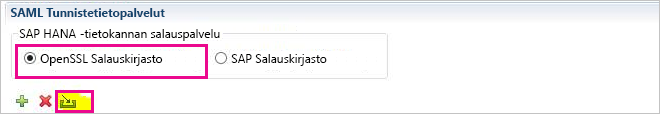
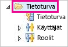
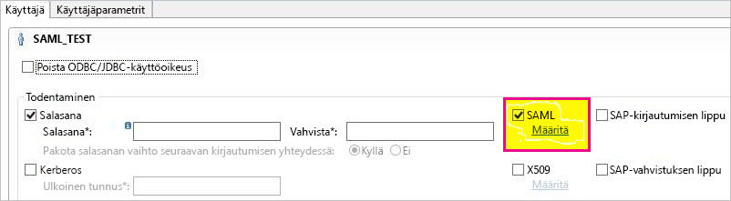
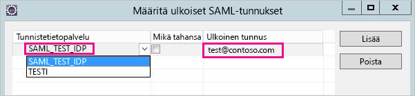
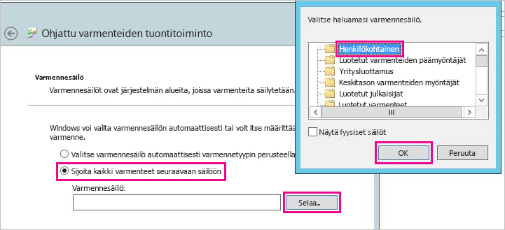
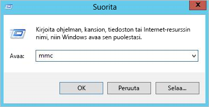
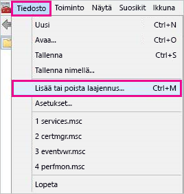
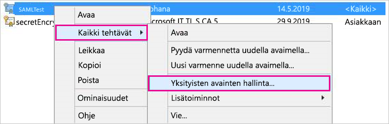
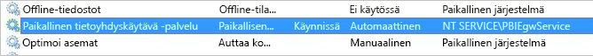
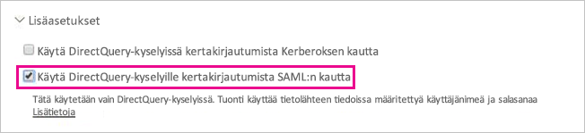

# <a name="use-security-assertion-markup-language-saml-for-single-sign-on-sso-from-power-bi-to-on-premises-data-sources"></a>Security Assertion Markup Languagen (SAML) käyttäminen kertakirjautumista (SSO) varten Power BI:stä paikallisiin tietolähteisiin

Käytä [Security Assertion Markup Languagea (SAML)](https://www.onelogin.com/pages/saml) ottaaksesi saumattoman kertakirjautumisen käyttöön. Kun otat kertakirjautumisen käyttöön, Power BI -raportit ja -koontinäytöt voivat helposti päivittää tiedot, jotka ovat peräisin paikallisista lähteistä.

## <a name="supported-data-sources"></a>Tuetut tietolähteet

Tuemme tällä hetkellä SAP HANA:a SAML:n kanssa. Lisätietoja kertakirjautumisen määrittämisestä SAP HANA:ssa SAML:n avulla on aiheessa [SAML SSO for BI Platform to HANA (SAML-kertakirjautuminen BI-alustasta HANA:an)](https://wiki.scn.sap.com/wiki/display/SAPHANA/SAML+SSO+for+BI+Platform+to+HANA) SAP HANA -dokumentaatiossa.

Tuemme muita tietolähteitä [Kerberoksen](service-gateway-sso-kerberos.md) avulla.

## <a name="configuring-the-gateway-and-data-source"></a>Yhdyskäytävän ja tietolähteen määrittäminen

Jotta voit käyttää SAML:a, luo ensin varmenne SAML-tunnistetietopalvelua varten ja yhdistä sitten Power BI -käyttäjä käyttäjätietoihin.

1. Luo varmenne. Varmista, että käytät SAP HANA -palvelimen täydellistä toimialuenimeä kun täytät *kutsumanimen*. Varmenne vanhenee 365 päivässä.

    ```
    openssl req -newkey rsa:2048 -nodes -keyout samltest.key -x509 -days 365 -out samltest.crt
    ```

1. Napsauta SAP HANA Studiossa SAP HANA -palvelintasi hiiren kakkospainikkeella ja siirry kohtaan **Tietoturva** > **Avaa tietoturvakonsoli** > **SAML-tunnistetietopalvelu** > **OpenSSL-salauskirjasto**.

    On mahdollista käyttää myös OpenSSL:n SAP-salauskirjastoa (se tunnetaan myös nimillä CommonCryptoLib tai sapcrypto) näiden määritysvaiheiden suorittamiseen. Katso lisätietoja virallisesta SAP-dokumentaatiosta.

1. Valitse **Tuo**, etsi samltest.crt-tiedosto ja tuo se.

    

1. Valitse SAP HANA Studiossa **Tietoturva**kansio.

    

1. Laajenna **Käyttäjät** ja valitse sitten käyttäjä, johon haluat yhdistää Power BI -käyttäjäsi.

1. Valitse **SAML** ja sitten **Määritä**.

    

1. Valitse tunnistetietopalvelu, jonka loit vaiheessa 2. Syötä kohtaan **Ulkoiset käyttäjätiedot** Power BI -käyttäjän täydellinen käyttäjätunnus ja valitse sitten **Lisää**.

    

Nyt kun olet määrittänyt varmenteen ja käyttäjätiedot, muunna varmenne pfx-muotoon ja määritä yhdyskäytäväkone käyttämään varmennetta.

1. Voit muuntaa varmenteen pfx-muotoon suorittamalla seuraavan komennon.

    ```
    openssl pkcs12 -inkey samltest.key -in samltest.crt -export -out samltest.pfx
    ```

1. Kopioi pfx-tiedosto yhdyskäytäväkoneeseen:

    1. Kaksoisnapsauta samltest.pfx-tiedostoa ja valitse sitten **Paikallinen tietokone** > **Seuraava**.

    1. Anna salasana ja valitse sitten **Seuraava**.

    1. Valitse **Sijoita kaikki varmenteet seuraavaan paikkaan** ja valitse sitten **Selaa** > **Henkilökohtainen** > **OK**.

    1. Valitse **Seuraava** ja sitten **Valmis**.

    

1. Myönnä yhdyskäytävän palvelutilille käyttöoikeus varmenteen yksityisavaimeen:

    1. Suorita yhdyskäytäväkoneessa Microsoft Management Console (MMC).

        

    1. Kohdassa **Tiedosto**, valitse **Lisää/poista laajennus**.

        

    1. Valitse **Varmenteet** > **Lisää** ja valitse sitten **Tietokonetili** > **Seuraava**.

    1. Valitse **Paikallinen tietokone** > **Valmis** > **OK**.

    1. Laajenna **Varmenteet** > **Henkilökohtainen** > **Varmenteet** ja etsi haluamasi varmenne.

    1. Napsauta varmennetta hiiren kakkospainikkeella ja siirry kohtaan **Kaikki tehtävät** > **Yksityisten avainten hallinta**.

        

    1. Lisää yhdyskäytävän palvelutili luetteloon. Tili on oletusarvoisesti **NT SERVICE\PBIEgwService.** Voit selvittää, mitä tili suorittaa yhdyskäytäväpalvelua suorittamalla **services.msc** ja etsimällä **Paikallinen tietoyhdyskäytävä -palvelun**.

        

Lopuksi seuraa näitä ohjeita lisätäksesi varmenteen allekirjoituksen yhdyskäytävän määritykseen.

1. Suorita seuraava PowerShell-komento, jotta saat luettelon tietokoneessasi olevista varmenteista.

    ```powershell
    Get-ChildItem -path cert:\LocalMachine\My
    ```
1. Kopioi luomasi varmenteen allekirjoitus.

1. Siirry yhdyskäytävän hakemistoon, joka on oletusarvoisesti C:\Program Files\On-premises data gateway.

1. Avaa tiedosto PowerBI.DataMovement.Pipeline.GatewayCore.dll.config ja etsi osio nimeltä \*SapHanaSAMLCertThumbprint\*. Liitä kopioimasi allekirjoitus.

1. Käynnistä yhdyskäytäväpalvelu uudelleen.

## <a name="running-a-power-bi-report"></a>Power BI -raportin suorittaminen

Nyt voit käyttää Power BI:n **yhdyskäytävän hallintasivua** tietolähteen määrittämiseen. Ota sen **Lisäasetukset**-kohdassa kertakirjautuminen käyttöön. Sitten voit julkaista kyseiseen tietolähteeseen liittyvät raportit ja tietojoukot.



## <a name="troubleshooting"></a>Vianmääritys

Kun olet määrittänyt SSO:n, saatat saada seuraavan virheilmoituksen Power BI -portaalista: ”Annettuja tunnistetietoja ei voida käyttää SapHana-lähteelle.” Tämä virheilmoitus merkitsee, että SAP HANA on hylännyt SAML-tunnistetiedon.

Todentamisen jäljityksistä saa yksityiskohtaisia tietoja SAP HANA:n tunnistetieto-ongelmien vianmääritystä varten. Määritä SAP HANA -palvelimen seuranta oheisella tavalla.

1. Käynnistä todentamisen jäljitys SAP HANA -palvelimella suorittamalla seuraava kysely.

    ```
    ALTER SYSTEM ALTER CONFIGURATION ('indexserver.ini', 'SYSTEM') set ('trace', 'authentication') = 'debug' with reconfigure 
    ```

1. Toista kokemasi ongelma.

1. Avaa HANA Studion hallintakonsoli ja siirry **Diagnoositiedostot**-välilehteen.

1. Avaa viimeisin indexserver-jäljitys ja hae SAMLAuthenticator.cpp.

    Sinun pitäisi löytää yksityiskohtainen virheilmoitus, joka ilmaisee pääsyyn, kuten seuraava esimerkki.

    ```
    [3957]{-1}[-1/-1] 2018-09-11 21:40:23.815797 d Authentication   SAMLAuthenticator.cpp(00091) : Element '{urn:oasis:names:tc:SAML:2.0:assertion}Assertion', attribute 'ID': '123123123123123' is not a valid value of the atomic type 'xs:ID'.
    [3957]{-1}[-1/-1] 2018-09-11 21:40:23.815914 i Authentication   SAMLAuthenticator.cpp(00403) : No valid SAML Assertion or SAML Protocol detected
    ```

1. Kun vianetsintä on valmis, poista todentamisen jäljitys käytöstä suorittamalla seuraava kysely.

    ```
    ALTER SYSTEM ALTER CONFIGURATION ('indexserver.ini', 'SYSTEM') UNSET ('trace', 'authentication');
    ```

## <a name="next-steps"></a>Seuraavat vaiheet

Lisätietoja **paikallisesta tietoyhdyskäytävästä** ja **DirectQuerystä** on seuraavissa resursseissa:

* [Paikallinen tietoyhdyskäytävä](service-gateway-onprem.md)
* [DirectQuery Power BI:ssä](desktop-directquery-about.md)
* [DirectQueryn tukemat tietolähteet](desktop-directquery-data-sources.md)
* [DirectQuery ja SAP BW](desktop-directquery-sap-bw.md)
* [DirectQuery ja SAP HANA](desktop-directquery-sap-hana.md)
