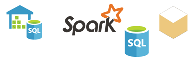

# Power BI -palvelun tietolähteet
Tiedot ovat Power BI:n ydin. Oletetaan, että tutkit tietoja. Voit tutkia luomalla kaavioita ja raporttinäkymiä tai kysymällä tietoja **Q&A:n** avulla. Näkemäsi visualisoinnit ja vastaukset saavat pohjana olevat tiedot tietojoukosta. Mutta mistä tietojoukko on peräisin? Tietojoukko on peräisin tietolähteestä.

Tässä artikkelissa tutustutaan eri tietolähdetyyppeihin, joihin voit muodostaa yhteyden Power BI -palvelun kautta. Muista, että on olemassa monia muitakin tietolähdetyyppejä, joista voi saada tietoa. Jos valitset tällaisia tietolähteitä, voit joutua käyttämään ensin Power BI Desktopin tai Excelin kehittyneitä kysely- ja mallinnusominaisuuksia. Perehdytään niihin vaihtoehtoihin myöhemmin. Tutustutaan ensin erilaisiin tietolähteisiin, jotka ovat käytettävissä suoraan Power BI -palvelusivustosta.

Voit noutaa tietoja mistä tahansa Power BI:n tietolähteestä valitsemalla **Nouda tiedot** sivun vasemmasta alakulmasta.

 

Kun olet valinnut **Nouda tiedot**, voit valita haluamasi tiedot

## Löydä sisältöä

**Löydä sisältöä** -osio sisältävää kaikki tiedot ja raportit esivalmisteltuina. Power BI:ssä on kahdenlaisia sisältöpaketteja: organisaation ja palveluiden paketteja. 

**Organisaatio**: Jos sinulla ja muilla organisaatiosi käyttäjillä on Power BI Pro -tili, voitte luoda, jakaa ja käyttää sisältöpaketteja. Lisätietoja on kohdassa [Organisaation sisältöpakettien esittely](service-organizational-content-pack-introduction.md).

**Palvelut**: Power BI:n sisältöpaketit sisältävät kymmeniä palveluja, joiden määrä kasvaa koko ajan. Useimmat palvelut edellyttävät tiliä. Lisätietoja on kohdassa [Power BI:ssä käyttämiisi palveluihin yhdistäminen](service-connect-to-services.md).

## Luo uutta sisältöä

**Luo uutta sisältöä** -osio sisältää sisällön luomiseen ja tuomiseen liittyviä vaihtoehtoja. Power BI:ssä on kaksi tapaa luoda tai tuoda omaa sisältöä: tiedostot ja tietokannat. 

### Tiedostot

**Excel** ( *.xlsx*, *.xlsm*) – Excel-työkirja voi sisältää erilaisia tietotyyppejä. Se voi sisältää esimerkiksi tietoja, jotka olet kirjannut laskentataulukkoon itse, tai sellaisia, joista olet tehnyt kyselyitä ja jotka olet ladannut ulkoisista tietolähteistä Power Queryn avulla. Power Query on käytettävissä Excel 2016:n ja Power Pivotin **Get & Transform** -toiminnon kautta. Voit tuoda tietoja laskentataulukoiden taulukoista tai tietomallista. Katso lisätietoja kohdasta [Tietojen noutaminen tiedostoista Power BI:hin](service-get-data-from-files.md).

**Power BI Desktop** ( *.pbix*) – Voit käyttää Power BI Desktopia tietojen kyselyyn ja lataamiseen ulkoisista tietolähteistä sekä raporttien luomiseen. Voit myös laajentaa tietomallia mittareilla ja suhteilla tai tuoda Power BI Desktop -tiedoston Power BI -sivustoosi. Power BI Desktop sopii parhaiten kokeneille käyttäjille. Tällaiset käyttäjät ovat usein hyvin perillä tietolähteistään. Tavallisesti he myös ymmärtävät tietojen kyselyn, muunnoksen ja mallinnuksen käsitteet. Lisätietoja on artikkelissa [Tietoihin yhdistäminen Power BI Desktopissa](desktop-connect-to-data.md).

**Pilkuilla erotetut arvot** ( *.csv*) – Tiedostot ovat yksinkertaisia tekstitiedostoja, jotka sisältävät tietorivejä. Kukin rivi voi sisältää yhden tai useita arvoja, jotka on erotettu toisistaan pilkulla. Esimerkiksi nimi- ja osoitetietoja sisältävässä *.csv*-tiedostossa voi olla useita rivejä. Kullakin rivillä voi olla etunimi-, sukunimi-, katuosoite-, kaupunki-, osavaltio- ja muita tietoja. Et voi tuoda tietoja *.csv*-tiedostoon, mutta monet sovellukset, kuten Excel, voivat tallentaa yksinkertaisia taulukkotietoja *.csv*-tiedostoon.

Muiden tiedostotyyppien kohdalla, kuten XML-taulukoiden ( *.xml*) ja tekstitiedostojen ( *.txt*), voit hakea, muuntaa ja ladata tiedot ensin Excel- tai Power BI Desktop -tiedostoon **Get & Transformin** avulla. Voit sitten tuoda Excel- tai Power BI Desktop -tiedoston Power BI:hin.

Myös tiedostojen tallennuspaikalla on merkitystä. OneDrive for Business tarjoaa suurta joustavuutta ja on integroitu Power BI:hin. Voit säilyttää tiedostoja paikallisessa asemassa. Tämä tarkoittaa kuitenkin ylimääräisiä työvaiheita, kun haluat päivittää tiedot. Katso lisätietoja alla olevista artikkelien linkeistä.

### Tietokannat

**Pilvipalveluissa olevat tietokannat** – Power BI -palvelussa voit muodostaa reaaliaikaisen yhteyden seuraaviin:

* Azure SQL -tietokanta
* Azure SQL Data Warehouse
* Azure HDInsightin Spark

Power BI:n yhteys näihin tietokantoihin on reaaliaikainen. Oletetaan, että muodostat yhteyden Azure SQL -tietokantaan. Voit sen jälkeen aloittaa sen tietojen tutkimisen luomalla raportteja Power BI:ssä. Aina kun ositat tietoja tai lisäät kentän visualisointiin, Power BI lähettää kyselyn suoraan tietokantaan. Lisätietoja on kohdassa [Azure ja Power BI](service-azure-and-power-bi.md).

**Paikalliset tietokannat** – Power BI -palvelusta voit muodostaa suoraan yhteyden SQL Server Analysis Servicesiin taulukkomuotoisten tietokantojen avulla. Tämä edellyttää Power BI Enterprise -yhdyskäytävää. Jos olet epävarma siitä, miten yhteys muodostetaan organisaatiosi taulukkomuotoiseen tietokantaan, pyydä neuvoja järjestelmänvalvojalta tai IT-osastolta. Katso lisätietoja kohdasta [SQL Server Analysis Servicesin reaaliaikaiset tiedot Power BI:ssä](sql-server-analysis-services-tabular-data.md).

Organisaatiosi muuntyyppisten tietokantojen kohdalla sinun on käytettävä Power BI Desktopia tai Exceliä yhteyden muodostamiseksi, kyselyn suorittamiseksi ja tietojen lataamiseksi tietomalliin. Sen jälkeen voit tuoda tiedostosi Power BI:hin, jossa tietojoukko sijaitsee. Jos määrität ajoitetun päivityksen, Power BI käyttää kyseistä määritystä ja tiedoston yhteyden tietoja yhteyden muodostamiseksi suoraan tietolähteeseen ja päivitysten hakemiseen. Power BI lataa asianmukaiset päivitykset tietojoukkoon. Lisätietoja on artikkelissa [Tietoihin yhdistäminen Power BI Desktopissa](desktop-connect-to-data.md).

## Entä jos tiedot ovat peräisin eri tietolähteestä?
Power BI:n kanssa voi käyttää satoja eri tietolähteitä. Mistä tiedot ovatkaan peräisin, niiden on oltava muodossa, jota Power BI -palvelu voi käyttää. Power BI -palvelu voi käyttää käsiteltäviä tietoja raporttien ja raporttinäkymien luomiseen, **Q&A**-kysymyksiin vastaamiseen ja niin edelleen.

Joidenkin tietolähteiden tiedot ovat jo Power BI -palvelun kanssa yhteensopivassa muodossa. Esimerkiksi Google Analytics- ja Twilio-sisältöpaketit ovat tällaisia lähteitä. Taulukkomuotoiset SQL Server Analysis Services -tietokannat ovat myös käyttövalmiita. Voit myös luoda reaaliaikaisen yhteyden pilvipalveluissa oleviin tietokantoihin, kuten Azure SQL -tietokantaan ja Spark + HDInsightiin.

Muissa tapauksissa voi olla tarpeen hakea ja ladata halutut tiedot tiedostoon. Sinulla voi olla esimerkiksi organisaatiosi logistiikkatietoja. Nämä tiedot tallennetaan palvelimelle tietovarastotyyppiseen tietokantaan. Et voi muodostaa yhteyttä suoraan Power BI -palvelusta kyseiseen tietokantaan ja aloittaa sen tietojen analysointia, ellei se ole taulukkomuotoinen tietokanta. Voit kuitenkin käyttää Power BI Desktopia tai Exceliä logistiikkatietojen hakemiseen ja lataamiseen tietomalliin, joka sen jälkeen tallennetaan tiedostona. Sen jälkeen voit tuoda kyseisen tiedoston Power BI:hin, jossa tietojoukko sijaitsee.

Pohdit varmasti sitä asiaa, että kyseisessä tietokannassa olevat logistiikkatiedot muuttuvat päivittäin, minkä vuoksi Power BI -tietojoukon päivittäminen saattaa aluksi kuulostaa hankalalta. Kun tuot tiedot tietojoukkoon, tuot samalla myös Power BI Desktop- tai Excel-tiedoston yhteyden tiedot.

Oletetaan, että määrität ajoitetun päivityksen tai suoritat tietojoukon manuaalisen päivityksen. Power BI käyttää tietojoukon yhteyden tietoja sekä muutamia muita asetuksia muodostaakseen yhteyden suoraan tietokantaan. Sen jälkeen se lähettää päivityskyselyn ja lataa asianmukaiset päivitykset tietojoukkoon. Huomaa, että Power BI -yhdyskäytävä todennäköisesti vaaditaan tiedonsiirron varmistamiseksi paikallisen palvelimen ja Power BI:n välillä. Kun siirto on valmis, raporttien ja koontinäyttöjen visualisoinnit päivittyvät automaattisesti.

Eli vaikka et pystyisikään muodostamaan yhteyttä tietolähteeseen suoraan Power BI -palvelusta, saat tiedot kuitenkin Power BI:hin. Se saattaa vain edellyttää hieman enemmän työvaiheita ja mahdollisesti apua IT-osastolta. Lisätietoja on artikkelissa [Power BI Desktopin tietolähteet](desktop-data-sources.md).

## Lisätietoja
Kuten voit huomata, käsitteitä tietojoukko ja tietolähde käytetään paljon Power BI:ssä. Niillä tarkoitetaan usein samaa asiaa. Itse asiassa ne ovat kuitenkin eri asioita, vaikkakin ne liittyvät läheisesti toisiinsa.

Luot **tietojoukon** automaattisesti Power BI:ssä, kun käytät **Nouda tiedot** -toimintoa. **Nouda tiedot** -toiminnolla muodostat yhteyden sisältöpakettiin tai tiedostoon ja tuot sen tiedot. Voit yhdistää myös reaaliaikaiseen tietolähteeseen. Tietojoukko sisältää tietoa tietolähteestä sekä tietolähteen tunnistetiedot. Monissa tapauksissa se sisältää myös tietolähteestä kopioitujen tietojen alijoukon. Kun luot visualisointeja raporteissa ja koontinäytöissä, tarkastelet usein tietojoukon tietoja.

**Tietolähde** on tietojoukon tietojen alkuperä. Tiedot voivat olla peräisin esimerkiksi:

* Google Analyticsista, QuickBooksista tai muuta verkkopalvelusta
* pilvipalvelun tietokannasta, kuten Azure SQL -tietokannasta
* oman organisaatiosi paikallisessa tietokoneessa tai palvelimessa sijaitsevasta tietokannasta

## Tietojen uudelleenlataus
Saatat tallentaa tiedostot paikalliselle asemalle tai asemalle organisaatiossasi. Tietojoukon päivittäminen Power BI:ssä saattaa edellyttää Power BI -yhdyskäytävää. Tietokoneen, jolle tiedosto on tallennettu, on oltava käynnissä päivityksen tapahtuessa. Voit tuoda tiedoston uudelleen tai käyttää Excelin tai Power BI Desktopin julkaisutoimintoa, mutta ne eivät ole automaattisia prosesseja.

Jos tallennat tiedostosi OneDrive for Businessiin tai SharePoint-työryhmäsivustoihin, voit muodostaa yhteyden niihin tai tuoda ne Power BI:hin. Sen jälkeen tietojoukko, raportit ja raporttinäkymät ovat aina ajan tasalla. Koska sekä OneDrive että Power BI ovat pilvipalveluita, Power BI voi muodostaa yhteyden suoraan tallennettuun tiedostoon. Se yhdistää tiedostoon ja tarkistaa päivitykset noin tunnin välein. Tietojoukko ja mahdolliset visualisoinnit päivittyvät automaattisesti, jos päivityksiä on saatavilla.

Palveluista peräisin olevat sisältöpaketit päivittyvät automaattisesti. Useimmissa tapauksissa ne päivitetään kerran päivässä. Voit päivittää manuaalisesti, mutta riippuu palveluntarjoajasta, näetkö päivitettyjä tietoja vai et. Organisaation käyttäjien omistamien sisältöpakettien päivittyminen riippuu käytettävistä tietolähteistä. Ne myös riippuvat siitä, miten sisältöpaketin luonut henkilö on määrittänyt päivityksen.

Azure SQL -tietokanta, Azure SQL -tietovarasto ja Azure HDInsightin Spark ovat pilvipalvelussa sijaitsevia tietolähteitä. Koska Power BI -palvelu on myös pilvipalvelu, Power BI voi muodostaa kyseisiin tietolähteisiin reaaliaikaisen yhteyden **DirectQuery**-toimintoa käyttäen. Power BI:ssä näkemäsi tiedot on aina synkronoitu, joten ajoitettua päivitystä ei tarvitse määrittää.

Kun muodostat Power BI:stä yhteyden SQL Server Analysis Servicesiin, yhteys on reaaliaikainen, aivan kuin yhteys Azure-pilvitietokantaan. Ero on siinä, että tietokanta sijaitsee organisaatiosi palvelimessa. Tällainen yhteys edellyttää Power BI -yhdyskäytävää, joka on IT-osaston määrittämä.

Tietojen päivittäminen on todella tärkeä osa Power BI:tä, eikä sitä voi käsitellä kokonaan tässä. Jos haluat saada tarkempaa tietoa, tutustu artikkeliin [Tietojen päivittäminen Power BI:ssä](refresh-data.md).

## Huomioitavat asiat ja rajoitukset
Seuraavat rajoitukset koskevat kaikkia Power BI -palvelussa käytettäviä tietolähteitä. On myös muita rajoituksia, jotka koskevat tiettyjä ominaisuuksia, mutta seuraava luettelo koskee Power BI -palvelua kokonaisuudessaan:

* **Tietojoukon kokorajoitus** – Power BI -palvelun kunkin tietojoukon suurin sallittu koko on 1 Gt.
* **Rivirajoitus** – Tietojoukon rivien enimmäismäärä on 2 miljardia (paitsi **DirectQuerya** käytettäessä). Kolme riveistä on varattu, joten käytettävissä on enintään 1 999 999 997 riviä. **DirectQuerya** käytettäessä rivien enimmäismäärä on 1 miljoona.
* **Sarakerajoitus** – Tietojoukon sarakkeiden enimmäismäärä tietojoukon kaikissa tauluissa on 16 000 saraketta. Tämä koskee Power BI -palvelua ja Power BI Desktopissa käytettyjä tietojoukkoja. Power BI käyttää taulukkokohtaista sisäistä rivinumerosaraketta tietojoukon sisällä, mikä tarkoittaa, että sarakkeiden enimmäismäärä on 16 000 miinus yksi kutakin tietojoukossa käytettyä taulukkoa kohden.

