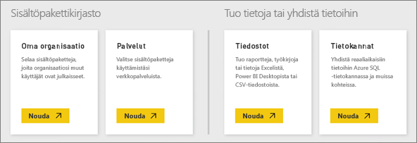

# Power BI -palvelun tietolähteet
Tiedot ovat Power BI:n ydin. Aina, kun olet tutkimassa tietoja, luomassa kaavioita ja koontinäyttöjä tai tutustumassa kysymyksiin ja vastauksiin, kaikkien näkemiesi visualisointien ja vastausten pohjana olevat tiedot ovat peräisin tietojoukosta. Mutta mistä tietojoukko on peräisin? No, tietolähteestä.

Tässä artikkelissa tutustutaan eri tietolähteisiin, joihin Power BI -palvelusta voi muodostaa yhteyden. Pidä mielessä, että on olemassa monia muitakin tietolähdetyyppejä, joista voi saada tietoa. Ne saattavat kuitenkin vaatia ensin Power BI Desktopin tai Excelin kehittyneiden tietokysely- ja mallinnusominaisuuksien käyttöä. Perehdytään niihin myöhemmin. Tutustutaan ensin erilaisiin tietolähteisiin, joihin voi muodostaa yhteyden suoraan Power BI -palvelusivustosta.

Voit saada tietoja mistä tahansa tietolähteestä Power BI:ssä Valitsemalla **Oma työtila** > **Nouda tiedot**.

## Tiedostot

**Excel** (.xlsx, xlxm) Excel on ainutlaatuinen siinä, että työkirja voi sisältää sekä laskentataulukoihin itse syöttämiäsi tietoja että ulkoisista tietolähteistä Power Queryn (Get & Transform Excel 2016:ssa) tai Power Pivotin avulla hakemiasi ja lataamiasi tietoja. Voit tuoda laskentataulukoiden tauluissa olevia tietoja (tietojen *on* oltava taulussa) tai tuoda tietoja, jotka on ladattu tietomallin. Lisätietoja on artikkelissa [Tietojen hakeminen Excelistä](service-get-data-from-files.md).

**Power BI Desktop** (.pbix) – Voit käyttää Power BI Desktopia tietojen hakemiseen ja lataamiseen ulkoisista tietolähteistä, tietomallien laajentamiseen mittayksiköillä ja suhteilla sekä raporttien luomiseen. Voit tuoda Power BI Desktop -tiedoston Power BI -sivustoon. Power BI Desktop sopii parhaiten kokeneille käyttäjille, joilla on paljon ymmärrystä tietolähteitä sekä tietojen hakemista, muuntamista ja mallinnusta koskevista käsitteistä. Lisätietoja on artikkelissa [Tietoihin yhdistäminen Power BI Desktopissa](desktop-connect-to-data.md).

**Pilkuilla erotetut arvot** (.csv) – Tiedostot ovat yksinkertaisia tekstitiedostoja, jotka sisältävät tietorivejä. Kukin rivi voi sisältää yhden tai useita arvoja, jotka on erotettu toisistaan pilkulla. Esimerkiksi nimi- ja osoitetietoja sisältävässä .csv-tiedostossa voi olla useita rivejä, jossa kullakin rivillä on arvot etunimelle, sukunimelle, katuosoitteelle, kaupungille, maalle ja niin edelleen. Et voi tuoda tietoja .csv-tiedostoon, mutta monet sovellukset, kuten Excel, voivat tallentaa yksinkertaisia taulutietoja .csv-tiedostoon.

Muiden tiedostotyyppien kohdalla, kuten XML-taulukoiden (.xml) ja tekstitiedostojen (.txt), voit hakea, muuntaa ja ladata tiedot ensin Excel- tai Power BI Desktop -tiedostoon Get & Transformin avulla. Voit sitten tuoda Excel- tai Power BI Desktop -tiedoston Power BI:hin.

Myös tiedostojen tallennuspaikalla on merkitystä. OneDrive for Business tarjoaa suurta joustavuutta ja on integroitu Power BI:hin. Tiedostojen säilyttäminen paikallisella kiintolevyllä on ok, mutta jos tiedot on päivitettävä, sinun on suoritettavia muutamia lisätoimenpiteitä. Lisätietoja on annettu linkitetyissä artikkeleissa.

## Sisältöpaketit

Sisältöpaketit sisältävät kaikki tarvitsemasi tiedot ja raportit esivalmisteltuina. Power BI:ssä on kahdentyyppisiä sisältöpaketteja: Google Analyticsin, Marketon tai Salesforcen kaltaisten palveluiden muodostamia paketteja sekä muiden organisaatiosi käyttäjien luomia ja jakamia paketteja.

**Palvelut** � Power BI:n sisältöpaketit sisältävät kymmeniä palveluita, ja lisää lisätään koko ajan. Useimmat palvelut edellyttävät tiliä. Lisätietoja on artikkelissa [Palveluihin yhdistäminen](service-connect-to-services.md).

**Organisaatio** � Jos sinulla ja muilla organisaatiosi käyttäjillä on Power BI Pro -tili, voitte luoda, jakaa ja käyttää sisältöpaketteja. Lisätietoja on artikkelissa [Organisaation sisältöpaketit](service-organizational-content-pack-introduction.md).

## Tietokannat

**Tietokannat pilvipalvelussa** Power BI -palvelun kautta voit muodostaa suoraan yhteyden Azure SQL -tietokantaan, Azure SQL -tietovarastoon, Spark + Azure HDInsightiin ja SQL Server Analysis Servicesiin DirectQueryn avulla. Yhteydet Power BI:stä näihin tietokantoihin ovat live-yhteyksiä, eli kun olet luonut yhteyden esimerkiksi Azure SQL -tietokantaan ja aloitat sen sisältämien tietojen analysoinnin luomalla raportteja Power BI:ssä, kysely suoritetaan suoraan tietokannasta aina, kun ositat tietoja tai lisäät toisen visualisointikentän. Lisätietoja on artikkelissa [Azure ja Power BI](service-azure-and-power-bi.md).

**Paikalliset tietokannat** � Voit muodostaa Power BI -palvelusta suoraan yhteyden SQL Server Analysis Servicesin taulukkomuotoisiin tietokantoihin. Power BI Enterprise -yhdyskäytävä vaaditaan. Jos olet epävarma siitä, miten yhteys muodostetaan organisaatiosi taulukkomuotoiseen tietokantaan, pyydä neuvoja järjestelmänvalvojalta tai IT-osastolta. Lisätietoja on artikkelissa [SQL Server Analysisin taulukkomuotoiset tiedot Power BI:ssä](sql-server-analysis-services-tabular-data.md).

Organisaatiosi muuntyyppisten tietokantojen kohdalla sinun on ensin käytettävä Power BI Desktopia tai Exceliä yhteyden muodostamiseksi, kyselyn suorittamiseksi ja tietojen lataamiseksi tietomalliin. Sen jälkeen voit tuoda tiedostosi Power BI:hin, jossa luodaan tietojoukko. Jos olet määrittänyt ajoitetun päivityksen, Power BI käyttää sekä tiedoston yhteystietoja että määrittämiäsi päivitysasetuksia yhteyden luomiseksi suoraan tietolähteeseen ja päivitysten hakemiseen. Kyseiset päivitykset ladataan sen jälkeen tietojoukkoon Power BI:ssä. Lisätietoja on artikkelissa [Tietoihin yhdistäminen Power BI Desktopissa](desktop-connect-to-data.md).

## Entä jos tiedot ovat peräisin eri tietolähteestä?
Power BI:n kanssa voi käyttää kirjaimellisesti satoja eri tietolähteitä. Mutta riippumatta siitä, mistä saat tietosi, tietojen on oltava muodossa, jota Power BI -palvelu voi käyttää raporttien ja koontinäyttöjen luomiseen, kysymyksiin vastaamiseen ja niin edelleen.

Joidenkin tietolähteiden tiedot ovat jo muodossa, jota Power BI -palvelu voi käyttää, kuten Google Analyticsin ja Twilion kaltaisten palveluntarjoajien sisältöpaketit. Taulukkomuotoiset SQL Server Analysis Services -tietokannat ovat myös käyttövalmiita. Voit myös luoda live-yhteyden pilvipalveluissa oleviin tietokantoihin, Azure SQL -tietokantaan ja Spark + HDInsightiin.

Muissa tapauksissa voi olla tarpeen hakea ja ladata halutut tiedot tiedostoon. Esimerkiksi jos sinulla on logistiikkatietoja tietovarastotietokannassa organisaatiosi palvelimella. Et voi muodostaa yhteyttä suoraan Power BI -palvelusta kyseiseen tietokantaan ja aloittaa sen sisältämien tietojen analysointia (paitsi jos se on taulukkomuotoinen tietokanta). Voit kuitenkin käyttää Power BI Desktopia tai Exceliä logistiikkatietojen hakemiseen ja lataamiseen tietomalliin, joka sen jälkeen tallennetaan tiedostona. Sen jälkeen voit tuoda kyseisen tiedoston Power BI:hin, jossa luodaan tietojoukko.

Ajattelet varmasti: �Kyseisessä tietokannassa olevat logistiikkatiedot muuttuvat päivittäin. Miten voin varmistaa, että tietojoukkoni Power BI:ssä päivitetään?� Power BI Desktop- tai Excel-tiedoston yhteystiedot tuodaan tietojoukkoon tietojen mukana. Jos määrität ajoitetun päivityksen tai suoritat tietojoukon manuaalisen päivityksen, Power BI käyttää tietojoukon yhteystietoja sekä muutamia muita asetuksia yhteyden muodostamiseen suoraan tietokantaan, päivitysten hakemiseen ja kyseisten päivitysten lataamiseen tietojoukkoon. Power BI -yhdyskäytävä todennäköisesti vaaditaan tietojen siirron varmistamiseksi paikallisen palvelimen ja Power BI:n välillä. Raporttien ja koontinäyttöjen visualisoinnit päivitetään automaattisesti.

Eli vaikka et pystyisikään muodostamaan yhteyttä tietolähteeseen suoraan Power BI -palvelusta, se ei tarkoita sitä, että tietoja ei voisi saada Power BI:hin. Se saattaa vain edellyttää hieman enemmän työvaiheita ja mahdollisesti apua IT-osastolta. Lisätietoja on artikkelissa [Power BI Desktopin tietolähteet](desktop-data-sources.md).

## Lisätietoja
Kuten voit huomata, käsitteitä tietojoukko ja tietolähde käytetään paljon Power BI:ssä. Niitä käytetään usein synonyymeinä, mutta itse asiassa ne ovat eri asioita, vaikkakin läheistä sukua keskenään.

***Tietojoukko*** luodaan automaattisesti Power BI:ssä, kun käytät Nouda tiedot -toimintoa yhteyden luomiseen ja sisältöpakkauksen tai tiedoston sisältämien tietojen tuomiseen tai kun muodostat yhteyden live-tietolähteeseen. Tietojoukko sisältää tietoja tietolähteestä, tietolähteen tunnistetiedot ja monissa tapauksissa tietolähteestä kopioidun tietojen osajoukon. Yleensä, kun luot visualisointeja raporteissa ja koontinäytöissä, tarkastelet tietojoukon tietoja.

***Tietolähde*** on tietojoukon tietojen todellinen alkuperä. Esimerkiksi Google Analyticsin tai QuickBooksin kaltaisen verkkopalvelu, Azure SQL -tietokannan kaltaisen pilvitietokanta tai paikallisessa organisaation tietokoneessa tai palvelimessa sijaitseva tietokanta tai tiedosto.

### Tietojen päivittäminen
Jos tallennat tiedostot paikalliselle kiintolevylle tai jollekin muulle organisaatiosi asemalle, tietojoukon päivittäminen Power BI:ssä saattaa edellyttää Power BI -yhdyskäytävää. Lisäksi tietokoneen, johon tiedosto on tallennettu, on oltava käynnissä päivityksen yhteydessä. Voit myös tuoda tiedoston uudelleen tai käyttää Excelin tai Power BI Desktopin julkaisutoimintoa, mutta ne eivät ole automaattisia prosesseja.

Jos tallennat tiedostosi OneDrive for Businessiin tai SharePoint � työryhmäsivustoihin ja muodostat sen jälkeen yhteyden niihin tai tuot ne Power BI:hin, tietojoukkosi, raporttisi ja koontinäyttösi ovat aina ajan tasalla. Koska sekä OneDrive että Power BI ovat pilvipalveluita, Power BI voi muodostaa yhteyden suoraan tallennettuun tiedostoon noin tunnin välein ja hakea päivityksiä. Jos jotain löytyy, tietojoukko ja mahdolliset visualisoinnit päivitetään automaattisesti.

Palveluista peräisin olevat sisältöpaketit päivittyvät automaattisesti. Useimmissa tapauksissa kerran päivässä. Voit päivittää manuaalisesti, mutta se, näetkö päivitettyjä tietoja vai et, riippuu palveluntarjoajasta. Muilta organisaation jäseniltä peräisin olevat sisältöpaketit riippuvat käytettävistä tietolähteistä sekä siitä, miten sisältöpaketin luonut henkilö määritti päivitysasetukset.

Azure SQL -tietokanta, Azure SQL -tietovarasto ja Spark + Azure HDInsight ovat erityisiä siinä, että ne ovat pilvipalvelussa sijaitsevia tietolähteitä. Koska Power BI -palvelu on myös pilvipalvelu, Power BI voi muodostaa niihin live-yhteyden DirectQuery-toimintoa käyttäen. Power BI:ssä näkyvät tiedot on aina synkronoitu, joten päivitystä ei tarvitse määrittää.

SQL Server Analysis Services on erityinen siinä, että kun muodostat siihen yhteyden Power BI:stä, yhteys on live-yhteys Azure-pilvitietokannan tapaan, mutta tietokanta itse sijaitsee organisaatiosi palvelimella. Tämänkaltainen yhteys edellyttää Power BI -yhdyskäytävää, joka on yleensä IT-osaston määrittämä.

Tietojen päivittäminen on todella tärkeä osa Power BI:tä, eikä sitä voi käsitellä kokonaan tässä. Jos haluat saada tarkempaa tietoa, tutustu artikkeliin [Tietojen päivittäminen Power BI:ssä](refresh-data.md).

## Huomioitavat asiat ja rajoitukset
Seuraavat huomioitavat asiat ja rajoitukset koskevat kaikkia Power BI -palvelussa käytettäviä tietolähteitä. On myös muita rajoituksia, jotka koskevat tiettyjä ominaisuuksia, mutta seuraava luettelo koskee Power BI -palvelua yleisesti:

* **Tietojoukon kokorajoitus** – Power BI -palvelun kunkin tietojoukon suurin sallittu koko on 1 gigatavu.
* **Rivirajoitus** – Tietojoukon (kun DirectQuery-toimintoa ei käytetä) rivien enimmäismäärä on 2 miljardia. Kolme riveistä on varattu (joten käytettävissä on enintään 1 999 999 997 riviä). DirectQuery-toimintoa käytettäessä rivien enimmäismäärä on 1 miljoona riviä.
* **Sarakerajoitus** – Tietojoukon sarakkeiden enimmäismäärä tietojoukon kaikissa tauluissa on 16 000 saraketta. Tämä koskee Power BI -palvelua ja Power BI Desktopissa käytettyjä tietojoukkoja. Power BI käyttää taulukohtaista sisäistä rivinumerosaraketta tietojoukon sisällä, mikä tarkoittaa sitä, että sarakkeiden enimmäismäärä on 16 000 miinus yksi kutakin tietojoukossa käytettyä taulua kohden.

