# Opetusohjelma: Power BI -palvelun (app.powerbi.com) käytön aloittaminen
Tämä opetusohjelma neuvoo ***Power BI -palvelun*** käytön aloittamisessa. Suosittelemme lukemaan [Mikä Power BI on](power-bi-overview.md) -ohjeartikkelin, jotta saat käsityksen, miten Power BI -palvelu sopii yhteen muiden Power BI -tuotteiden kanssa.

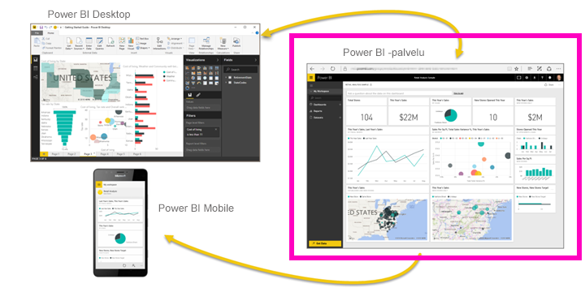

Tässä opetusohjelmassa käyt läpi seuraavat vaiheet:

> [!div class="checklist"]
> * Etsi muuta aloittamista käsittelevää sisältöä Power BI -palvelulle
> * Kirjaudu sisään Power BI Online -tilillesi tai rekisteröi tili, jos sinulla ei vielä sitä ole
> * Avaa Power BI -palvelu
> * Hae joitakin tietoja ja avaa ne raporttinäkymässä
> * Käytä näitä tietoja visualisointien luomiseksi ja tallenna ne raporttina
> * Luo koontinäyttö kiinnittämällä ruudut raportista
> * Lisää toinen visualisointi koontinäyttöön luonnollisenkielisen Q&A-työkalun avulla
> * Tyhjennä resurssit poistamalla tietojoukko, raportti ja koontinäyttö

## Rekisteröidy Power BI -palveluun
Jos et ole rekisteröitynyt Power BI:hin, [rekisteröidy ilmaiseen Power BI Pro -kokeiluversioon](https://app.powerbi.com/signupredirect?pbi_source=web), ennen kuin aloitat.

Jos sinulla on jo tili, avaa Power BI -palvelu avaamalla selain ja kirjoittamalla app.powerbi.com. 

Jos etsit ohjeita Power BI Desktopin käyttöön, lue [Power BI Desktopin käytön aloittamisen](desktop-getting-started.md) ohjeet. Jos etsit ohjeita Power BI -mobiilisovelluksen käyttöön, katso [Power BI -sovellukset mobiililaitteille](consumer/mobile/mobile-apps-for-mobile-devices.md) -ohjeet.

> [!TIP]
> Haluaisitko mieluummin maksuttoman, omaan tahtiin käytävän harjoituskurssin? [Rekisteröidy Datan analysointi ja visualisointi -kurssille EdX:ssa](http://aka.ms/edxpbi).

Tutustu [YouTube-soittolistaamme](https://www.youtube.com/playlist?list=PL1N57mwBHtN0JFoKSR0n-tBkUJHeMP2cP). Suosittelemme aloittamaan videosta, jonka nimi on Johdanto Power BI -palveluun:
> 
> <iframe width="560" height="315" src="https://www.youtube.com/embed/B2vd4MQrz4M" frameborder="0" allowfullscreen></iframe>
> 

## Mikä Power BI -palvelu on?
Microsoft Power BI -palveluun viitataan joskus nimellä Power BI Online tai app.powerbi.com. Power BI auttaa sinua pysymään ajan tasalla sinua kiinnostavista asioista.  Power BI -palvelun ***raporttinäkymät*** auttavat sinua pitämään yrityksesi langat käsissäsi.  Koontinäytöissä näytetään ***ruutuja***, joita napsauttamalla voit avata ***raportteja*** tarkempaa tutustumista varten.  Yhdistä useisiin ***tietojoukkoihin*** ja kerää kaikki tarvittavat tiedot samaan paikkaan. Tarvitsetko apua Power BI:n rakenneosien kanssa?  Katso [Power BI - peruskäsitteet](consumer/end-user-basic-concepts.md).

Jos sinulla on tärkeitä tietoja Excel- tai CSV-tiedostoissa, voit luoda Power BI -koontinäytön, jotta voit jakaa merkityksellisiä tietoja muiden kanssa ja pysyä ajan tasalla missä ikinä oletkin.  Onko sinulla SaaS-sovellustilaus, kuten Salesforce?  Ota varaslähtö yhdistämällä Salesforceen ja luo koontinäyttö automaattisesti sen tiedoista tai [Tutustu muihin SaaS-sovelluksiin](service-get-data.md), joihin voit muodostaa yhteyden. Jos kuulut johonkin organisaatioon, katso, onko sinua varten julkaistu [sovelluksia](service-create-distribute-apps.md).

Lue muista tavoista, joilla voit [hakea tietoja Power BI:hin](service-get-data.md).

## Vaihe 1: Nouda tiedot
Tämä on esimerkki tietojen hakemisesta CSV-tiedostosta. Haluatko noudattaa tätä opasohjelmaa? [Lataa CSV-esimerkkitiedosto](http://go.microsoft.com/fwlink/?LinkID=521962).

1. [Kirjaudu sisään Power BI:hin](http://www.powerbi.com/). Eikö sinulla ole tiliä? Ei huolta, voit rekisteröityä ilmaiseen kokeiluversioon.
2. Power BI avautuu selaimessa. Valitse vasemman siirtymisruudun alareunasta **Hae tiedot**.
   
   
3. Valitse **Tiedostot**. 
   
   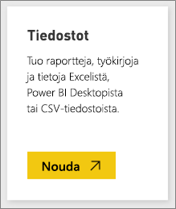
4. Etsi tiedosto tietokoneeltasi ja valitse **Avaa**. Jos tallensit sen OneDrive for Businessiin, valitse kyseinen vaihtoehto. Jos tallensit sen paikallisesti, valitse **Paikallinen tiedosto**. 
   
   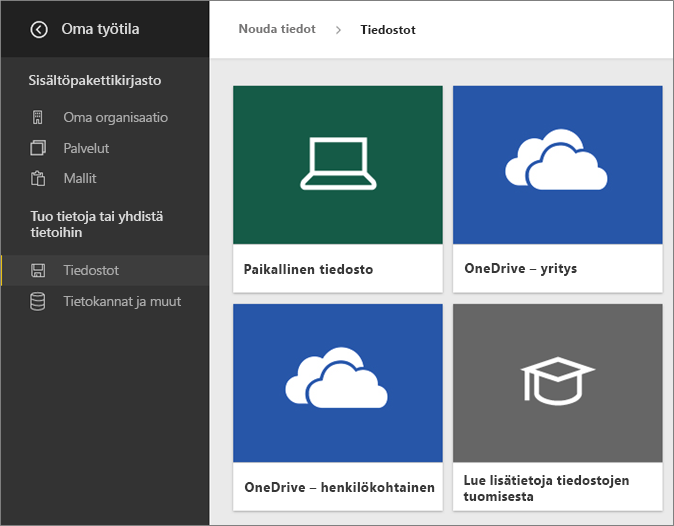
5. Tätä opetusohjelmaa varten lisäämme tietojoukkona käytettävän Excel-tiedoston, jota voimme käyttää raporttien ja raporttinäkymien luomiseen. Aloitetaan valitsemalla **Tuo**. Jos valitset **Lataa**, koko Excel-työkirja ladataan Power BI:hin, jossa voit avata ja muokata sitä Excel Onlinella.
   
   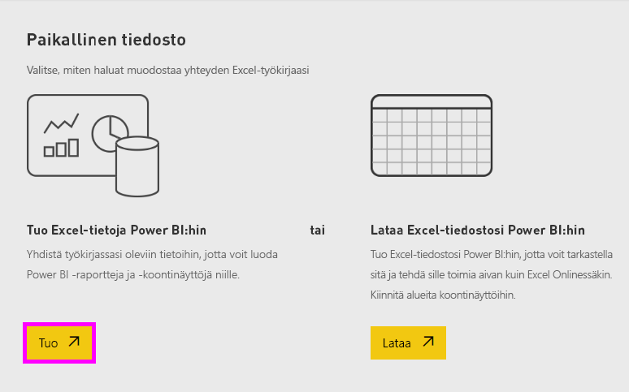
6. Kun tietojoukkosi on valmis, valitse **Tarkastele tietojoukkoa** avataksesi sen raporttieditorissa. 

    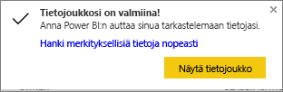

    Koska emme ole vielä luoneet visualisointeja, raporttipohja on tyhjä.

    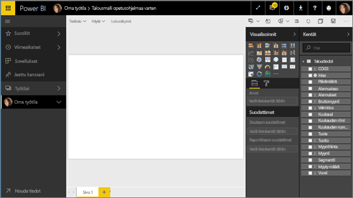

6. Tutustu yläreunan valikkoriviin. Huomaa siellä oleva **Lukunäkymä**-vaihtoehto. Lukunäkymä-vaihtoehdon näkyminen tarkoittaa, että olet tällä hetkellä **Muokkausnäkymässä**. 

    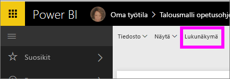

    Muokkausnäkymässä voit luoda ja muokata raportteja, sillä raportin *omistajana* olet myös raportin *luoja*. Kun jaat raportin työtovereiden kanssa, he voivat käsitellä raporttia ainoastaan lukunäkymässä; he ovat *kuluttajia*. Lue lisätietoja [Lukunäkymästä ja Muokkausnäkymästä](consumer/end-user-reading-view.md).
    
    Voit tutustua raporttieditoriin kätevästi [aloittamalla esittelyn](service-the-report-editor-take-a-tour.md)
   > 
 

## Vaihe 2: Aloita tietojoukkoosi tutustuminen
Nyt kun olet muodostanut yhteyden tietoihin, voit aloittaa tutustumisen.  Kun olet löytänyt jotain mielenkiintoista, voit luoda koontinäytön valvoaksesi sitä ja nähdäksesi, miten se muuttuu ajan mittaan. Katsotaan, miten tämä toimii.
    
1. Käytämme raporttieditorissa **Kentät**-paneelia sivun oikealla puolella visualisoinnin muodostamiseen.  Valitse vieressä oleva valintaruutu **Bruttomyynti**- ja **Päivämäärä**-kohdan vierestä.
   
   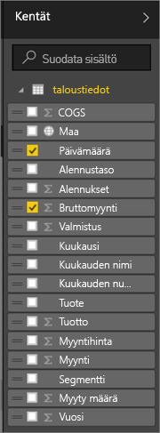

2. Power BI analysoi tiedot ja luo visualisoinnin.  Jos valitsit ensin **Päivämäärä**, näet taulukon.  Jos valitsit ensin **Bruttomyynti**, näet taulukon. Valitse erilainen tietojen esitystapa. Tarkastellaan näitä tietoja viivakaaviona. Valitse viivakaaviokuvake (tunnetaan myös mallina) **Visualisoinnit-ruudusta**.
   
   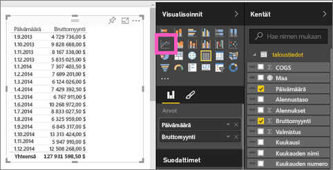

3. Tämä kaavio näyttää mielenkiintoiselta, joten *kiinnitetään* se raporttinäkymään. Osoita kiinnitettävää visualisointia ja napsauta **Kiinnitä**-kuvaketta.  Kun kiinnität visualisoinnin, se tallennetaan koontinäyttöön ja pidetään ajan tasalla, jotta voit seurata viimeisimpiä arvoja yhdellä silmäyksellä.
   
   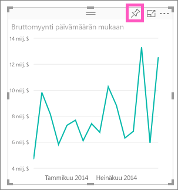

4. Koska kyseessä on uusi raportti, sinua pyydetään tallentamaan se, ennen kuin voit kiinnittää visualisoinnin raporttinäkymään. Anna raportille nimi (esimerkiksi *Myynti ajan kuluessa*) ja valitse **Tallenna ja jatka**. 
   
   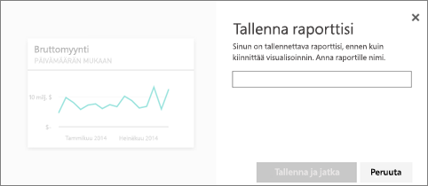
   
5. Kiinnitetään viivakaavio uuteen koontinäyttöön ja annetaan sen nimeksi ”Talousmalli opetusohjelmaa varten”. 
   
   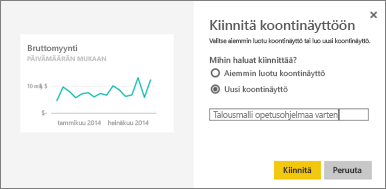
   
1. Valitse **Kiinnitä**.
   
    Onnistumisesta kertova ilmoitus (oikean yläkulman lähellä) ilmaisee, että visualisointi lisättiin ruutuna raporttinäkymään.
   
    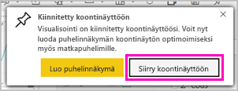

6. Voit tarkastella uuteen koontinäyttöösi ruutuna kiinnitettyä viivakaaviota valitsemalla **Siirry koontinäyttöön**. Voit parantaa koontinäyttöä entisestään lisäämällä visualisointiruutuja ja [nimeämällä ruutuja uudelleen, muuttamalla niiden kokoa, linkittämällä niitä ja muuttamalla niiden sijaintia](service-dashboard-edit-tile.md).
   
   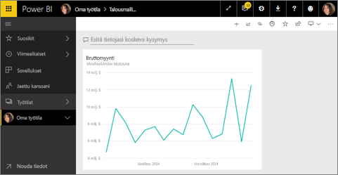
   
   Voit palata raporttiin milloin tahansa valitsemalla raporttinäkymän uuden ruudun. Power BI palauttaa sinut raporttieditorin lukunäkymään. Voit palata muokkausnäkymään valitsemalla **Muokkaa raporttia** yläreunan valikkorivistä. Kun olet muokkausnäkymässä, jatka tutkimista ja ruutujen kiinnittämistä. 

## Vaihe 3:  Jatka tutustumista Q&A:lla (luonnollisella kielellä kirjoitettu kysely)
1. Voit tutkia tietoja nopeasti esittämällä kysymyksen Q&A-ruutuun. Q&A-kysymysruutu sijaitsee koontinäytön yläreunassa (**Kysy kysymys tiedoistasi**) ja raportin yläreunan valikkorivissä (**Kysy kysymys**). Yritä esimerkiksi kirjoittaa ”mistä segmentistä tuli paras tuotto”.
   
   

2. Q&A etsii vastauksen ja näyttää sen visualisointina. Valitse Kiinnitä-kuvake  näyttääksesi tämän visualisoinnin myös omalla koontinäytölläsi.
3. Kiinnitä visualisointi ”Talousmalli opetusohjelmaa varten” -koontinäyttöön.
   
    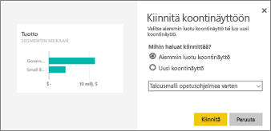

4. Palaa koontinäytön, jossa näet uuden ruudun.

   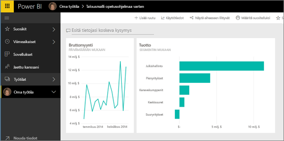

## Resurssien tyhjentäminen
Nyt kun olet suorittanut opetusohjelman, voit poistaa tietojoukon, raportin ja koontinäytön. 

1. Valitse vasemmassa siirtymispalkissa **Oma työtila**.
2. Valitse **Tietojoukot**-välilehti ja etsi tätä opetusohjelmaa varten tuotu tietojoukko.  
3. Valitse kolme pistettä (...) > **Poista**.

    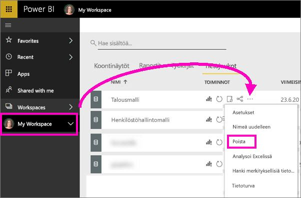

    Tietojoukon poistaminen poistaa myös raportin ja koontinäytön. 

## Seuraavat vaiheet
Oletko valmis kokeilemaan lisää?  Alla on joitakin käteviä tapoja tutkia Power BI:tä.

> [!div class="nextstepaction"]
> [Käyttämiisi verkkopalveluihin yhdistäminen](service-connect-to-services.md)

