# Opetusohjelma: Power BI -palvelun käytön aloittaminen
Tämä opetusohjelma on johdanto joihinkin *Power BI -palvelun* ominaisuuksiin. Sen avulla voit yhdistää tietoihin, luoda raportin ja koontinäytön sekä esittää kysymyksiä tiedoistasi. Voit tehdä paljon muutakin Power BI -palvelussa. Tämä opetusohjelma tarjoaa vain esimakua. Suosittelemme lukemaan [Mikä Power BI on](fundamentals/power-bi-overview.md) -ohjeartikkelin, jotta saat käsityksen, miten Power BI -palvelu sopii yhteen muiden Power BI -tuotteiden kanssa.

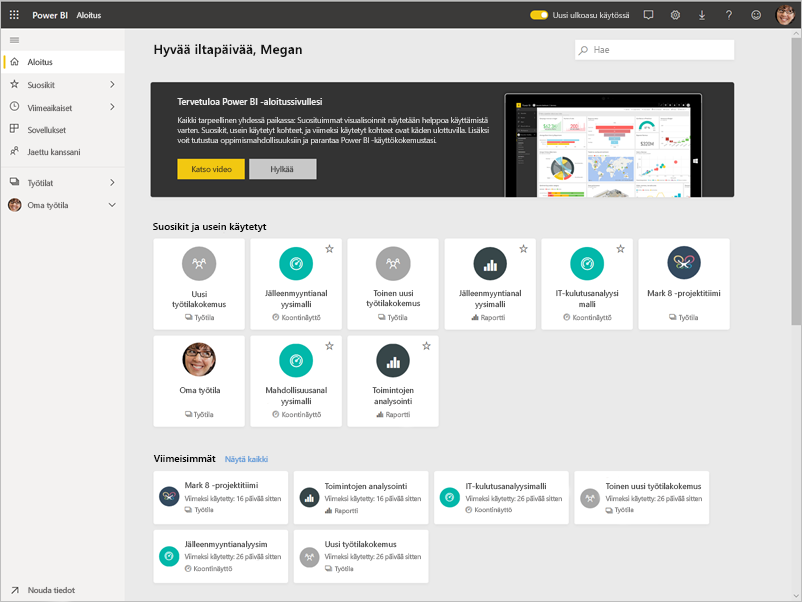

Tässä opetusohjelmassa käyt läpi seuraavat vaiheet:

> [!div class="checklist"]
> * Kirjaudu sisään Power BI Online -tilillesi tai rekisteröi tili, jos sinulla ei vielä ole sitä.
> * Avaa Power BI -palvelu.
> * Hae tietoja ja avaa ne raporttinäkymässä.
> * Käytä näitä tietoja visualisointien luomiseksi ja tallenna ne raporttina.
> * Luo koontinäyttö kiinnittämällä ruudut raportista.
> * Lisää muita visualisointeja koontinäyttöön luonnollisenkielisen Q&A-työkalun avulla.
> * Muuta koontinäytön ruutujen kokoa, järjestä ne uudelleen ja käsittele niitä.
> * Tyhjennä resurssit poistamalla tietojoukko, raportti ja koontinäyttö.

> [!TIP]
> Haluaisitko mieluummin maksuttoman, omaan tahtiin käytävän harjoituskurssin? [Rekisteröidy Datan analysointi ja visualisointi -kurssille EdX:ssa](https://aka.ms/edxpbi).

## Rekisteröidy Power BI -palveluun
Jos sinulla ei ole Power BI -tiliä, [rekisteröidy ilmaiseen Power BI Pro -kokeiluversioon](https://app.powerbi.com/signupredirect?pbi_source=web), ennen kuin aloitat.

Kun sinulla on tili, avaa Power BI -palvelu kirjoittamalla selaimeen *app.powerbi.com*. 

## Vaihe 1: Nouda tiedot

Kun haluat luoda Power BI -raportin, aloitat usein Power BI Desktopista. Tällä kertaa aloitamme alusta alkaen ja luomme raportin Power BI -palvelussa.

Tässä opetusohjelmassa saamme tiedot CSV-tiedostosta. Haluatko seurata mukana? [Lataa talousmallin CSV-tiedosto](https://go.microsoft.com/fwlink/?LinkID=521962).

1. [Kirjaudu sisään Power BI:hin](https://www.powerbi.com/). Eikö sinulla ole tiliä? Ei huolta, voit rekisteröityä ilmaiseen kokeiluversioon.
2. Power BI avautuu selaimessa. Valitse siirtymisruudun alareunassa **Nouda tiedot**.

    **Nouda tiedot** -sivu avautuu.   

3. Valitse **Luo uutta sisältöä** -kohdasta **Tiedostot**. 
   
   
4.  Valitse **Paikallinen tiedosto**.
   
    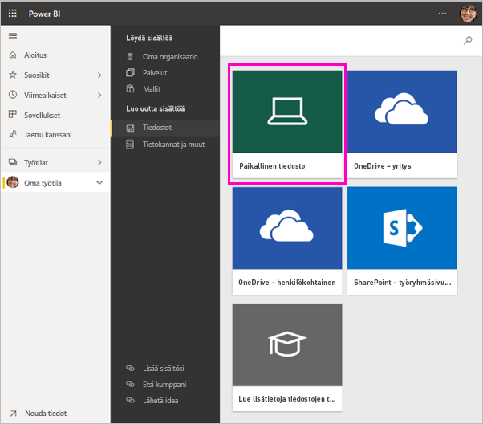

5. Etsi tiedosto tietokoneeltasi ja valitse **Avaa**.

5. Tätä opetusohjelmaa varten lisäämme tietojoukkona käytettävän Excel-tiedoston, jota voimme käyttää raporttien ja koontinäyttöjen luomiseen. Aloitetaan valitsemalla **Tuo**. Jos valitset **Lataa**, koko Excel-työkirja ladataan Power BI:hin, jossa voit avata ja muokata sitä Excel Onlinella.
   
   
6. Kun tietojoukkosi on valmis, valitse **Tietojoukot**. Avaa sitten raporttieditori valitsemalla **Luo raportti** tietojoukon **Talousmalli** vierestä. 

    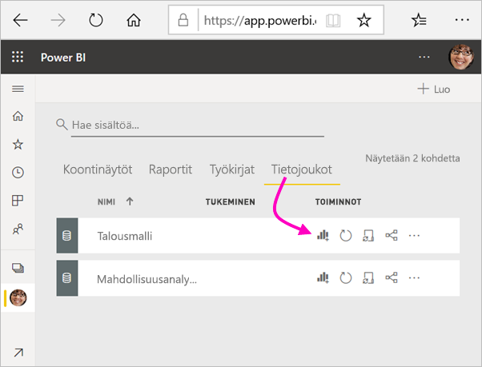

    Raporttipohja on tyhjä. Oikealla puolella ovat **Suodattimet**-, **Visualisoinnit**- ja **Kentät**-ruudut.

    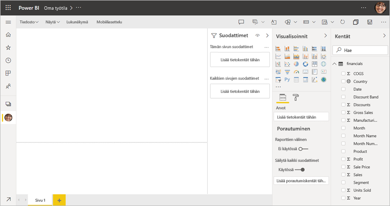

7. Huomaa, että yläreunan siirtymisruudussa on vaihtoehto **lukunäkymää** varten. Koska tämä vaihtoehto on käytettävissä, olet tällä hetkellä muokkausnäkymässä. Voit tutustua raporttieditoriin kätevästi [aloittamalla esittelyn](service-the-report-editor-take-a-tour.md).

    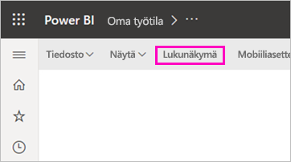

    Muokkausnäkymässä voit luoda ja muokata raportteja, sillä olet raportin *omistaja*. Olet siis *tekijä*. Kun jaat raportin työtovereiden kanssa, he voivat käsitellä raporttia ainoastaan lukunäkymässä; he ovat *kuluttajia*. Lue lisätietoja [Lukunäkymästä ja Muokkausnäkymästä](consumer/end-user-reading-view.md).

## Vaihe 2: Luo kaavio raporttiin
Nyt kun olet muodostanut yhteyden tietoihin, voit aloittaa tutustumisen.  Kun olet löytänyt jotain mielenkiintoista, voit luoda koontinäytön valvoaksesi sitä ja nähdäksesi, miten se muuttuu ajan mittaan. Katsotaan, miten tämä toimii.
    
1. Käytämme raporttieditorissa **Kentät**-paneelia sivun oikealla puolella visualisoinnin muodostamiseen. Valitse **Bruttomyynti**- ja **Päivämäärä**-valintaruudut.
   
   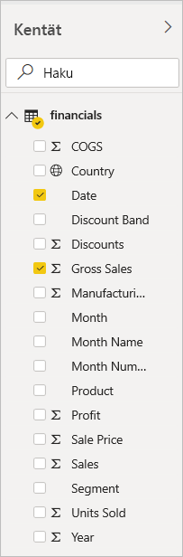

    Power BI analysoi tiedot ja luo visualisoinnin. Jos valitsit ensin **Päivämäärä**, näet taulukon. Jos valitsit ensin **Bruttomyynti**, näet pylväskaavion. 

2. Valitse erilainen tietojen esitystapa. Tarkastellaan näitä tietoja viivakaaviona. Valitse **Visualisoinnit**-ruudusta viivakaavion kuvake.
   
   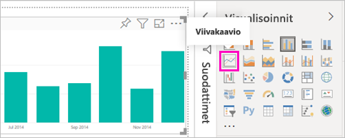

3. Tämä kaavio näyttää mielenkiintoiselta, joten *kiinnitetään* se raporttinäkymään. Osoita kiinnitettävää visualisointia ja napsauta Kiinnitä-kuvaketta. Kun kiinnität visualisoinnin, se tallennetaan koontinäyttöön ja pidetään ajan tasalla, jotta voit seurata viimeisimpiä arvoja yhdellä silmäyksellä.
   
   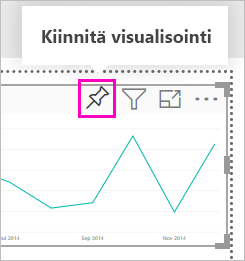

4. Koska kyseessä on uusi raportti, sinua pyydetään tallentamaan se, ennen kuin voit kiinnittää visualisoinnin koontinäyttöön. Anna raportille nimi (esimerkiksi *Myynti ajan kuluessa*) ja valitse **Tallenna**. 

5. Valitse **Uusi koontinäyttö** ja anna sen nimeksi *Talousmalli opetusohjelmaa varten*. 
   
   
   
6. Valitse **Kiinnitä**.
   
    Onnistumisesta kertova ilmoitus (oikean yläkulman lähellä) ilmaisee, että visualisointi lisättiin ruutuna koontinäyttöön.
   
    

7. Valitse **Siirry koontinäyttöön**, niin näet uuden koontinäyttösi ja siihen ruutuna kiinnitetyn viivakaavion. 
   
   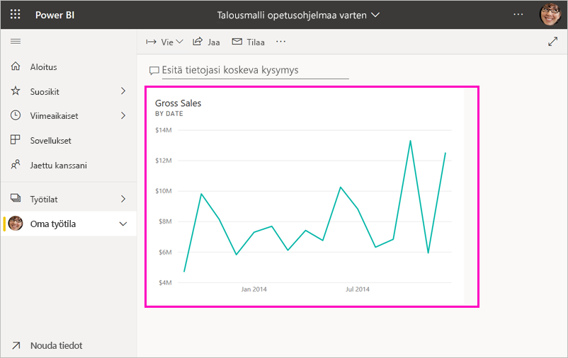
   
8. Voit palata raporttiin valitsemalla raporttinäkymän uuden ruudun. Power BI palauttaa sinut raportin lukunäkymään. 

1. Voit palata muokkausnäkymään valitsemalla yläreunan siirtymisruudusta **Enemmän vaihtoehtoja** (...) > **Muokkaa**. Kun olet muokkausnäkymässä, voit jatkaa ruutujen tarkastelemista ja kiinnittämistä.

    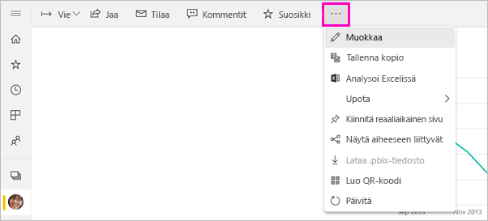

## Vaihe 3: Tutki Q&A:n avulla

Voit tutkia tietoja nopeasti esittämällä kysymyksen Q&A-ruutuun. Q&A luo luonnollisen kielen mukaisia kyselyjä tiedoistasi. Q&A-ruutu on koontinäytön yläosassa (**Esitä tietojasi koskeva kysymys**). Raportissa se on yläreunan siirtymisruudussa (**Esitä kysymys**).

1. Jos haluat palata koontinäyttöön, valitse **Oma työtila** mustasta **Power BI** -palkista.

    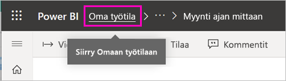

1. Valitse **koontinäyttöjen** välilehdeltä koontinäyttösi.

    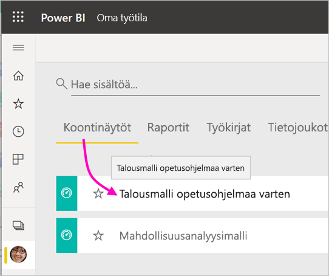

1. Valitse **Kysymysten kysyminen tiedoista**. Q&A tarjoaa automaattisesti useita ehdotuksia.

    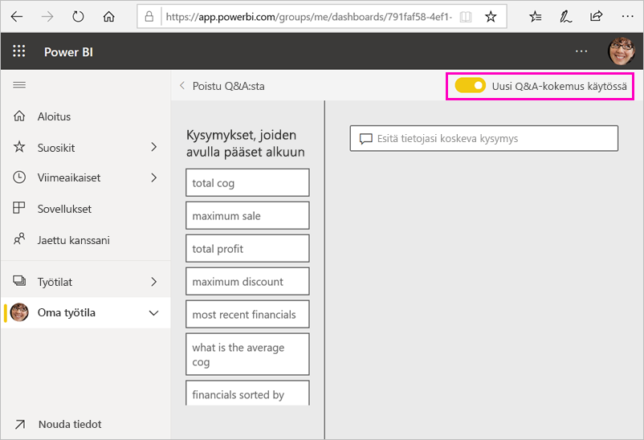

    > [!NOTE]
    > Jos et näe ehdotuksia, ota käyttöön **Uusi Q&A-kokemus**.

2. Jotkin ehdotuksista palauttavat yksittäisen arvon. Valitse esimerkiksi **suurin myynti**.

    Q&A etsii vastauksen ja näyttää sen *kortin* visualisointina.

    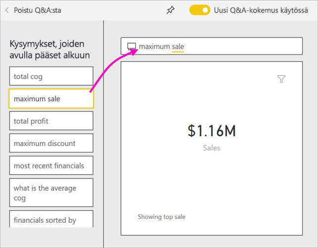

3. Valitse Kiinnitä-kuvake  näyttääksesi visualisoinnin Talousmalli opetusohjelmaa varten -koontinäytössä.

1. Vieritä alaspäin **Kysymykset, joiden avulla pääset alkuun** -luettelossa ja valitse **kunkin kuukauden myytyjen tuotteiden kustannusten keskiarvo**. 

    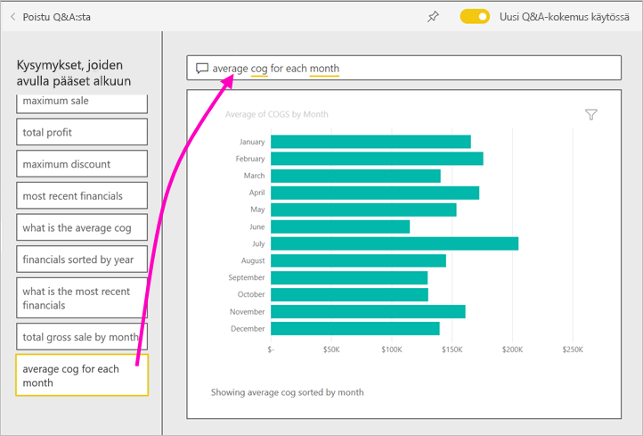

1. Kiinnitä myös palkkikaavio **Talousmalli opetusohjelmaa varten** -koontinäyttöön.

1. Aseta kohdistin *kuukauden mukaan* -kohdan perään Q&A-ruutuun ja kirjoita *rivinä*. Valitse **rivi (Visualisointityyppi)** . 

    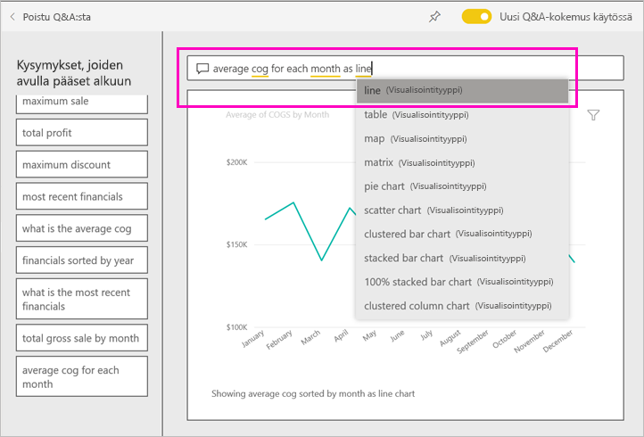

4. Valitse **Poistu Q&A:sta** palataksesi koontinäyttöön, jossa näet luomasi uudet ruudut. 

   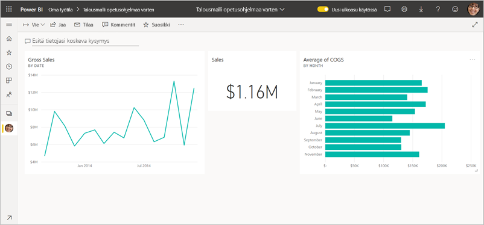

   Huomaat, että vaikka muutit kaavion viivakaavioksi, ruutu pysyy palkkikaaviona, koska se oli sellainen, kun kiinnitit sen. 

## Vaihe 4: Järjestä ruudut uudelleen

Koontinäyttö on leveä. Voit järjestää ruudut uudelleen ja hyödyntää koontinäytön tilan paremmin.

1. Vedä *Bruttomyynti*-viivakaavioruudun oikeaa alakulmaa ylöspäin, kunnes se on samalla korkeudella kuin Myynti-ruutu, ja vapauta se sitten.

    

    Nyt molemmat ruudut ovat samalla korkeudella.

    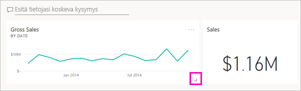

1. Vedä *Myytyjen tuotteiden kustannusten keskiarvo* -palkkikaavioruutua, kunnes se on *Bruttomyynti*-viivakaavion alapuolella.

    Se näyttää paremmalta.

    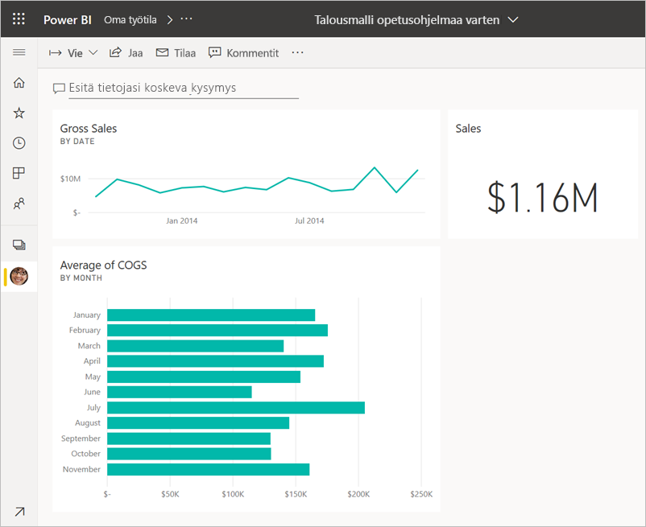

## Vaihe 5: Käsittele ruutuja

Tässä on vielä yksi huomioitava seikka, ennen kuin alat tehdä omia koontinäyttöjä ja raportteja. Eri ruutujen valitseminen tuottaa erilaisia tuloksia. 

1. Valitse ensin raportista kiinnittämäsi *Bruttomyynti*-viivakaavioruutu. 

    Power BI avaa raportin lukunäkymässä. 

2. Valitse selaimen Takaisin-painike. 

1. Valitse nyt Q&A:ssa luomasi *Myytyjen tuotteiden kustannusten keskiarvo* -palkkikaavioruutu. 

    Power BI ei avaa raporttia. Q&A avautuu sen sijaan, koska loit tämän kaavion siellä.

## Resurssien tyhjentäminen
Nyt kun olet suorittanut opetusohjelman, voit poistaa tietojoukon, raportin ja koontinäytön. 

1. Varmista siirtymisruudussa, että olet **Omassa työtilassa**.
2. Valitse **Tietojoukot**-välilehti ja etsi tätä opetusohjelmaa varten tuotu tietojoukko.  
3. Valitse **Enemmän vaihtoehtoja** (...) > **Poista**.

    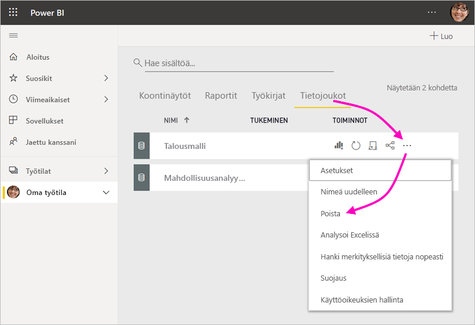

    Kun poistat tietojoukon, näet varoituksen, jossa lukee **Myös kaikki raportit ja koontinäyttöruudut, jotka sisältävät tietoja tästä tietojoukosta, poistetaan**.

4. Valitse **Poista**.

## Seuraavat vaiheet

Voit parantaa koontinäyttöjäsi entisestään lisäämällä visualisointiruutuja ja [nimeämällä niitä uudelleen, muuttamalla niiden kokoa, linkittämällä niitä ja muuttamalla niiden sijaintia](service-dashboard-edit-tile.md).

