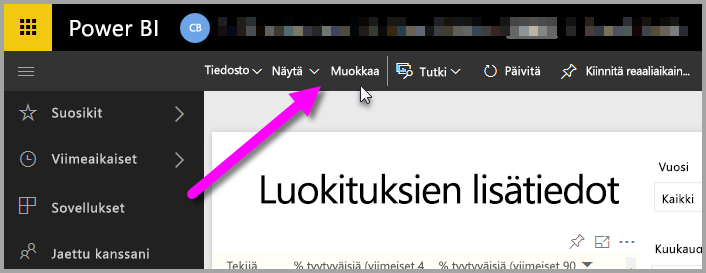
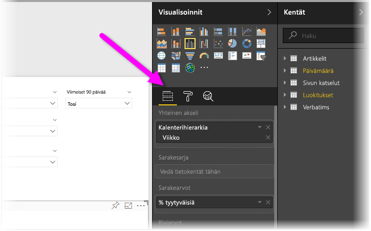
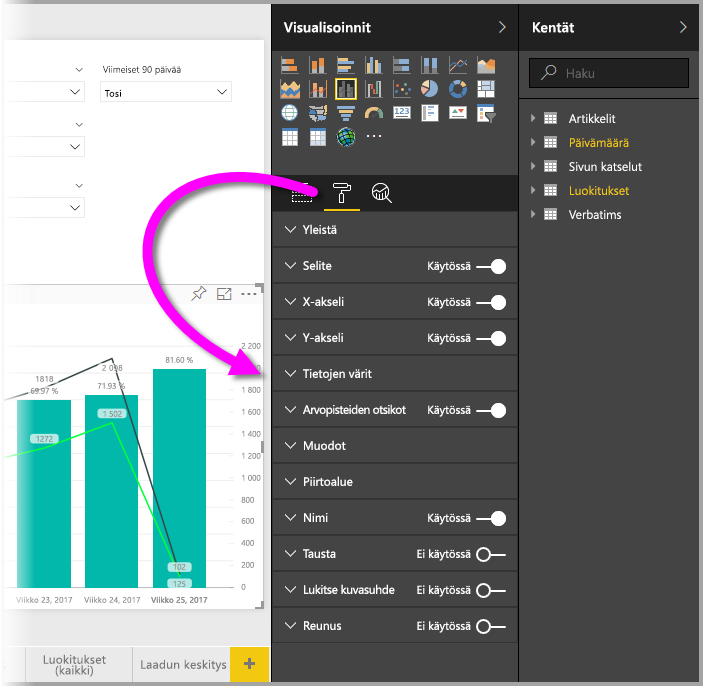
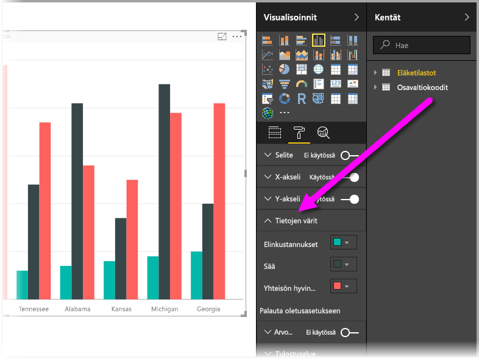
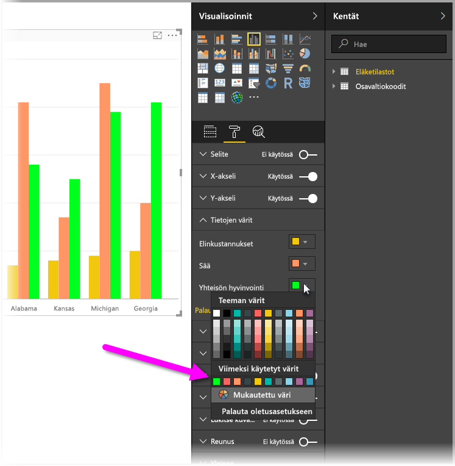
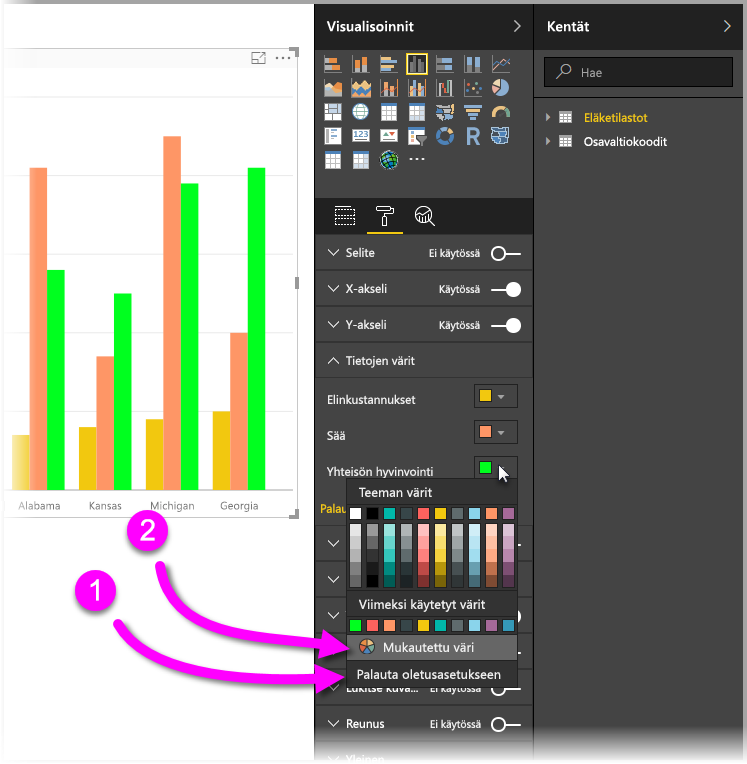
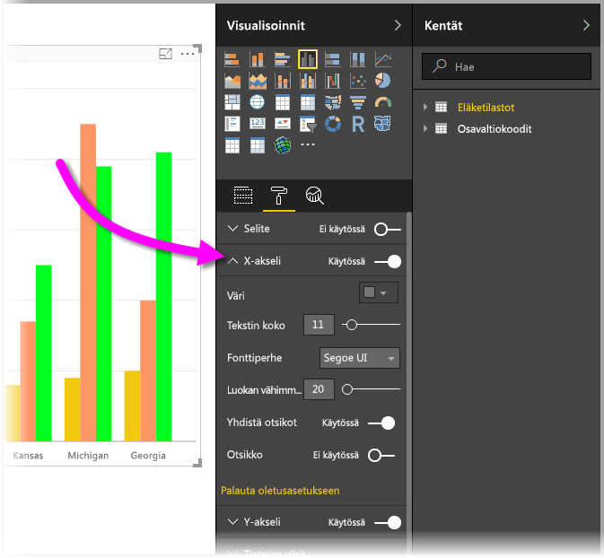

# Värimuotoilun ja akseliominaisuuksien käytön aloittaminen
Valitsemalla **Power BI** voit muuttaa arvosarjojen, arvopisteiden ja jopa visualisointien taustan värin. Voit myös muuttaa x- ja y-akselin esitystapaa, joten voit hallita täydellisesti raporttinäkymien ja raporttien ulkonäköä.

Aloita valitsemalla **Raportti** **Oma työtilani** -ruudusta. Valitse sitten ylävalikosta **Muokkaa raporttia**.  

Kun muokkaat raporttia ja sinulla on visualisointi valittuna, näkyviin tulee **Visualisoinnit**-ruutu, jonka avulla voit lisätä tai muuttaa visualisointeja. Käytettävissä olevien visualisointien alapuolella on kolme kuvaketta: **Kentät** (palkkien pino), **Muoto** (tela) ja **Analytiikka** (suurennuslasi). Alla olevassa kuvassa näkyvä keltainen palkki kuvakkeen alapuolella osoittaa **Kentät**-kuvakkeen olevan valittuna.

Kun valitset kohdan **Muoto**, sen alapuolella oleva alue näyttää ne värin ja akselin mukautukset, jotka ovat käytössä valitun visualisoinnin kanssa.  

Voit mukauttaa kunkin visualisoinnin monia elementtejä:

* Selite
* X-akseli
* Y-akseli
* Tietojen värit
* Arvopisteiden otsikot
* Muodot
* Piirtoalue
* Otsikko
* Tausta
* Lukitse kuvasuhde
* Reunus

> [!NOTE]
>  
> Kaikkia näitä elementtejä ei näy jokaisen visualisointityypin kanssa. Valitsemasi visualisointi vaikuttaa käytettävissä oleviin mukautuksiin; et voi esimerkiksi mukauttaa x-akselia jos olet valinnut ympyräkaavion, sillä niissä ei ole x-akselia.
> 
> 

Huomaa myös, että jos et ole valinnut visualisointia, kuvakkeiden sijaan näkyviin tulee **Suodattimet**, josta voit asettaa suodattimia kaikkiin sivulla oleviin visualisointeihin.

Esittelemme pari esimerkkiä: ensimmäinen värien käyttämisestä ja toinen akselin ominaisuuksien muuttamisesta. Sen jälkeen sinun pitäisi olla valmis mukauttamaan värejä, akseleita ja otsikoita koko päivän.

## Värien käyttäminen
Käydään läpi kaavion värien mukauttamiseen tarvittavat vaiheet.

1. Valitsen raporttipohjasta kohdan **Klusteroitu pylväskaavio**.
2. Seuraavaksi valitsen **Muoto**-kuvakkeen, joka näyttää käytettävissä olevat mukautukset.
3. Seuraavaksi valitsen pienen alanuolen **Tietojen värit** -mukauttamisen vasemmalta puolelta. Tämä toiminto näyttää, miten voin mukauttaa tietojen värejä valitsemani visualisoinnin vaihtoehdoilla.
4. **Tietojen värit** laajenee alaspäin ja näyttää käytettävissä olevat mukautukset.  
   

Tehdään joitain muutoksia. Voin tehdä muutoksia jokaiseen saatavilla olevaan arvosarjaan valitsemalla värin vierestä alanuolen. Laitan **Elinkustannukset**-kohdan keltaisella **Sää**-kohdan oranssilla ja **Yhteisön hyvinvointi** -kohdan vihreällä. Seuraavassa näytössä näkyy viimeinen vaiheeni, **Elinkustannukset**-kohdan muuttaminen.  

Muutokset näkyvät alla olevassa kuvassa. Vau, onpa kirkas kaavio. Tässä on muutamia hyödyllisiä elementtejä koskien värien käyttöä. Luettelon numerot esiintyvät myös seuraavassa näytössä ja ne ilmaisevat, mistä näitä hyödyllisiä elementtejä pääsee käyttämään tai muuttamaan.

1. Et pidä väreistä? Ei hätää, valitse **Palauta oletusasetukseen** ja valintasi palautuvat oletusasetuksiin. Voit tehdä sen joko yhdelle värille tai koko visualisoinnille.
2. Haluatko värin, jota et näe valikoimassa? Valitse vain **Mukautettu väri** ja valitse asteikolta.  
   

Etkö pidä juuri tekemistäsi muutoksista? Käytä yhdistelmää **CTRL + Z** kumoamisvaiheena, aivan kuten olet tottunut tekemään.

## Akselin ominaisuuksien muuttaminen
X- tai Y-akselin muokkaaminen on usein hyödyllistä. Seuraavassa kuvassa näytetään, miten voit muokata haluamaasi akselia valitsemalla alanuoli-kuvakkeen akselin vasemmalta puolelta, aivan kuten värejä käyttäessäsi.  

Jos haluat tiivistää **X-akseli**n asetuksia, valitse vain ylänuoli-kuvake **X-akseli**n vierestä.

**X-akseli**n vieressä olevalla valintanapilla voit poistaa x-akselin otsikot kokonaan. **Otsikko**-kohdan vieressä olevalla valintanapilla voit valita ovatko akseleiden otsikot käytössä vai eivät.  

Power BI raportteihin ja raporttinäkymiin on valittavana monenlaisia värejä ja mukautuksia.

> [!NOTE]
>  
> Mukautukset, jotka ovat käytettävissä **Muoto**-kuvakkeen ollessa valittuna, ovat käytettävissä myös Power BI Desktopissa.
> 
> 

## Seuraava vaihe
Katso lisätietoja seuraavasta artikkelista:  

* [Vinkkejä värimuotoiluun Power BI:ssä](service-tips-and-tricks-for-color-formatting.md)  

