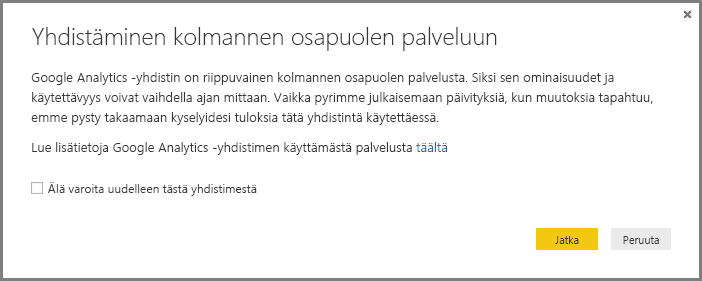
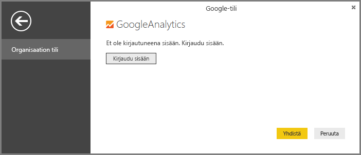
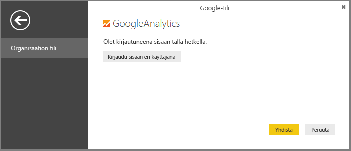
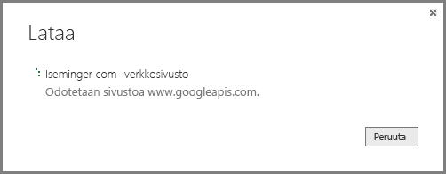

# Google Analytics -yhdistin Power BI Desktopille
> [!NOTE]
> Google Analytics -sisältöpaketti ja -yhdistin Power BI Desktopille ovat riippuvaisia Google Analytics Core Reporting -ohjelmointirajapinnasta. Tämän vuoksi niiden ominaisuudet ja käytettävyys voivat vaihdella ajan mittaan.
> 
> 

Voit muodostaa yhteyden Google Analytics -tietoihin **Google Analytics** -yhdistimen avulla. Voit muodostaa yhteyden seuraavasti:

1. Valitse **Power BI Desktopissa** **Nouda tiedot** valintanauhan **Aloitus**-välilehdeltä.
2. Valitse **Nouda tiedot** -ikkunassa **Online-palvelut** vasemmanpuoleisen ruudun luokista.
3. Valitse **Google Analytics** oikeanpuoleisen ruudun valinnoista.
4. Valitse ikkunan alareunassa **Yhdistä**.  
   

Näkyviin tulee valintaikkuna, jossa kerrotaan, että yhdistin on kolmannen osapuolen palvelu, varoitetaan siitä, että sen ominaisuudet ja käytettävyys saattavat muuttua ajan mittaan, ja annetaan muita selvennyksiä.  

Kun valitset **Jatka**, sinua pyydetään kirjautumaan sisään Google Analyticsiin.  

Kun annat tunnistetietosi, näkyviin tulee valintaikkuna, jossa sinua pyydetään sallimaan Power BI:lle tietojen offline-käyttö. Tällä tavoin voit käyttää Google Analytics -tietojasi **Power BI Desktopissa**.  

Kun sallit tämän, **Power BI Desktop** näyttää, että olet kirjautuneena sisään.  

Valitse **Yhdistä**. Google Analytics-tietosi yhdistetään **Power BI Desktopiin** ja ladataan.  

## Ohjelmointirajapinnan muutokset
Vaikka pyrimmekin julkaisemaan päivityksiä tehtyjen muutosten mukaan, ohjelmointirajapinta saattaa muuttua tavalla, joka vaikuttaa luotujen kyselyjen tuloksiin. Tiettyjä kyselyjä ei ehkä enää tueta joissain tapauksissa. Tämän riippuvuuden vuoksi emme voi taata tekemiesi kyselyjen tuloksia tätä yhdistintä käytettäessä.

Lisätietoja Google Analytics -ohjelmointirajapinnan muutoksista löytyy Google Analyticsin [muutoslokista](https://developers.google.com/analytics/devguides/changelog).

