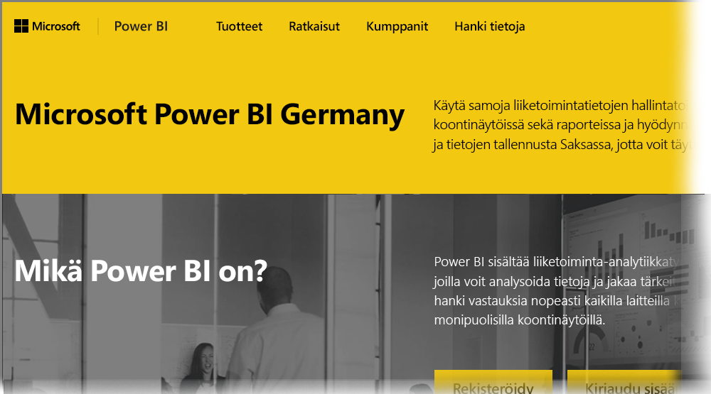

# Usein kysyttyjä kysymyksiä Power BI:n pilvipalvelun saksalaisille asiakkaille
**Power BI -palvelusta** on saatavilla Euroopan unionin ja Euroopan Vapaakauppajärjestön sopimuksen (EU/EFTA) asiakkaille versio, johon viitataan usein nimellä Microsoft Cloud Deutschland (MCD). Tässä artikkelissa kuvattu **Power BI -palvelun** versio on suunniteltu erityisesti EU/EFTA -asiakkaille ja on erillinen ja erilainen kuin **Power BI -palvelun** kaupallinen versio, joka on tarjolla valtionhallinnon asiakkaille.

Seuraavat kysymykset ja vastaukset tarjoavat tärkeää tietoa Microsoft Cloud Deutschlandin (MCD) Power BI Pro -palvelusta, joka on tarjolla oleva Power BI pilvipalvelu nimenomaisesti EU/EFTA -asiakkaille.

1. **Mikä on Germany Cloudin Power BI -palvelu?**
   
   EU/EFTA-asiakkaille tarkoitettu Power BI -palvelu, jota kutsutaan myös nimellä Microsoft Cloud Deutschland (MCD) on EU/EFTA -yhteensopiva Saksan tietokeskuksien tarjoama Power BI -pilvipalvelu. EU/EFTA Power BI -pilvipalvelussa kaikkia asiakastietoja säilytetään Saksassa, T-Systemin toimiessa riippumattomana saksalaisena tietojen edunvalvojana, ja joiden fyysistä ja loogista käyttöä hallitaan Saksan lain mukaan. EU/EFTA Power BI -pilvipalvelu vaatii erottuvan ja erillisen tilin kaupallisessa versiossa käytetystä Power BI -palvelutilistä. Lue lisää Microsoft Cloud Deutschlandista [täältä](https://www.microsoft.com/trustcenter/cloudservices/nationalcloud).
2. **Mistä voin löytää Power BI Saksan pilvipalvelun hinnoittelu- ja rekisteröintitiedot?**
   
   [Power BI Saksan pilvipalvelun kotisivuilta](https://powerbi.microsoft.com/power-bi-germany/) löytyy paljon tietoa, mm. hinnoittelusta. Sivuilta löytyy myös linkki, jonka kautta voi rekisteröityä **Power BI Pro -palvelun** käyttäjäksi 30 päivän kokeiluversioon, joka sisältää 25 käyttöoikeutta. Osana kokeiluversioon rekisteröitymistä, saat mahdollisuuden ostaa tai lisätä käyttöoikeuksia tarpeen vaatiessa. Tarjoamme myös Enterprise Agreement (EA) -sopimuksen ja voittoa tavoittelemattoman hinnoittelun. Ota yhteyttä Microsoftin asiakasedustajaan saadaksesi lisätietoja.
3. **Minulla on Saksan pilvipalvelun -vuokraaja osana Azure Saksan ja/tai Office 365 Saksan tilausta. Voinko käyttää olemassa olevaa vuokraajaa rekisteröityessäni Power Bi Saksaan?**
   
   Kyllä. Osana rekisteröitymisprosessia, voit vaihtoehtoisesti kirjautua sisään olemassa olevalla Saksan pilvipalvelun vuokraajan järjestelmänvalvojatilillä, ja lisätä Power BI Pro -palvelun käyttöoikeuden olemassa olevaan Saksan pilvipalvelun vuokraajan. Huomioi, että Saksan pilvipalvelun vuokraajat ja käyttäjätilit eroavat Power BI -palvelu Saksan pilvipalvelun vastaavista.
4. **Onko olemassa maksutonta Power Bi Saksan pilvipalvelua?**
   
   Ei. Emme tarjoa ilmaisia käyttöoikeusversioita Power BI Saksan pilvipalvelusta. Voit kuitenkin rekisteröityä [ilmaiseksi Power Bi:n julkiseen pilvipalveluun](https://powerbi.microsoft.com/get-started/) jos yrityksesi tarpeet on mahdollista tyydyttää ilmaisen Power BI -palvelun avulla.
5. **Voinko käyttää Power BI Desktopia, Power BI -mobiilisovellusta, paikallisia tietoyhdyskäytäviä ja Publisher for Exceliä Power BI Saksan pilvipalvelussa?**
   
   Kyllä. Olemme päivittäneet Power BI -tuotteemme toimimaan saumattomasti Power BI Saksan pilvipalvelun kanssa. Kirjaudu sisään Power BI Saksan pilvipalvelutilillesi käyttääksesi samoja asiakastuotteita Power BI Saksan pilvipalvelussa. Voit ladata viimeisimmän version asiakastuotteista seuraavista paikoista:
   
   * [Power BI Desktop](https://powerbi.microsoft.com/desktop/)
   * [Power BI Mobile](https://powerbi.microsoft.com/mobile/)
   * [Paikallinen tietoyhdyskäytävä](https://powerbi.microsoft.com/gateway/)
   * [Power BI Publisher for Excel](https://powerbi.microsoft.com/excel-dashboard-publisher/)
6. **Onko mitään ominaisuuksia rajoitettu Power BI Saksan pilvipalvelussa?**
   
   Seuraavat palveluominaisuudet eivät ole tällä hetkellä saatavilla Power BI Saksan pilvipalvelussa:
   
   * Verkkoon julkaiseminen
   * Esrin ArcGIS -kartat
   * Power BI Embedded (erillinen käytön mukaan laskutettava ISV -käyttöoikeus tulee tulevaisuudessa saataville [Microsoft Azure Saksan](https://azure.microsoft.com/overview/clouds/germany/)kautta)
7. **Mistä löydän Power BI Saksan pilvipalvelun tarkat kokoonpanotiedot, jotta voin integroida ja käyttää niitä omissa sovelluksissani?**
   
   Olemme päivittäneet [SaaS Embedding -kehittäjämallit](https://github.com/Microsoft/PowerBI-Developer-Samples) Saksan ja muiden Power BI -pilvipalveluiden tarkat kokoonpanotiedot. Tarkastele mallien **Pilvipalvelumääritykset**-kansioita löytääksesi pilvipalveluita koskevat määritysten loppupisteet. Seuraavassa taulukossa on lueteltu useita määritysten loppupisteitä Power BI Saksan pilvipalvelulle (sekä ristiviittaukseksi julkiselle pilvipalvelulle).

| **Loppupisteen nimi ja/tai käyttö** | **Power BI -palvelun Saksan pilvipalvelun URL-osoite** | **Julkinen pilvipalvelun vastaava URL-osoite (ristiviittaukseksi)** |
| --- | --- | --- |
| Kotisivu, rekisteröinti ja sisäänkirjautuminen |[https://powerbi.microsoft.com/power-bi-germany/](https://powerbi.microsoft.com/power-bi-germany/) |[https://powerbi.microsoft.com/](https://powerbi.microsoft.com/) |
| Suora sisäänkirjautuminen Power BI-palveluun |[https://app.powerbi.de/?noSignUpCheck=1](https://app.powerbi.de/?noSignUpCheck=1) |[https://app.powerbi.com/?noSignUpCheck=1](https://app.powerbi.com/?noSignUpCheck=1) |
| Palvelun ohjelmointirajapinta |[https://api.powerbi.de/](https://api.powerbi.de/) |[https://api.powerbi.com/](https://api.powerbi.com/) |
| Käyttäjän käyttöoikeuksien hallinta Office-portaalissa, palvelun kunnon tila ja järjestelmänvalvojien tukipyynnöt |[https://portal.office.de/](https://portal.office.de/) |[https://portal.office.com/](https://portal.office.com/) |
| AAD -valtuutuksen URI |[https://login.microsoftonline.de/common/oauth2/authorize/](https://login.microsoftonline.de/common/oauth2/authorize/) |[https://login.microsoftonline.com/common/oauth2/authorize/](https://login.microsoftonline.com/common/oauth2/authorize/) |
| Power BI -palvelun resurssi URI |[https://analysis.cloudapi.de/powerbi/api](https://analysis.cloudapi.de/powerbi/api) |[https://analysis.windows.net/powerbi/api](https://analysis.windows.net/powerbi/api) |
| Mukautettujen visualisointien kirjasto |[https://app.powerbi.de/visuals/](https://app.powerbi.de/visuals/) |[https://app.powerbi.com/visuals/](https://app.powerbi.com/visuals/) |
| Rekisteröi Power BI -sovellus (Embedded:lle) |[https://app.powerbi.de/apps](https://app.powerbi.de/apps) |[https://app.powerbi.com/apps](https://app.powerbi.com/apps) |
| Azure-portaali (Embedded:lle) |[https://portal.microsoftazure.de/](https://portal.microsoftazure.de/) |[https://portal.azure.com/](https://portal.azure.com/) |
| Yhteisö |[https://community.powerbi.com/](https://community.powerbi.com/) |[https://community.powerbi.com/](https://community.powerbi.com/) |

### Seuraavat vaiheet
Voit tehdä Power BI:llä kaikenlaista. Saat lisätietoja ja kursseja, mukaan lukien artikkelin, jossa näytetään, miten voit rekisteröityä palveluun, tutustumalla seuraaviin resursseihin:

* [Power BI:n ohjattu oppiminen](guided-learning/gettingstarted.yml?tutorial-step=1)
* [Power BI -palvelun käytön aloittaminen](service-get-started.md)
* [Mikä on Power BI Desktop?](desktop-what-is-desktop.md)

