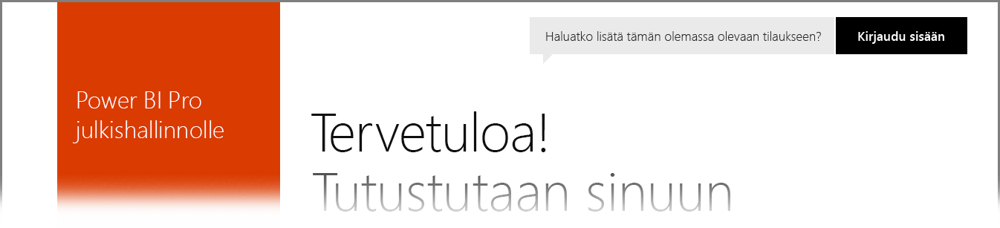

# Power BI Yhdysvaltain valtionhallinnon asiakkaille
**Power BI-palvelulla** on versio, joka on saatavilla Yhdysvaltain valtionhallinnon asiakkaille osana **Office 365 US Government Community** -tilauksia. Tässä artikkelissa kuvattu **Power BI -palvelun** versio on suunniteltu erityisesti Yhdysvaltain valtionhallinnon asiakkaille ja on erillinen ja erilainen kuin **Power BI -palvelun** kaupallinen versio.

Seuraavissa osissa kuvataan *ominaisuuksia*, jotka ovat käytettävissä **Power BI -palvelun** Yhdysvaltain valtionhallinnon versiossa, selkeytetään joitakin *rajoituksia*, luetellaan **usein kysyttyjä kysymyksiä** ja vastauksia (mukaan lukien miten rekisteröidytään) ja annetaan linkkejä lisätietoihin.

## Power BI US Governmentin ominaisuudet
On tärkeää huomata, että **Power BI US Government** on saatavilla vain **Pro-käyttöoikeutena** eikä se ole saatavilla maksuttomana käyttöoikeutena. Tietyt Power BI -palvelun ominaisuudet ovat saatavilla palvelun **Power BI US Government** -versiossa.

Seuraavat ominaisuudet ovat saatavilla **Power BI US Government** -asiakkaille, koska ne koskevat **Pro**-käyttöoikeuden toimintoja:

* Koontinäyttöjen ja raporttien luominen ja tarkasteleminen
* [Tietokapasiteetin rajoitukset](service-admin-manage-your-data-storage-in-power-bi.md)
* [Ajoitettu tietojen päivittäminen](refresh-data.md)
* Päivitettävät työryhmän koontinäytöt
* Active Directory -ryhmät jakamista ja käytön hallintaa varten
* [Tuo tietoja](service-get-data.md) ja raportteja Excel-, CSV- ja Power BI Desktop -tiedostoista
* Tiedonhallinnan yhdyskäytävä
* Kaikki tiedot salataan sekä Azure SQL:ssä että Power BI:n Blob-säilössä
* Muodosta yhteys palveluihin [sisältöpaketeilla](service-connect-to-services.md)

## Valtionhallinnon ja julkisten Azure Cloud -palveluiden välinen yhteys 

Azure jaetaan useiden pilvien kesken. Vuokraajat voivat oletusarvoisesti avata palomuurisääntöjä pilvikohtaiseen esiintymään, mutta verkkopilvipalvelujen välinen verkko on erilainen ja edellyttää tiettyjen palomuurisääntöjen avaamista palveluiden väliselle viestinnälle. Jos olet Power BI -asiakas ja sinulla on julkisessa pilvessä aiemmin luotuja SQL-esiintymiä, joita sinun tarvitse käyttää, sinun on avattava SQL:ssä tietyt palomuurisäännöt Azure Government Cloud IP -tilaa varten seuraavissa tietokeskuksissa:

* USGov Iowa
* USGov Virginia
* USGov Texas
* USGov Arizona

Julkisessa pilvessä IP-tilat ovat saatavilla, mutta valtionhallinnon pilven osalta sinun on avattava Azure-tukipyyntö, jos haluat pyytää yllä lueteltujen tietokeskusten IP-osoitealueet. 

## Power BI US Governmentin rajoitukset
Jotkin ominaisuudet, jotka ovat saatavilla **Power BI -palvelun** kaupallisessa versiossa, *eivät* ole saatavilla **Power BI -palvelussa** Yhdysvaltain valtionhallinnon asiakkaille. Power BI -tiimi pyrkii aktiivisesti saamaan nämä ominaisuudet Yhdysvaltain valtionhallinnon asiakkaille ja päivittää tämän artikkelin tiedot, kun nämä ominaisuudet tulevat saataville.

* **Upottaminen SharePoint Onlinessa** - sisällön upottaminen ei ole mahdollista SharePoint Onlinen Power BI -verkko-osaa käyttämällä.
* **Power BI US Government** on saatavilla vain **Pro**-käyttöoikeutena. Hallintaportaalin viittaukset Power BI (maksuton) -käyttöoikeuksiin (tai käyttäjinä) suoritetaan kaupallisessa Power BI -palvelun pilvessä.
* **Valvonta** – valvonta on saatavilla Office 365:n tietoturva ja yhteensopivuus -portaalin kautta, alkaen kesäkuussa 2018.
* **Power BI -sisältö Cortanassa** – Power BI:n tulokset eivät näy Cortanan hakutuloksissa. Tämä sisältää Power BI -sisällön (koontinäytöt, raportit, sovellukset) tulokset sekä tulokset, jotka näyttävät Cortanalle optimoidut raporttisivujen avainsanat.
* **Ulkoisen käyttäjän kanssa jakaminen** – jakaminen on sallittua Power BI -vuokralaisen sisällä, ja alkaen kesäkuussa 2018 voita jakaa myös Power BI -vuokraajan ulkopuolisten käyttäjien kanssa. Katso artikkeli [Power BI -sisällön jakaminen ulkoisille vieraskäyttäjille Azure AD B2B:n avulla](service-admin-azure-ad-b2b.md).
* **Raporttinäkymien ja raporttien käyttötilastot** – käyttötilastot eivät ole käytettävissä raporteille ja raporttinäkymille. Asiakkaat voivat käyttää valvontalokitietoja saadakseen organisaation sisäisen sisällön käyttötietoja.

Jos sinulla on maksuttomia **Power BI** -käyttöoikeuksia määritettynä tilillesi, kyseiset tilit toimivat kaupallisessa**Power BI** -palvelun versiossa, joten ne ovat eivät ole osa **Power BI US Government** -tarjontaa. Voit kohdata seuraavia ongelmia maksuttomissa tileissä:

* Yhdyskäytävä, mobiili ja työpöytä eivät voi todentaa.
* Et voi käyttää Azuren kaupallisia tietolähteitä.
* PBIX-tiedostot on ladattava manuaalisesti kaupallisesta versiosta.
* Power BI -mobiilisovellukset eivät ole käytettävissä.

Ratkaise ongelmia ottamalla yhteyttä tilisi edustajaan.

## Power BI-palvelun Yhdysvaltain valtionhallinnon version usein kysytyt kysymykset
Seuraavat kysymykset (ja vastaukset) on toimitettu auttamaan sinua saamaan tarvitsemasi tiedot palvelusta nopeasti.

**Kysymys:** Miten siirrän kaupallisen **Power BI:n** tiedot Yhdysvaltain valtionhallinnon **Power BI -palveluun**?

**Vastaus:** Järjestelmänvalvojan on luotava uusi **Power BI** -esiintymä erillisessä Yhdysvaltain valtionhallinnon tilauksessa. Voit sitten kopioida kaupalliset tiedot Yhdysvaltain valtionhallinnon **Power BI -palvelussa**, poistaa kaupallisen käyttöoikeutesi ja liittää olemassa olevan toimialueen Yhdysvaltain valtionhallinnon palveluun.

**Kysymys:** Miksi en voi yhdistää tiettyyn sisältöpakettiin?

**Vastaus:** Sinun on varmistettava, että tilauksesi on otettu käyttöön, ennen kuin muodostat yhteyden kyseiseen sisältöpakettiin.

**Kysymys:** Olen kiinnostunut hankkimaan **Power BI:n** Yhdysvaltain valtionhallinnon organisaatiolle. Miten voin aloittaa?

**Vastaus:** Rekisteröityminen (eli *perehdytys*) saattaa vaihdella nykyisen käyttöoikeuden ja tilauksen mukaan. Lisätietoja on artikkelissa [Rekisteröidy Yhdysvaltain valtionhallinnon Power BI:hin](service-govus-signup.md).

**Kysymys:** Eroaako **Power BI:n** Yhdysvaltain valtionhallinnolle URL-yhdistämisosoite kaupallisesta **Power BI** -URL-osoitteesta?

**Vastaus:** Kyllä, URL-osoitteet ovat erilaiset. Seuraavassa taulukossa on kukin URL-osoite:

| Kaupallisen version URL-osoite | Yhdysvaltain valtionhallinnon version URL-osoite |
| --- | --- |
| https://app.powerbi.com/ |[https://app.powerbigov.us](https://app.powerbigov.us) |

**Kysymys:** Tilini on valmisteltu useammassa kuin yhdessä maakohtaisessa pilvipalvelussa. Miten voin valita yhdistettävän pilvipalvelun käyttäessäni **Power BI Desktopia**?

**Vastaus:** Heinäkuun 2018 **Power BI Desktop**-julkaisusta alkaen, voit valita, mihin pilvipalveluun haluat **Power BI Desktopilla** kirjautua.

## Seuraavat vaiheet
Voit tehdä Power BI:llä kaikenlaista. Saat lisätietoja ja kursseja, mukaan lukien artikkelin, jossa näytetään, miten voit rekisteröidy palveluun, tutustumalla seuraaviin resursseihin:

* [Rekisteröidy Yhdysvaltain valtionhallinnon Power BI:hin](service-govus-signup.md)
* <a href="https://channel9.msdn.com/Blogs/Azure/Cognitive-Services-HDInsight-and-Power-BI-on-Azure-Government">Yhdysvaltain valtionhallinnon Power BI:n esittelyohjelma</a>
* [Power BI:n ohjattu oppiminen](guided-learning/gettingstarted.yml?tutorial-step=1)
* [Power BI -palvelun käytön aloittaminen](service-get-started.md)
* [Mikä on Power BI Desktop?](desktop-what-is-desktop.md)

