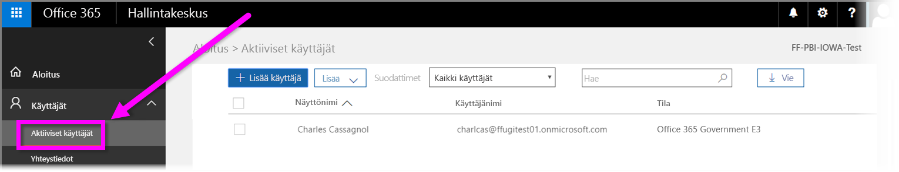

# Rekisteröi Yhdysvaltain valtionhallinnon organisaatio Power BI -palveluun
**Power BI-palvelulla** on versio, joka on saatavilla Yhdysvaltain valtionhallinnon asiakkaille osana **Office 365 US Government Community** -tilauksia. Tässä artikkelissa kuvattu **Power BI -palvelun** versio on suunniteltu erityisesti Yhdysvaltain valtionhallinnon asiakkaille ja on erillinen ja erilainen kuin **Power BI -palvelun** kaupallinen versio.

Saat lisätietoja **Power BI -palvelusta** Yhdysvaltain valtiohallinnolle, sen ominaisuudet ja rajoitukset mukaan lukien, tutustumalla ohjeartikkeliin [Power BI Yhdysvaltain valtionhallinnon asiakkaille – Yleiskuvaus](service-govus-overview.md).

> [!NOTE]
> Tämä artikkeli on tarkoitettu järjestelmänvalvojille, joilla on valtuudet rekisteröidä Yhdysvaltain valtionhallinnon organisaationsa Power BI -käyttöä varten. Jos olet käyttäjä, ota yhteyttä järjestelmänvalvojaan, jos haluat tietoja Yhdysvaltain valtionhallinnon Power BI -tilauksesta.
> 
> 

## Valitse oikealle rekisteröintiprosessi Yhdysvaltain valtionhallinnon organisaatiollesi
Yhdysvaltain valtionhallinnon organisaatiosi voi olla käyttämässä ensimmäistä kertaa **Office Government -pilvipalvelua**, tai sillä saattaa jo olla tilaus. Seuraavissa osioissa kerrotaan rekisteröitymisvaiheet sen perusteella, missä vaiheessa olet Office Government -pilvipalvelun ja Power BI:n käytössä, ja ne riippuvat olemassa olevasta tilauksestasi.

Kun olet rekisteröitynyt Yhdysvaltain valtionhallinnon Power BI -käyttäjäksi, jotkin ominaisuudet eivät välttämättä toimi, ennen kuin myyntiedustaja tai tukihenkilö saa perehdytysprosessisi valmiiksi. Lisätietoja näistä ominaisuuksista on artikkelissa [Power BI Yhdysvaltain valtionhallinnon asiakkaille – Yleiskuvaus](service-govus-overview.md). Jotta voit suorittaa perehdytysprosessin loppuun näiden ominaisuuksien ottamiseksi käyttöön, ota yhteyttä myyntiedustajaan tai tukihenkilöön.

### Yhdysvaltain valtionhallinnon organisaatiot, jotka ovat uusia Officen pilvipalvelun asiakkaita
Jos organisaatiosi on uusi **Office Government -pilvipalvelun** asiakas, toimi seuraavasti:

> [!NOTE]
> Portaalin järjestelmänvalvojan tulisi suorittaa nämä vaiheet.
>

1. Siirry kohteeseen [https://products.office.com/en-us/government/office-365-web-services-for-government](https://products.office.com/en-us/government/office-365-web-services-for-government).

>[!NOTE]
>Jos et halua tällä hetkellä rekisteröityä Office Government -pilvipalveluun, ota yhteyttä myyntiedustajaasi.
>

2. Valitse Office G3 ja täytä lomake Office-kokeiluversiota varten
3. Kun olet Officen pilvipalvelun asiakas, jatka alla olevilla Nykyiset Office Government -pilvipalvelun asiakkaat -kohdan vaiheilla

### Nykyiset Office Government -pilvipalvelun asiakkaat
Jos organisaatio on **Office Government -pilvipalvelun** nykyinen asiakas, mutta sinulla ei ole **Power BI** -tilausta (maksutonta tai muuta), toimi seuraavasti:

> [!NOTE]
> Portaalin järjestelmänvalvojan tulisi suorittaa nämä vaiheet.
> 
> 

1. Kirjaudu sisään olemassa olevaan Office Government -pilvipalvelun tiliisi ja siirry hallintaportaaliin
2. Valitse **Laskutus**.
3. Valitse **Ostopalvelut**.
4. Valitse Power BI Pro Government -vaihtoehto ja valitse joko **Kokeile** tai **Osta nyt**
5. Viimeistele tilaus
6. Määritä käyttäjiä tilille.
   
   
7. Kirjaudu sisään **Power BI -palveluun** Yhdysvaltain valtionhallinnon asiakkaille osoitteessa [https://app.powerbigov.us](https://app.powerbigov.us)

## Lisätietoa rekisteröitymisestä
Alla on lisätietoja rekisteröitymisestä **Yhdysvaltain valtionhallinnon Power BI** -palveluun eri käyttöoikeuksien siirtotapauksissa.

### Suora Power BI -kokeiluversio Pro-asiakkaan perehdytykseen
* Valitse Laskutus > Osta palvelu > Power BI Pro Gov ja valitse osto kokeiluversion sijaan
* Täytä tarvittavat tiedot ja hanki käyttöoikeudet
* Poista Power BI Pro -kokeiluversio tai poista vanhat käyttöoikeudet ja määritä käyttäjille uudet
* Kirjaudu sisään kohteeseen [https://app.powerbigov.us](https://app.powerbigov.us)

### Jälleenmyyjän Power BI -kokeiluversio Pro-asiakkaan perehdytykseen
Valitse **Laskutus > Tilaukset** ja valitse **Power BI Pro julkishallinnolle** -tilaus. Näytössä näkyy:

* Käytettävissä
* Määritetty
* Määritä käyttäjille -linkit
* Jos sinulla on yhä kokeiluversio määritettynä:
  * Napsauta **Määritetty** kokeiluversion tilauksen kohdalla ja poista käyttäjät, jotka haluat lisätä maksulliseen tilaukseen
  * Siirry Maksettu tilaus -kohtaan ja määritä kyseiset käyttäjät

### Ohjeet sallittujen luetteloon lisäämiseksi
*Sallittujen luetteloon lisääminen* on prosessi, jota Power BI:n teknikkojen työryhmä käyttää asiakkaiden siirtämiseksi kaupallisesta pilvipalveluympäristöstä suojattuun valtionhallinnon pilvipalveluympäristöön. Tämä takaa sen, että Yhdysvaltain valtionhallinnon pilvipalvelun ominaisuudet toimivat odotetulla tavalla. Kaikkien nykyisten (tai uusien) Yhdysvaltain valtionhallinnon asiakkaiden, jotka ostavat Yhdysvaltain valtionhallinnon **Power BI** -palveluita ensimmäistä kertaa, *täytyy* aloittaa seuraava sallittujen luetteloon lisäämisprosessi. Prosessi on tehtävä ennen asennusta tai siirtoa Yhdysvaltain valtionhallinnon **Power BI** -palveluihin. 

Jos haluat, että vuokraajasi on lisätty *sallittujen luetteloon* Yhdysvaltain valtionhallinnon pilvipalvelussa, pyydä Microsoft-tilitiimiltä apua tähän liittyen. Huomaa, että vain järjestelmänvalvojat voivat tehdä tämän pyynnön. *Sallittujen luetteloon lisääminen* kestää noin kolme viikkoa, jonka aikana Power BI:n teknikkojen työryhmä tekee tarvittavat muutokset varmistaakseen, että vuokraaja toimii oikein Yhdysvaltain valtionhallinnon pilvipalvelussa.

Asiakkaat, jotka siirtyvät Power BI:n **maksuttomista** käyttöoikeuksista **Yhdysvaltain valtionhallinnon Power BI** -käyttäjiksi (ja siten siirtyvät liittyviin **Pro**-käyttöoikeuden ominaisuuksiin, jotka on kuvattu aiemmin tässä artikkelissa) kohtaavat tämän artikkelin seuraavassa osassa kuvattuja ongelmia, kunnes Power BI:n teknikkojen työryhmä on lisännyt heidän vuokraajansa *sallittujen luetteloon*.

### Sekä maksuttomat että Pro-käyttöoikeudet Yhdysvaltain valtionhallinnon vuokraajissa
Jos vuokraajassasi on sekä maksuttomat että Yhdysvaltain valtionhallinnon Pro-käyttöoikeudet, kummatkin käyttöoikeudet pysyvät näkyvissä, mutta jompi kumpi käyttöoikeustyyppi ei toimi oikein. Jos vuokraaja läpäisee onnistuneesti *sallittujen luetteloon lisäämisen*, tapahtuu seuraavaa:

* Maksuttoman käyttöoikeuden käyttäjät eivät enää voi kirjautua Power BI:hin käyttämällä **Power BI Desktopia**, ja he saattavat kokea aukkoja toiminnoissa seuraavassa osassa kuvatulla tavalla.
* Kaikki asiakkaat, joille on määritetty Yhdysvaltain valtionhallinnon Pro-käyttöoikeudet, voivat käyttää toimintoja odotetulla tavalla, mukaan lukien yhdyskäytävät, Power BI Desktop ja mobiilisovellukset.

Kun käytössäsi on samanaikaisesti maksuttomat ja Pro-käyttöoikeudet Yhdysvaltain valtionhallinnon vuokraajassa ja *sallittujen luetteloon lisäämisen* prosessi on käynnissä, seuraavat tapahtumat ovat mahdollisia:

**Ennen *sallittujen luetteloon lisäämistä***:

* Käyttäjät, joilla on maksuttomat käyttöoikeudet, suoritetaan kaupallisessa pilvipalvelussa
* Yhdysvaltain valtionhallinnon Pro-käyttöoikeudet näkyvät portaalissa, ja järjestelmänvalvoja voi määrittää näitä käyttöoikeuksia käyttäjille. Yhdysvaltain valtionhallinnon Pro-käyttäjät eivät menetä tietoja maksuttomista käyttöoikeuksistaan, kun järjestelmänvalvoja on määrittänyt Yhdysvaltain valtionhallinnon Pro-käyttöoikeuden. Määritetyt käyttäjät voivat käyttää Power BI Pro -toimintoja Yhdysvaltain valtionhallinnon asiakkaille, mutta seuraavassa luettelossa mainitut toimintojen aukot ovat olemassa, kunnes vuokraaja on onnistuneesti *lisätty sallittujen luetteloon*:
  
  * Yhdyskäytävä, mobiili ja Power BI Desktop eivät voi todentaa.
  * Et voi käyttää Azuren kaupallisia tietolähteitä.
  * PBIX-tiedostot on ladattava manuaalisesti kaupallisesta Power BI -palvelusta.
  * Power BI -mobiilisovellukset eivät ole käytettävissä.

**Sallittujen luetteloon lisäämisen *jälkeen***:

* Kaupallisessa Power BI -palvelussa olevat maksuttomat käyttäjät voivat jatkaa suorittamista, mutta ne lakkaavat todentamasta odotetulla tavalla.
* Yhdysvaltain valtionhallinnon pilvipalvelussa olevat Pro-käyttäjät voivat käyttää **Power BI Yhdysvaltain valtionhallinnon asiakkaille** -palvelua odotetulla tavalla.

Tunnistaakseen vuokraajassa olevat käyttäjät, joilla on käytössään Power BI:n maksuton käyttöoikeus, järjestelmänvalvojat voivat suorittaa käyttöoikeuksien raportin, minkä jälkeen maksuttoman käyttöoikeuden käyttäjät näkyvät **Power BI:n vakiokäyttäjinä**.

## Seuraavat vaiheet
Voit tehdä Power BI:llä kaikenlaista. Saat lisätietoja ja kursseja, mukaan lukien artikkelin, jossa näytetään, miten voit rekisteröityä palveluun, tutustumalla seuraaviin resursseihin:

* [Power BI Yhdysvaltain valtionhallinnolle – Yleiskuvaus](service-govus-overview.md)
* [Power BI:n ohjattu oppiminen](guided-learning/gettingstarted.yml?tutorial-step=1)
* [Power BI -palvelun käytön aloittaminen](service-get-started.md)
* [Mikä on Power BI Desktop?](desktop-what-is-desktop.md)

