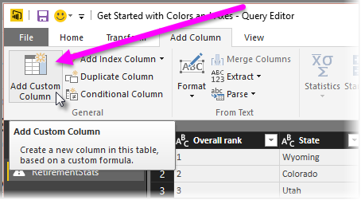

# Histogrammit
Histogrammeja voi muodostaa Power BI:ssa monella tavalla. Aloitamme yksinkertaisimmasta tavasta ja etenemme siitä.

## Yksinkertaiset histogrammit
Aloita määrittämällä, mikä kysely sisältää histogrammin pohjaksi tarvittavan kentän.  Luo uusi kysely kyselyn *Viittaus*-asetuksen avulla ja anna sille nimeksi *FieldName Histogram*. Käytä **Muunna**-valintanauhan **Ryhmittelyperuste**-vaihtoehtoa ja valitse **Laske rivit** -kooste. Varmista, että koostesarakkeen tietotyyppi on numero. Voit visualisoida nämä tiedot raporttisivulla. Tämä lähestymistapa on nopea ja helppo tapa mutta ei toimi hyvin, jos arvopisteitä on useita, eikä sivellintoiminnon käyttöä sallita kaikissa visualisoinneissa.

## Säiliöiden määrittäminen histogrammien muodostamiseksi
Määritä, mikä kysely sisältää histogrammin pohjaksi tarvittavan kentän. Luo uusi kysely kyselyn *Viittaus*-asetuksen avulla ja anna sille nimeksi *FieldName*.  Määritä nyt jakaumat ja niiden säännöt. Käytä **Lisää sarake** -valintanauhan **Lisää mukautettu sarake** -vaihtoehtoa mukautetun säännön luomiseen.

Varmista, että koostesarakkeen tietotyyppi on numero. Nyt voit käyttää yksinkertaisimman histogrammin yhteydessä kuvattua **Ryhmittelyperuste**-vaihtoehtoa histogrammin muodostamiseen. Tällä asetuksella käsitellään enemmän arvopisteitä, mutta se ei silti tue sivellintoiminnon käyttöä.

## Sivellintä tukevan histogrammin määrittäminen
Sivellintoiminnolla tarkoitetaan linkitetyissä visualisoinneissa sitä, että kun käyttäjä valitsee yhden tietopisteen yhdessä visualisoinnissa, raporttisivun muissa visualisoinneissa korostetaan tai suodatetaan valittuun tietopisteeseen liittyvät tietopisteet.  Koska käsittelemme tietoa kyselyhetkellä, meidän on luotava yhteys taulukoiden välille ja varmistettava, mikä tietokohde liittyy jakaumaan histogrammissa ja päinvastoin.

Aloita prosessi valitsemalla *Viittaus*-asetus siinä kyselyssä, jonka pohjalta haluat luoda histogrammin.  Anna uudelle kyselylle nimeksi *Jakaumat*.  Tässä esimerkissä annetaan alkuperäiselle kyselylle nimeksi *Tiedot*.  Poista seuraavaksi kaikki sarakkeet lukuun ottamatta sitä, jota käytetään histogrammin jakaumana.  Käytä sitten kyselyn *Poista kaksoiskappaleet* -toimintoa, jolloin sarakkeeseen jää jäljelle vain ainutkertaisia arvoja. Löydät toiminnon napsauttamalla saraketta hiiren kakkospainikkeella. Jos tiedoissa on desimaalilukuja, voit ensin käyttää jakaumien määrittämisen vinkkiä, jonka avulla voit luoda histogrammin helposti hallittavasta jakaumajoukosta.  Tarkista nyt kyselyn esikatselussa näkyvät tiedot. Jos näet tyhjiä arvoja tai null-arvoja, ne on korjattava ennen suhteiden muodostamista. Lisätietoja on artikkelissa Suhteen luominen tyhjiä tai null-arvoja sisältävillä tiedoilla. Tämä lähestymistapa voi olla ongelmallinen lajittelutarpeen vuoksi. Jakaumien lajittelemisesta oikein on lisätietoja artikkelissa Lajittelujärjestys: luokkien näkyminen halutussa järjestyksessä. 

> [!NOTE]
> Lajittelujärjestystä kannattaa miettiä ennen visualisointien luomista.   
> 
> 

Prosessin seuraava vaihe on määritellä suhde *Jakaumat*- ja *Tiedot*-kyselyjen välille jakaumasarakkeessa.  Valitse *Power BI Desktopin* valintanauhasta *Suhteiden hallinta*.  Luo suhde, jossa *Jakaumat*-kysely on vasemmassa taulukossa ja *Tiedot*-kysely oikeassa taulukossa ja valitse kenttä, jota käytät histogrammiin. 

Viimeinen vaihe on histogrammin luominen. Vedä jakaumakenttä *Jakaumat*-taulukosta. Poista oletuskenttä tuloksena saatavasta pylväskaaviosta.  Vedä histogrammikenttä samaan visualisointiin *Tiedot*-taulukosta. Muuta kenttäsäilössä oletuskoosteeksi Määrä. Tuloksena saat histogrammin. Jos luot Tiedot-taulukosta toisen visualisoinnin, kuten puukartan, valitse puukartasta arvopiste, niin histogrammi korostuu. Näet valitun arvopisteen histogrammin suhteessa koko tietojoukon trendiin.

