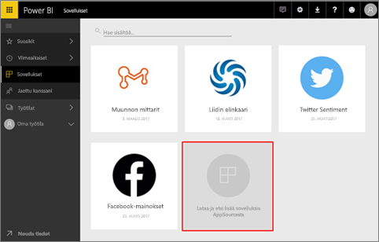
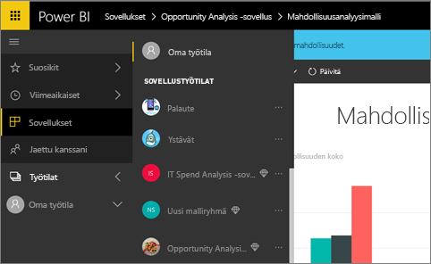
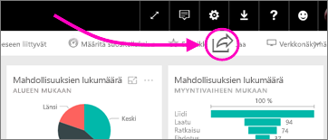

# Töiden jakamistavat Power BI:ssä

Olet luonut koontinäyttöjä ja raportteja. Olet ehkä myös muokannut niitä yhdessä työtovereidesi kanssa. Haluat nyt, että muut voivat käyttää niitä. Mikä on paras tapa jakaa ne?

Tässä artikkelissa vertailemme yhteistyö- ja jakamisvaihtoehtoja Power BI:ssä: 

* Yhteistyö työtovereiden kanssa kuvaavien raporttien ja koontinäyttöjen luomiseksi *työtiloissa*.
* Kyseisten koontinäyttöjen ja raporttien niputtaminen *sovelluksiin* ja niiden julkaiseminen suuremmalle ryhmälle tai koko organisaatiolle.
* Koontinäyttöjen tai raporttien jakaminen muutamalle henkilölle palvelusta tai Power BI -mobiilisovelluksista.
- Raporttien tulostaminen.
* Julkaiseminen verkossa julkisissa WWW-sivustoissa, joissa kuka tahansa voi tarkastella ja käyttää sisältöä.

Riippumatta siitä, minkä vaihtoehdon valitset, koontinäytön jakamiseen tarvitaan [Power BI Pro -käyttöoikeus](service-features-license-type.md), tai sisällön on oltava [Premium-kapasiteetissa](service-premium.md). Koontinäyttöjä tarkastelevia työtovereita koskevat käyttöoikeusvaatimukset vaihtelevat valitsemasi vaihtoehdon mukaan. Seuraavissa osioissa annetaan lisätietoja. 

*Power BI -palvelun sovellukset*

## Yhteistyö työtovereiden kanssa työtilassa

Kun työryhmät tekevät yhteistyötä, jokaisen on päästävä käyttämään samoja asiakirjoja, jotta yhteistyö on tehokasta. Power BI:n työtilat ovat paikka, jossa työryhmät voivat kokoontua ja jakaa niille merkityksellisten koontinäyttöjen, raporttien, tietojoukkojen ja työkirjojen omistajuuden ja hallinnan. Joskus Power BI:n käyttäjät järjestävät työtilansa organisaation rakenteiden mukaan ja joskus ne luodaan tiettyjä projekteja varten. Muissa organisaatioissa käytetään useita työtiloja käytettävien raporttien tai koontinäyttöjen eri versioiden tallentamiseen. 

Työtilat tarjoavat rooleja, jotka määrittävät, mitä oikeuksia työtovereillasi on. Voit roolien avulla määrittää, kuka voi hallita koko työtilaa tai vain tuottaa siihen sisältöä.

Jotkin käyttäjät luonnollisesti laittavat sisällön omaan työtilaansa ja jakavat sen sieltä. Työtilat ovat omaan työtilaan verrattuna parempi vaihtoehto yhteistyötä varten, koska ne tarjoavat sisällölle yhteisomistuksen. Voit yhdessä koko työryhmäsi kanssa päivittää sisältöä helposti tai antaa muille käyttöoikeuden. Oma työtila soveltuu parhaiten yksittäisille henkilöille kertakäyttöisen tai henkilökohtaisen sisällön käyttöön.

Oletetaan, että sinulla on valmis koontinäyttö, joka on jaettava työtovereidesi kanssa. Mikä on paras tapa antaa heille koontinäytön käyttöoikeus? Vastaus riippuu useista tekijöistä. Jos tietyn työtoveri on oltava koontinäytön omistaja ja pidettävä se ajan tasalla tai hän tarvitsee työtilan kaiken sisällön käyttöoikeuden, paras tapa voi olla henkilön lisääminen työtilaan. Jos työtoverisi tarvitsee vain nähdä kyseinen koontinäyttö työtilan kaiken sisällön sijasta, valittavana on jälleen useita vaihtoehtoja. Jos koontinäyttö on osa suurempaa sisältöjoukkoa, joka sinun tarvitse jakaa monelle työtoverille, sovelluksen julkaiseminen on todennäköisesti paras vaihtoehto. Jos työtoverisi tarvitsee vain kyseisen koontinäytön, koontinäytön jakaminen voi olla paras polku eteenpäin. 

Lue lisää [työtilojen luomisesta](service-create-workspaces.md).

**Tiesitkö?** Power BI:ssä esikatsellaan uutta työtilakokemusta. Lisätietoja työtilojen muuttumisesta tulevaisuudessa on artikkelissa [Uusien työtilojen luominen (esikatselu)](service-create-the-new-workspaces.md). 

## Tietojen ja merkityksellisen tiedon jakaminen luomalla sovellus

Oletetaan, että haluat jakaa koontinäytön laajalle yleisölle. Sinä ja työtoverisi olette luoneet *työtilan* ja sen jälkeen luoneet koontinäyttöjä, raportteja ja tietojoukkoja ja muokanneet niitä työtilassa. Nyt voit valita haluamasi koontinäytöt ja raportit ja julkaista ne sovelluksena ryhmälle tai koko organisaatiolle. 

Sovelluksia on helppo löytää ja asentaa Power BI -palvelussa ([https://powerbi.com](https://powerbi.com)). Voit lähettää yrityskäyttäjille suoran linkin sovellukseen tai he voivat hakea sen AppSourcesta. Jos Power BI -järjestelmänvalvojasi antaa sinulle oikeudet, voit asentaa sovelluksen automaattisesti työtovereidesi Power BI -tileille. Lue lisää [sovellusten julkaisemisesta](service-create-distribute-apps.md). 

Sovelluksen asentamisen jälkeen he voivat tarkastella sitä selaimessa tai mobiililaitteessa.

Jotta käyttäjät voivat tarkastella sovellustasi, myös heillä täytyy olla Power BI Pro -käyttöoikeus tai sovellus on tallennettava Power BI Premium -kapasiteettiin. Lisätietoja on artikkelissa [Mikä on Power BI Premium?](service-premium.md)

Voit julkaista sovelluksia myös organisaatiosi ulkopuolisille henkilöille. Myös he voivat tarkastella ja käsitellä sovelluksen sisältöä, mutta eivät jakaa sitä muille.

## Koontinäyttöjen ja raporttien jakaminen
Oletetaan, että olet saanut koontinäytön ja raportin valmiiksi omassa työtilassasi tai työtilassa ja haluat joidenkin muiden käyttäjien voivan käyttää sitä. Yksi tapa saada se heidän käyttöönsä on *jakaa* se. 

Jotta voit jakaa sisältöä, tarvitset Power BI Pro -käyttöoikeuden, joka vaaditaan myös niiltä, joille jaat. Muutoin sisällön on oltava työtilassa [Premium-kapasiteetissa](service-premium.md). Kun jaat koontinäytön tai raportin, vastaanottajat voivat tarkastella ja käsitellä sitä, mutta eivät muokata sitä. He näkevät koontinäytössä tai raportissa samat tiedot kuin sinä, ellei tietojoukossa käytetä rivitason suojausta (RLS). Työtoverit, joille jaat sisältöä, voivat jakaa sen omien työtovereidensa kanssa, jos sallit jakamisen. 

Voit jakaa myös organisaatiosi ulkopuolisten henkilöiden kanssa. Myös he voivat tarkastella ja käsitellä koontinäyttöä tai raporttia, mutta eivät jakaa sitä. 

Lue lisää [koontinäyttöjen ja raporttien jakamisesta](service-share-dashboards.md) Power BI -palvelusta. Voit myös lisätä linkkiin suodattimen ja [jakaa suodatetun näkymän raportistasi](service-share-reports.md).

## Merkintöjen lisääminen ja jakaminen Power BI -mobiilisovelluksissa
iOS- ja Android-laitteiden Power BI -mobiilisovelluksissa voit jakaa kenelle tahansa ruudun, raportin tai visualisoinnin sähköpostitse ja lisätä merkintöjä niihin. 

Jaat tilannevedoksen ruudusta, raportista tai visualisoinnista, ja vastaanottajat näkevät sen juuri sellaisena kuin se oli, kun lähetit viestin. Sähköpostiviesti sisältää myös linkin koontinäyttöön tai raporttiin. Jos vastaanottajalla on Power BI Pro -käyttöoikeus tai sisältö on [Premium-kapasiteetissa](service-premium.md) ja olet jo jakanut kohteen hänen kanssaan, hän voi avata sen. Voit lähettää tilannevedoksia ruuduista kenelle tahansa – ei pelkästään työtovereille samalla sähköpostitoimialueella.

Lue lisää [ruutujen, raporttien ja visualisointien jakamisesta ja merkintöjen lisäämisestä niihin](consumer/mobile/mobile-annotate-and-share-a-tile-from-the-mobile-apps.md) iOS- ja Android-mobiilisovelluksissa.

Voit myös [jakaa tilannevedoksen ruudusta](consumer/mobile/mobile-windows-10-phone-app-get-started.md) Windows 10 -laitteiden Power BI -sovelluksesta.

## Tulostaminen tai tallentaminen PDF-tiedostona tai muuna staattisena tiedostona
Voit tulostaa tai tallentaa PDF-tiedostona (tai muuna staattisena tiedostomuotona) koko koontinäytön, koontinäytön ruudun, raporttisivun tai visualisoinnin Power BI -palvelusta. Raportteja voi tulostaa vain yhden sivun kerrallaan – et voi tulostaa koko raporttia kerralla. Lue lisää [tulostamisesta tai staattisena tiedostona tallentamisesta](consumer/end-user-print.md).

## Julkaiseminen verkossa

> [!WARNING]
> Käytä **Julkaise verkkoon** -toimintoa vain, jos haluat jatkaa sisältöä julkisesti. Älä käytä sitä sisäiseen jakamiseen.

Voit julkaista Power BI -raportteja koko Internetissä upottamalla vuorovaikutteisia visualisointeja blogimerkintöihin, sivustoille, sosiaaliseen mediaan ja muihin verkossa oleviin viesteihin millä tahansa laitteella. Kaikki Internetin käyttäjät voivat tarkastella raportteja, etkä voi hallita sitä, kuka voi nähdä julkaisemasi sisällön. Power BI -käyttöoikeutta ei tarvita. Verkossa julkaiseminen on mahdollista vain raporteille, joita voit muokata. Et voi julkaista raportteja verkossa, jos ne jaetaan kanssasi tai jos ne sisältyvät sovellukseen. Lue lisää [verkossa julkaisemisesta](service-publish-to-web.md).

## Seuraavat vaiheet
* [Koontinäyttöjen jakaminen työtovereiden ja muiden kanssa](service-share-dashboards.md)
* [Sovelluksen luominen ja julkaiseminen Power BI:ssä](service-create-distribute-apps.md)
* Haluatko antaa palautetta? Anna ehdotuksia siirtymällä [Power BI -yhteisön sivustolle](https://community.powerbi.com/).
* Onko sinulla kysyttävää? [Kokeile Power BI -yhteisöä](http://community.powerbi.com/).

