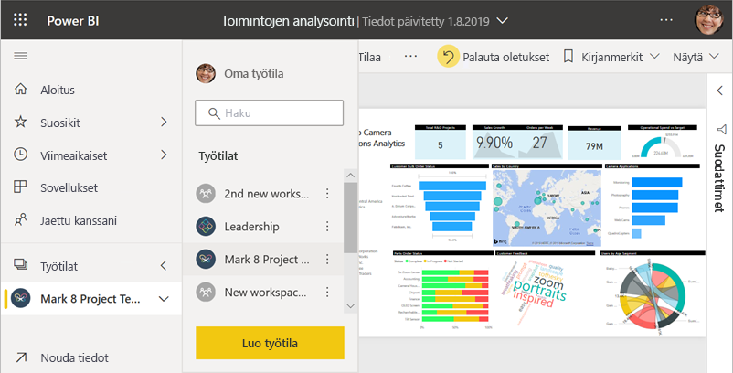
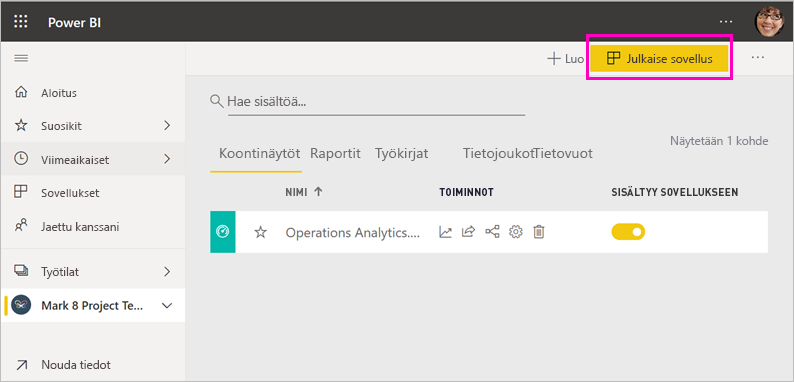
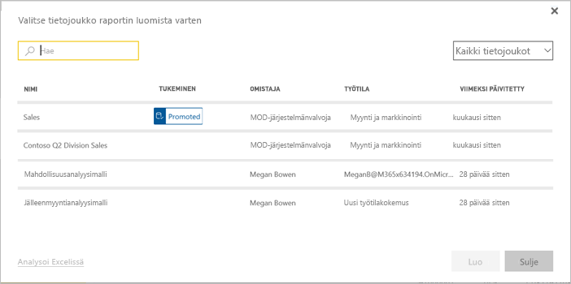
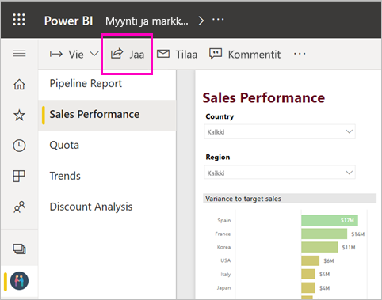
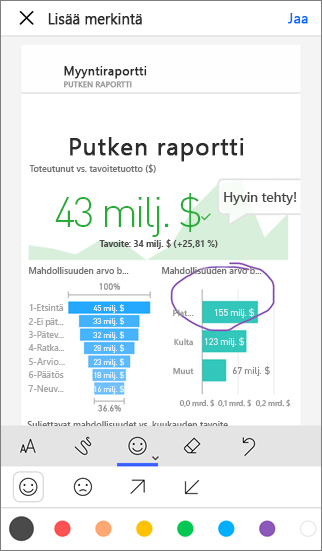

# Töiden jakamistavat Power BI:ssä

Olet luonut raporttinäkymiä ja raportteja. Olet ehkä myös muokannut niitä yhdessä työtovereidesi kanssa. Haluat nyt, että muut voivat käyttää niitä. Mikä on paras tapa jakaa ne? Tässä artikkelissa vertailemme yhteistyö- ja jakamisvaihtoehtoja Power BI:ssä:

* Yhteistyö työtovereiden kanssa kuvaavien raporttien ja raporttinäkymien luomiseksi *työtiloissa*.
* Kyseisten raporttinäkymien ja raporttien niputtaminen *sovelluksiin* ja niiden julkaiseminen suurelle ryhmälle tai koko organisaatiolle.
* Sellaisten *jaettujen tietojoukkojen* luominen, joita työtoverit voivat käyttää omien raporttiensa pohjana omissa työtiloissaan.
* Raporttinäkymien tai raporttien jakaminen muutamalle henkilölle palvelun tai Power BI -mobiilisovellusten kautta.
* Merkintöjen lisääminen ja jakaminen Power BI -mobiilisovelluksissa.
* Raportin upottaminen Microsoft Teamsiin.
* Raporttien tulostaminen.
* Raporttien *upottaminen* suojattuihin portaaleihin tai julkisiin verkkosivustoihin.
* Ulkoisille Power BI -käyttäjille jaettavan *mallisovelluksen* luominen Microsoft AppSourcella.

Riippumatta siitä, minkä vaihtoehdon valitset, sisällön jakamiseen tarvitaan [Power BI Pro -käyttöoikeus](service-features-license-type.md), tai sisällön on oltava [Premium-kapasiteetissa](service-premium-what-is.md). Sisältöäsi tarkastelevia työtovereita koskevat käyttöoikeusvaatimukset vaihtelevat valitsemasi vaihtoehdon mukaan. Seuraavissa osioissa annetaan lisätietoja. 

*Power BI -palvelun sovellukset*

## Yhteistyö työtilassa

Kun työryhmät tekevät yhteistyötä, jokaisen on päästävä käyttämään samoja asiakirjoja, jotta yhteistyö on tehokasta. Power BI -työtilat ovat paikka, jossa työryhmät voivat kokoontua ja jakaa niille merkityksellisten raporttinäkymien, raporttien, tietojoukkojen ja työkirjojen omistajuuden ja hallinnan. Joskus Power BI:n käyttäjät järjestävät työtilansa organisaation rakenteiden mukaan ja joskus ne luodaan tiettyjä projekteja varten. Muissa organisaatioissa käytetään useita työtiloja käytettävien raporttien tai raporttinäkymien eri versioiden tallentamiseen. 

Työtilat tarjoavat rooleja, jotka määrittävät, mitä oikeuksia työtovereillasi on. Voit roolien avulla määrittää, kuka voi hallita koko työtilaa tai muokata ja jakaa sen sisältöä.

Saatat luonnollisesti laittaa sisältöä omaan työtilaasi ja jakaa sen sieltä. Työtilat ovat omaan työtilaan verrattuna parempi vaihtoehto yhteistyötä varten, koska ne mahdollistavat sisällön yhteisomistuksen. Voit yhdessä koko ryhmäsi kanssa päivittää sisältöä helposti tai antaa muille käyttöoikeuden. Oma työtila soveltuu parhaiten yksittäisille henkilöille kertakäyttöisen tai henkilökohtaisen sisällön käyttöön.

Oletetaan, että sinulla on valmis raporttinäkymä, joka on jaettava työtovereidesi kanssa. Mikä on paras tapa antaa heille raporttinäkymän käyttöoikeus? Vastaus riippuu useista tekijöistä. 

- Jos työtoverit tarvitsevat apua raporttinäkymän pitämisessä ajan tasalla tai jos he työtilan sisällön käyttöoikeudet, harkitse niiden lisäämistä työtilaan. 
- Jos työtoveriesi tarvitsee vain nähdä kyseinen raporttinäkymä työtilan kaiken sisällön sijasta, voit jälleen valita useista vaihtoehdoista. Jos muutama henkilö tarvitsee vain yksittäisen raporttinäkymän oikeudet, raporttinäkymän jakaminen voi olla paras ratkaisu.
- Jos raporttinäkymä on osa suurempaa sisältöjoukkoa, joka sinun tarvitse jakaa monelle työtoverille, *sovelluksen* julkaiseminen on todennäköisesti paras vaihtoehto.

Power BI:ssä on uusi työtilakokemusta. Lue [uuden työtilakokemuksen luomisesta](service-create-the-new-workspaces.md), miten työtilat ovat muuttuneet. 

## Merkityksellisten tietojen jakaminen sovelluksella

Oletetaan, että haluat jakaa raporttinäkymän laajalle yleisölle organisaatiossasi. Sinä ja työtoverisi olette luoneet *työtilan* ja sen jälkeen luoneet koontinäyttöjä, raportteja ja tietojoukkoja ja muokanneet niitä työtilassa. Nyt voit valita haluamasi raporttinäkymät ja raportit sekä julkaista ne sovelluksena ryhmälle tai koko organisaatiolle.

Sovelluksia on helppo löytää ja asentaa Power BI -palvelussa ([https://app.powerbi.com](https://app.powerbi.com)). Voit lähettää yrityskäyttäjille suoran linkin sovellukseen tai he voivat hakea sen AppSourcesta. Jos Power BI -järjestelmänvalvojasi antaa sinulle oikeudet, voit asentaa sovelluksen automaattisesti työtovereidesi Power BI -tileille. Lue lisää [sovellusten julkaisemisesta](service-create-distribute-apps.md).

Sovelluksen asentamisen jälkeen he voivat tarkastella sitä selaimessa tai mobiililaitteessa.

Jotta käyttäjät voivat tarkastella sovellustasi, myös heillä täytyy olla Power BI Pro -käyttöoikeus tai sovellus on tallennettava Power BI Premium -kapasiteettiin. Lisätietoja on artikkelissa [Mikä on Power BI Premium?](service-premium-what-is.md)

Voit julkaista sovelluksia myös organisaatiosi ulkopuolisille henkilöille. Myös he voivat tarkastella ja käsitellä sovelluksen sisältöä, mutta eivät jakaa sitä muille. Nyt voit luoda *mallisovelluksia* ja ottaa ne käyttöön Power BI -asiakkaille.

## Tietojoukon jakaminen

Jotkut käyttäjistä osaavat luoda laadukkaita, hyvin suunniteltu tietomalleja raporteissaan. Toiset taas eivät ole siinä niin hyviä. Ehkä sinä olet yksi parhaista. Koko organisaatio voi hyötyä samojen, hyvin suunniteltujen tietomallien käytöstä. *Jaetut tietojoukot* ovat tätä varten. Kun luot raportin, jonka tietomallia kaikkien pitäisi käyttää, voit tallentaa kyseisen raportin Power BI -palveluun ja antaa asianmukaisille henkilöille sen käyttöoikeudet. He voivat sitten luoda omat raporttinsa tietojoukkosi perusteella. Näin kaikkien raportit perustuvat samoihin tietoihin ja heijastavat ero näkökantoja samoihin tosiasioihin.

Lue lisää [jaettujen tietojoukkojen luomisesta ja käyttämisestä](service-datasets-across-workspaces.md).

## Koontinäyttöjen ja raporttien jakaminen

Oletetaan, että olet saanut koontinäytön ja raportin valmiiksi omassa työtilassasi tai työtilassa ja haluat joidenkin muiden käyttäjien voivan käyttää sitä. Yksi tapa saada se heidän käyttöönsä on *jakaa* se. 

Jotta voit jakaa sisältöä, tarvitset Power BI Pro -käyttöoikeuden, jota edellytetään myös niiltä henkilöiltä, joille jaat. Muutoin sisällön on oltava työtilassa [Premium-kapasiteetissa](service-premium-what-is.md). Kun jaat raporttinäkymän tai raportin, vastaanottajat voivat tarkastella ja käsitellä sitä, mutta eivät muokata. He näkevät raporttinäkymässä tai raportissa samat tiedot kuin sinä, ellei tietojoukossa käytetä rivitason suojausta (RLS). Työtoverit, joille jaat sisältöä, voivat jakaa sen omien työtovereidensa kanssa, jos sallit jakamisen. 

Voit jakaa myös organisaatiosi ulkopuolisten henkilöiden kanssa. Myös he voivat tarkastella ja käsitellä raporttinäkymää tai raporttia, mutta eivät jakaa sitä. 

Lue lisää [raporttinäkymien ja raporttien jakamisesta](service-share-dashboards.md) Power BI -palvelusta. Voit myös lisätä linkkiin suodattimen ja [jakaa suodatetun näkymän raportistasi](service-share-reports.md).

## Merkintöjen lisääminen ja jakaminen Power BI -mobiilisovelluksissa

iOS- ja Android-laitteiden Power BI -mobiilisovelluksissa voit jakaa kenelle tahansa ruudun, raportin tai visualisoinnin sähköpostitse ja lisätä merkintöjä niihin.

Jaat tilannevedoksen ruudusta, raportista tai visualisoinnista, ja vastaanottajat näkevät sen juuri sellaisena kuin se oli, kun lähetit viestin. Sähköpostiviesti sisältää myös linkin raporttinäkymään tai raporttiin. Jos vastaanottajalla on Power BI Pro -käyttöoikeus tai sisältö on [Premium-kapasiteetissa](service-premium-what-is.md) ja olet jo jakanut kohteen hänen kanssaan, hän voi avata sen. Voit lähettää tilannevedoksia ruuduista kenelle tahansa – ei pelkästään työtovereille samalla sähköpostitoimialueella.

Lue lisää [ruutujen, raporttien ja visualisointien jakamisesta ja merkintöjen lisäämisestä niihin](consumer/mobile/mobile-annotate-and-share-a-tile-from-the-mobile-apps.md) iOS- ja Android-mobiilisovelluksissa.

Voit myös [jakaa tilannevedoksen ruudusta](consumer/mobile/mobile-windows-10-phone-app-get-started.md) Windows 10 -laitteiden Power BI -sovelluksesta.

## Raportin upottaminen Microsoft Teamsiin

Kasvata tietopohjaista yhteistyötä organisaatiossasi upottamalla Power BI -raportteja ja Power BI:n sivutettuja raportteja Microsoft Teamsissa. Voit lisätä erillisiä Power BI -välilehtiä kullekin yksittäiselle raportille ja antaa kullekin välilehdelle raportin nimen tai minkä tahansa muun nimen. Työtoverisi voivat tarkastella raporttejasi Power BI -välilehdissä Teamsissa. He voivat myös avata keskusteluikkunan ja kommentoida raporttia suoraan Teamsissa. Lue lisää [raportin upottamisesta Microsoft Teamsissa](service-embed-report-microsoft-teams.md).

## Tulostaminen tai tallentaminen PDF-tiedostona tai muuna staattisena tiedostona

Voit tulostaa tai tallentaa PDF-tiedostona (tai muuna staattisena tiedostomuotona) koko raporttinäkymän, raporttinäkymän ruudun, raporttisivun tai visualisoinnin Power BI -palvelusta. Raportteja voi tulostaa vain yhden sivun kerrallaan – et voi tulostaa koko raportin kerralla. Lue lisää [tulostamisesta tai staattisena tiedostona tallentamisesta](consumer/end-user-print.md).

## Raporttien upottaminen suojattuihin portaaleihin tai julkisiin verkkosivustoihin

### Upottaminen suojattuihin portaaleihin

Voit upottaa Power BI -raportteja portaaleihin tai verkkosivustoihin, joissa käyttäjäsi odottaisivat näkevänsä ne.  
Voit upottaa raportteja sisäisille käyttäjille turvallisesti Power BI -palvelun **Upota SharePoint Onlinessa**- tai **Upota**-vaihtoehdon avulla. 

- **Upottaminen SharePoint Onlinessa** toimii Power BI:n SharePoint Online -verkko-osan kanssa. Se sisältää kertakirjautumiskokemuksen ja raportin upotuksen hallintatyökalut. 
- **Upottaminen** toimii niissä portaaleissa ja sivustoissa, jotka tukevat sisällön upottamista URL-osoitteen tai iFramen avulla. 

Kummassakin tapauksessa Power BI tarkistaa käyttöoikeudet ja tietosuojan ennen kuin käyttäjät voivat nähdä sisältöä. Raporttia tarkasteleva henkilö tarvitsee asianmukaisen käyttöoikeuden. Lue lisätietoja Power BI:n [Upota SharePoint Onlinessa](service-embed-report-spo.md)- ja [Upota](service-embed-secure.md)-vaihtoehdoista.

### Julkisille verkkosivustoille julkaiseminen

**Julkaise verkkoon** -toiminnolla voit julkaista Power BI -raportteja Internetissä upottamalla vuorovaikutteisia visualisointeja blogikirjoituksiin, verkkosivustoille, sosiaaliseen mediaan ja muihin verkossa oleviin viesteihin millä tahansa laitteella. Kaikki Internetin käyttäjät voivat tarkastella raportteja, etkä voi hallita sitä, kuka voi nähdä julkaisemasi sisällön. Power BI -käyttöoikeutta ei tarvita. Verkossa julkaiseminen on mahdollista vain raporteille, joita voit muokata. Et voi julkaista raportteja verkossa, jos ne jaetaan kanssasi tai jos ne sisältyvät sovellukseen. Lue lisää [verkossa julkaisemisesta](service-publish-to-web.md).

>[!Warning]
>Käytä [Julkaise verkkoon](service-publish-to-web.md) -toimintoa vain, jos haluat jatkaa sisältöä julkisesti. Älä käytä sitä sisäiseen jakamiseen.

## Mallisovellusten luominen ja käyttöönotto

*Mallinsovellukset* on tarkoitettu julkisesti (yleensä Microsoft AppSourcen kautta) jaettavaksi. Voit luoda sovelluksen ottaa sen käyttöön Power BI -asiakkaille. Koodaustaitoja tarvitaan vain vähän tai ei lainkaan. Asiakkaat yhdistävät omiin tietoihinsa ja alustavat omat tilinsä. Lue lisää [Power BI -mallisovelluksist](service-template-apps-overview.md).

## Seuraavat vaiheet

* [Raporttinäkymien jakaminen työtovereiden ja muiden kanssa](service-share-dashboards.md)
* [Sovelluksen luominen ja julkaiseminen Power BI:ssä](service-create-distribute-apps.md)
* [Raportin upottaminen turvalliseen portaaliin tai sivustoon](service-embed-secure.md)

Haluatko antaa palautetta? Anna ehdotuksia siirtymällä [Power BI -yhteisön sivustolle](https://community.powerbi.com/).

Onko sinulla kysyttävää? [Kokeile Power BI -yhteisöä](https://community.powerbi.com/)
