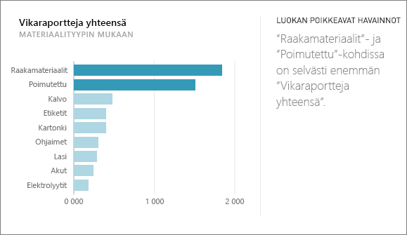
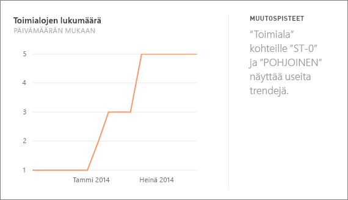
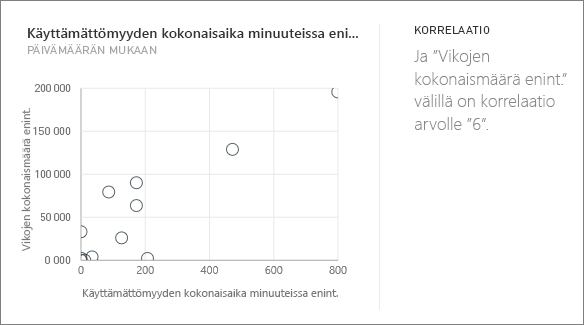
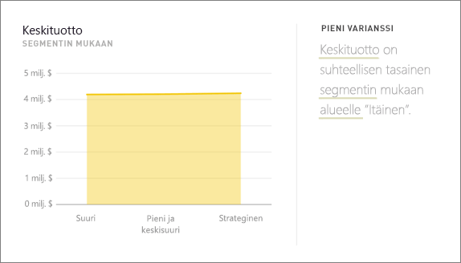
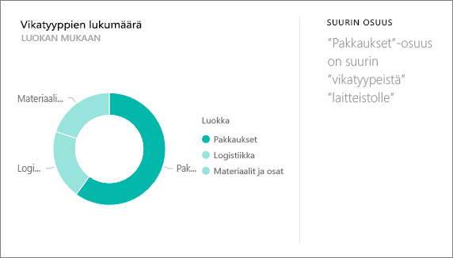
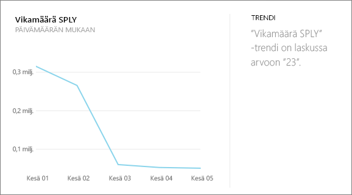
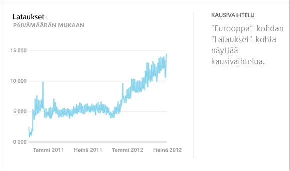
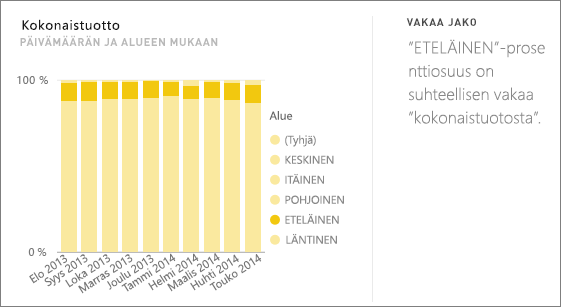
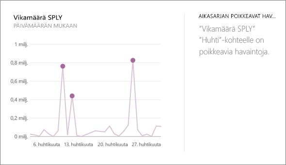

# Power BI:n tukemat merkityksellisten tietojen tyypit
## Merkityksellisten tietojen toiminta
Power BI hakee nopeasti tietojoukosta erilaisia alijoukkoja ja hyödyntää kehittyneitä algoritmeja, joiden avulla se pyrkii tunnistamaan mahdollisesti merkityksellisiä tietoja. Power BI tarkistaa niin suuren osan tietojoukosta kuin mahdollista määritetyn ajan sisällä.

Voit verrata merkityksellisiä tietoja tietojoukkoon tai koontinäytön ruutuun.   

## Minkälaisia merkityksellisiä tietoja on olemassa?
Seuraavana muutamia käyttämiämme algoritmeja:

## Luokan poikkeavat havainnot (ylä/ala)
Korostaa tapaukset, joissa mallin mittayksikössä yhdellä tai kahdella dimension jäsenellä on paljon suuremmat arvot kuin muilla dimension jäsenillä.  

## Aikasarjan muutospisteet
Korostaa kohdat, joissa tietojen aikasarjan trendeissä on merkittäviä muutoksia.

## Korrelaatio
Havaitsee tilanteet, joissa usea mittayksikkö osoittaa keskinäistä korrelaatiota, kun niitä verrataan tietojoukon dimensioon.

## Pieni varianssi
Havaitsee tapaukset, jossa arvopisteet eivät eroa keskiarvosta huomattavasti.

## Enemmistö (päätekijät)
Etsii tapauksia, jossa kokonaisarvon enemmistön voidaan katsoa johtuneen yhdestä tekijästä, kun se jaetaan toisella dimensiolla.  

## Aikasarjan yleiset trendit
Havaitsee ylöspäin ja alaspäin suuntautuvat trendit aikasarjatiedoissa.

## Kausivaihtelu aikasarjassa
Etsii toistuvia kuvioita aikasarjatiedoissa, kuten viikoittaista, kuukausittaista tai vuosittaista kausivaihtelua.

## Vakaa jako
Korostaa tapaukset, joissa on olemassa pääkohde-alikohde-korrelaatio alikohteen osuudessa suhteessa pääkohteen yleisarvoon jatkuvassa muuttujassa.

## Aikasarjan poikkeavat havainnot
Tunnistaa aikasarjan tiedoissa erityiset päivämäärät tai ajat, joiden arvot eroavat huomattavasti muista päivä-/aika-arvoista.

## Seuraavat vaiheet
[Power BI:n merkitykselliset tiedot](service-insights.md)

Jos omistat tietojoukon, [optimoi se merkityksellisiä tietoja varten](service-insights-optimize.md)

Onko sinulla muuta kysyttävää? [Kokeile Power BI -yhteisöä](http://community.powerbi.com/)

