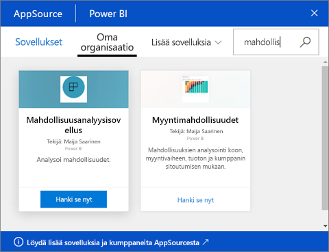

# Koontinäyttöjä ja raportteja hyödyntävien sovellusten asentaminen ja käyttäminen Power BI:ssä
Power BI:ssä *sovellukset* kokoavat toisiinsa liittyvät koontinäytöt ja raportit yhteen paikkaan. Organisaatioon kuuluvat henkilöt voivat luoda ja jakaa yrityksen avaintietoja sisältäviä sovelluksia. Myös käytössäsi mahdollisesti jo olevat [ulkoiset palvelut](service-connect-to-services.md), kuten Google Analytics ja Microsoft Dynamics CRM, tarjoavat Power BI -sovelluksia. 

Sovelluksia on helppo löytää ja asentaa Power BI -palveluun ([https://powerbi.com](https://powerbi.com)) ja mobiililaitteeseen. Kun olet asentanut sovelluksen, sinun ei tarvitse muistaa monien eri raporttinäkymien nimiä, sillä ne ovat kaikki yhdessä sovelluksessa, selaimessa tai mobiililaitteessa.

Kun käytät sovelluksia,näet muutokset automaattisesti aina, kun sovelluksen tekijä julkaisee päivityksiä. Tekijä määrittää myös, kuinka usein tiedot ajoitetaan päivittymään, joten sinun ei tarvitse huolehtia niiden pitämisestä ajan tasalla. 

Suunnitteletko oman sovelluksen tekemistä? Lisätietoja on artikkelissa [Työtilojen luominen työtovereiden kanssa Power BI:ssä](service-create-distribute-apps.md).

## Uuden sovelluksen hankkiminen
Voit hankkia sovelluksia muutamilla eri tavoilla. Sovelluksen tekijä voi asentaa sovelluksen automaattisesti Power BI -tiliisi tai lähettää sinulle suoran linkin sovellukseen. Voit myös etsiä sovellusta AppSourcessa, jossa näet kaikki käytettävissäsi olevat sovellukset. Jos käytät Power BI:tä mobiililaitteella, et voi asentaa sovellusta AppSourcen kautta vaan tarvitset suoran linkin. Jos sovelluksen tekijä asentaa sovelluksen automaattisesti, näet sen sovellusluettelossa.

### Sovelluksen asentaminen suoran linkin kautta
Helpoin tapa asentaa uusi sovellus omatoimisesti on saada sovelluksen tekijältä suora linkki. Power BI luo asennuslinkin, jonka tekijä voi lähettää sinulle.

**Tietokone** 

Kun napsautat sähköpostissa olevaa linkkiä, Power BI-palvelu ([https://powerbi.com](https://powerbi.com)) avautuu selaimessa. Vahvista, että haluat asentaa sovelluksen, jolloin se avautuu sovelluksen aloitussivulle.

**iOS-tai Android-mobiililaite** 

Kun napsautat sähköpostissa olevaa linkkiä mobiililaitteessa, sovellus asentuu automaattisesti ja avaa sovelluksen sisältöluettelon mobiilisovelluksessa. 

### Sovelluksen hakeminen Microsoft AppSourcesta
Voit myös etsiä ja asentaa käytettävissäsi olevia sovelluksia Microsoft AppSourcesta. 

1. Valitse **Sovellukset**  > **Hanki sovelluksia**. 
   
     
2. AppSourcen **Oma organisaatio** -osiossa voit tehdä hakuja rajataksesi tuloksia ja löytääksesi haluamasi sovelluksen.
   
     
3. Lisää sovellus Sovellukset-sivullesi valitsemalla **Hanki se nyt**. 

## Koontinäyttöjen ja raporttien käsitteleminen sovelluksessa
Nyt voit tutkia koontinäyttöjen ja raporttien tietoja sovelluksessa. Voit käyttää kaikkia Power BI:n vakiotoimia, kuten suodatusta, korostusta, lajittelua ja porautumista. Voit myös [viedä tietoja Exceliin ](power-bi-visualization-export-data.md) taulukosta tai muusta raportin visualisoinnista. Lue [Power BI-raporteissa käytettävissä olevista toimista](service-reading-view-and-editing-view.md). 

## Seuraavat vaiheet
* [Sovellusten luominen ja julkaiseminen Power BI:ssä](service-create-distribute-apps.md)
* [Power BI -sovellukset ulkoisille palveluille](service-connect-to-services.md)
* Ilmenikö kysyttävää? [Voit esittää kysymyksiä Power BI -yhteisössä](http://community.powerbi.com/)

