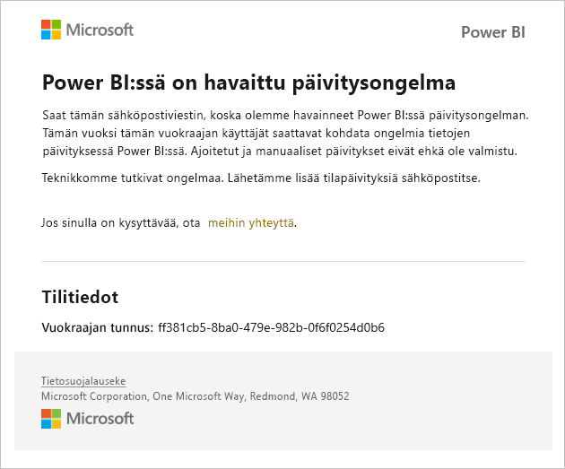
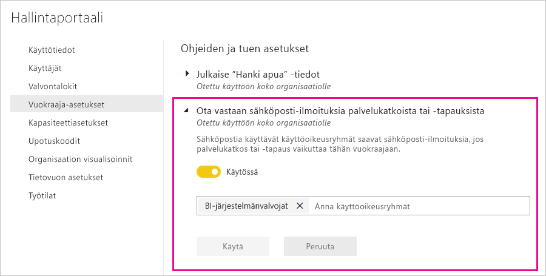

# Palvelun keskeytymisilmoitukset

On tärkeää, että saat merkityksellistä tietoa liiketoiminnalle tärkeiden yrityssovellusten käytettävyydestä. Power BI sisältää tapausilmoituksen, joten voit halutessasi vastaanottaa sähköpostiviestejä, jos palvelussa on häiriöitä tai toiminnan heikkenemistä. Vaikka Power BI:n palvelutasosopimus (99,9 %) tekee näistä tapahtumista harvinaisia, haluamme varmistaa, että pysyt ajan tasalla. Seuraavassa näyttökuvassa näkyy, millaista sähköpostia saat, jos otat ilmoitukset käyttöön:

Tällä hetkellä lähetämme sähköpostiviestejä seuraavissa _luotettavuustilanteissa_:

- Raportin avaamisen luotettavuus
- Mallin päivityksen luotettavuus
- Kyselyn päivityksen luotettavuus

Ilmoituksia lähetetään silloin, kun toiminnoissa, kuten raporttien avaamisessa, tietojoukon päivityksessä tai kyselyjen suorittamisessa, on _pitkä viive_. Kun tapaus on ratkaistu, saat seurantasähköpostiviestin.

> [!NOTE]
> Tämä ominaisuus on tällä hetkellä käytettävissä vain Power BI Premiumin varatuissa kapasiteeteissa. Se ei ole käytettävissä jaetussa tai upotetussa kapasiteetissa.

## Ota ilmoitukset käyttöön

Power BI -vuokraajan järjestelmänvalvoja ottaa ilmoitukset käyttöön hallintaportaalissa:

1. Yksilöi tai luo sähköpostia käyttävä käyttöoikeusryhmä, jonka tulee saada ilmoituksia.

1. Valitse hallintaportaalissa **Vuokraaja-asetukset**. Valitse **Ohjeen ja tuen asetukset** ja laajenna **Ota vastaan sähköposti-ilmoituksia palvelukatkoista tai -tapauksista**.

1. Ota ilmoitukset käyttöön, anna käyttöoikeusryhmä ja valitse **Käytä**.

    

> [!NOTE]
> Power BI lähettää ilmoitukset tilistä no-reply-powerbi@microsoft.com. Varmista, että tämä tili on sallittujen luettelossa, jotta ilmoitukset eivät päädy roskapostikansioon.

## Seuraavat vaiheet

[Power BI Pron ja Power BI Premiumin tukivaihtoehdot](service-support-options.md)

Onko sinulla kysyttävää? [Kokeile Power BI -yhteisöä](https://community.powerbi.com/)
