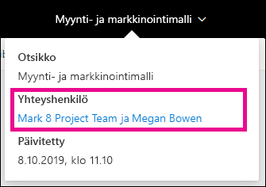
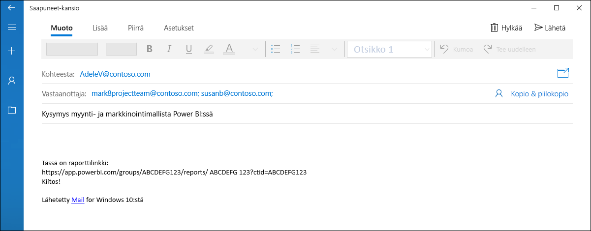
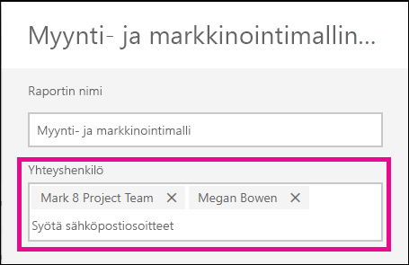
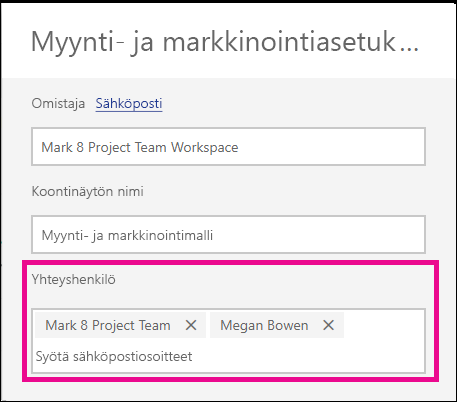

# Power BI -palvelun raporttien ja koontinäyttöjen yhteystietojen määrittäminen
Tässä artikkelissa kerrotaan, miten voit määrittää koontinäytön tai raportin yhteystiedot Power BI-palvelussa.

> [!NOTE]
> Yhteystiedot voidaan määrittää tietoyksiköille perinteisessä tai uudessa työtilassa. Et voi määrittää yhteystietoja tietoyksiköille omassa työtilassasi. Tietokortti näytetään, kun tarkastelet raporttia tai koontinäyttöä [uudessa ulkoasussa](service-new-look.md).

Voit lisätä tietoyksikön yhteystietoihin useita käyttäjiä tai ryhmiä. Ne voivat olla:
* henkilöitä
* Office 365 -ryhmiä
* sähköpostin välityksellä käytettäviä käyttöoikeusryhmiä
* jakeluluetteloita

Henkilö, joka luo uuden raportin tai koontinäytön, on oletusarvoisesti sen yhteyshenkilö. Jos määrität arvon, se korvaa oletusarvon. Voit tietenkin poistaa kaikki käyttäjät tai ryhmät yhteystietoluettelosta. Kun teet näin klassisessa työtilassa, työtilan Office 365 -ryhmä näytetään. Työtilojen uudessa näkymässä käytetään [työtilan yhteystietoluetteloa](service-create-the-new-workspaces.md#workspace-contact-list). Jos työtilan yhteystietoluetteloa ei ole määritetty, työtilan järjestelmänvalvojat näytetään.

Yhteystiedot näytetään käyttäjille, jotka tarkastelevat tietoyksikköä. 

 

Kun napsautat yhteystietoluetteloa, luodaan sähköpostiviesti, jotta voit esittää kysymyksiä tai saada ohjeita. 

 
 
Yhteystietoluetteloiden tietoja käytetään myös muissa paikoissa. Sitä käytetään esimerkiksi joidenkin virhetilanteiden virheviestissä. Tietoyksikköön liittyvät automaattiset sähköpostiviestit, kuten käyttöoikeuspyynnöt, lähetetään yhteystietoluettelon tahoille. 

> [!NOTE]
> Kun julkaiset sovellusta, yksittäiselle tietoyksikölle määritetyt yhteystiedot on määritetty henkilölle, joka julkaisi tai päivitti sovelluksen. Voit määrittää sovellukselle tuen URL-osoitteen, jotta sovelluksen käyttäjät saavat tarvitsemansa avun.

## Raportin yhteystietojen määrittäminen
1. Valitse työtilassa **Raportit**-välilehti.
2. Etsi haluamasi raportti ja valitse **Asetukset**-kuvake.
3. Etsi **Yhteystiedot**-kenttä ja määritä arvo.

     

## Koontinäytön yhteystietojen määrittäminen
1. Valitse työtilassa **Koontinäytöt**-välilehti.
2. Etsi haluamasi koontinäyttö ja valitse **Asetukset**-kuvake
3. Etsi **Yhteystiedot**-kenttä ja määritä arvo.

     

## Rajoitukset ja huomioitavat asiat
* Yhteystieto määritetään automaattisesti Power BI -palvelussa luoduille uusille tietoyksiköille. Olemassa oleville tietoyksiköille näytetään työtilan oletusarvo.
* Voit valita minkä tahansa käyttäjän tai ryhmän yhteystietoluettelosta, mutta heille ei myönnetä käyttöoikeutta tietoyksikköön automaattisesti. Käytä jakamista tai anna käyttöoikeudet niitä tarvitseville käyttäjille työtilan roolien avulla. 

## Seuraavat vaiheet

Onko sinulla muuta kysyttävää? [Kokeile Power BI -yhteisöä](http://community.powerbi.com/)
