# Automaattianalyysipalvelut Power BI:ssä (esikatselu)

Tietovoiden automaattianalyysipalveluiden avulla yritysanalyytikot voivat harjoittaa, vahvistaa ja käynnistää koneoppimismalleja suoraan Power BI:ssä. Se sisältää yksinkertaisen kokemuksen uuden koneoppimismallin luomiseen – siinä analyytikot voivat tietovoita käyttämällä määrittää syötetiedot mallin harjoittamista varten. Palvelu poimii automaattisesti tärkeimmät ominaisuudet, valitsee sopivan algoritmin ja virittää ja vahvistaa koneoppimismallin. Kun mallia on harjoitettu, Power BI luo automaattisesti raportin, joka sisältää vahvistuksen tulokset selittäen suorituskyvyn ja tulokset analyytikoille. Malli voidaan sitten käynnistää kaikista uusista tai päivitetyistä tiedoista tietovuossa.

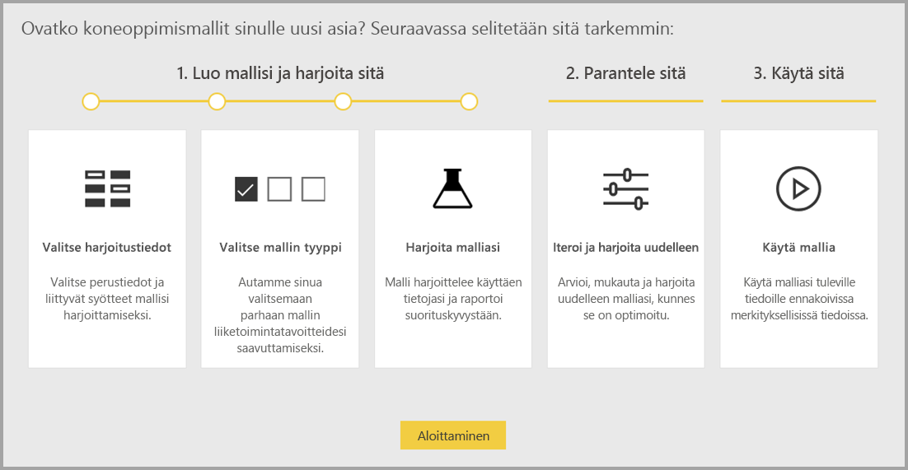

Automaattianalyysipalvelut on käytettävissä vain Power BI Premiumissa ja upotetuissa kapasiteeteissa isännöidyissä tietovoissa. Tässä esikatselussa automaattianalyysipalvelut mahdollistaa koneoppimismallien harjoittamisen binaariennuste-, luokitus- ja regressiomalleja varten.

## Automaattianalyysipalveluiden käyttö

[Power BI -tietovuot](service-dataflows-overview.md) tarjoavat omatoimisen tietojen valmistelemisen massadataa varten. Automaattianalyysipalveluiden avulla voit hyödyntää tietojen valmistelua koneoppimismallien rakentamiseen suoraan Power BI:ssä.

Power BI:n automaattianalyysipalveluiden avulla tietoanalyytikot voivat käyttää tietovoita koneoppimismallien luomiseen yksinkertaistetulla kokemuksella käyttäen vain Power BI -taitoja. Koneoppimismallien luomisen taustalla olevasta tietotieteestä suurin osa on automatisoitu Power BI:n avulla, ja suojakaiteiden avulla varmistetaan, että tuloksena oleva malli on laadukas. Lisäksi näkyvyyden ansiosta saat täyden kuvan koneoppimismallisi luomiseen käytetystä prosessista.

Automaattianalyysipalvelut tukee tietovoiden **binaariennuste**-, **luokitus**- ja **regressio**mallien luomista. Nämä ovat valvottavien koneoppimismallien tyyppejä, mikä tarkoittaa sitä, että ne oppivat aiempien havaintojen tunnetuista tuloksista muiden havaintojen tulosten ennustamiseksi. Automaattianalyysipalvelumallin harjoittamiseen käytettävä syötteiden tietojoukko on joukko tietueita, jotka **on merkitty** tunnetuilla tuloksilla.

Power BI:n automaattianalyysipalvelut integroi [automatisoidun koneoppimisen](https://docs.microsoft.com/azure/machine-learning/service/concept-automated-ml) [Azuren automaattianalyysipalvelusta](https://docs.microsoft.com/azure/machine-learning/service/overview-what-is-azure-ml) koneoppimismallien luomista varten. Voit kuitenkin käyttää automaattianalyysipalveluita Power BI:ssä ilman Azure-tilausta. Power BI -palvelu hallitsee täysin koneoppimismallien harjoittamista ja isännöintiä.

Kun koneoppimismallia on harjoitettu, automaattianalyysipalvelut luo automaattisesti Power BI -raportin, jossa selitetään koneoppimismallisi todennäköinen suorituskyky. Automaattianalyysipalvelut korostaa selitettävyyttä korostamalla syötteesi tärkeimmät vaikuttajat, jotka vaikuttavat mallisi palauttamiin ennusteisiin. Raportti sisältää myös mallin keskeiset arvot koneoppimismallin tyypistä riippuen.

Muut luodun raportin sivut näyttävät mallin tilastollisen yhteenvedon ja harjoittamisen tiedot. Tilastollinen yhteenveto kiinnostaa käyttäjiä, jotka haluavat tarkastella mallin suorituskyvyn tietotieteen vakiomittareita. Harjoitustiedoissa on yhteenveto kaikista niistä iteroinneista, jotka suoritettiin mallin luomiseksi, niihin liittyvillä mallinnusparametreilla. Siinä kuvataan myös, miten kutakin syötettä käytettiin koneoppimismallin luomisessa.

Voit sitten käyttää koneoppimismalliasi tiedoissasi pisteyttämistä varten. Kun tietovuo päivitetään, koneoppismallin ennusteet otetaan automaattisesti käyttöön tiedoissasi. Power BI sisältää myös yksilöllisen selvityksen kunkin tietyn ennustustuloksen osalta, jonka koneoppimismalli tuottaa.

## Koneoppimismallin luominen

Tässä osiossa kuvataan, miten voit luoda automaattianalyysipalveluiden koneoppimismallin. 

### Tietojen valmistelu koneoppimismallin luontia varten

Koneoppimismallin luomiseksi Power BI:ssä sinun on ensin luotava tiedoille tietovuo historiallisilla tulostiedoilla, joita käytetään koneoppimismallin harjoittamiseen. Lisätietoja tietovuon määrittämisestä on kohdassa [Omatoiminen tietojen valmistelu Power BI:ssä](service-dataflows-overview.md).

Nykyisessä versiossa Power BI käyttää vain yhden entiteetin tietoja koneoppimismallin harjoittamisessa. Jos siis historialliset tietosi koostuvat useista entiteeteistä, sinun on liitettävä tiedot manuaalisesti yksittäiseksi tietovuoentiteetiksi. Sinun tulee myös lisätä laskettuja sarakkeita sellaisiin liiketoimintamittareihin, jotka saattavat olla vahvoja ennustajia sen tuloksen kannalta, jota yrität ennustaa.

Automaattianalyysipalveluilla on tiettyjä tietovaatimuksia, jotka koskevat koneoppimismallin harjoittamista. Nämä vaatimukset on kuvattu alla olevissa osissa kunkin mallityypin perusteella.

### Koneoppimismallin syötteiden määrittäminen

Jos haluat luoda automaattianalyysipalvelumallin, valitse koneoppimisen kuvake historiallisen tiedot sisältävän tietovuoentiteetin **Toiminnot**-sarakkeesta ja valitse **Lisää koneoppimismalli**.

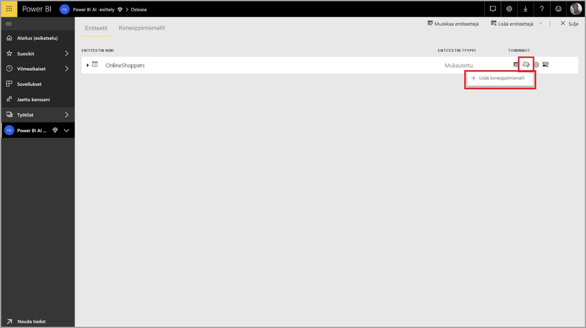

Tämän jälkeen käynnistyy yksinkertaistettu käyttökokemus, joka sisältää koneoppimismallin luomisprosessissa opastavan ohjatun toiminnon. Ohjatussa toiminnossa on seuraavat yksinkertaiset vaiheet.

1. Valitse historialliset tulostiedot sisältävä entiteetti sekä kenttä, jolle haluat saada ennusteen.
2. Valitse mallityyppi sen ennustustyypin perusteella, jonka haluat näyttää.
3. Valitse syötteet, joita haluat mallin käyttävän ennustavina signaaleina.
4. Nimeä mallisi ja tallenna määritykset.

Historiallisen tuloksen kenttä tunnistaa koneoppimismallin harjoittamisessa käytettävän otsikon määritteen seuraavassa kuvassa esitetyllä tavalla.

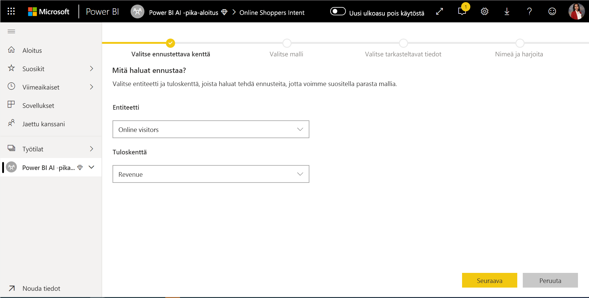

Kun määrität historiallisen tuloksen kentän, automaattianalyysipalvelut analysoi otsikon tiedot tunnistaakseen niiden koneoppimismallien tyypit, joita voidaan harjoittaa kyseisiä tietoja varten, ja ehdottaa todennäköisimmän koneoppimismallin tyypin harjoittamista varten. 

> [!NOTE]
> Joitakin mallityyppejä ei välttämättä tueta valitsemiasi tietoja varten.

Automaattianalyysipalvelut analysoi myös kaikki valitun entiteetin kentät ja ehdottavat syötteitä, joita voidaan käyttää koneoppimismallin harjoittamiseen. Tämä prosessi on likimääräinen, ja se perustuu tilastolliseen analyysiin, joten tarkista käytetyt syötteet. Syötteitä, jotka ovat riippuvaisia historiallisen tuloksen kentästä (tai otsikkokentästä), ei tule käyttää koneoppimismallin harjoittamisessa, koska ne vaikuttavat sen suorituskykyyn.

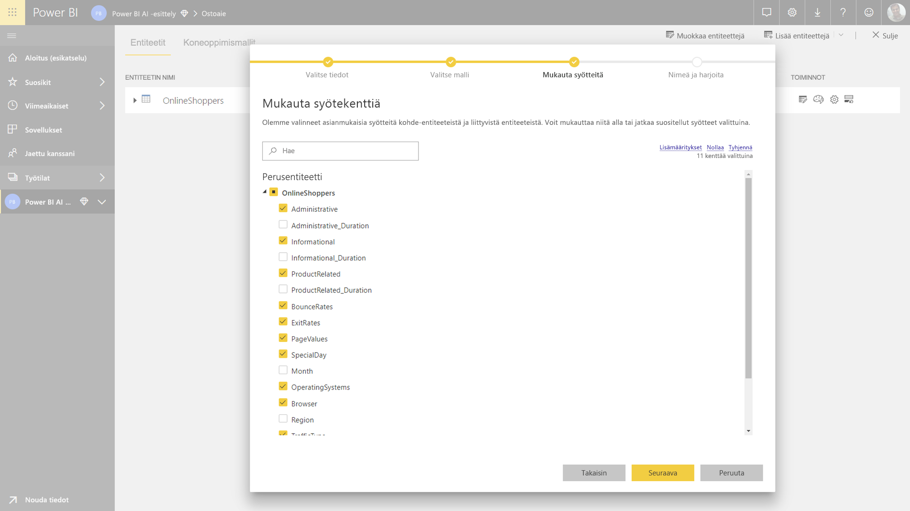

Viimeisessä vaiheessa voit nimetä mallin ja tallentaa sen asetukset.

Tässä vaiheessa sinua kehotetaan päivittämään tietovuo, mikä aloittaa koneoppimismallin harjoittamisprosessin.

### Koneoppimismallin harjoittaminen

Automaattianalyysipalvelumallien harjoittaminen on osa tietovuon päivitystä. Automaattianalyysipalvelut valmistelee ensin tietosi harjoittamista varten.

Automaattianalyysipalvelut jakaa antamasi historialliset tiedot harjoittamisen ja testauksen tietojoukkoihin. Testitietojoukko on pidätysjoukko, jota käytetään mallin suorituskyvyn vahvistamiseen harjoittamisen jälkeen. Nämä toteutuvat **harjoittamis- ja testaus**entiteetteinä tietovuossa. Automaattianalyysipalvelut käyttää ristiintarkistusta mallin vahvistuksessa.

Seuraavaksi kunkin syötekentän tiedot analysoidaan ja imputointi otetaan käyttöön, mikä korvaa puuttuvat arvot muilla arvoilla. Automaattianalyysipalvelut käyttää paria erilaista imputointistrategiaa. Sitten tarvittavat näytteenotot ja normalisointi otetaan käyttöön tiedoissa.

Automaattianalyysipalvelut käyttää useita muunnoksia kuhunkin valittuun syötekenttään sen tietotyypin ja tilastollisten ominaisuuksien perusteella. Näiden muunnosten avulla automaattianalyysipalvelut poimii ominaisuuksia koneoppimismallisi harjoittamista varten.

Automaattianalyysipalvelumallien harjoittamisprosessi koostuu enintään 50 iteroinnista eri mallinnusalgoritmeilla ja hyperparametriasetuksilla suorituskykyisimmän mallin löytämiseksi. Kunkin mallin suorituskyky arvioidaan vahvistuksella pidätystestin tietojoukon kanssa. Tämän harjoitusvaiheen aikana automaattianalyysipalvelut luovat useita jaksoja näiden iteraatioiden harjoittamiselle ja vahvistukselle. Mallien suorituskyvyn arviointiprosessi voi kestää jonkin aikaa muutamasta minuutista muutamaan tuntiin tietojoukon koon ja käytettävissä olevien varattujen kapasiteettiresurssien mukaan.

Joissakin tapauksissa lopullinen luotu malli voi käyttää yhdistelmäoppimista, jossa useita malleja käytetään paremman ennakoivan suorituskyvyn saamiseksi.

### Automaattianalyysipalvelumallin selitettävyys

Mallin harjoittamisen jälkeen automaattianalyysipalvelut analysoi syöteominaisuuksien ja mallitulosteen välistä suhdetta. Se arvioi pidätystestin tietojoukon mallitulosteen suuruuden ja muutoksen suunnan kullekin syöteominaisuudelle. Tätä kutsutaan *ominaisuuden tärkeydeksi*.

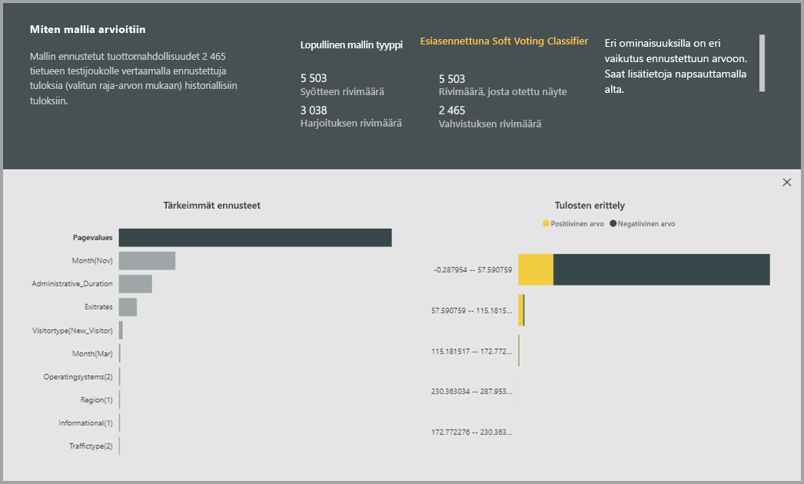

### Automaattianalyysipalvelumallin raportti

Automaattianalyysipalvelut luo Power BI -raportin, jossa on yhteenveto mallin suorituskyvystä vahvistuksen aikana sekä ominaisuuden yleinen tärkeys. Raportissa on yhteenveto tuloksista, jotka koskevat koneoppimismallin käyttämistä pidätystestin tiedoissa ja ennustusten vertaamista tunnettuihin tulosarvoihin.

Voit tutustua malliraporttiin, jotta ymmärrät sen suorituskyvyn. Voit myös vahvistaa, että mallin tärkeimmät vaikuttajat ovat yhdenmukaisia tunnettuja tuloksia koskevien liiketoimintatietojen kanssa.

Raportin mallin suorituskyvyn kuvaamisessa käytetyt kaaviot ja mittarit riippuvat mallin tyypistä. Nämä suorituskykykaaviot ja -mittarit kuvataan seuraavissa osissa.

Raportin lisäsivuilla saatetaan kuvailla tilastollisia mittareita mallista tietotieteen näkökulmasta. Esimerkiksi **Binaarinen ennuste** -raportti sisältää mallin voittokaavion ja ROC-käyrän.

Raporteissa on myös **Harjoitustiedot**-sivu, joka sisältää kuvauksen mallin harjoittamisesta sekä kaavion, jossa kuvataan mallin suorituskyky kunkin iteraation suorittamisen aikana.

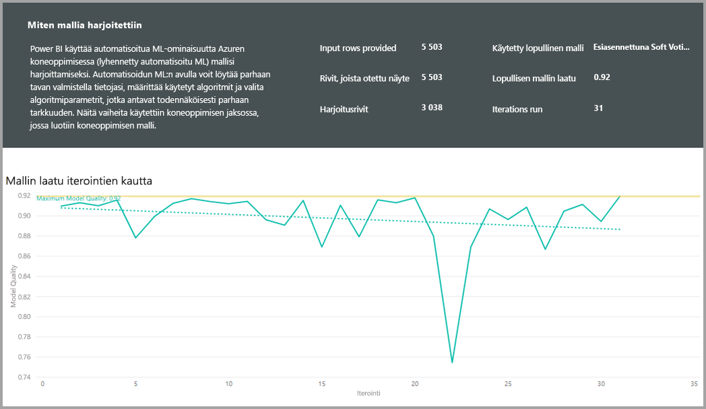

Tämän sivun toisessa osiossa kerrotaan, miten imputointimenetelmää käytettiin syötekenttien puuttuvien arvojen täyttämiseen sekä miten kukin syötekenttä muunnettiin poimimaan mallissa käytetyt ominaisuudet. Se sisältää myös lopullisen mallin käyttämät parametrit.

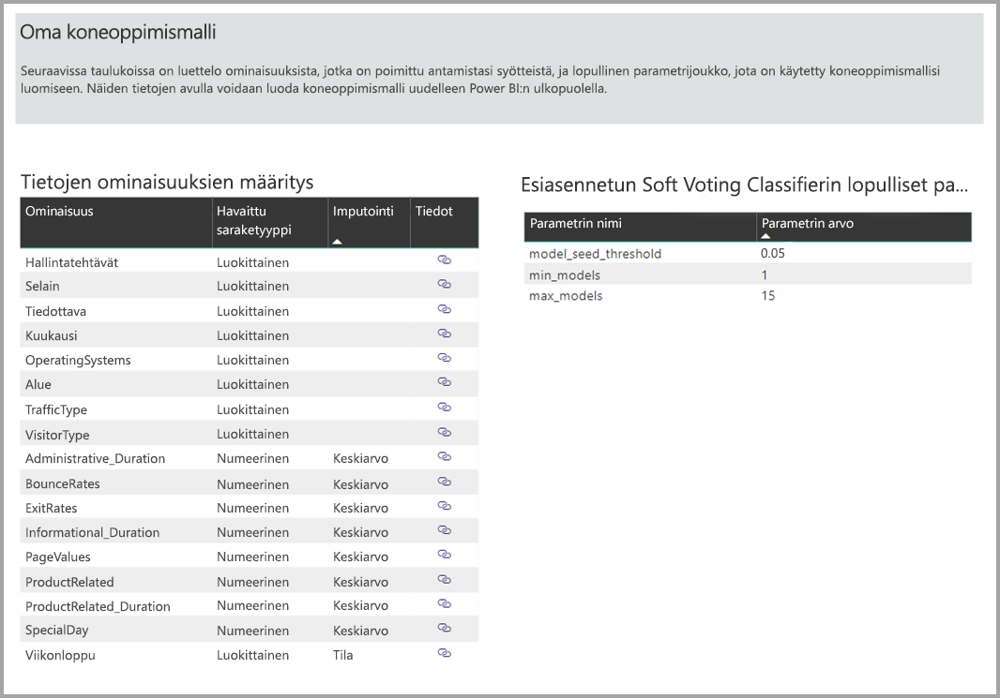

Jos tuotettu malli käyttää yhdistelmäoppimista, niin **Harjoitustiedot**-sivulla on myös osio, joka kuvaa kunkin perustana olevan mallin painotusta yhdistelmässä sekä sen parametreja.

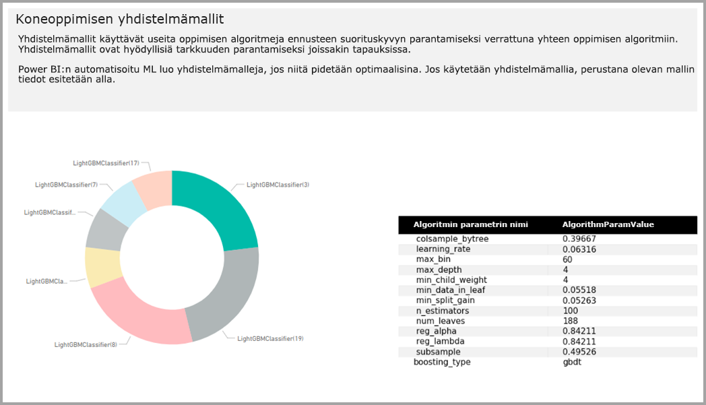

## Automaattianalyysipalvelumallin käyttäminen

Jos olet tyytyväinen luodun koneoppimismallin suorituskykyyn, voit ottaa sen käyttöön uusissa tai päivitetyissä tiedoissa, kun tietovuo päivitetään. Voit tehdä tämän malliraportista valitsemalla **Käytä**-painikkeen oikeassa yläkulmassa.

Jos haluat käyttää koneoppimismallia, sinun täytyy määrittää sen entiteetin nimi, jossa se pitää ottaa käyttöön, sekä etuliite niille sarakkeille, jotka lisätään tähän entiteettiin mallitulostetta varten. Sarakkeiden nimien oletusetuliite on mallin nimi. *Käytä*-funktio voi sisältää mallityypille määritettyjä lisäparametreja.

Koneoppimismallin käyttäminen luo uuden tietovuoentiteetin, jonka jälkiliite on **täydennetty <mallin_nimi>** . Jos esimerkiksi käytät _Ostoaie_-mallia _OnlineOstajat_-entiteetissä, tuloste luo kohteen **OnlineOstajat täydennetty Ostoaie**.

Tällä hetkellä tuloste-entiteettiä ei voi käyttää koneoppimismallin tulosten esikatseluun Power Query -editorissa. Tulostesarakkeiden tuloksena näkyy aina tyhjäarvo. Jos haluat tarkastella tuloksia, toinen tuloste-entiteetti jälkiliitteellä **täydennetty <mallin_nimi> Esikatselu** luodaan, kun mallia käytetään.

Sinun on päivitettävä tietovuo, jotta voit esikatsella tuloksia kyselyeditorissa.

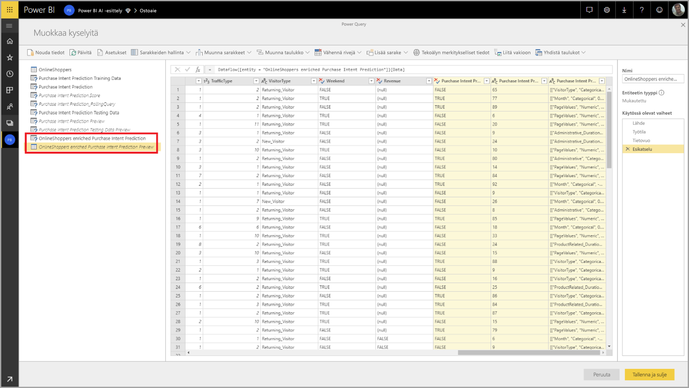

Kun otat mallin käyttöön, automaattianalyysipalvelut pitää ennusteet aina ajan tasalla, kun tietovuo päivitetään.

Automaattianalyysipalvelut sisältää myös yksilöllisen selityksen kullekin tuloste-entiteetissä pisteytetylle riville.

Jos haluat käyttää koneoppimismallin merkityksellisiä tietoja ja ennusteita Power BI -raportissa, voit muodostaa yhteyden tuloste-entiteettiin Power BI Desktopista käyttämällä **tietovuo**liitintä.

## Binaariennustemallit

Binaariennustemalleja, jotka tunnetaan paremmin **binaariluokitusmalleina**, käytetään tietojoukon luokittelemisessa kahteen ryhmään. Niitä käytetään ennakoimaan tapahtumia, joilla voi olla binaarinen tulos, kuten onko myyntimahdollisuus muunnettavissa, vaihtuuko asiakas, maksetaanko lasku ajallaan, onko tapahtuma vilpillinen, ja niin edelleen.

Koska tulos on binaraarinen, Power BI odottaa, että binaariennustemallin otsikkona on totuusarvo, jonka tunnetut tulokset on otsikoitu **tosi** tai **epätosi**. Esimerkiksi myyntimahdollisuuden muuntamismallissa voitettujen myyntimahdollisuuksien otsikkona on tosi, hävittyjen otsikkona on epätosi ja avoimien myyntimahdollisuuksien otsikkona on tyhjäarvo.

Binaariennustemallin tuloste on todennäköisyyden pistemäärä, joka määrittää todennäköisyyden sille, että otsikon arvoa vastaava tulos toteutuu.

### Binaariennustemallin harjoittaminen

Jotta voit luoda binaariennustemallin, harjoitustiedot sisältävällä syöte-entiteetillä on oltava totuusarvokenttä historiallisen tuloksen kenttänä aiempien tunnettujen tulosten tunnistamiseksi.

Edellytykset:

* Totuusarvokenttää on käytettävä historiallisen tuloksen kenttänä.
* Kullekin tulosluokalle vaaditaan vähintään 50 riviä historiallista tietoa.

Yleisesti jos aiemmat tulokset tunnistetaan eri tietotyyppiä olevien kenttien avulla, voit lisätä lasketun sarakkeen ja muuntaa ne totuusarvoksi käyttämällä Power Querya.

Binaariennustemallin luontiprosessi noudattaa samoja vaiheita kuin muutkin automaattianalyysipalvelumallit. Vaiheet on kuvattu yllä olevassa osassa **Koneoppimismallin syötteiden määrittäminen**.

### Binaariennustemallin raportti

Binaariennustemalli tuottaa tulosteena todennäköisyyden sille, että tietue saavuttaa tuloksen, jonka totuusarvo-otsikko on määrittänyt arvolla Tosi. Raportti sisältää todennäköisyyden raja-arvolle osittajan, joka vaikuttaa siihen, miten todennäköisyyden raja-arvon ylä- ja alapuolella olevat pistemäärät tulkitaan.

Raportissa kuvataan mallin suorituskyky arvoilla *True-positiiviset*, *False-positiiviset*, *True-negatiiviset* ja *False-negatiiviset*. True-positiiviset ja True-negatiiviset ovat oikein ennustettuja tuloksia kahdelle luokalle tulostiedoissa. False-positiiviset ovat tuloksia, joiden todellinen totuusarvo oli Epätosi, mutta joiden arvon ennustettiin olevan Tosi. False-negatiiviset taas ovat tuloksia, joiden todellinen totuusarvo oli Tosi, mutta joiden arvon ennustettiin olevan Epätosi.

Mittarit, kuten Tarkkuus ja Saanti, kuvaavat todennäköisyyden raja-arvon vaikutusta ennustettuihin tuloksiin. Todennäköisyyden raja-arvon osittajan avulla voit valita raja-arvon, joka saavuttaa tasapainoisen kompromissin tarkkuuden ja saannin välillä.

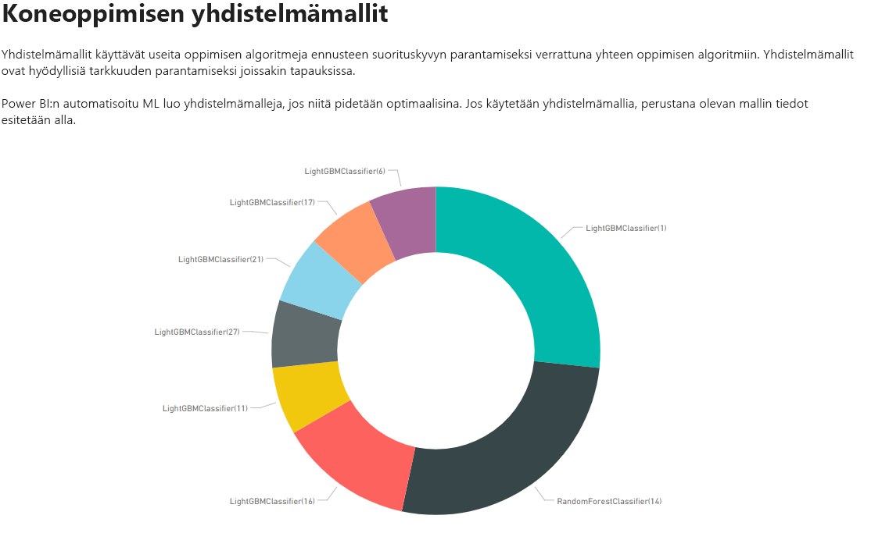

Malliraportin **Tarkkuusraportti**-sivu sisältää *Kertyneet voitot* -kaavion ja ROC-käyrän mallille. Nämä ovat mallin suorituskykyyn liittyviä tilastollisia mittareita. Raportit sisältävät kuvauksen näytetyistä kaavioista.

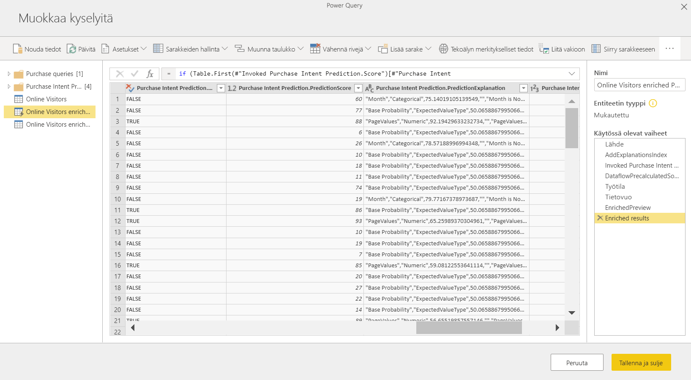

### Binaariennustemallin käyttäminen

Jos haluat käyttää binaariennustemallia, sinun on määritettävä entiteetti ja tiedot, joissa haluat käyttää koneoppimismallin ennusteita. Muita parametreja ovat tulostesarakkeen nimen etuliite ja todennäköisyyden raja-arvo ennustetun tuloksen luokittelemiseksi.

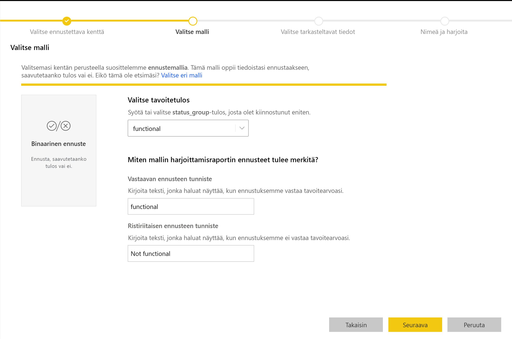

Kun binaariennustemallia käytetään, se lisää kolme tulostesaraketta täydennettyyn tuloste-entiteettiin. Ne ovat **EnnusteenPisteet**, **EnnusteenTulos** ja **EnnusteenSelitys**. Entiteetin sarakkeiden nimien etuliite on määritetty, kun mallia käytetään.

**EnnusteenTulos**-sarake sisältää ennustetun tuloksen otsikon. Tietueiden, joiden todennäköisyydet ylittävät raja-arvon, ennustetaan todennäköisesti saavuttavan tuloksen, kun taas raja-arvon alle jäävillä tietueilla se on epätodennäköistä.

**EnnusteenSelitys**-sarake sisältää selityksen ja määrittää tietyn vaikutteen, joka syöteominaisuuksilla oli **EnnusteenPisteet**-kohdassa. Tämä on JSON-muotoiltu kokoelma, joka sisältää ennusteen syöteominaisuuksien painotukset.

## Luokitusmallit

Luokitusmallien avulla tietojoukot luokitellaan useisiin ryhmiin tai luokkiin.  Niitä käytetään ennakoimaan tapahtumia, joilla voi olla jokin useista mahdollisista tuloksista, kuten onko asiakkaan elinkaariarvo todennäköisesti erittäin suuri, suuri, normaali vai pieni, tai onko oletusarvon riski suuri, kohtalainen, pieni vai erittäin pieni, ja niin edelleen.

Luokitusmallin tuloste on todennäköisyyden pistemäärä, joka tunnistaa todennäköisyyden sille, että tietue saavuttaa tietyn luokan ehdot.

### Luokitusmallin harjoittaminen

Luokitusmallin harjoitustiedot sisältävällä syöte-entiteetillä on oltava merkkijono- tai numeerinen kenttä historiallisen tuloksen kenttänä, joka tunnistaa aiemmat tunnetut tulokset.

Edellytykset:

* Kullekin tulosluokalle vaaditaan vähintään 50 riviä historiallista tietoa.

Luokitusmallin luontiprosessi noudattaa samoja vaiheita kuin muutkin automaattianalyysipalvelumallit. Vaiheet on kuvattu yllä olevassa osassa **Koneoppimismallin syötteiden määrittäminen**.

### Luokitusmallin raportti

Luokitusmallin raportti luodaan käyttämällä koneoppimismallia pidätystestin tietoihin ja vertaamalla tietueen ennustettua luokkaa todelliseen tunnettuun luokkaan.

Malliraportti sisältää kaavion, joka sisältää kunkin tunnetun luokan oikein ja virheellisesti luokiteltujen tietueiden erittelyn.

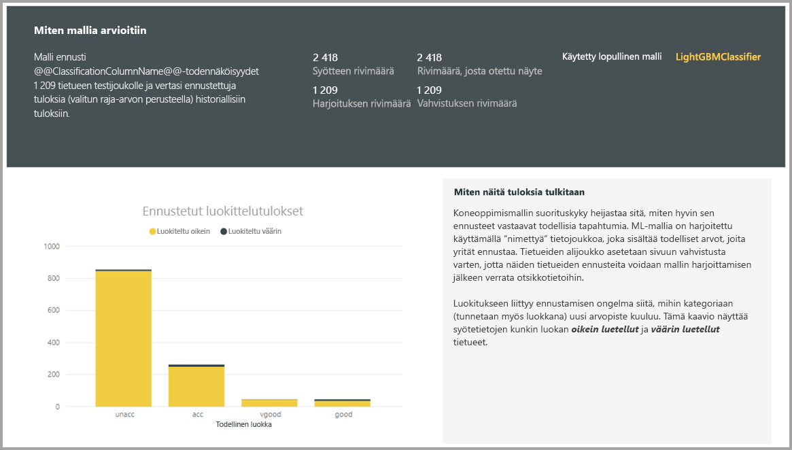

Siirtyminen pidemmälle luokan alirakenteisiin mahdollistaa analyysin siitä, miten tunnetun luokan ennusteet on jaettu. Tämä sisältää muut luokat, joihin kyseisen tunnetun luokan tietueet todennäköisesti luokitellaan virheellisesti.

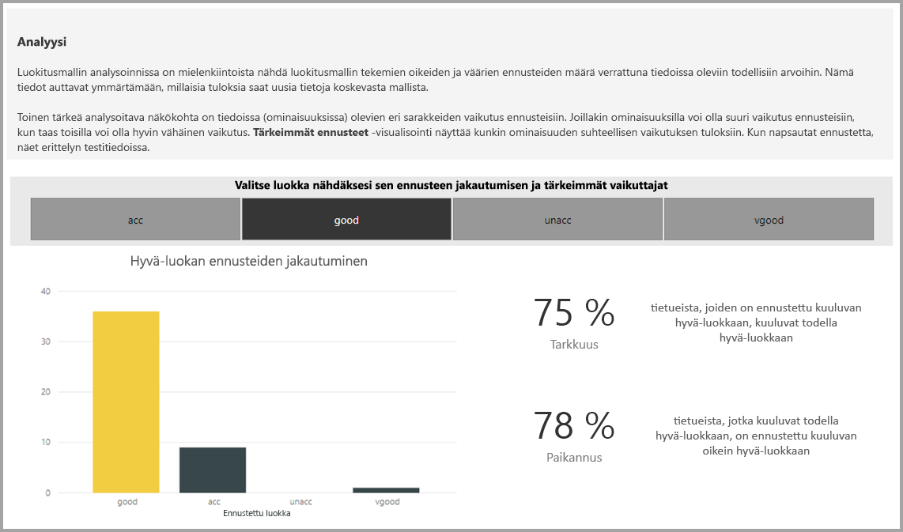

Raportin malliselitys sisältää myös kunkin luokan tärkeimmät ennusteet.

Luokitusmallin raportti sisältää myös Harjoitustiedot-sivun, joka on samanlainen kuin muiden mallityyppien sivut, jotka on kuvattu tämän artikkelin aiemmassa kohdassa **Automaattianalyysipalvelumallin raportti**.

### Luokitusmallin käyttäminen

Jos haluat käyttää koneoppimisen luokitusmallia, sinun on määritettävä entiteetti syötetiedoilla ja tulostesarakkeen nimen etuliitteellä.

Kun luokitusmallia käytetään, se lisää kolme tulostesaraketta täydennettyyn tuloste-entiteettiin. Ne ovat **EnnusteenPisteet**, **EnnusteenLuokka** ja **EnnusteenSelitys**. Entiteetin sarakkeiden nimien etuliite on määritetty, kun mallia käytetään.

**EnnusteenLuokka**-sarake sisältää tietueen todennäköisimmän luokan. **EnnusteenPisteet**-sarake sisältää todennäköisyyspisteiden luettelon kunkin mahdollisen luokan tietueelle.

**EnnusteenSelitys**-sarake sisältää selityksen ja määrittää tietyn vaikutteen, joka syöteominaisuuksilla oli **EnnusteenPisteet**-kohdassa. Tämä on JSON-muotoiltu kokoelma, joka sisältää ennusteen syöteominaisuuksien painotukset.

## Regressiomallit

Regressiomalleja käytetään ennakoimaan arvoa, kuten myyntisopimuksesta todennäköisesti saatavaa voittoa, asiakkaan elinkaariarvoa, saatavan laskun todennäköisesti maksettavaa summaa, päivämäärää, jolloin lasku mahdollisesti maksetaan, ja niin edelleen.

Regressiomallin tuloste on ennustettu arvo.

### Regressiomallin harjoittaminen

Regressiomallin harjoitustiedot sisältävällä syöte-entiteetillä on oltava numeerinen kenttä historiallisen tuloksen kenttänä, joka tunnistaa aiempien tunnettujen tulosten arvot.

Edellytykset:

* Regressiomallille vaaditaan vähintään 100 riviä historiallista tietoa.

Regressiomallin luontiprosessi noudattaa samoja vaiheita kuin muutkin automaattianalyysipalvelumallit. Vaiheet on kuvattu yllä olevassa osassa **Koneoppimismallin syötteiden määrittäminen**.

### Regressiomallin raportti

Muiden automaattianalyysipalvelumallien tavoin regressioraportti perustuu tuloksiin, jotka koskevat mallin käyttämistä pidätystestin tiedoissa.

Malliraportti sisältää kaavion, joka vertaa ennustettuja arvoja todelliseen arvoon. Tässä kaaviossa etäisyys lävistäjästä ilmaisee ennusteessa olevan virheen.

Jäännösvirhekaaviossa näytetään keskimääräisen virheen prosenttiosuuden jakautuminen eri arvoille pidätystestin tietojoukossa. Vaaka-akseli edustaa ryhmän todellisen arvon keskiarvoa siten, että kuplan koko näyttää joukon arvojen tiheyden tai määrän. Pystyakseli on keskimääräinen jäännösvirhe.

Regressiomallin raportti sisältää myös Harjoitustiedot-sivun, joka on muiden mallityyppien raporttien kaltainen, ja ne on kuvattu aiemmassa kohdassa **Automaattianalyysipalvelumallin raportti**.

### Regressiomallin käyttäminen

Jos haluat käyttää koneoppimisen regressiomallia, sinun on määritettävä entiteetti syötetiedoilla ja tulostesarakkeen nimen etuliitteellä.

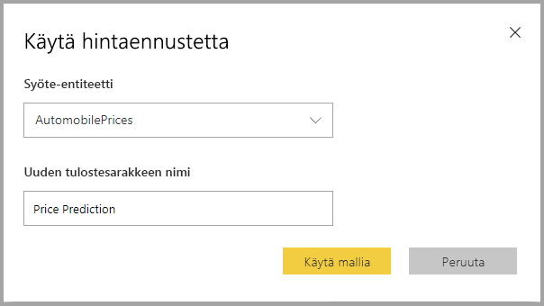

Kun regressiomallia käytetään, se lisää kaksi tulostesaraketta täydennettyyn tuloste-entiteettiin. Ne ovat **EnnusteenArvo** ja **EnnusteenSelitys**. Entiteetin sarakkeiden nimien etuliite on määritetty, kun mallia käytetään.

**EnnusteenArvo**-sarake sisältää syötekenttiin perustuvan tietueen ennustetun arvon. **EnnusteenSelitys**-sarake sisältää selityksen ja määrittää tietyn vaikutteen, joka syöteominaisuuksilla oli **EnnusteenArvo**-kohdassa. Tämä on JSON-muotoiltu kokoelma, joka sisältää syöteominaisuuksien painotukset.

## Seuraavat vaiheet

Tässä artikkelissa annettiin yleiskuva tietovoiden automaattianalyysipalveluista Power BI -palvelussa. Myös seuraavista artikkeleista voi olla apua.

* [Opetusohjelma: Koneoppimismallin luominen Power BI:ssä (esikatselu)](service-tutorial-build-machine-learning-model.md)
* [Opetusohjelma: Kognitiivisten palvelujen käyttö Power BI:ssä](service-tutorial-use-cognitive-services.md)
* [Opetusohjelma: Automaattianalyysistudion mallin käynnistys Power BI:ssä (esikatselu)](service-tutorial-invoke-machine-learning-model.md)
* [Kognitiiviset palvelut Power BI:ssä (esikatselu)](service-cognitive-services.md)
* [Azuren automaattianalyysipalveluiden integroiminen Power BI:hin (esikatselu)](service-machine-learning-integration.md)

Lisätietoja tietovoista on seuraavissa artikkeleissa:
* [Tietovoiden luominen ja käyttäminen Power BI:ssä](service-dataflows-create-use.md)
* [Laskettujen entiteettien käyttäminen Power BI Premiumissa](service-dataflows-computed-entities-premium.md)
* [Tietovoiden käyttö paikallisiin tietolähteisiin](service-dataflows-on-premises-gateways.md)
* [Kehittäjien resurssit Power BI -tietovoille](service-dataflows-developer-resources.md)
* [Tietovuot ja Azure Data Lake -integrointi (esikatselu)](service-dataflows-azure-data-lake-integration.md)

