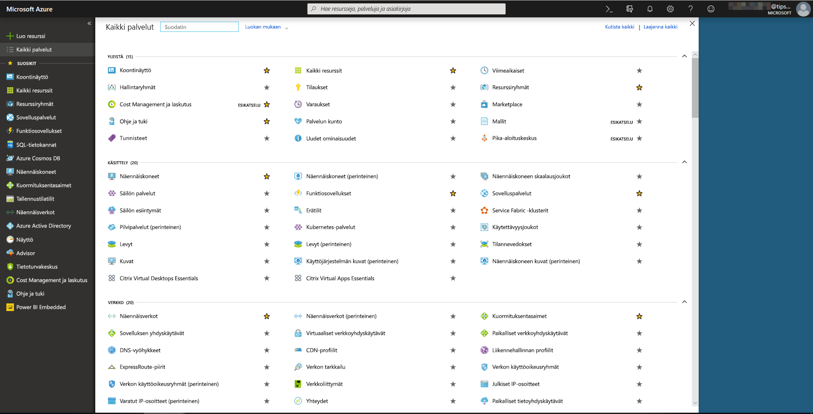
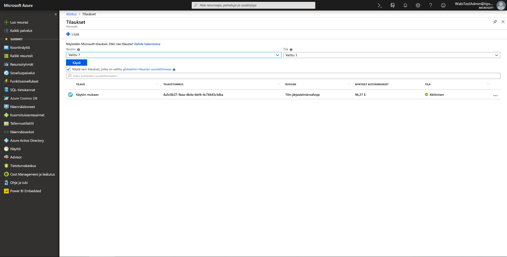
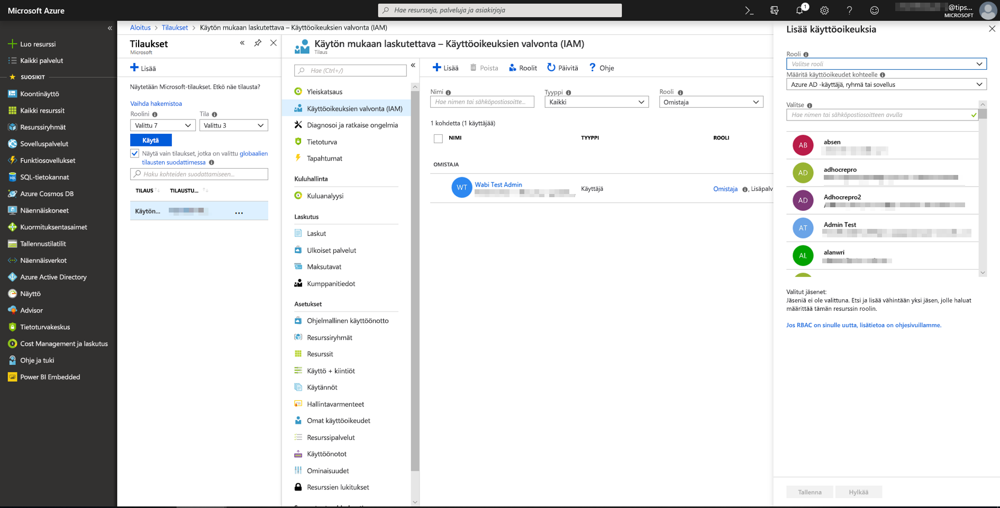
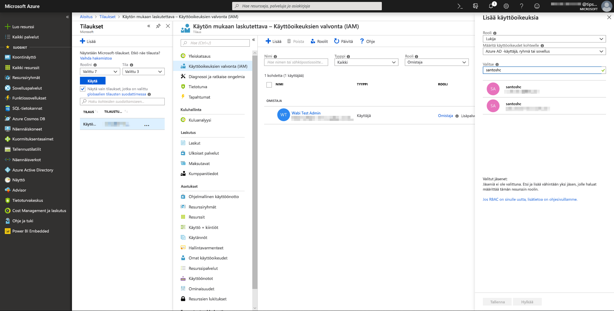
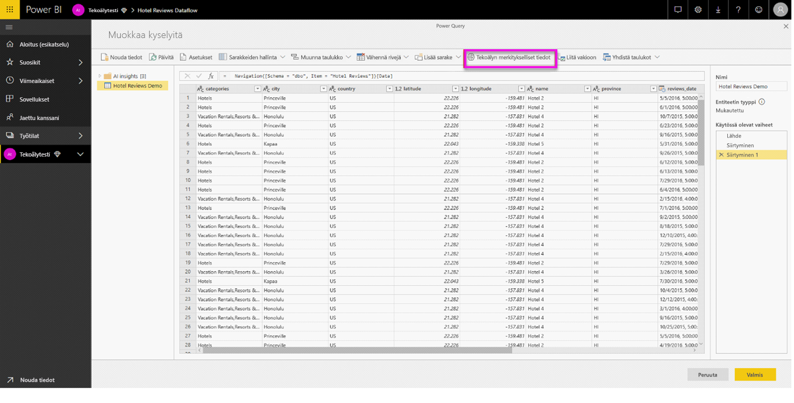
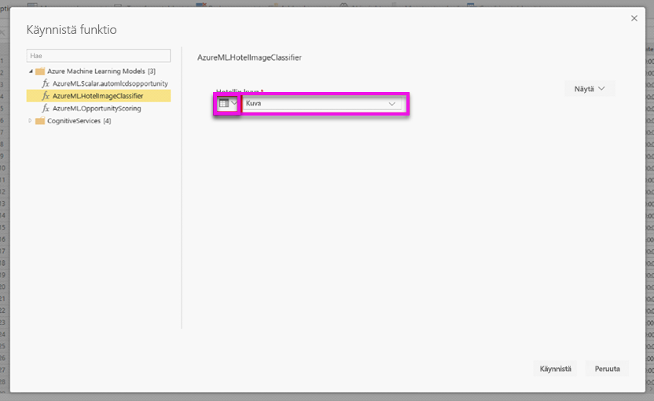
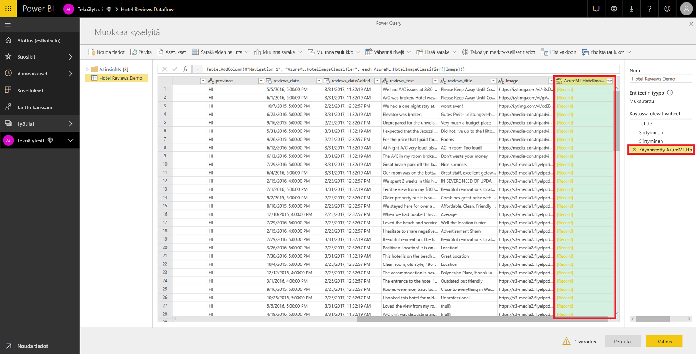
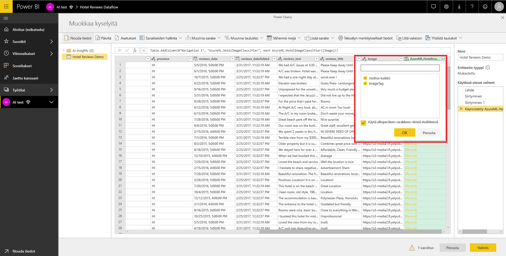

# Automaattianalyysipalveluiden integrointi Power BI:ssä

Useat organisaatiot käyttävät **automaattianalyysin** malleja saadakseen parempia merkityksellisiä tietoja ja ennusteita liiketoiminnastaan. Voit visualisoida ja käynnistää merkityksellisiä tietoja näistä malleista raporteissa, koontinäytöissä ja muita analyyseissa, mikä helpottaa merkityksellisten tietojen välittämistä niille yrityskäyttäjille, jotka tarvitsevat niitä eniten.  Power BI:n avulla voi nyt helposti sisällyttää Azuren automaattianalyysipalvelussa isännöityjen mallien merkityksellisiä tietoja käyttämällä yksinkertaisia osoita ja napsauta -liikkeitä.

Jotta tätä ominaisuutta voisi käyttää, datatieteilijän tulee vain myöntää Azuren automaattianalyysipalveluiden mallille käyttöoikeus BI-analyytikkoon Azure-portaalin kautta.  Kunkin istunnon aluksi Power Query sitten löytää kaikki Azuren automaattianalyysipalveluiden mallit, joihin käyttäjällä on käyttöoikeus, ja paljastaa ne dynaamisina Power Query -funktioina.  Käyttäjä voi käynnistää kyseiset funktiot käyttämällä niitä Power Query -editorin valintanauhasta tai käynnistämällä suoraan M-funktion. Lisäksi Power BI käsittelee käyttöoikeuspyynnöt automaattisesti erissä suorituskyvyn parantamiseksi, kun se käynnistää Azuren automaattianalyysipalveluiden mallin rivijoukolle.

Tätä toimintoa tuetaan tällä hetkellä vain Power BI -tietovoille sekä Power Querylle verkossa Power BI -palvelussa.

Lisätietoja tietovoista on artikkelissa [Omatoiminen tietojen valmistelu Power BI:ssä](service-dataflows-overview.md).

Lisätietoja Azuren automaattianalyysipalveluista on seuraavissa:

- Yleiskatsaus:  [Mitä ovat Azuren automaattianalyysipalvelut?](https://docs.microsoft.com/azure/machine-learning/service/overview-what-is-azure-ml)
- Pikaoppaita ja opetusohjelmia Azuren automaattianalyysipalveluihin:  [Azuren automaattianalyysipalveluiden dokumentaatio](https://docs.microsoft.com/azure/machine-learning/)

## Azuren automaattianalyysipalvelumallin käyttöoikeuksien myöntäminen Power BI -käyttäjälle

Jotta käyttäjä voisi käsitellä Azuren automaattianalyysipalveluiden mallia Power BI:stä, hänellä on oltava Azure-tilauksen **luku**-oikeudet.  Lisäksi:

- Automaattianalyysistudion malleille **luku**-oikeus automaattianalyysistudion verkkopalveluun
- Automaattianalyysipalvelun malleille **luku**-oikeus automaattianalyysipalvelun työtilaan

Tässä artikkelissa kuvataan, kuinka Power BI -käyttäjälle myönnetään käyttöoikeus Azuren automaattianalyysipalveluissa isännöityyn malliin, niin että käyttäjä voi käsitellä mallia Power Query -funktiona.  Lisätietoja on artikkelissa [Käyttöoikeuksien hallinta RBAC:n ja Azure-portaalin avulla](https://docs.microsoft.com/azure/role-based-access-control/role-assignments-portal).

1. Kirjaudu sisään [Azure-portaaliin](https://portal.azure.com).

2. Siirry **Tilaukset**-sivulle. Pääset **Tilaukset**-sivulle valitsemalla Azure-portaalin vasemmanpuoleisen siirtymisvalikon luettelosta **Kaikki palvelut** -vaihtoehdon.

    

3. Valitse tilauksesi.

    

4. Valitse **Käyttöoikeuksien valvonta (IAM)** ja valitse sitten **Lisää**-painike.

    

5. Valitse rooliksi **Lukija**. Valitse Power BI -käyttäjä, jolle haluat myöntää Azuren automaattianalyysipalveluiden käyttöoikeuden.

    

6. Valitse **Tallenna**.

7. Toista vaiheet kolmesta kuuteen ja myönnä käyttäjälle **Lukija**-käyttöoikeus tiettyyn Automaattianalyysistudion verkkopalveluun *tai* Automaattianalyysipalvelun työtilaan, joka isännöi mallia.

## Rakenteen etsiminen Automaattianalyysipalveluiden malleille

Datatieteilijät käyttävät ensisijaisesti Pythonia, kun he kehittävät (ja jopa ottavat käyttöön) koneoppimismalleja Automaattianalyysipalveluihin.  Toisin kuin automaattianalyysistudion yhteydessä, joka auttaa automatisoimaan skeematiedoston luonnin mallia varten, automaattianalyysipalvelun tapauksessa datatieteilijän tulee erikseen luoda rakennetiedosto Pythonia käyttämällä.

Tämä skeematiedosto on sisällytettävä käyttöön otettuun automaattianalyysipalvelumallien verkkopalveluun. Jos haluat luoda verkkopalvelun rakenteen automaattisesti, sinun on lisättävä esimerkki syöteestä/tulosteesta käyttöönotetun mallin käynnistyskomentosarjaan. Lue dokumentaation Mallien käyttöönotto Azuren koneoppimispalvelulla alakohta (Valinnainen) Automaattinen Swagger-skeeman luominen. Linkki sisältää esimerkkikäynnistyskomentosarjan, jossa on lausekkeet skeeman luontia varten. 

Tarkalleen ottaen käynnistyskomentosarjan *@input_schema* - ja *@output_schema* -funktiot viittaavat syöte- ja tulostemallien muotoihin *input_sample* ja *output_sample* -muuttujissa ja käyttävät näitä malleja luodakseen OpenAPI (Swagger) -määrityksen verkkopalvelulle käyttöönoton aikana.

Näitä ohjeita, jotka koskevat skeeman luontia käynnistyskomentosarjaa päivittämällä, tulee soveltaa malleihin, jotka on luotu käyttämällä Azuren automaattianalyysipalvelujen SDK:ta käyttäviä automaattianalyysipalvelujen kokeita.

> [!NOTE]
> Mallit, jotka on luotu Azuren automaattianalyysipalvelun käyttöliittymää käyttämällä, eivät tällä hetkellä tue skeemojen luomista. Tuki lisätään myöhemmissä versioissa. 

## Azuren automaattianalyysipalveluiden mallin käynnistäminen Power BI:ssä

Voit käynnistää minkä tahansa Azuren automaattianalyysipalveluiden mallin, johon olet saanut käyttöoikeuden, suoraan tietovuosi Power Query -editorista. Jos haluat käyttää Azuren automaattianalyysipalveluiden malleja, valitse sen entiteetin **Muokkaa**-painike, jota haluat rikastuttaa Azuren automaattianalyysipalveluiden mallin merkityksellisillä tiedoilla, kuten seuraavassa kuvassa esitetään.

**Muokkaa**-painikkeen valitseminen avaa Power Query -editorin tietovuossa oleville entiteeteille.

Valitse valintanauhan **Tekoälyn merkitykselliset tiedot** -painike ja valitse sitten vasemmasta siirtymisvalikosta _Azuren koneoppimismallit_ -kansio. Kaikki Azuren automaattianalyysipalveluiden mallit, joihin sinulla on käyttöoikeus, näkyvät tässä Power Query -funktioina. Lisäksi Azuren automaattianalyysipalveluiden mallin syöteparametrit yhdistetään automaattisesti vastaavan Power Query -funktion parametreina.

Jos haluat käynnistää Azuren automaattianalyysipalveluiden mallin, voit määrittää avattavassa luettelossa minkä tahansa valitun entiteetin sarakkeista syötteeksi. Voit myös määrittää syötteenä käytettävän vakioarvon käyttämällä syötevalintaikkunan vasemmalla puolella olevaa sarakekuvaketta.

Valitse **Käynnistä**, niin voit tarkastella Azuren automaattianalyysipalveluiden mallin tulostetta entiteettitaulukon uutena sarakkeena. Näet myös mallin kutsun kyselyyn käytettynä vaiheena.

Jos malli palauttaa useita tulosteparametreja, ne ryhmitellään yhteen tulossarakkeen tietueena. Voit laajentaa sarakkeen, niin että saat yksittäiset tulosteparametrit erillisiin sarakkeisiin.

Kun tallennat tietovuon, malli käynnistetään automaattisesti, kun tietovuohon päivitetään entiteettitaulukon uusia tai päivitettyjä rivejä.

## Seuraavat vaiheet

Tässä artikkelissa annettiin yleiskuva siitä, miten automaattianalyysit integroidaan Power BI -palveluun. Myös seuraavat artikkelit voivat olla kiinnostavia ja hyödyllisiä. 

* [Opetusohjelma: Azuren koneoppimisstudion käynnistäminen Power BI:ssä](service-tutorial-invoke-machine-learning-model.md)
* [Opetusohjelma: Kognitiivisten palvelujen käyttö Power BI:ssä](service-tutorial-use-cognitive-services.md)
* [Kognitiiviset palvelut Power BI:ssä](service-cognitive-services.md)

Lisätietoja tietovoista on seuraavissa artikkeleissa:
* [Tietovoiden luominen ja käyttäminen Power BI:ssä](service-dataflows-create-use.md)
* [Laskettujen entiteettien käyttäminen Power BI Premiumissa](service-dataflows-computed-entities-premium.md)
* [Tietovoiden käyttö paikallisiin tietolähteisiin](service-dataflows-on-premises-gateways.md)
* [Kehittäjien resurssit Power BI -tietovoille](service-dataflows-developer-resources.md)
* [Tietovuot ja Azure Data Lake -integrointi (esikatselu)](service-dataflows-azure-data-lake-integration.md)

