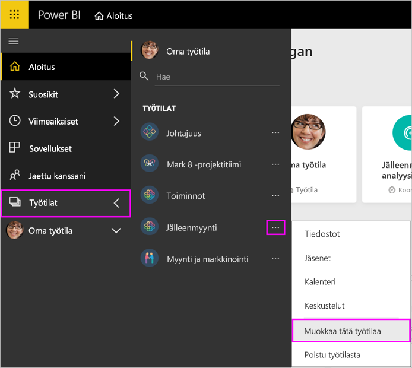
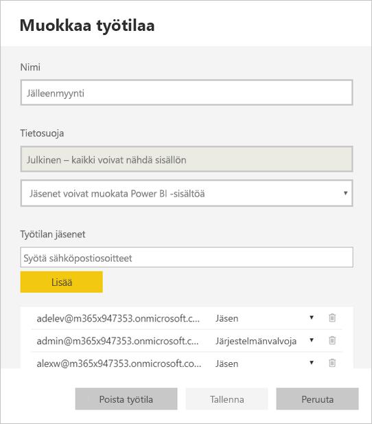
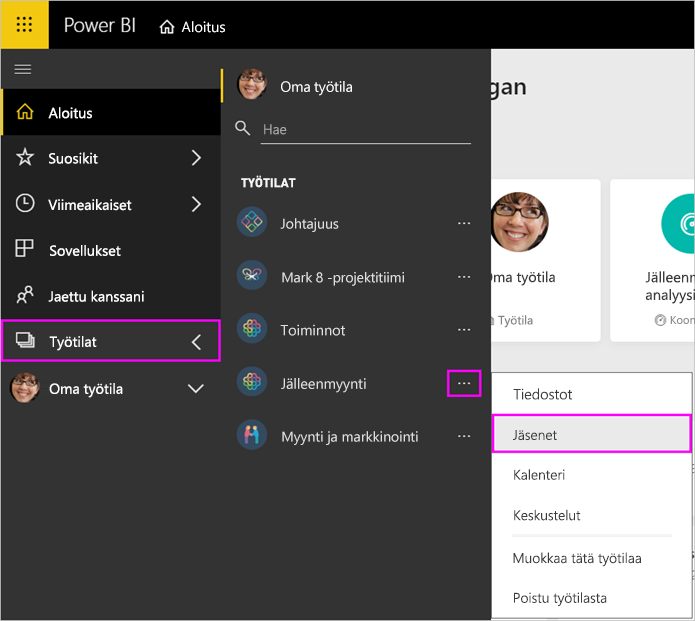
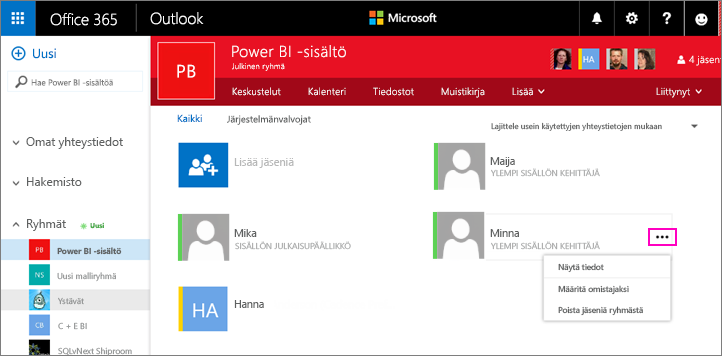
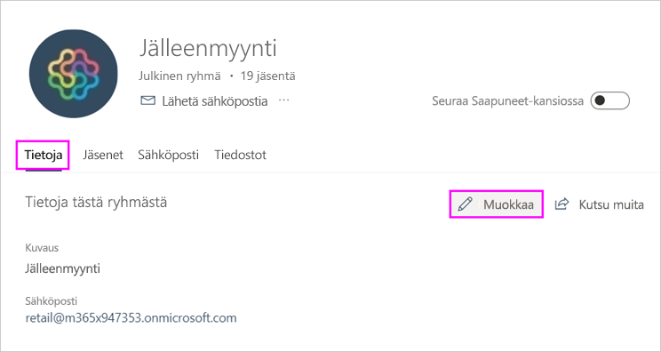
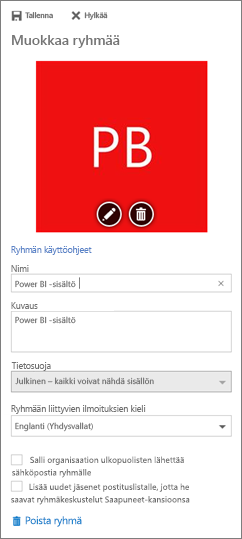

# Sovellustyötilan hallinta Power BI:ssä ja Office 365:ssä

[Power BI:ssä](service-create-distribute-apps.md) tai Office 365:ssä olevan sovellustyötilan luojana tai järjestelmänvalvojana voit hallita työtilan tiettyjä ominaisuuksia Power BI:ssä. Muita ominaisuuksia hallitaan Office 365:ssä.

> [!NOTE]
> Uusi työtilakokemuksen esiversio muuttaa Power BI -työtilojen ja Office 365:n ryhmien välistä suhdetta. Et luo automaattisesti Office 365 -ryhmää aina, kun luot uuden työtilan. Lue tietoja [uusien työtilojen luomisesta](service-create-the-new-workspaces.md).

**Power BI:ssä** suoritettavia toimintoja:

* Lisää tai poista sovellustyötilan jäseniä. Voit myös tehdä työtilan jäsenestä järjestelmänvalvojan.
* Muokkaa sovellustyötilan nimeä.
* Poista sovellustyötila.

**Office 365:ssä** suoritettavia toimintoja:

* Lisää tai poista sovellustyötilan ryhmän jäseniä. Voit myös tehdä jäsenestä omistajan.
* Muokkaa ryhmän nimeä, kuvaa, kuvausta ja muita asetuksia.
* Tarkastele ryhmän sähköpostiosoitetta.
* Poista ryhmä.

Tarvitset [Power BI Pro -käyttöoikeuden](service-features-license-type.md), jotta voit olla sovellustyötilan järjestelmänvalvoja tai jäsen. Sovelluksen käyttäjät tarvitsevat niin ikään Power BI Pro -käyttöoikeuden paitsi siinä tapauksessa, että sovellustyötilasi on Power BI Premium -ominaisuus. Lisätietoja on artikkelissa [Mikä on Power BI Premium?](service-premium-what-is.md)

## Sovellustyötilan muokkaaminen Power BI:ssä

1. Valitse Power BI -palvelun **Työtilat**-kohdan vieressä oleva nuoli. Valitse pistekuvake (...) työtilan nimen vieressä ja valitse **Muokkaa työtilaa**.

   

   > [!NOTE]
   > Näet **Muokkaa työtilaa** -vaihtoehdon vain, jos olet sovellustyötilan järjestelmänvalvoja.

1. Täällä voit nimetä työtilan uudelleen, lisätä tai poistaa sen jäseniä tai poistaa työtilan.

   

1. Valitse **Tallenna** tai **Peruuta**.

## Power BI -sovellustyötilan ominaisuuksien muokkaaminen Office 365:ssä

Voit myös muokata sovellustyötilan ominaisuuksia suoraan Outlook for Office 365:ssä.

### Sovellustyötilaryhmän jäsenten muokkaaminen

1. Valitse Power BI -palvelun **Työtilat**-kohdan vieressä oleva nuoli. Valitse pistekuvake (...) työtilan nimen vieressä ja valitse **Jäsenet**.

   

   Tämä avaa sovellustyötilan Office 365:n Outlookin ryhmänäkymän. Voit joutua kirjautumaan sisään yritystililläsi.

1. Valitse rooli tiimin jäsenen nimen vieressä, jos haluat tehdä hänestä **jäsenen** tai **omistajan**. Valitse **X**, jos haluat poistaa henkilön ryhmästä.

   

### Kuvan lisääminen ja työtilan muiden ominaisuuksien määrittäminen

Kun jakelet sovellustasi sovellustyötilasta, tässä lisäämäsi kuva näkyy sovelluksen kuvana. Lisätietoja on **Uusien työtilojen luominen** -artikkelin osiossa [Kuvan lisääminen Office 365:n uusiin työtiloihin](service-create-workspaces.md#add-an-image-to-your-office-365-workspace-optional).

1. Siirry sovellustyötilasi Outlook for Office 365 -näkymässä **Tietoja**-välilehdelle ja valitse **Muokkaa**.

    
1. Voit muokata ryhmään liittyvien ilmoitusten nimeä, kuvausta ja kieltä. Voit myös lisätä kuvan ja valita muita ominaisuuksia täällä.

   

1. Valitse **Tallenna** tai **Hylkää**.

## Seuraavat vaiheet

* [Julkaise sovellus Power BI:ssä](service-create-distribute-apps.md)

* Onko sinulla kysyttävää? [Kokeile Power BI -yhteisöä](http://community.powerbi.com/)
