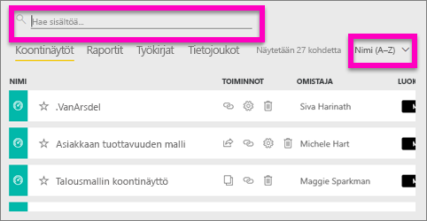
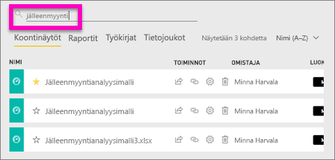
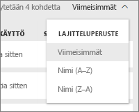
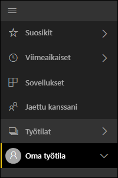
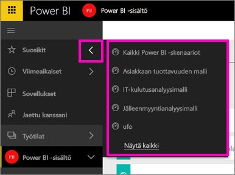

# Siirtyminen: sisällön hakeminen, löytäminen ja lajitteleminen Power BI -palvelussa
Sisältöön voi siirtyä monella tavalla Power BI -palvelussa. Sisältö on jaettu työtiloissa tyypin mukaan koontinäyttöihin, raportteihin, työkirjoihin ja tietojoukkoihin.  Lisäksi sisältö on järjestetty käytön mukaan suosikkeihin, viimeksi avattuihin, sovelluksiin, kanssani jaettuihin ja esiteltyihin. Näiden eri kulkureittien kautta löydät tarvitsemasi sisällön nopeasti Power BI -palvelussa.  

>[!NOTE] 
>Tämä artikkeli koskee vain Power BI -palvelua (app.powerbi.com), ei Power BI Desktopia.

## Siirtyminen työtiloissa

Power BI -palvelu jakaa työtilan sisällön tyypin mukaan koontinäyttöihin, raportteihin, työkirjojoihin ja tietojoukkoihin. Näet tämän jaon, kun valitset työtilan. Tässä esimerkissä sovelluksen työtilan nimi on ”Myynti- ja markkinointisovelluksen malli” ja se sisältää 2 koontinäyttöä, 6 raporttia, 1 työkirjan ja 5 tietojoukkoa.

________________________________________

## Hakeminen ja lajitteleminen työtiloissa
Työtilassa on neljä sisältövälilehteä: Koontinäytöt, Raportit, Työkirjat ja Tietojoukot.  Jokainen näistä välilehdistä sisältää hakukentän ja lajittelupainikkeen.  Kun olet aloittamassa Power BI -palvelun käyttöä, näistä ei välttämättä ole hyötyä, koska kussakin välilehdessä on vain yksi tai kaksi kohdetta.  Ajan kuluessa niissä saattaa kuitenkin olla pitkä luettelo sisältöä.  Löydät tarvitsemasi helposti käyttämällä hakua ja lajittelua.

* Kirjoita hakuehto, jotta löydät vastineen nykyisessä näytössä
  
   
* Tuo näkyviin näyttöasetuksia nykyistä sivua varten valitsemalla lajittelupainike. Vaihtoehdot ovat lajittelu nimen mukaan tai omistajan mukaan.
  
   

## Siirtyminen käyttämällä vasenta siirtymisruutua
Vasen siirtymisruutu luokittelee sisällön tavoilla, jotka helpottavat ja nopeuttavat entisestään tarvittavan sisällön löytämistä.  

Sisältö, jonka luot omaa käyttöäsi varten, on käytettävissä **Oma työtila** -kohdassa. Sisältö, jonka luot ja jaat ryhmän kanssa, on käytettävissä **Sovellukset**-työtilassa. Kanssasi jaettu sisältö on käytettävissä **Jaettu kanssani** -kohdassa. Viimeksi tarkasteltu sisältö on käytettävissä **Viimeisimmät**-kohdassa.

Voit lisäksi lisätä sisällön [suosikiksi](service-dashboard-favorite.md) ja [esittelyyn](service-dashboard-featured.md). Valitse koontinäyttö, jota uskot tarkastelevasi useimmin, ja määritä se *esittelyssä* olevaksi koontinäytöksi. Aina kun avaat Power BI -palvelun, tämä koontinäyttö näkyy ensimmäisenä. Käytkö usein useissa koontinäytöissä ja sovelluksissa? Kun lisäät ne suosikeiksi, ne ovat aina käytettävissä vasemmassa siirtymisruudussa.

.

## Huomioon otettavat seikat ja vianmääritys
* Tietojoukoissa omistaja ei ole käytettävissä **lajitteluperusteena**.

## Seuraavat vaiheet
[Power BI:n peruskäsitteet](service-basic-concepts.md)

Onko sinulla muuta kysyttävää? [Kokeile Power BI -yhteisöä](http://community.powerbi.com/)