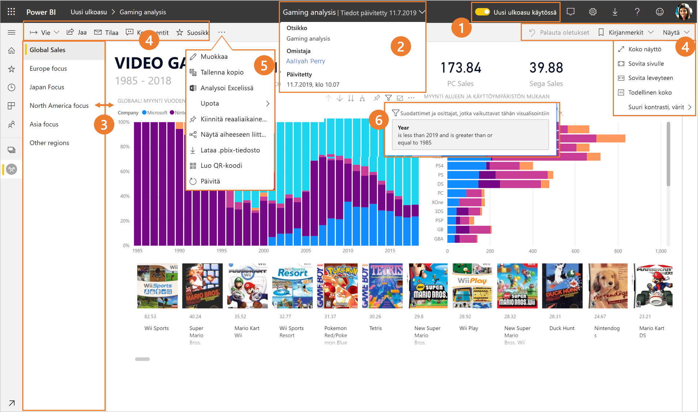
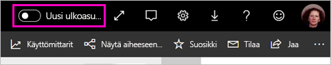
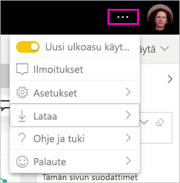
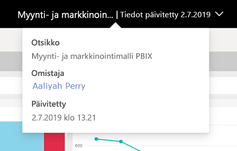
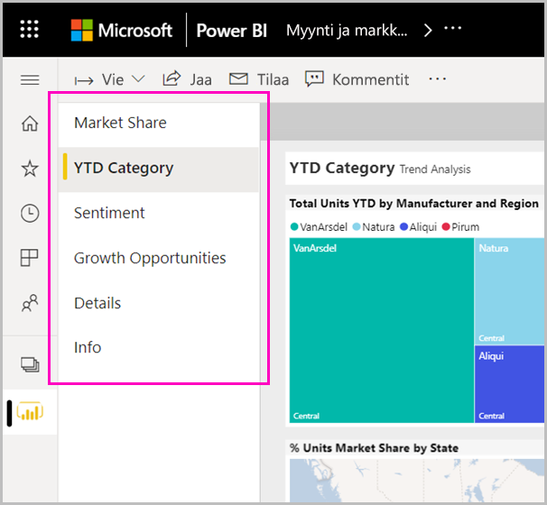
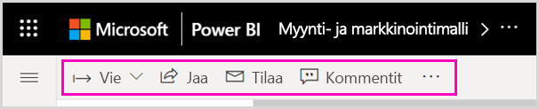
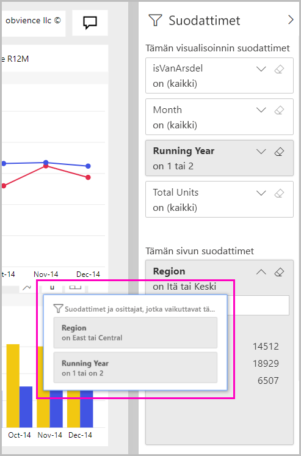

# Power BI -palvelun uusi ulkoasu

Power BI -palvelussa (app.powerbi.com) on uusi ulkoasu, jonka ansiosta raportteja on helpompi tarkastella ja käyttää. Uusi ulkoasu on yksinkertaisempi ja se perustuu muiden Microsoft-tuotteiden tuntemukseesi. Olemme painottaneet koko Power BI -palvelussa raportin sisältöä vaihtamalla vaaleampaan väriteemaan ja päivittämällä kuvakkeita. 

Etsitkö tietoja **Power BI Desktopin** uudesta ulkoasusta? Katso [Power BI Desktopin päivitetyn valintanauhan käyttäminen](desktop-ribbon.md).

Seuraavassa on yleiskatsaus siitä, mitä uutta uudessa ulkoasussa on. Lisätietoja on numeroiduissa osioissa:

Etsitkö tiettyä toimintoa? Katso ["uusi ulkoasu": Minne toiminnot ovat kadonneet?](service-new-look-where-actions.md)

## Muutosten pikaesittely

Tämä animaatio esittelee raporttien ulkoasuun tehdyt muutokset toiminnassa.

## 1. Uuden ulkoasun ottaminen käyttöön

Kaikki Power BI -palvelun käyttäjät voivat valita uuden ulkoasun. Siirrä vain **Uusi ulkoasu pois käytöstä** -valitsin kohtaan **Uusi ulkoasu käytössä**.

Jos haluat palata vanhaan näkymään, siirrä valitsin takaisin kohtaan **ei käytössä** . Jos et näe sitä, valitse oikeasta yläkulmasta kolme pistettä -valikko.

## 2. Raportin tietojen tarkasteleminen 

Näytä nopeasti tietoja, kuten viimeisimmän päivityksen päivämäärä ja yhteystiedot, suoraan yläpalkissa.  Avaa valikko, jos haluat tarkastella raportin lisätietoja. Voit myös lähettää sähköpostiviestin raportin omistajalle.

## 3. Pystysuuntainen sivuluettelo 
Raporttisivun nimet ovat nyt luettelona pystysuuntaisessa ruudussa. Ne ovat selkeästi näkyvissä ja muistuttavat siirtymistä Wordissa ja PowerPointissa. Voit suurentaa tai pienentää raporttialueen muita osia muuttamalla pystysuuntaisen ruudun kokoa.

## 4. Yksinkertaistettu toimintorivi 

Yläreunan päivitetyllä toimintorivillä ovat tärkeimmät komennot raportin kuluttajille. Vienti, tilaaminen, yhteistyö muiden käyttäjien kanssa sekä tietojen syvällisempi tarkastelu suodattimien ja kirjanmerkkien kautta on nyt helpompaa.

## 5. Missä raportin komennot ovat?

Emme poistaneet mitään toimintoja vanhasta ulkoasusta. Lisäkomennot, kuten Muokkaa, Tallenna kopio jne. löytyvät laajentamalla kolme pistettä (...) toimintorivillä. Voit myös käyttää sisältöluettelon käyttömittareita.

### Missä Tiedosto-valikon toiminnot ovat?

Etsitkö **Tiedosto**-valikon toimintoja? Toiminnot, jotka olivat **Tiedosto**-valikossa, ovat myös **Enemmän vaihtoehtoja** (...) -valikossa. 

## 6. Uusi suodatuskokemus

Viimeaikaiset päivitykset, kuten käytössä olevien suodattimien tarkastelu ja uusi suodatinruutu, ovat oletusarvoisesti käytettävissä uudessa ulkoasussa. Vaikka raportin suunnittelija ei olisikaan ottanut uusia suodattimia käyttöön, uusi suodatinruutu on näkyvissä.

## Koontinäytön uuden ulkoasun käyttökokemus 

Koontinäytöissä on myös yksinkertaistettu toimintorivi raporttien ja sovellusten tapaan yhdenmukaisen käyttökokemuksen tarjoamiseksi mutta kuitenkin toiminnalliset erot säilyttäen. Seuraavassa on esitelty koontinäytön toimintoja.
 

## Ei muutoksia muokkaustilaan 

Muokkaus toimii suunnilleen samalla tavalla kuin Desktopissakin. Uudet ulkoasumuutokset koskevat vain lukunäkymää.

## Seuraavat vaiheet

- [Power BI Desktopin päivitetyn valintanauhan käyttäminen](desktop-ribbon.md)
- [Työtilojen uuden ulkoasun ottaminen käyttöön](collaborate-share/service-workspaces-new-look.md)
- [Power BI kuluttajille](consumer/end-user-consumer.md)
