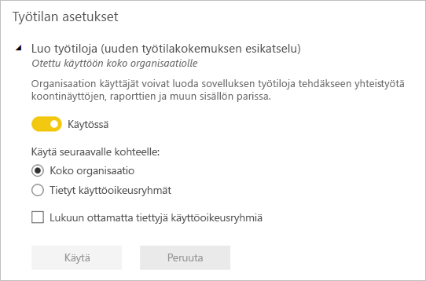
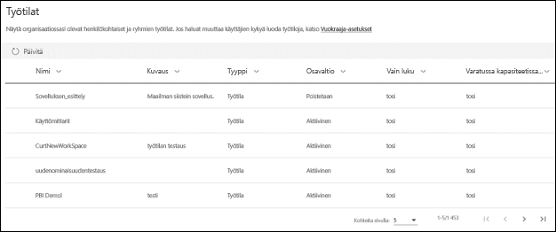

# Työn järjestäminen uusiin työtiloihin Power BI:ssä

 *Työtilat* ovat paikkoja, joissa voit yhdessä työtovereiden kanssa luoda koontinäyttöjen, raporttien ja sivutettujen raporttien kokoelmia. Uusi työtilakokemus auttaa sinua paremmin hallitsemaan sisältöä. Tässä artikkelissa kuvataan uusia työtiloja ja sitä, miten ne eroavat perinteisistä työtiloista.  Perinteisten työtilojen tavoin voit yhä käyttää niitä sovellusten luomiseen ja jakamiseen. Lue lisää siitä, miten voit [luoda uuden työtilakokemuksen](service-create-the-new-workspaces.md).

Uusi työtilakokemus on yleisesti käytettävissä (GA), ja se on nyt oletustyötila. Voit kuitenkin edelleen luoda ja käyttää Office 365 -ryhmiin perustuvia [perinteisiä työtiloja](service-create-workspaces.md). 

> [!NOTE]
> Jotta voit ottaa käyttöön rivitason suojauksen (RLS) käyttäjille, jotka selaavat sisältöä työtilassa, käytä Katselija-roolia. Jos haluat ottaa RLS:n käyttöön antamatta työtilan käyttöoikeutta, julkaise Power BI -sovellus kyseisille käyttäjille tai jakele sisältö jakamisen avulla.

Uusien työtilojen avulla voit:

- Työtilan roolien määrittäminen käyttäjäryhmille: käyttöoikeusryhmät, jakeluluettelot, Office 365 -ryhmiä ja henkilöt.
- Työtilan luominen Power BI:ssä luomatta Office 365 -ryhmää.
- Tarkempien työtilaroolien käyttäminen oikeuksien määrittämiseksi työtilassa entistä joustavammin.
- Power BI -järjestelmänvalvoja voi hallita sitä, kuka voi luoda työtiloja Power BI:ssä.

Kun luot jonkin uusista työtiloista, et luo taustalla toimivaa, työtilaan liitettyä Office 365 -ryhmää. Työtilaa hallitaan Power BI:ssä Office 365:n sijasta. Voit uudessa työtilakokemuksessa nyt lisätä Office 365 -ryhmän työtilan käyttöoikeusluetteloon, jotta voit jatkaa käyttäjien käyttöoikeuksien hallitsemista sisältöön Office 365 -ryhmien kautta.

## Uuden työtilakokemuksen työtilojen hallinta
Koska uuden työtilakokemuksen työtilojen hallinta tapahtuu nyt Power BI:ssä, Power BI:n järjestelmänvalvojat päättävät, kuka voi luoda työtiloja organisaatiossa. He voivat myös hallita ja palauttaa työtiloja käyttämällä joko Power BI:n hallintaportaalia tai PowerShellin CmdLet-komentoja. Office 365 -ryhmiin perustuvissa perinteisissä työtiloissa hallinta tapahtuu edelleen Office 365 -hallintaportaalissa ja Azure Active Directoryssä.

Järjestelmänvalvojat voivat hallintaportaalin **Työtilan asetukset** -kohdassa käyttää Luo työtilat (uusi työtilakokemus) -asetusta salliakseen organisaation kaikkien käyttäjien tai ei yhdenkään käyttäjän luoda uuden työtilakokemuksen työtiloja. He voivat myös rajoittaa luomisen tiettyjen käyttöoikeusryhmien jäsenille.

> [!NOTE]
> Luo työtiloja (uusi työtilakokemus) -oletusasetuksen mukaan uusia työtiloja saavat luoda Power BI:ssä vain ne käyttäjät, jotka voivat luoda Office 365 -ryhmiä. Muista määrittää arvo Power BI -hallintaportaalissa sen varmistamiseksi, että asianmukaiset käyttäjät voivat luoda uuden työtilakokemuksen työtiloja.

[Työtilojen luettelo on käytettävissä](service-admin-portal.md#workspaces) Power BI -hallintaportaalissa. 

## Uudet työtilat ovat käytettävissä rinnakkain perinteisten työtilojen kanssa

Uudet päivitetyt työtilat ja aiemmat perinteiset työtilat ovat käytettävissä rinnakkain, ja voit luoda niitä kumpiakin. Uusi työtilakokemus on työtilan oletustyyppi. Power BI luettelee jatkossakin kaikki Office 365 -ryhmät, joiden jäsen käyttäjä on Power BI:ssä, jotta aiempia työnkulkuja ei tarvitse muuttaa. Lue, miten voit luoda uuden työtilan, artikkelista [Uusien työtilojen luominen](service-create-the-new-workspaces.md). Lue, miten voit luoda perinteisen työtilan, artikkelista [Perinteisten työtilojen luominen](service-create-workspaces.md).

## Roolit uusissa työtiloissa

Voit myöntää käyttöoikeuden uuteen työtilaan lisäämällä käyttäjäryhmiä tai henkilöitä yhteen työtilarooliin: katselijat, jäsenet, osallistujat tai järjestelmänvalvojat. Kaikki käyttäjäryhmän jäsenet saavat määrittämäsi roolin. Jos henkilö on useissa käyttäjäryhmissä, hän saa hänelle myönnettyjen roolien antaman korkeimman käyttöoikeustason.

Roolien avulla voit hallita, kuka voi tehdä mitäkin työtilassa, joten ryhmät voivat tehdä yhteistyötä. Uusissa työtiloissa voit määrittää henkilöille ja käyttäjäryhmille rooleja. Voit käyttää käyttöoikeusryhmiä, Office 365 -ryhmiä ja jakeluluetteloita. 

Kun määrität rooleja käyttäjäryhmälle, ryhmän käyttäjät voivat käyttää sisältöä. Jos asetat sisäkkäin käyttäjäryhmiä, kaikilla ryhmien käyttäjillä on käyttöoikeus.

Tässä ovat ominaisuudet neljästä roolista: järjestelmänvalvojat, jäsenet, osallistujat ja katselijat. Kaikki nämä ominaisuudet viimeistä lukuun ottamatta edellyttävät Power BI Pro -käyttöoikeutta.

|Ominaisuus   | Järjestelmänvalvoja  | Jäsen  | Osallistuja  | Katselija |
|---|---|---|---|---|
| Päivittää työtilaa ja poistaa sen.  | X  |   |   |   | 
| Lisätä tai poistaa ihmisiä, myös muita järjestelmänvalvojia.  | X  |   |   |   |
| Lisätä jäseniä tai muita, joilla on vähäisemmät oikeudet.  |  X | X  |   |   |
| Julkaista ja päivittää sovelluksen. |  X | X  |   |   |
| Jakaa kohteen tai sovelluksen. |  X | X  |   |   |
| Sallia muille kohteiden jakaminen uudelleen. |  X | X  |   |   |
| Luoda, muokata ja poistaa työtilan sisältöä.  |  X | X  | X  |   |
| Julkaista raportteja työtilaan ja poistaa sisältöä.  |  X | X  | X  |   |
| Luo raportti toisessa työtilassa tämän työtilan tietojoukon perusteella. |  X | X  | X  |   |
| Kopioi raportti. | X | X | X |  |
| Tarkastele ja käytä kohdetta. |  X | X  | X  | X  |

> [!NOTE]
>Raportin kopioiminen ja raportin luominen toisessa työtilassa tämän työtilan tietojoukon perusteella edellyttää, että käyttäjät täyttävät seuraavat lisäehdot:
>- Power BI Pro -käyttöoikeus tarvitaan. 
>- Käyttäjillä on oltava tietojoukon muodostamisen käyttöoikeus. Tämän työtilan tietojoukoissa käyttäjillä, joilla on järjestelmänvalvojan, jäsenen tai osallistujaroolin, on muodostamisen käyttöoikeus työtilaroolin kautta.
 
## Käyttöoikeudet
Jokainen jäsen, jonka lisäät työtilaan jaetussa kapasiteetissa, tarvitsee Power BI Pro -käyttöoikeuden. Työtilassa nämä käyttäjät voivat tehdä yhteistyötä niiden koontinäyttöjen ja raporttien parissa, jotka aiot julkaista laajemmalle lukijakunnalle tai jopa koko organisaatiolle. 

Jos haluat jakaa sisältöä muille organisaatiosi sisällä, voit määrittää Power BI Pro -käyttöoikeudet kyseisille käyttäjille tai sijoittaa työtilan Power BI Premium -kapasiteettiin.

Kun työtila on Power BI Premium -kapasiteetissa, Katselija-roolin saaneet käyttäjät voivat käyttää työtilaa, vaikka heillä ei olisi Power BI Pro -käyttöoikeutta. Kuitenkin, jos määrität näille käyttäjille korkeamman roolin, kuten järjestelmänvalvoja, jäsen tai osallistuja, heitä kehotetaan aloittamaan Pro-kokeilu, kun he yrittävät käyttää työtilaa. Jotta voit myöntää Katselija-ominaisuuden käyttäjille ilman Pro-käyttöoikeuksia, varmista, että Katselija-roolissa olevat käyttäjät eivät ole muissa työtilarooleissa joko erikseen tai käyttäjäryhmän kautta. 

> [!NOTE]
> Nykyisiä käyttöoikeussääntöjä sovelletaan tiukemmin raporttien julkaisemiseen uuteen työtilakokemukseen. Käyttäjät, jotka yrittävät julkaista raportteja Power BI Desktopista tai muista asiakastyökaluista ilman Pro-käyttöoikeutta, näkevät virheen ”Vain käyttäjät, joilla on Power BI Pro -käyttöoikeudet, voivat julkaista tähän työtilaan”.

## Uusien työtilojen erot

Uusien työtilojen myötä osa ominaisuuksista on suunniteltu uudelleen. Seuraavassa on muutoksia, joiden voit odottaa säilyvän pysyvästi. 

* Näiden työtilojen luominen ei luo Office 365 -ryhmiä perinteisten työtilojen tavoin. Voit kuitenkin nyt käyttää Office 365 -ryhmää antamaan käyttäjille pääsyn työtilaasi myöntämälle tälle roolin. 
* Perinteisissä työtiloissa voit lisätä vain yksittäisiä henkilöitä jäsenten ja järjestelmänvalvojien luetteloihin. Uusissa työtiloissa voit lisätä useita AD-suojausryhmiä, jakeluluetteloita tai Office 365 -ryhmiä näihin luetteloihin, mikä helpottaa käyttäjien hallintaa. 
- Voit luoda organisaation sisältöpaketin perinteisestä työtilasta. Et voi luoda sisältöpakettia uusista työtiloista.
- Voit käyttää organisaation sisältöpakettia perinteisestä työtilasta. Et voi käyttää sitä jostakin uudesta työtilasta.

## Työtilan yhteystietoluettelo
Uuden **Yhteystietoluettelo**-ominaisuuden avulla voit määrittää käyttäjät, joille ilmoitetaan työtilassa esiintyneistä ongelmista. Oletusarvon mukaan ilmoitus annetaan kaikille käyttäjille tai ryhmille, jotka on määritetty työtilan järjestelmänvalvojiksi, mutta voit mukauttaa luetteloa. Yhteystietoluettelossa luetellut käyttäjät tai ryhmät näytetään käyttöliittymässä (UI), jotta käyttäjät saavat työtilaa koskevaa apua. 

Lue lisää [työtilan yhteystietoluettelon määrittämisestä](service-create-the-new-workspaces.md#workspace-contact-list).

## Työtilan OneDrive
Työtilan OneDrive -ominaisuuden avulla voit määrittää Office 365 -ryhmän, jonka SharePoint-tiedostokirjaston tiedostosäilö on työtilan käyttäjien käytettävissä. Ryhmä on luotava Power BI:n ulkopuolella. 

Power BI ei synkronoi niiden käyttäjien tai ryhmien käyttöoikeuksia, joille on määritetty työtilan käyttöoikeus Office 365 -ryhmän jäsenyyden yhteydessä. Paras käytäntö on hallita työtilan käyttöoikeutta saman Office 365 -ryhmän kautta, jonka tiedostosäilön määritit tässä asetuksessa. 

Lue lisää siitä, miten [voit määrittää työtilan OneDriven ja käyttää sitä](service-create-the-new-workspaces.md#workspace-onedrive).  
   
## Valvonta
Power BI valvoo seuraavia uuden työtilakokemuksen työtiloja.

| Kutsumanimi |   Toiminnon nimi |
|---|---|
| Luotu Power BI -kansio | CreateFolder |
| Poistettu Power BI -kansio | DeleteFolder |
| Päivitetty Power BI -kansio | UpdateFolder |
| Päivitetty Power BI -kansion käyttöoikeus| UpdateFolderAccess |

Lue lisää [Power BI:n valvonnasta](service-admin-auditing.md#activities-audited-by-power-bi).

## Rajoitukset ja huomioitavat asiat

Huomioitavia rajoituksia:

- Työtiloissa voi olla korkeintaan 1 000 tietojoukkoa tai 1 000 raporttia tietojoukkoa kohti. 
- Henkilö, jolla on Power BI Pro -käyttöoikeus, voi olla korkeintaan 1 000 työtilan jäsen.
- Power BI Publisher for Exceliä ei tueta.

## Eri tavalla toimivat työtilan ominaisuudet

Jotkin ominaisuudet toimivat uusissa työtiloissa eri tavalla kuin nykyisissä työtiloissa. Nämä erot ovat tarkoituksellisia. Ne perustuvat saatuun asiakaspalautteeseen ja mahdollistavat entistä joustavamman yhteistyötavan työtiloissa:

- Käyttöoikeuksien pakottaminen: Raporttien julkaiseminen uuteen työtilakokemukseen pakottaa nykyiset käyttöoikeussäännöt, jotka edellyttävät Power BI Pro -käyttöoikeutta käyttäjiltä, jotka tekevät yhteistyötä työtiloissa tai jakavat sisältöä muille Power BI -palvelussa. Käyttäjät, joilla ei ole Pro-käyttöoikeutta, näkevät virheen ”Vain käyttäjät, joilla on Power BI Pro -käyttöoikeudet, voivat julkaista tähän työtilaan”.
- Jäsenet voivat tai eivät voi jakaa uudelleen: korvataan osallistujan roolilla
- Vain luku -työtilat: Sen sijaan, että myöntäisit käyttäjille Vain luku -käyttöoikeuden työtilaan, myönnät käyttäjille Katselija-roolin, johon kuuluu samankaltainen Vain luku -käyttöoikeus työtilan sisältöön.
- Käyttäjät, joilla ei ole Pro-käyttöoikeutta, voivat käyttää työtilaa, jos työtila on Power BI Premium -kapasiteetissa, vaikka heillä olisi vain Katselija-rooli.
- Jotta käyttäjät, joilla on Katselija-rooli, voisivat viedä tietoja, varmista, että heillä on Koontiversio-oikeus työtilan tietojoukoille. Lue lisää [tietojoukkojen muodostamisoikeuksista](service-datasets-build-permissions.md#build-permissions-for-shared-datasets).
- Ei **Poistu työtilasta** -painiketta.

## Usein kysyttyjä kysymyksiä

**Vaikuttaako uuden työtilakokemuksen yleinen käytettävyys linkkeihin olemassa olevaan sisältöön?**

Ei. Uusi työtilakokemus ei vaikuta linkkeihin olemassa oleviin kohteisiin perinteisissä työtiloissa. Uuden työtilakokemuksen yleinen käytettävyys (GA) muuttaa luomaasi oletustyötilaa, mutta ei muuta olemassa olevia työtiloja. 

**Päivitetäänkö olemassa olevat työtilat uuteen työtilakokemukseen, johon liittyy yleinen käytettävyys (GA)?**

Ei. Uuden työtilakokemuksen yleinen käytettävyys (GA) muuttaa vain oletustyötilan tyypin uudeksi työtilakokemukseksi. Office 365 -ryhmiin perustuvia olemassa olevia perinteisiä työtiloja ei muuteta.

**Luodaanko työtiloja edelleen automaattisesti Office 365 -ryhmille?**

Kyllä. Koska tuemme kummankin tyyppistä työtilaa rinnakkain, luettelemme edelleen kaikki Office 365 -ryhmät, joihin käyttäjällä on käyttöoikeus työtilojen luettelossa.

## Seuraavat vaiheet
* [Luo uusia työtiloja Power BI:ssä](service-create-the-new-workspaces.md)
* [Luo perinteisiä työtiloja](service-create-workspaces.md)
* [Asenna ja käytä sovelluksia Power BI:ssä](service-create-distribute-apps.md)
* Onko sinulla kysyttävää? [Voit esittää kysymyksiä Power BI -yhteisössä](http://community.powerbi.com/)
