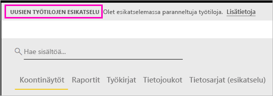

# Työn järjestäminen uusiin työtiloihin (esikatselu) – Power BI

Työtilat ovat paikkoja, joissa voit yhdessä työtovereiden kanssa luoda ja tarkentaa koontinäyttöjen ja raporttien kokoelmia. Sen jälkeen voit niputtaa ne yhteen *sovelluksiksi* ja jakaa ne koko organisaatiolle tai tietyille henkilöille tai ryhmille. Power BI:ssä esitellään uusi työtilakokemus esikatseluna. 

Uusien työtilojen esikatselun avulla voit nyt suorittaa seuraavia toimintoja:

- Työtilan roolien määrittäminen käyttäjäryhmille: käyttöoikeusryhmät, jakeluluettelot, Office 365 -ryhmiä ja henkilöt.
- Työtilan luominen Power BI:ssä luomatta Office 365 -ryhmää.
- Tarkempien työtilaroolien käyttäminen oikeuksien määrittämiseksi työtilassa entistä joustavammin.

Lue lisää siitä, miten voit [luoda jonkin uusista työtiloista](service-create-the-new-workspaces.md).
 
Kun luot jonkin uusista työtiloista, et luo taustalla toimivaa, työtilaan liitettyä Office 365 -ryhmää. Työtilaa hallitaan Power BI:ssä Office 365:n sijasta. Voit yhä lisätä Office 365 -ryhmän työtilaan ja jatkaa käyttöoikeuksien hallitsemista Office 365 -ryhmien kautta. Voit myös käyttää käyttöoikeusryhmiä ja jakeluluetteloita sekä lisätä henkilöitä suoraan Power BI:ssä ja hallita näin joustavasti työtilan käyttöoikeuksia. Koska työtilan hallinta tapahtuu nyt Power BI:ssä, Power BI:n järjestelmänvalvojat päättävät, kuka voi luoda työtiloja organisaatiossa. Järjestelmänvalvojat voivat hallintaportaalin **Työtilan asetukset** -kohdassa sallia sen, että kaikki organisaation työntekijät voivat luoda työtiloja tai että yksikään heistä ei voi luoda niitä. He voivat myös rajoittaa luomisen tiettyjen käyttöoikeusryhmien jäsenille.

Lue lisää [Power BI -hallintaportaalista](service-admin-portal.md).

## Uusien työtilojen julkaiseminen

Esikatselun ajanjaksolla uudet ja vanhat työtilat voivat olla olemassa rinnakkain, ja voit luoda kumman niistä tahansa. Kun uusien työtilojen esikatselu päättyy ja ne ovat yleisesti saatavilla, vanhat työtilat ovat olemassa yhä jonkin aikaa. Niitä ei voi enää luoda, ja sinun tulee valmistautua työtilojen siirtämiseen uuteen työtilainfrastruktuuriin. Älä kuitenkaan huolestu, sillä siirron tekemiseen on aikaa useita kuukausia.

## Roolit uusissa työtiloissa

Voit lisätä käyttäjäryhmiä tai henkilöitä uusiin työtiloihin jäseninä, osallistujina tai järjestelmänvalvojina. Kaikki käyttäjäryhmän jäsenet saavat määrittämäsi roolin. Jos käyttäjä on useissa käyttäjäryhmissä, hän saa roolin myöntämän korkeimman käyttöoikeustason.  Eri roolien tarkempi kuvaus on jäljempänä tässä artikkelissa kohdassa [Roolit uusissa työtiloissa](#roles-in-the-new-workspaces).

Jokainen työtilaan lisätty jäsen tarvitsee Power BI Pro -käyttöoikeuden. Työtilassa nämä käyttäjät voivat tehdä yhteistyötä niiden koontinäyttöjen ja raporttien parissa, jotka aiot julkaista laajemmalle lukijakunnalle tai jopa koko organisaatiolle. Jos haluat jakaa sisältöä muille organisaatiosi sisällä, voit määrittää Power BI Pro -käyttöoikeudet kyseisille käyttäjille tai sijoittaa työtilan Power BI Premium -kapasiteettiin.

Roolien avulla voit hallita, kuka voi tehdä mitäkin työtilassa, joten ryhmät voivat tehdä yhteistyötä. Uusissa työtiloissa voit määrittää henkilöille ja käyttäjäryhmille rooleja. Voit käyttää käyttöoikeusryhmiä, Office 365 -ryhmiä ja jakeluluetteloita. 

Kun määrität rooleja käyttäjäryhmälle, ryhmän käyttäjät voivat käyttää sisältöä. Jos asetat sisäkkäin käyttäjäryhmiä, kaikilla ryhmien käyttäjillä on käyttöoikeus. Käyttäjä, joka on useissa käyttäjäryhmissä, joille on määritetty eri rooleja, saa parhaan myönnetyn käyttöoikeuden. 

Uusissa työtiloissa on kolme roolia: järjestelmänvalvojat, jäsenet ja osallistujat.

**Järjestelmänvalvojat voivat:**

- Päivittää työtilaa ja poistaa sen. 
- Lisätä tai poistaa ihmisiä, myös muita järjestelmänvalvojia.
- Tehdä kaikkea, mitä jäsenet voivat tehdä.

**Jäsenet voivat:** 

- Lisätä jäseniä tai muita, joilla on vähäisemmät oikeudet.
- Julkaista ja päivittää sovelluksen.
- Jakaa kohteen tai sovelluksen.
- Sallia muille kohteiden jakaminen uudelleen.
- Tehdä kaikkea, mitä osallistujat voivat tehdä.

**Osallistujat voivat:** 

- Luoda, muokata ja poistaa työtilan sisältöä. 
- Julkaista raportteja työtilaan ja poistaa sisältöä.
- Eivät voi antaa uusien henkilöiden käyttää sisältöä. He eivät voi jakaa uutta sisältöä, mutta voivat jakaa sisältöä henkilöille, joille työtila, kohde tai sovellus on jo jaettu. 
- Ryhmän jäseniä ei voi muokata.
 
Luomme Pyydä käyttöoikeutta -työnkulkuja palvelun kautta, jotta käyttäjät, joilla ei ole käyttöoikeutta, voivat pyytää sitä. Pyydä käyttöoikeutta -työnkulut ovat tällä hetkellä käytettävissä raporttinäkymille, raporteille ja sovelluksille.

## Vanhojen työtilojen muuntaminen uusiksi työtiloiksi

Esikatselun ajanjaksolla et voi muuntaa automaattisesti vanhoja työtiloja uusiksi työtiloiksi. Voit kuitenkin luoda uuden työtilan ja julkaista sisältöä uudessa sijainnissa. 

Kun uudet työtilat ovat yleisesti käytettävissä (GA), voit siirtää vanhat työtilat automaattisesti. Jonkin aikaa GA:n jälkeen ne on siirrettävä.

## Power BI -sovellusten usein kysytyt kysymykset

### Miten uudet työtilat eroavat nykyisistä työtiloista?

Uusien työtilojen myötä suunnittelemme joitakin ominaisuuksia uudelleen. Seuraavassa on muutoksia, joiden voit odottaa säilyvän pysyvästi esikatselun myötä. 

* Työtilojen luominen ei luo vastaavia entiteettejä Office 365:ssä, kuten nykyiset työtilat tekevät. (Voit silti lisätä Office 365 -ryhmän työtilaasi määrittämällä sille roolin.) 
* Nykyisissä työtiloissa voit lisätä vain yksittäisiä henkilöitä jäsenten ja järjestelmänvalvojien luetteloihin. Uusissa työtiloissa voit lisätä useita AD-suojausryhmiä, jakeluluetteloita tai Office 365 -ryhmiä näihin luetteloihin, mikä helpottaa käyttäjien hallintaa. 
- Voit luoda organisaation sisältöpaketin nykyisestä työtilasta. Et voi luoda sisältöpakettia uusista työtiloista.
- Voit käyttää organisaation sisältöpakettia nykyisestä työtilasta. Et voi käyttää sitä jostakin uudesta työtilasta.
- Esikatselun ajanjaksolla jotkin ominaisuudet eivät ole vielä käytössä uusille työtiloille. Katso lisätietoja seuraavasta osiosta [Suunniteltuja uuden työtilan ominaisuuksia](service-new-workspaces.md#planned-new-workspace-preview-features).

## Suunniteltuja uuden työtilan esikatseluominaisuuksia

Kehitämme esikatselun käyttöönoton yhteydessä edelleen joitakin muita uusien työtilojen esikatseluominaisuuksia, mutta ne eivät ole vielä saatavilla:

- Ei **Poistu työtilasta** -painiketta.
- Käyttötietoja ei vielä tueta.
- Premium-version toiminta: Voit määrittää ja luoda työtiloja Premium-kapasiteetissa, mutta jos haluat siirtää työtilan kapasiteetista toiseen, siirry työtilan asetuksiin.
- SharePointin verkko-osan upottamista ei vielä tueta.
- Ei **OneDrive**-painiketta Office 365 -ryhmille Nouda tiedot- tai Hae tiedostot -ominaisuudessa.

## Eri tavalla toimivat työtilan ominaisuudet

Jotkin ominaisuudet toimivat uusissa työtiloissa eri tavalla kuin nykyisissä työtiloissa. Nämä erot on tarkoituksellista. Ne perustuvat saatuun asiakaspalautteeseen, ja ne mahdollistavat entistä joustavamman yhteistyötavan työtiloissa:

- Jäsenet voivat tai eivät voi jakaa uudelleen: korvataan osallistujan roolilla
- Vain luku -työtilat: Sen sijaan, että myöntäisit käyttäjille Vain luku -käyttöoikeuden työtilaan, määrität käyttäjille tulevan katselijan roolin, johon kuuluu samankaltainen Vain luku -käyttöoikeus työtilan sisältöön.

## Tunnetut ongelmat

Koska tämä on esikatseluominaisuus, siihen liittyy joitakin rajoituksia, jotka sinun on tiedettävä. Seuraavat ongelmat ovat tiedossa ja niiden korjauksia kehitetään:

- Maksuttomat käyttäjät tai käyttäjäryhmät, jotka on lisätty sähköpostitilausten vastaanottajiksi, eivät saa sähköpostiviestejä, vaikka heidän pitäisi saada viestit. Ongelma ilmenee silloin, kun yksi uusista työtiloista on Premium-kapasiteetissa, mutta tilauksen luovan käyttäjän oma työtila ei ole Premium-kapasiteetissa. Jos oma työtila on Premium-kapasiteetissa, maksuttomat käyttäjät ja käyttäjäryhmät saavat sähköpostiviestit.
- Kun työtila on siirretty Premium-kapasiteetista jaettuun kapasiteettiin, maksuttomat käyttäjät ja käyttäjäryhmät saavat joissakin tapauksissa sähköpostiviestejä edelleen, vaikka heidän ei pitäisi saada niitä. Ongelma ilmenee, kun tilauksen luoneen käyttäjän oma työtila on Premium-kapasiteetissa.

## Seuraavat vaiheet
* [Uusien työtilojen (esikatselu) luominen Power BI:ssä](service-create-the-new-workspaces.md)
* [Nykyisten työtilojen luominen](service-create-workspaces.md)
* [Asenna ja käytä sovelluksia Power BI:ssä](service-create-distribute-apps.md)
* Onko sinulla kysyttävää? [Voit esittää kysymyksiä Power BI -yhteisössä](http://community.powerbi.com/)
