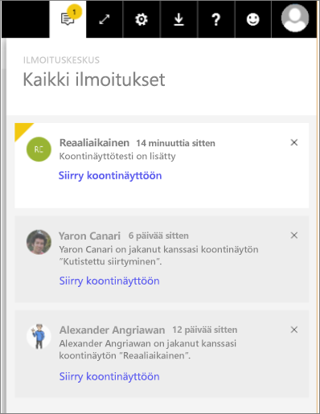

# Power BI -ilmoitukset
Ilmoituskeskus tarjoaa säännöllistä tietoa Power BI:n käyttöön liittyvistä asioista. Avaamalla sen voit lukea viestit, jotka koskevat uusia, kanssasi jaettuja koontinäyttöjä, muutoksia Ryhmätilassa sekä tarjoavat tietoa Power BI -tapahtumista ja -tapaamisista, asettamistasi ilmoituksista ja paljon muusta. Voit [asettaa ilmoituksia Power BI-palvelussa](service-set-data-alerts.md) ja Power BI -mobiilisovelluksissa.

Katsele, kun Amanda tarkastelee saamiaan ilmoituksia, hallinnoi ilmoituksia ja reagoi niihin. Kokeile sitten samaa itse seuraamalla videon alapuolella olevia ohjeita.

<iframe width="560" height="315" src="https://www.youtube.com/embed/bZMSv5KAlcE" frameborder="0" allowfullscreen></iframe>

1. Kun kirjaudut Power BI:hin, syötteessäsi lisätään ilmoitukset, jotka on lähetetty ollessasi offline-tilassa. Jos sinulle on tullut uusia ilmoituksia, Power BI:ssa näkyy keltainen kupla, jossa on uusien kohteiden lukumäärä.
   
   
2. Valitse Ilmoitukset-kuvake Power BI -valikkopalkissa.
   
   
3. Ilmoitukset näkyvät uusin ylimpänä ja lukemattomat viestit korostettuina. Ilmoituksia säilytetään 90 päivää, ellei 100 kappaleen enimmäisrajaa saavuteta tai jos et poista niitä jo aiemmin.
   
   
4. Ohita ilmoitus valitsemalla X-kuvake.

### Seuraavat vaiheet
* [Power BI -palvelun tietoilmoitukset](service-set-data-alerts.md)
* [Power BI -tietoilmoitusten käynnistämän Microsoft Flow’n luominen](service-flow-integration.md)
* [Tietohälytysten määrittäminen iPhone-sovelluksessa (Power BI iOS:lle)](mobile-set-data-alerts-in-the-mobile-apps.md)
* [Tietoilmoitusten määrittäminen Power BI -mobiilisovellukseen Windows 10:ssä](mobile-set-data-alerts-in-the-mobile-apps.md)
* Ilmenikö muuta kysyttävää? [Kokeile Power BI -yhteisöä](http://community.powerbi.com/)

