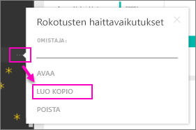

# Organisaation sisältöpaketit: kopioiminen, päivittäminen ja käyttöoikeuksien hankkiminen
> [!NOTE]
> Oletko jo kuullut uusista *sovelluksista*? Sovellukset on uusi tapa jakaa sisältöä suurille kohderyhmille Power BI:ssä. Ajan mittaan aiomme lakkauttaa organisaation sisältöpaketit, joten suosittelemme niiden sijaan sovellusten käyttöä. Lue [lisätietoja sovelluksista](service-install-use-apps.md).
> 
> 

Kun organisaation sisältöpaketti julkaistaan, kaikki vastaanottajat näkevät saman sisällön (koontinäytön, raportit, Excel-työkirjat, tietojoukot ja tiedot, ellei kyseessä ole SQL Server Analysis Services (SSAS) -tietolähde).  [Vain sisältöpaketin tekijä voi muokata sisältöpakettia ja julkaista sen uudelleen](service-organizational-content-pack-manage-update-delete.md).  Kaikki vastaanottajat voivat kuitenkin tallentaa kopion sisältöpaketista, joka toimii alkuperäisen kappaleen rinnalla.

Sisältöpakettien luominen eroaa koontinäyttöjen jakamisesta tai niiden työstämisestä ryhmässä. Valitse itsellesi sopivin vaihtoehto lukemalla artikkeli [Miten voin työstää koontinäyttöjä ja raportteja yhdessä muiden kanssa sekä jakaa niitä?](service-how-to-collaborate-distribute-dashboards-reports.md).

## Kopion luominen organisaation sisältöpaketista
Luo sisältöpaketista oma kopiosi, joka ei näy muille.

1. Valitse kolme pistettä (...) sisältöpaketin koontinäytön vieressä ja valitse Tee kopio.
   
    
2. Valitse **Tallenna**.  

Nyt sinulla on kopio, jota voit muokata. Kukaan muu ei näe tekemiäsi muutoksia.

## Apua!  Sisältöpaketti ei ole enää käytettävissä
Tämä voi johtua useista syistä:

* **Jäsenyys muuttuu**: Sisältöpaketit julkaistaan sähköpostin jakeluryhmille, käyttöoikeusryhmille ja [Office 365:en perustuville Power BI -ryhmille](https://support.office.com/article/Create-a-group-in-Office-365-7124dc4c-1de9-40d4-b096-e8add19209e9).  Jos sinut poistetaan ryhmästä, et enää pääse käyttämään sisältöpakettia.
* **Jakelun muutokset**: Sisältöpaketin tekijä muuttaa jakelua. Esimerkiksi jos sisältöpaketti on alun perin julkaistu koko organisaatiolle, mutta tekijä julkaisee sen uudelleen pienemmälle yleisölle, et välttämättä enää sisälly paketin kohdeyleisöön.
* **Suojausasetukset muuttuvat**: Jos koontinäyttö ja raportit on yhdistetty paikallisiin SSAS-tietolähteisiin ja suojausasetuksia muutetaan, käyttöoikeutesi kyseiseen palvelimeen on ehkä kumottu.

## Miten organisaation sisältöpaketit päivitetään?
Kun sisältöpaketti luodaan, päivitysasetukset periytyvät tietojoukon kanssa.  Kun luot sisältöpaketista kopion, uusi versio säilyttää yhteyden alkuperäiseen tietojoukkoon ja sen päivitysaikatauluun. 

Katso [Organisaation sisältöpakettien hallinta, päivitys ja poistaminen](service-organizational-content-pack-manage-update-delete.md).

## Seuraavat vaiheet
* [Johdanto organisaation sisältöpaketteihin](service-organizational-content-pack-introduction.md)
* [Ryhmän luominen Power BI:ssä](service-create-distribute-apps.md)
* Onko sinulla muuta kysyttävää? [Kokeile Power BI -yhteisöä](http://community.powerbi.com/)

