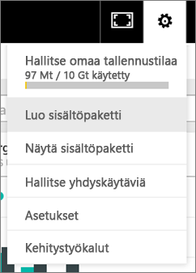
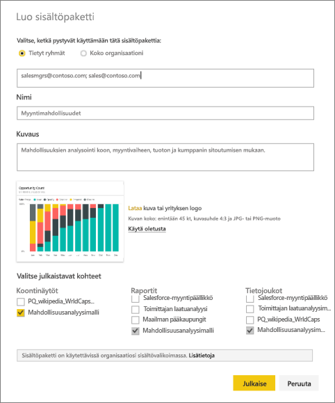
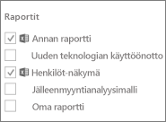
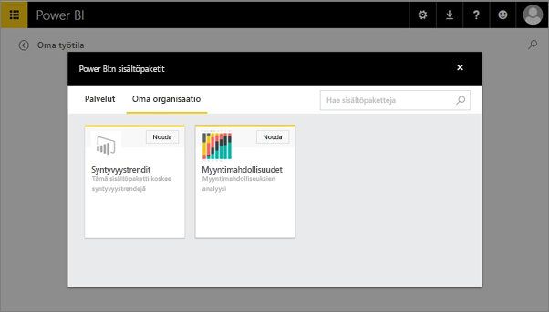

# Organisaation sisältöpaketin luominen ja julkaiseminen Power BI:ssa (opetusohjelma)

Tässä opetusohjelmassa luodaan organisaation sisältöpaketti, annetaan käyttö tiettyyn ryhmään ja julkaistaan se organisaatiosi sisältöpakettikirjastossa Power BI:ssa.

Sisältöpakettien luominen eroaa koontinäyttöjen jakamisesta tai niiden työstämisestä ryhmässä. Valitse itsellesi sopivin vaihtoehto lukemalla artikkeli [Miten voin työstää koontinäyttöjä ja raportteja yhdessä muiden kanssa sekä jakaa niitä?](service-how-to-collaborate-distribute-dashboards-reports.md).

Organisaation sisältöpaketin luominen edellyttää [Power BI Pro -tiliä](https://powerbi.microsoft.com/pricing) sinulle ja työtovereillesi. 

> [!NOTE]
> Et voi luoda tai asentaa organisaation sisältöpaketteja uuden työtilakokemuksen esiversiossa. Nyt on hyvä aika päivittää sisältöpaketit sovelluksiin, jos et ole vielä aloittanut päivittämistä. Lue [lisätietoja uudesta työtilakokemuksesta](service-create-the-new-workspaces.md).
> 

Kuvittele olevasi Release Manager Contosossa ja valmistaudut uuden tuotteen julkaisun varten.  Olet luonut raporttinäkymän ja raportteja, jotka haluat jakaa muiden julkaisua käsittelevän työntekijöiden kanssa. Haluat saada tavan pakata raporttinäkymän ja raportit ratkaisuna työtovereidesi käyttöön. 

Haluatko seurata mukana? Siirry [Power BI -palvelussa](https://powerbi.com) kohtaan **Nouda tiedot > Näytteet > Mahdollisuusanalyysimalli** > **Yhteydet** oman kopion saamiseksi. 

1. Valitse vasemmassa siirtymisruudussa **Mahdollisuusanalyysimalli**-raporttinäkymä.
2. Valitse ylälaidan siirtymispalkissa hammasrataskuvake   >  **Luo sisältöpaketti**.    
   
3. Anna **Luo sisältöpaketti** -ikkunassa seuraavat tiedot.  
   
   Pidä mielessä, että organisaatiosi sisältöpakettikirjastoon voi päättyä satoja sisältöpaketteja, jotka on julkaistu organisaatiolle tai ryhmille. Paneudu hetkeksi sisältöpaketin nimeämiseen, jotta se on kuvaava ja ottaa kohderyhmän huomioon.  Käytä sanoja, jotka helpottavat sisältöpaketin löytämistä haun avulla.
   
   1. Valitse **Tietyt ryhmät** ja anna täydelliset sähköpostiosoitteet henkilöille, [Office 365 -ryhmille](https://support.office.com/article/Create-a-group-in-Office-365-7124dc4c-1de9-40d4-b096-e8add19209e9), jakeluryhmille ja käyttöoikeusryhmille. Esimerkki:
      
        salesmgrs@contoso.com; sales@contoso.com
      
      Tässä opetusohjelmassa voit kokeilla oman tai ryhmän sähköpostiosoitteen käyttämistä.
   
   2. Nimeä sisältöpaketti **Myyntimahdollisuudet**.
   
      > [!TIP]
      > Harkitse, voiko sisältöpakein nimeen liittää raporttinäkymän nimen. Tällä tavoin työtoverisi löytää raporttinäkymän helpommin sen jälkeen, kun on muodostanut yhteyden sisältöpakettiisi.
      > 
      > 
   
   3. Suositus: Lisää **kuvaus**. Tämän avulla työtoverin on helppo löytää sisältöpaketteja, joita he tarvitsevat. Kuvauksen lisäksi lisää avainsanoja, joilla työtoverisi saattavat hakea tätä sisältöpakettia. Sisällytä myös yhteystiedot siltä varalta, että työtoverillasi on kysyttävää tai hän tarvitsee apua.
   
   4. **Lataa kuvan tai logo**, jotta ryhmän jäsenien on helpompi löytää sisältöpaketti &#151, sillä kuvan hakeminen on nopeampaa kuin tekstin. Olemme käyttäneet Mahdollisuuksien lukumäärä 100 % -pylväskaaviota alla näkyvän näyttökuvan mukaisesti.
   
   5. Valitse **Mahdollisuusanalyysimalli** -raporttinäkymä lisätäksesi sen sisältöpakettiin.  Power BI lisää automaattisesti liittyvän raportin ja tietojoukon. Voit lisätä myös muita, jos haluat.
   
      > [!NOTE]
      >  Luettelossa on vain raporttinäkymiä, raportteja, tietojoukkoja ja työkirjoja, joita voit muokata. Näin ollen mitään kanssasi jaettuja ei ole luettelossa.
      > 
      > 
   
       
   
   6. Jos sinulla on Excel-työkirjoja, näet ne kohdassa Raportit Excel-kuvakkeella varustettuina. Voit lisätä ne myös sisältöpakettiin.
   
      
   
      > [!NOTE]
      > Jos ryhmän jäsenet eivät voi tarkastella Excel-työkirjaa, voit joutua [jakamaan työkirjan heidän kanssaan OneDrive for Business -palvelussa](https://support.office.com/article/Share-documents-or-folders-in-Office-365-1fe37332-0f9a-4719-970e-d2578da4941c).
      > 
      > 
4. Valitse **Julkaise** lisätäksesi sisältöpaketin ryhmän Organisaation sisältöpaketit -kirjastoon.  
   
   Kun julkaisu onnistuu, esiin tulee onnistumisesta ilmoittava viesti. 
5. Kun ryhmän jäsenet siirtyvät kohtaan **Nouda tiedot > Oma organisaatio**, he napauttavat haku-ruutua ja kirjoittavat ”myyntimahdollisuudet”.
   
    
6. He näkevät sinun sisältöpakettisi.  
    
   
   > [!TIP]
   > Selaimessa näkyvä URL-osoite on tämän sisältöpaketin yksilöllinen osoite.  Haluatko kertoa työtovereillesi tästä uudesta sisältöpaketista?  Liitä URL-osoite sähköpostiviestiin.
   > 
   > 
7. He valitsevat **Yhdistä** ja voivat nyt [tarkastella ja käsitellä sisältöpakettiasi](service-organizational-content-pack-copy-refresh-access.md). 

### Seuraavat vaiheet
* [Organisaation sisältöpakettien esittely](service-organizational-content-pack-introduction.md)  
* [Organisaation sisältöpakettien hallinta, päivitys ja poistaminen](service-organizational-content-pack-manage-update-delete.md)  
* [Ryhmän luominen Power BI:ssä](service-create-distribute-apps.md)  
* [Mikä on OneDrive for Business?](https://support.office.com/article/What-is-OneDrive-for-Business-187f90af-056f-47c0-9656-cc0ddca7fdc2)
* Onko sinulla muuta kysyttävää? [Kokeile Power BI -yhteisöä](http://community.powerbi.com/)

