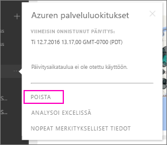

# Organisaation sisältöpaketin yhteyden poistaminen Power BI:lle
Työtoveri loi sisältöpaketin. Löysit sen AppSourcesta ja lisäsit sen Power BI -työtilaasi. Nyt et tarvitse sitä enää.  Miten voit poistaa sen?

Poista sisältöpaketin poistamalla sen tietojoukko.  

* Valitse vasemmassa siirtymisruudussa oikealla olevat kolme pistettä ja valitse **Poista \> Kyllä**.  
  
  

Tietojoukon poistaminen poistaa myös kaikki siihen liittyvät raportit ja koontinäkymät. Yhteyden poistaminen sisältöpakettiin ei poista sisältöpakettia organisaatiosi AppSource.  Voit aina palata AppSourceen ja lisätä sisältöpaketin takaisin työtilaasi. Voit [poistaa sisältöpaketin AppSourcesta](service-organizational-content-pack-manage-update-delete.md) vain, jos se olet itse luonut sen.

## Seuraavat vaiheet
* [Johdanto organisaation sisältöpaketteihin](service-organizational-content-pack-introduction.md) 
* [Sovelluksen luominen ja jakaminen Power BI:ssä](service-create-distribute-apps.md) 
* [Power BI:n peruskäsitteet](service-basic-concepts.md)  
* Onko sinulla muuta kysyttävää? [Kokeile Power BI -yhteisöä](http://community.powerbi.com/)

