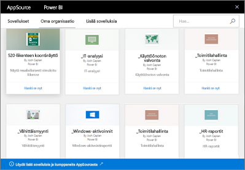

# Power BI:n organisaation sisältöpakettien esittely
> [!NOTE]
> Et voi luoda organisaation sisältöpaketteja tai asentaa niitä uudessa työtilakokemuksessa. Nyt on hyvä aika päivittää sisältöpaketit sovelluksiin, jos et ole vielä aloittanut päivittämistä. Lue [lisätietoja uudesta työtilakokemuksesta](service-create-the-new-workspaces.md).
> 

Jaatko säännöllisesti raportteja sähköpostitse työryhmällesi? Kokeile seuraavaa: Pakkaa raporttinäkymät, raportit, Excel-työkirjat ja tietojoukot ja julkaise ne työryhmällesi *organisaation sisältöpakettina*. Työryhmäsi löytää sisältöpakettisi helposti – ne ovat kaikki saatavilla AppSourcessa. Koska ne ovat osa Power BI:tä, ne hyödyntävät kaikkia Power BI -ominaisuuksia, mukaan lukien vuorovaikutteinen tietojen tarkasteleminen, uudet visualisoinnit, Q&A, integrointi muihin tietolähteisiin ja tietojen päivittäminen.

Sisältöpakettien luominen eroaa koontinäyttöjen jakamisesta tai niiden työstämisestä työtilassa. Valitse itsellesi sopivin vaihtoehto lukemalla artikkeli [Miten voin työstää koontinäyttöjä ja raportteja yhdessä muiden kanssa sekä jakaa niitä?](service-how-to-collaborate-distribute-dashboards-reports.md). 

AppSourcessa voit selata tai hakea sisältöpaketteja, jotka on julkaistu koko organisaatiolle, jakelu- tai käyttöoikeusryhmille tai [Office 365 -ryhmille, joihin kuulut](https://support.office.com/article/Create-a-group-in-Office-365-7124dc4c-1de9-40d4-b096-e8add19209e9). Jos et ole tietyn ryhmän jäsen, et näe kyseisen ryhmän kanssa jaettuja sisältöpaketteja. Kaikilla ryhmän jäsenillä on samat vain luku -käyttöoikeudet sisältöpaketin tietoihin, raportteihin, työkirjoihin ja koontinäyttöihin (ellei se ole SQL Server Analysis Services (SSAS) -tietolähde, jolloin oikeudet periytyvät tietolähteen kanssa).

Koontinäytöt, raportit ja Excel-työkirjat ovat vain luku -tilassa, mutta voit kopioida ja käyttää koontinäyttöjä ja raportteja aloituskohtana ja luoda niistä oma mukautettu sisältöpaketti.

> [!NOTE]
> Organisaation sisältöpaketit ovat käytettävissä vain, jos sinulla ja työtovereillasi on käytössä [Power BI Pro -käyttöoikeus](service-features-license-type.md).
> 
> 

## Mikä *AppSource* on?
Organisaation sisältöpaketin julkaiseminen lisää sen AppSourceen.  Tämän keskitetyn tietovaraston jäsenet voivat selata ja löytää heille julkaistuja koontinäyttöjä, raportteja ja tietojoukkoja.  

* Voit avata AppSourcen valitsemalla **Nouda tiedot** > **Oma organisaatio** > **Nouda**.

## Organisaation sisältöpaketin elinkaari
Kaikki Power BI Pro -käyttäjät voivat luoda, julkaista ja käyttää organisaation sisältöpaketteja. Vain sisältöpaketin luoja voi muokata työkirjaa ja tietojoukkoa, ajoittaa päivityksiä ja poistaa sen.

Elinkaari näyttää suunnilleen tältä:

1. Käyttäjä luo Power BI Prossa sisältöpaketin ja julkaisee sen markkinoinnin jakeluryhmälle. Päivitysasetukset periytyvät tietojoukon kanssa, ja vain käyttäjä (sisältöpaketin luoja) voi muuttaa niitä.
   
   > [!NOTE]
   > Jos Nate luo sisältöpaketin [Power BI -työtilassa](service-create-distribute-apps.md), työtilan muut jäsenet voivat saada omistajuuden, jos hän poistuu työtilasta.
   > 
   > 
2. Käyttäjä lähettää jakeluryhmälle sähköpostiviestin, jossa hän kertoo uudesta sisältöpaketista.
3. Jakeluryhmän jäsen Jane voi Power BI Prossa etsiä sisältöpaketin AppSourcessa ja muodostaa siihen yhteyden. Jane saa sisältöpaketista vain luku -kopion. Jane tietää, että se on vain luku -muodossa, koska siirtymisruudussa näkyy jakamiskuvake koontinäytön nimen ja raportin nimen vasemmalla puolella. Kun Jane valitsee koontinäytön, lukkokuvake kertoo, että kyseessä on sisältöpaketin koontinäyttö. 
4. Oletetaan, että Jane päättää mukauttaa sitä. Hänellä on nyt oma kopio koontinäytöstä ja raporteista. Janen tekemät muutokset eivät vaikuta lähteeseen, eli alkuperäiseen sisältöpakettiin, eikä jakeluryhmän muiden jäsenten työhön. Kaikki jäsenet voivat työstää omia kopioitaan koontinäytöstä ja raporteista.
5. Nate päivittää koontinäyttöä ja julkaisee sisältöpaketista uuden version.
   
   * Toinen jakeluryhmän jäsen ei ole mukauttanut alkuperäistä sisältöpakettia. Uudet muutokset otetaan automaattisesti käyttöön Julio sisältöpakettiversiossa.  
   * Tässä esimerkissä yksi poistetuista jäsenistä on kuitenkin muokannut sisältöpakettia. Jane saa ilmoituksen uudesta versiosta.  Hän voi siirtyä AppSourceen ja hakea päivitetyn sisältöpaketin menettämättä omaa mukautettua versiotaan. Janella on nyt kaksi versiota: mukautettu versio ja päivitetty sisältöpaketti.
6. Sisältöpaketin luoja voi muuttaa sen suojausasetuksia. Tällöin jäsenet eivät enää pääse käyttämään sisältöä. Jäseniä voi myös poistaa jakeluryhmästä.
   
   * Sisältö poistetaan automaattisesti ryhmästä poistetuilta jäseniltä, elleivät he ole muokanneet alkuperäistä sisältöpakettia. 
   * Tässä esimerkissä yksi poistetuista jäsenistä on kuitenkin muokannut sisältöpakettia. Seuraavan kerran kun Jane avaa koontinäytön, kaikki alkuperäisen sisältöpaketin ruudut on poistettu, mutta muista raporteista kiinnitetyt ruudut näkyvät edelleen (riippuen toki käyttöoikeuksista). Liittyvät raportit ja tietojoukot eivät ole enää käytettävissä (eivätkä näy siirtymisruudussa).
7. Vaihtoehtoisesti luoja voi poistaa sisältöpaketin.
   
   * Sisältö poistetaan automaattisesti ryhmästä poistetuilta jäseniltä, elleivät he ole muokanneet alkuperäistä sisältöpakettia. 
   * Tässä esimerkissä yksi poistetuista jäsenistä on kuitenkin muokannut sisältöpakettia. Seuraavan kerran kun Jane avaa koontinäytön, kaikki alkuperäisen sisältöpaketin ruudut on poistettu, mutta muista raporteista kiinnitetyt ruudut näkyvät edelleen. Liittyvät raportit ja tietojoukot eivät ole enää käytettävissä (eivätkä näy siirtymisruudussa).

## Tietosuoja
Kaikilla jakeluryhmän jäsenillä on samat tietojen käyttöoikeudet kuin sisältöpaketin luojalla. Ainoa poikkeus tähän on paikalliset taulukkomuotoiset SQL Server Analysis Services (SSAS) -tietojoukot. Koska raportit ja koontinäytöt muodostavat reaaliajassa yhteyden paikalliseen SSAS-malliin, tietojen käyttöoikeudet määrittyvät kunkin jakeluryhmän jäsenen tunnistetietojen perusteella.

## Seuraavat vaiheet
* [Organisaation sisältöpaketin luominen ja julkaiseminen](service-organizational-content-pack-create-and-publish.md)
* [Sovelluksen luominen ja jakaminen Power BI:ssä](service-create-distribute-apps.md) 
* [Power BI -palvelun peruskäsitteitä suunnittelijoille](service-basic-concepts.md)
* Onko sinulla kysyttävää? [Kokeile Power BI -yhteisöä](https://community.powerbi.com/)

