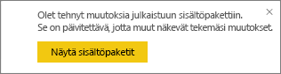
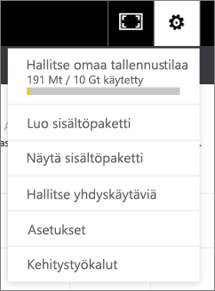

# Organisaation sisältöpakettien hallinta, päivitys ja poistaminen
> [!NOTE]
> Et voi luoda organisaation sisältöpaketteja tai asentaa niitä uudessa työtilakokemuksessa. Nyt on hyvä aika päivittää sisältöpaketit sovelluksiin, jos et ole vielä aloittanut päivittämistä. Lue [lisätietoja uudesta työtilakokemuksesta](service-create-the-new-workspaces.md).
> 

Voit pakata ja jakaa koontinäyttöjä, raportteja, Excel-työkirjoja ja tietojoukkoja työtovereillesi [organisaation sisältöpaketteina](service-organizational-content-pack-introduction.md). Työtoverisi voivat käyttää niitä sellaisinaan tai luoda niistä itselleen kopion.

Sisältöpakettien luominen eroaa koontinäyttöjen jakamisesta tai niiden työstämisestä ryhmässä. Päätä tilanteeseesi parhaiten sopiva vaihtoehto lukemalla artikkeli [Miten voin työstää koontinäyttöjä ja raportteja yhdessä muiden kanssa sekä jakaa niitä?](service-how-to-collaborate-distribute-dashboards-reports.md).

Jos olet sisältöpaketin luoja, voit tehdä vain joitakin organisaation sisältöpakettia koskevia toimintoja:

* Julkaise uudelleen.
* Rajoita tai laajenna sisältöpaketin käyttöoikeuksia.
* Määritä ajoitettu päivitys ja muokkaa sitä.
* Poista sisältöpaketti.

## Organisaation sisältöpaketin muokkaaminen ja julkaiseminen uudelleen
Jos teet muutoksia sisältöpaketin alkuperäiseen koontinäyttöön, raporttiin tai Excel-työkirjaan, Power BI kysyy, haluatko julkaista sisältöpaketin uudelleen. Lisäksi voit sisältöpaketin luojana muuttaa asetuksia, jotka määritit Luo sisältöpaketti ‑ikkunassa alkuperäisen sisältöpaketin luomisen yhteydessä. 

## Julkaiseminen uudelleen uudella sisällöllä
Kun teet muutoksia koontinäyttöön, jonka olet sisällyttänyt sisältöpakettiin, ja tallennat muutokset, Power BI muistuttaa sinua paketin päivittämisestä, jotta muutkin näkevät tekemäsi muutokset. Tämä koskee esimerkiksi uuden ruudun kiinnittämistä tai pelkkää koontinäytön nimen muuttamista.

1. Valitse viestistä **Näytä sisältöpaketit**.
   
   
2. Vaihtoehtoisesti voit valita oikeasta yläkulmasta hammasrataskuvakkeen  ja valita **Näytä sisältöpaketti**.
   
   
   
   Huomaa varoituskuvake .  Se ilmaisee, että olet muokannut sisältöpakettia jollakin tavalla, eikä se enää vastaa julkaisemaasi pakettia.
3. Valitse **Muokkaa**.  
4. Tee tarvittavat muutokset, **Päivitä sisältöpaketti** ‑ikkunassa ja valitse **Päivitä**. Näytölle avautuu **onnistumisilmoitus**.
   
   * Jos ryhmän jäsen ei ole mukauttanut sisältöpakettiaan, päivitys tulee hänelle voimaan automaattisesti.
   * Jos ryhmän jäsen on mukauttanut sisältöpakettiaan, hän saa ilmoituksen, että saatavilla on uusi versio.  Sitten hän voi siirtyä AppSourceen ja noutaa päivitetyn sisältöpaketin menettämättä mukauttamaansa versiota.  Hänellä on nyt kaksi versiota: mukautettu versio ja päivitetty sisältöpaketti.  Mukautetusta versiosta ovat hävinneet kaikki alkuperäisen sisältöpaketin ruudut.  Muista raporteista kiinnitetyt ruudut näytetään kuitenkin edelleen. Jos sisältöpaketin omistaja poistaa tietojoukon, johon sisältöpaketti perustuu, koko raportti poistetaan.  

## Yleisön muokkaaminen: käyttöoikeuksien laajentaminen tai rajoittaminen
Toinen sisältöpaketin luojien käytettävissä oleva muokkaustoiminto on sisältöpaketin käyttöoikeuksien laajentaminen ja rajoittaminen.  Olet ehkä julkaissut sisältöpaketin laajalle yleisölle, mutta haluatkin nyt rajoittaa sen käyttöoikeudet pienemmälle ryhmälle.  

1. Valitse hammasrataskuvake  ja valitse **Näytä sisältöpaketit**.
2. Valitse **Muokkaa**. 
3. Tee tarvittavat muutokset, **Päivitä sisältöpaketti** ‑ikkunassa ja valitse **Päivitä**. Voit esimerkiksi poistaa alkuperäisen jakeluryhmän **Tietyt ryhmät** ‑kentästä ja vaihtaa tilalle jonkin toisen jakeluryhmän (johon kuuluu vähemmän jäseniä).
   
   Näytölle avautuu onnistumisilmoitus.
   
   Työtoverit, jotka eivät enää sisälly uuteen aliakseen:
   
   * Jos ryhmän jäsen ei ole mukauttanut sisältöpakettia, sisältöpakettiin liittyvät koontinäyttö ja raportti eivät ole enää hänen käytettävissään eikä sisältöpaketti näy enää siirtymisruudussa.
   * Jos ryhmän jäsen on mukauttanut sisältöpakettia, seuraavan kerran, kun hän avaa mukautetun sisältöpaketin, kaikki alkuperäisen sisältöpaketin ruudut ovat hävinneet siitä.  Muista raporteista kiinnitetyt ruudut näytetään kuitenkin edelleen. Alkuperäisen sisältöpaketin raportit ja tietojoukko eivät ole enää käytettävissä eikä sisältöpakettia näy enää siirtymisruudussa.   

## Organisaation sisältöpaketin automaattinen päivittäminen
Sisältöpaketin luojana voit [ajastaa tietojoukkojen päivittymisen](refresh-data.md).  Kun luot sisältöpaketin ja lataat sen järjestelmään, sen mukana ladataan tietojoukkojen päivittymisaikataulu. Jos muutat päivittymisaikataulua, sinun on julkaistava sisältöpaketti uudelleen (katso edellä olevat ohjeet).

## Organisaation sisältöpaketin poistaminen AppSourcesta
Voit poistaa sisältöpaketin AppSourcesta vain, jos se olet itse luonut sen. Jos olet luonut organisaation sisältöpaketin työtilaan ja päätät poistaa kyseisen työtilan, muista ensin poistaa sisältöpaketti. Jos poistat työtilan poistamatta ensin sisältöpakettia, menetät kaikki käyttöoikeudet kyseisiin sisältöpaketteihin ja sinun on otettava yhteyttä Microsoftin tukeen. 

> [!TIP]
> Lisäksi voit [poistaa yhteytesi sisältöpakettiin](service-organizational-content-pack-disconnect.md), jota et ole itse luonut. Se ei poista sisältöpakettia AppSourcesta.
> 
> 

1. Jos haluat poistaa sisältöpaketin AppSourcesta, siirry työtilaan, jossa loit sisältöpaketin, valitse hammasrataskuvake  ja valitse **Näytä sisältöpaketit**.
2. Valitse **Poista \> Poista**. 
   
   * Jos ryhmän jäsen ei ole mukauttanut sisältöpakettia, sisältöpakettiin liittyvät koontinäyttö ja raportti poistetaan automaattisesti. Ne eivät ole enää käytettävissä, eikä sisältöpakettia näy enää siirtymisruudussa.
   * Jos ryhmän jäsen on mukauttanut sisältöpakettia, seuraavan kerran, kun hän avaa mukautetun sisältöpaketin, kaikki alkuperäisen sisältöpaketin ruudut ovat hävinneet siitä.  Muista raporteista kiinnitetyt ruudut näytetään kuitenkin edelleen. Alkuperäisen sisältöpaketin raportit ja tietojoukko eivät ole enää käytettävissä eikä sisältöpakettia näy enää siirtymisruudussa.   

## Seuraavat vaiheet
* [Johdanto organisaation sisältöpaketteihin](service-organizational-content-pack-introduction.md)
* [Sovelluksen luonti ja jakaminen Power BI:ssä](service-create-distribute-apps.md) 
* Onko sinulla kysyttävää? [Kokeile Power BI -yhteisöä](http://community.powerbi.com/)

