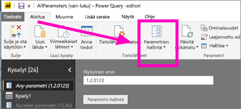
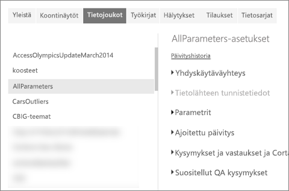
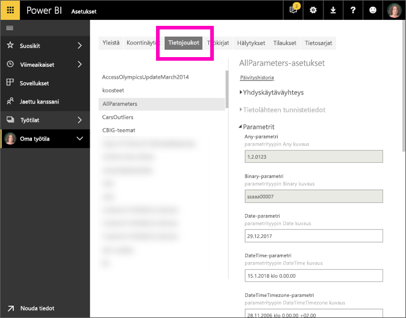

# Mikä on kyselyparametri?
Raportin luojat lisäävät kyselyparametreja Power BI Desktopiin. Parametrien avulle he voivat osittaa raportteja yhden tai useamman parametrin *arvon* mukaan. Raportin luoja voi esimerkiksi luoda parametrin, joka rajoittaa tiedot yhden maan alueelle tai parametrin, joka määrittää hyväksyttävät muodot esimerkiksi päivämäärä-, kellonaika- ja tekstikenttiin.

## Parametrien tarkasteleminen ja muokkaaminen Power BI -palvelussa

Kun parametrit on määritetty Desktopissa ja tämä [raportti julkaistaan Power BI -palvelussa](desktop-upload-desktop-files.md), parametrin asetukset ja valinnat kulkevat tämän raportin mukana. Joitakin parametriasetuksia voidaan tarkastella ja muokata Power BI -palvelussa -- tämä ei koske parametreja, jotka rajoittavat saatavilla olevia tietoja, vaan parametreja, jotka määrittävät ja kuvaavat hyväksyttäviä arvoja.

1. Valitse Power BI -palvelussa , jotta voit avata **Asetukset**-kohdan.

2. Valitse välilehti **Tietojoukot**-kohdalle ja korosta tietojoukko luettelossa. 
    
    

3. Laajenna **Parametrit**-kohtaa.  Jos valitulla tietojoukolla ei ole parametreja, näkyviin tulee viesti, jossa on linkki artikkeliin Lisätietoja kyselyparametreista. Jos tietojoukolla ei ole parametreja, saat ne näkyviin laajentamalla **Parametrit**-ylätunnistetta. 

    

    Tarkastele parametriasetuksia ja muuta niitä tarvittaessa. Harmaita kenttiä ei voi muokata. 

## Seuraavat vaiheet
Yksinkertaisia parametreja voi tilapäisesti lisätä [muokkaamalla URL-osoitetta](service-url-filters.md).