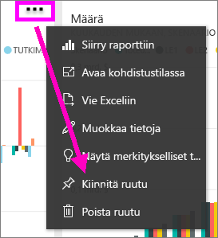
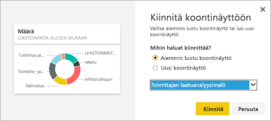
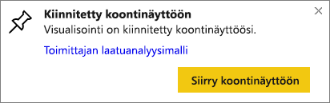

# Yhden koontinäytön ruudun kiinnittäminen toiseen koontinäyttöön
Yksi tapa lisätä uusi [koontinäytön ruutu](consumer/end-user-tiles.md) on kopioida se toisesta koontinäytöstä. Kukin näistä ruuduista on napsautettaessa linkki takaisin sinne, jossa se luotiin, joko Q&A:lle tai raporttiin. 

> [!NOTE]
> Et voi kiinnittää ruutuja jaetulta koontinäytöltä.

## Ruudun kiinnittäminen toiseen koontinäyttöön
1. [Nouda tiedot](service-get-data.md). Tässä esimerkissä käytetään [IT Spend -analyysimallia](sample-it-spend.md).
2. Avaa [koontinäyttö](consumer/end-user-dashboards.md).
3. Valitse sen ruudun päältä, jotka haluat kiinnittää, **Enemmän vaihtoehtoja** (...) ja valitse **Kiinnitä ruutu**.  
   
   
4. Kiinnitä ruutu aiemmin luotuun raporttinäkymään tai uuteen raporttinäkymään. 
   
   * **Aiemmin luotu koontinäyttö**: valitse avattavasta luetteloruudusta koontinäytön nimi.
   * **Uusi koontinäyttö**: anna nimi uudelle koontinäytölle.
   
   
5. Valitse **Kiinnitä**.
   Onnistumissanoma (oikean yläkulman lähellä) ilmaisee, että visualisointi lisättiin ruutuna valittuun koontinäyttöön.
   
   
6. Valitse **Siirry koontinäyttöön**, jotta näet kiinnitetyn ruudun. Täällä kiinnitetty visualisointi voidaan [nimetä uudelleen, linkittää ja siirtää ja sen kokoa voidaan muuttaa](service-dashboard-edit-tile.md).

## Seuraavat vaiheet
[Ruudut Power BI:ssa](consumer/end-user-tiles.md)  
[Koontinäytöt Power BI:ssä](consumer/end-user-dashboards.md)  
Onko sinulla kysyttävää? [Kokeile Power BI -yhteisöä](https://community.powerbi.com/)

