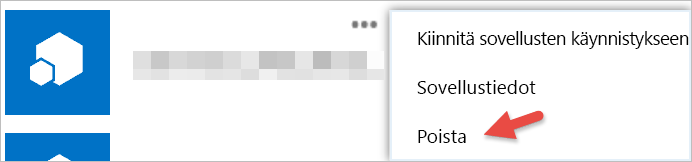

# Kolmannen osapuolen sovellusten käytön aloittaminen

Power BI:llä voit käyttää sovellusta, jonka on rakentanut yritys tai yksittäinen henkilö Microsoftin ulkopuolelta. Voit esimerkiksi käyttää kolmannen osapuolen sovellusta, joka integroituu Power BI-ruutuihin räätälöidyssä verkkosovelluksessa. Kun käytät kolmannen osapuolen sovellusta, sinua pyydetään myöntämään kyseiselle sovellukselle tiettyjä käyttöoikeuksia Power BI-tilillesi ja resursseihisi. On tärkeää myöntää lupa vain sovelluksille, jotka tunnet ja joihin luotat. 4Sovelluksen käyttöoikeudet voidaan peruuttaa milloin tahansa. Katso [Kolmannen osapuolen sovelluksen käyttöoikeuksien kumoaminen](#revoke).

Seuraavassa on erilaisia käyttöoikeuksia, joita sovellus saattaa pyytää.

## Power BI -sovelluksen käyttöoikeudet

* **Kaikkien raporttinäkymien lukuoikeus**
  
  * Tämä oikeus antaa sovellukselle mahdollisuuden tarkastella kaikkia raporttinäkymiä, joihin sinulla on pääsy. Tämä sisältää raporttinäkymät, jotka omistat, jotka olet saanut sisältöpaketeista ja jotka on jaettu sinulle ja jotka ovat ryhmissä, joihin kuulut. Sovellus ei voi tehdä mitään muutoksia raporttinäkymään. Muun muassa tätä oikeutta voi käyttää sovellus raporttinäkymän sisällön upottamiseksi omaan käyttäjäkokemukseensa.

* **Kaikkien raporttien lukuoikeus**
  
  * Tämä oikeus antaa sovellukselle mahdollisuuden tarkastella kaikkia raportteja, joihin sinulla on pääsy. Tämä sisältää raportit, jotka omistat, jotka olet saanut sisältöpaketeista ja jotka ovat ryhmissä, joihin kuulut. Raportin osan tarkastelu tarkoittaa, että sovellus voi myös nähdä sen sisältämät tiedot. Sovellus ei voi tehdä mitään muutoksia itse raportteihin. Muun muassa tätä oikeutta voi käyttää sovellus raportin sisällön upottamiseksi omaan käyttäjäkokemukseensa.

* **Kaikkien tietojoukkojen lukuoikeus**
  
  * Tämä oikeus antaa sovellukselle mahdollisuuden luetella kaikkia tietojoukot, joihin sinulla on pääsy. Tämä sisältää tietojoukot, jotka omistat, jotka olet saanut sisältöpaketeista ja jotka ovat ryhmissä, joihin kuulut. Sovellus voi nähdä kaikkien tietojoukkojen nimet sekä niiden rakenteen, mukaan lukien taulukon ja sarakkeen nimet. Tämä oikeus antaa oikeudet lukea tietojoukon tietoja. Käyttöoikeus ei anna sovellukselle lupaa lisätä tai tehdä muutoksia tietojoukkoon.
* **Kaikkien tietojoukkojen luku- ja kirjoitusoikeus**
  
  * Tämä oikeus antaa sovellukselle mahdollisuuden luetella kaikkia tietojoukot, joihin sinulla on pääsy. Tämä sisältää tietojoukot, jotka omistat, jotka olet saanut sisältöpaketeista ja jotka ovat ryhmissä, joihin kuulut. Sovellus voi nähdä kaikkien tietojoukkojen nimet sekä niiden rakenteen, mukaan lukien taulukon ja sarakkeen nimet. Tämä oikeus antaa tietojoukon tietojen luku- ja kirjoitusoikeudet. Sovellus voit myös luoda uusia tietojoukkoja tai tehdä muutoksia aiemmin luotuihin. Tätä käytetään yleisesti tietojen lähettämiseen suoraan Power BI:lle.

* **Käyttäjän ryhmien tarkasteleminen**
  
  * Tämä oikeus antaa sovellukselle mahdollisuuden luetella kaikkia ryhmät, joiden jäsen olet. Se voi käyttää tätä oikeutta ja joitakin muita luettelon oikeuksia sisällön tarkasteluun tai päivittämiseen kyseiselle ryhmälle. Sovellus ei voi tehdä mitään muutoksia itse ryhmään.

<a name="revoke"/>

## Kolmannen osapuolen sovelluksen käyttöoikeuksien kumoaminen

Kolmannen osapuolen sovelluksen oikeudet kumotaan siirtymällä Office 365:n Omat sovellukset -sivulle.

Valitse **Office 365:n Omat sovellukset**. Voit kumota kolmannen osapuolen käyttöoikeuksia seuraavasti:

1. Siirry [Office 365:n Omat sovellukset -sivulle](https://portal.office.com/myapps).

2. Valitse **Omat sovellukset** ja etsi kolmannen osapuolen sovellus.

3. Valitse sovellusruudun päällä **(...)**  -painike ja napsauta **Poista**.

   