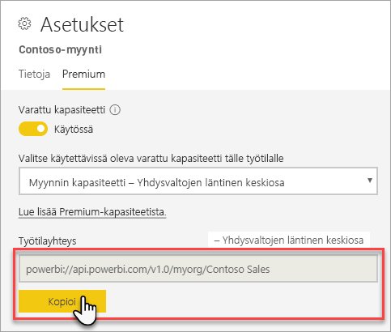
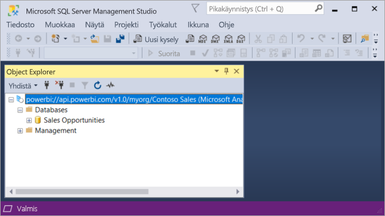

# Tietojoukkoihin yhdistäminen asiakassovelluksilla ja työkaluilla (esikatselu)

Power BI Premiumin työtilat ja tietojoukot tukevat Microsoftin sekä muiden valmistajien asiakassovellusten ja työkalujen *Vain luku* -yhteyksiä. Oletusarvon mukaan yhteydet ovat käytössä

> [!NOTE]
> Tämä artikkeli on tarkoitettu vain Power BI Premiumin työtilojen ja tietojoukkojen Vain luku -yhteyksien esittelyksi. Sen tarkoitus *ei ole* tarjota tarkkoja tietoja ohjelmoitavuudesta, tietyistä työkaluista ja sovelluksista, arkkitehtuurista tai työtilojen sekä tietojoukkojen hallinnasta. Tässä käsitellyt aiheet edellyttävät vankkaa ymmärrystä Analysis Servicesin taulukkomallisesta tietokanta-arkkitehtuurista ja -ylläpidosta.

## Protokolla

Power BI Premium käyttää [XML for Analysis](https://docs.microsoft.com/bi-reference/xmla/xml-for-analysis-xmla-reference) (XMLA) -protokollaa viestinnässä asiakassovellusten välillä ja moduulissa, joka hallitsee työtilojasi ja tietojoukkojasi. Tämä viestintä kulkee niin sanottujen XMLA-päätepisteiden välillä. XMLA on sama viestintäprotokolla, jota käytetään Microsoft Analysis Services -moduulissa. Se perustuu Power BI:n semanttiseen mallinnukseen, valvontaan, elinkaareen ja tiedonhallintaan. 

Valtaosa asiakassovelluksista ja työkaluista ei nimenomaisesti ole yhteydessä moduulin kanssa XMLA-päätepisteiden avulla. Ne käyttävät sen sijaan asiakaskirjastoja (esimerkiksi MSOLAP, ADOMD ja AMO) välittäjänä asiakassovelluksen ja moduulin välillä, joka viestii ainoastaan XMLA:n välityksellä.

## Tuetut työkalut

Seuraavat työkalut tukevat Power BI Premiumin työtilojen ja tietojoukkojen Vain luku -käyttöä:

**SQL Server Management Studio (SSMS)** : Tukee DAX-, MDX-, XMLA- ja TraceEvent-kyselyitä. Edellyttää versiota 18.0. Lataa [täältä](https://docs.microsoft.com/sql/ssms/download-sql-server-management-studio-ssms). 

**SQL Server Profiler**: Tämä SSMS 18.0:aan (esikatselu) sisältyvä työkalu tarjoaa palvelintapahtumien seurannan ja virheenkorjauksen. Voit kirjata ja tallentaa tietoja kustakin tapahtumasta tiedostoon tai taulukkoon myöhemmin analysoitavaksi. Vaikka Profiler on virallisesti poistettu käytöstä SQL Serverille, se on kuitenkin edelleen mukana SSMS:ssä ja sitä tuetaan edelleen Analysis Servicesille ja nyt Power BI Premiumille. Saat lisätietoja [SQL Server Profilerin](https://docs.microsoft.com/sql/tools/sql-server-profiler/sql-server-profiler) ohjeartikkelista.

**DAX Studio**: Tämä on avoimen lähdekoodin yhteisötyökalu, jolla voit suorittaa ja analysoida DAX-kyselyitä Analysis Servicesin kanssa. Edellyttää versiota 2.8.2 tai tätä uudempaa. Saat lisätietoja osoitteesta [daxstudio.org](https://daxstudio.org/).

**Excelin Pivot-taulukot**: edellyttää Officen (vähintään versio 16.0.11326.10000) pika-asennusversiota.

**Muut ohjelmistovalmistajat**: tarjolla on esimerkiksi tietojen visualisoinnin asiakassovelluksia ja työkaluja, joilla voit muodostaa yhteyden Power BI Premiumin tietojoukkoihin, tehdä kyselyitä niihin ja käyttää niitä. Useimmat työkalut edellyttävät MSOLAP-asiakaskirjastojen uusimpia versioita, mutta jotkin saattavat käyttää ADOMD-kirjastoja.

## Asiakaskirjastot

Asiakassovellukset ja työkalut edellyttävät asiakaskirjastoja voidakseen muodostaa yhteyden Power BI Premium -työtiloihin. Samoja asiakaskirjastoja, joilla muodostetaan yhteys Analysis Servicesiin, tuetaan myös Power BI Premiumissa. Microsoftin asiakassovellukset, esimerkiksi Excel, SQL Server Management Studio (SSMS) ja SQL Server Data Tools (SSDT), asentavat kaikki kolme asiakaskirjastoa ja päivittävät niitä säännöllisesti sovelluspäivitysten yhteydessä. Joissain tapauksissa, etenkin muiden ohjelmistovalmistajien sovelluksia ja työkaluja käytettäessä, sinun täytyy ehkä asentaa asiakaskirjastojen uudemmat versiot. Asiakaskirjastoja päivitetään kuukausittain. Saat lisätietoja ohjeartikkelista [Asiakaskirjastot Analysis Servicesiin yhdistämiseksi](https://docs.microsoft.com/azure/analysis-services/analysis-services-data-providers).

## Premium-työtilaan yhdistäminen

Voit yhdistää työtiloihin, joille on määritetty omat Premium-kapasiteetit. Työtiloilla, jotka on määritetty omalle kapasiteetilleen, on yhteysmerkkijono URL-muodossa. 

Voit hakea työtilan yhteysmerkkijonon valitsemalla Power BI:ssä **työtilan asetusten** **Premium**-välilehden **työtilayhteyden** kohdassa **Kopioi**.

Työtilayhteydet käyttävät seuraavaa URL-muotoa työtiloille kuin ne olisivat Analysis Services -palvelinnimiä:   
`powerbi://api.powerbi.com/v1.0/[tenant name]/[workspace name]` 

esimerkiksi `powerbi://api.powerbi.com/v1.0/contoso.com/Sales Workspace`.

### Yhdistäminen SSMS:ssä

Valitse **Connect to Server** > **Server Type** > **Analysis Services**. Anna URL-osoite **Server name** -kenttään. Valitse **Authentication** -kohdassa **Active Directory - Universal with MFA Support**. Anna sitten **User name** -kenttään organisaation käyttäjätunnuksesi. 

Kun yhteys on muodostettu, työtila näytetään Analysis Services -palvelimensa ja työtilan tietojoukot tietokantoina.  

### Alkuperäinen luettelo

Jotkin työkalut, esimerkiksi SQL Server Profiler, saattavat edellyttää, että määrität *alkuperäisen luettelon*. Määritä tietojoukko (tietokanta) työtilaasi. Valitse **Yhdistä palvelimeen** -kohdassa **Asetukset**. Anna **Yhdistä palvelimeen** -valintaikkunan **yhteyden ominaisuuksien** välilehden **Yhdistä tietokantaan** -kohdassa tietojoukon nimi.

### Päällekkäinen työtilan nimi

Kun yhdistät työtilaan, jolla on sama nimi kuin toisella työtilalla, saatat saada seuraavan virheilmoituksen: **Cannot connect to powerbi://api.powerbi.com/v1.0/[vuokraajan nimi]/[työtilan nimi].**

Voit kiertää tämän ongelman määrittämällä työtilan nimen lisäksi myös ObjectIDGuid-arvon, jonka voit kopioida työtilan URL-osoitteesta objectID-kohdasta. Liitä objectID yhteyden URL-osoitteen loppuun. Esimerkki: powerbi://api.powerbi.com/v1.0/myorg/Contoso Sales - 9d83d204-82a9-4b36-98f2-a40099093830

### Päällekkäinen tietojoukon nimi

Kun yhdistät tietojoukkoon, jolla on sama nimi kuin toisella tietojoukolla samassa työtilassa, liitä tietojoukon GUID-tunnus tietojoukon nimeen. Voit hakea sekä tietojoukon nimen *että* GUID-tunnuksen, kun olet yhteydessä työtilaan SSMS:ssä. 

### Viive näytetyissä tietojoukoissa

Kun yhdistät työtilaan, muutokset uusista, poistetuista ja uudelleennimetyistä tietojoukoista saattavat näkyä vasta jopa viiden minuutin viipeellä. 

### Tietojoukot, joita ei tueta

Seuraavia tietojoukkoja ei voi käyttää XMLA-päätepisteillä. Näitä tietojoukkoja *ei* näytetä työtilassa SSMS:ssä tai muissa työkaluissa: 

- tietojoukot, joilla on reaaliaikainen yhteys Analysis Services -malleihin 
- tietojoukot, jotka lähettävät tietoja REST API:n avulla
- Excel-työkirjojen tietojoukot. 

Seuraavia tietojoukkoja ei tueta Power BI -palvelussa:   

- tietojoukot, joilla on reaaliaikainen yhteys Power BI -tietojoukkoon.

### Roolit ja roolijäsenyydet

Tällä hetkellä mallin rooleja ja roolijäsenyyksiä ei voi etsiä tai näyttää XMLA-päätepisteiden avulla.

## Poista yhteys käytöstä

Oletusarvon mukaan XMLA-päätepisteyhteys on käytössä tietojoukkojen kuormituksessa. Voit poistaa yhteyden käytöstä [kuormituksen asetuksissa](service-admin-premium-workloads.md#workload-settings).

## Valvontalokit 

Kun asiakassovellukset ja työkalut yhdistävät työtilaan, käyttö XMLA-päätepisteiden kautta kirjataan Power BI -valvontalokeihin **GetWorkspaces**-toiminnon alle. Saat lisätietoja artikkelista [Power BI:n valvonta](service-admin-auditing.md).

## Katso myös

[Analysis Services -viittaukset](https://docs.microsoft.com/bi-reference/#pivot=home&panel=home-all)   
[SQL Server Management Studio](https://docs.microsoft.com/sql/ssms/sql-server-management-studio-ssms)   
[SQL Server Analysis Servicesin taulukkomuotoinen protokolla](https://docs.microsoft.com/openspecs/sql_server_protocols/ms-ssas-t/b98ed40e-c27a-4988-ab2d-c9c904fe13cf)   
[Dynaamiset hallintanäkymät](https://docs.microsoft.com/sql/analysis-services/instances/use-dynamic-management-views-dmvs-to-monitor-analysis-services)   

Onko sinulla kysyttävää? [Voit esittää kysymyksiä Power BI -yhteisössä](https://community.powerbi.com/)
