# <a name="incremental-refresh-in-power-bi-premium"></a>Lisäävää päivitys Power BI Premiumissa

Lisäävä päivitys mahdollistaa erittäin suurien tietojoukkojen käytön Power BI Premium -palvelussa tarjoamalla seuraavat edut:

> [!div class="checklist"]
> * **Päivitykset sujuvat nopeammin**: vain muutetut tiedot päivitetään. Voit esimerkiksi päivittää vain viimeiset viisi päivää 10 vuoden tietojoukosta.
> * **Päivitykset ovat luotettavampia**: sinun ei tarvitse enää säilyttää pitkäkestoisia yhteyksiä lyhytkestoisiin lähdejärjestelmiin.
> * **Resurssien kulutus on vähäisempää**: kun päivitettäviä tietoja on vähemmän, muistin ja muiden resurssien yleinen kulutus on pienempi.

## <a name="configure-incremental-refresh"></a>Lisäävän päivityksen määrittäminen

Lisäävän päivityksen käytännöt on määritetty Power BI Desktopissa, ja ne otetaan käyttöön, kun ne on julkaistu Power BI -palvelussa.

Aloita ottamalla käyttöön lisäävän päivityksen **esiversiotoiminnot**.

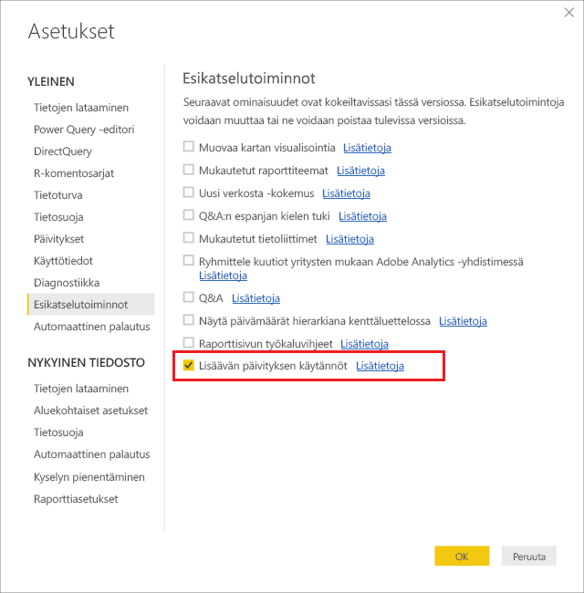

### <a name="filter-large-datasets-in-power-bi-desktop"></a>Suurien tietojoukkojen suodattaminen Power BI Desktopissa

Mahdollisesti miljardeja rivejä sisältävät suuret tietojoukot eivät ehkä mahdu Power BI Desktop -malliin, koska pöytätietokoneessa saatavilla olevat muistiresurssit rajoittavat PBIX-tiedostoa. Tällaisia tietojoukkoja suodatetaan siksi yleensä tuonnin yhteydessä. Tämäntyyppistä suodatusta sovelletaan siitä huolimatta, käytetäänkö lisäävää päivitystä vai ei. Lisäävän päivityksen suodatuksessa käytetään Power Queryn päivämäärä-/aikaparametreja.

#### <a name="rangestart-and-rangeend-parameters"></a>RangeStart- ja RangeEnd-parametrit

Jos haluat käyttää lisäävää päivitystä, tietojoukot suodatetaan Power Queryn päivämäärä/aikaparametrien avulla varatuilla, kirjainkooltaan merkitsevillä nimillä **RangeStart** ja **RangeEnd**. Näiden parametrien avulla tuodut tiedot suodatetaan Power BI Desktopiin ja tiedot jaetaan myös dynaamisesti alueisiin, kun ne on julkaistu Power BI -palvelussa. Palvelu korvaa parametriarvot kunkin osion suodattamiseksi. Niitä ei tarvitse määrittää palvelun tietojoukon asetuksissa. Julkaisun jälkeen Power BI -palvelu ohittaa parametrin arvot automaattisesti.

Voit määrittää parametreille oletusarvot valitsemalla Power Query -editorissa **Parametrien hallinta**.

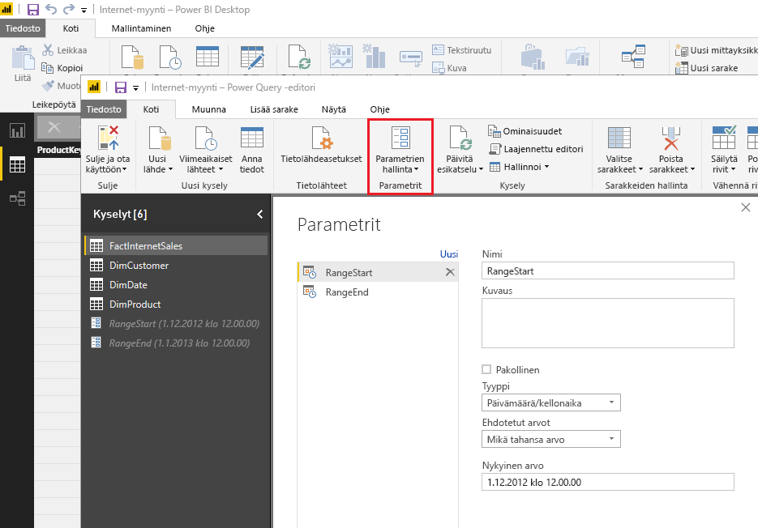

Kun parametrit on määritetty, voit käyttää suodatinta valitsemalla **Mukautettu suodatin** -valikkovaihtoehdon sarakkeelle.

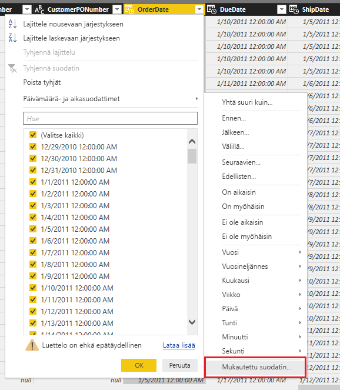

Varmista, että rivit suodatetaan, kun sarakkeen arvo *on suurempi tai yhtä suuri kuin* **RangeStart** ja *pienempi kuin* **RangeEnd**. Muilla suodatinyhdistelmillä rivit saatetaan laskea kahdesti.

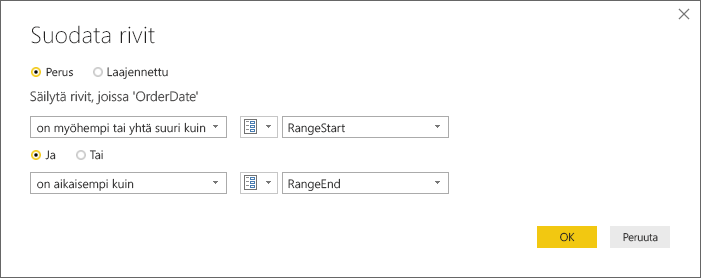

> [!IMPORTANT]
> Varmista, että kyselyissä on yhtäsuuruusmerkki (=) joko **RangeStart**- tai **RangeEnd**-kohdassa, mutta ei niissä molemmissa. Jos kummassakin parametrissa on yhtäsuuruusmerkki (=), rivi voi täyttää kahden osion ehdot, mikä voi johtaa mallin tietojen kaksoiskappaleisiin. Esimerkki:  
> \#"Filtered Rows" = Table.SelectRows(dbo_Fact, kumpikin [OrderDate] **>= RangeStart** ja [OrderDate] **<= RangeEnd**) saattaa aiheuttaa tietojen kaksoiskappaleita.

> [!TIP]
> Vaikka parametrien tietotyypin on oltava päivämäärä/aika, se voidaan muuntaa vastaamaan tietolähteen vaatimuksia. Esimerkiksi seuraava Power Query -funktio muuntaa päivämäärän/ajan arvon muistuttamaan tietovarastoissa yleisen muodon *vvvvkkpp* kokonaisluvun korvaavaa avainta. Funktio voidaan kutsua suodattimen vaiheen mukaan.
>
> `(x as datetime) => Date.Year(x)*10000 + Date.Month(x)*100 + Date.Day(x)`

Valitse **Sulje ja ota käyttöön** Power Query -editorissa. Sinulla pitäisi olla tietojoukon alijoukko Power BI Desktopissa.

#### <a name="filter-date-column-updates"></a>Päivämääräsarakkeen päivitysten suodattaminen

Päivämääräsarakkeen suodatinta käytetään tietojen jakamiseen dynaamisesti alueisiin Power BI -palvelussa. Lisäävää päivitystä ei ole suunniteltu tukemaan tapauksia, joissa suodatettu päivämääräsarake on päivitetty lähdejärjestelmässä. Päivitys tulkitaan lisäämiseksi ja poistamiseksi (ei todelliseksi päivitykseksi). Jos poisto tehdään historialliselta alueelta eikä lisäävältä alueelta, sitä ei poimita. Tämä voi aiheuttaa tietojen päivittämisen virheitä osion avain -ristiriitojen vuoksi.

#### <a name="query-folding"></a>Kyselyn taittaminen

On tärkeää, että jakosuodattimet lähetetään lähdejärjestelmään, kun kyselyjä lähetetään päivitystoimintoja varten. Suodattimen lähettäminen edellyttää, että tietolähde tukee kyselyn taittamista. Useimmat tietolähteet, jotka tukevat SQL-kyselyitä, tukevat kyselyn taittamista. Kuitenkin tietolähteet, kuten tietuetiedostot, blob-objektit, verkko ja OData-syötteet, eivät yleensä tue sitä. Jos tietolähteen tausta ei tue suodatinta, suodatinta ei voi lähettää. Tässä tapauksessa koostemoduuli kompensoi ja ottaa suodattimen käyttöön paikallisesti, mikä saattaa edellyttää koko tietojoukon noutamista tietolähteestä. Tämä voi hidastaa lisäävää päivitystä merkittävästi, ja prosessi voi johtaa resurssien loppumiseen joko Power BI -palvelussa tai paikallisessa tietoyhdyskäytävässä.

Kun otetaan huomioon kunkin tietolähteen kyselyn taitostuen eri tasot, on suositeltavaa, että tarkistat suodatinlogiikan sisältyvän lähdekyselyihin. Tämän helpottamiseksi Power BI Desktop yrittää suorittaa tämän tarkistuksen puolestasi. Jos tarkistusta ei voida suorittaa, lisäävän päivityksen valintaikkunassa näkyy varoitus lisäävän päivityksen käytäntöä määritettäessä. SQL-pohjaiset tietolähteet, kuten SQL, Oracle ja Teradata, voivat käyttää tätä varoitusta. Muut lähteet eivät ehkä pysty suorittamaan tarkistusta ilman kyselyjen jäljitystä. Jos Power BI Desktop ei pysty suorittamaan tarkistusta, näyttöön tulee seuraava varoitus.

 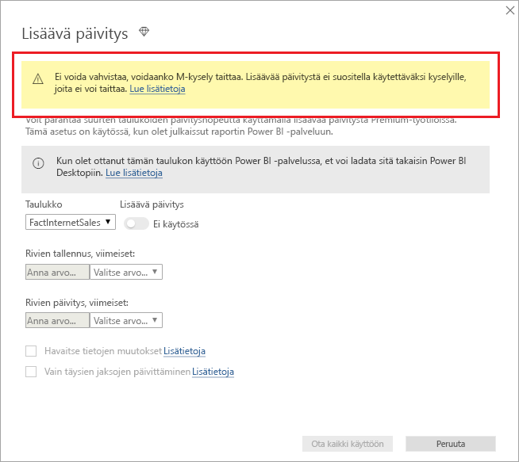

### <a name="define-the-refresh-policy"></a>Päivityskäytännön määrittäminen

Lisäävä päivitys on käytettävissä taulukoiden pikavalikossa lukuun ottamatta reaaliaikaisen yhteyden malleja.

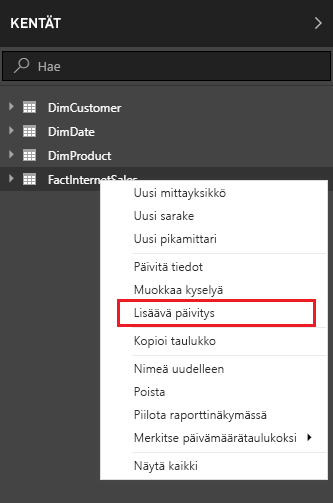

#### <a name="incremental-refresh-dialog"></a>Lisäävä päivitys -valintaikkuna

Lisäävä päivitys -valintaikkuna tulee näkyviin. Ota valintaikkuna käyttöön vaihtopainikkeella.

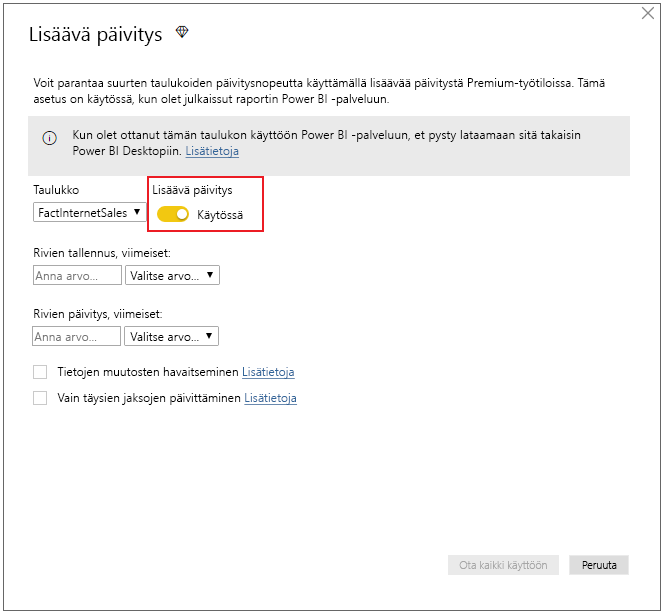

> [!NOTE]
> Jos taulukon Power Query -lauseke ei viittaa parametreihin, joilla on varatut nimet, vaihtopainike on poistettu käytöstä.

Otsikkoteksti kertoo seuraavaa:

- Lisäävää päivitystä tuetaan vain Premium-kapasiteetin työtiloissa. Päivityskäytännöt määritetään Power BI Desktopissa, ja palvelun päivitystoiminnot käyttävät niitä.

- Jos et pysty lataamaan lisäävän päivityskäytännön sisältävää PBIX-tiedostoa Power BI -palvelusta, se ei avaudu Power BI Desktopissa. Vaikka tätä saatetaan tukea tulevaisuudessa, huomaa, että nämä tietojoukot voivat kasvaa niin suuriksi, että niitä on hankala ladata ja avata tavallisella pöytätietokoneella.

#### <a name="refresh-ranges"></a>Päivitysalueet

Seuraavassa esimerkissä määritetään päivityskäytäntö tallentamaan tiedot viideksi kokonaiseksi kalenterivuodeksi sekä kuluvan vuoden tiedot nykyiseen päivämäärään saakka ja päivittämään asteittain 10 päivän tiedot. Ensimmäinen päivitystoiminto lataa historiatietoja. Myöhemmät päivitykset ovat lisääviä ja, jos ne ovat määritelty suoritettavaksi päivittäin, ne suorittavat seuraavat toiminnot:

- Lisää uusi tietopäivä.

- Päivitä 10 päivää nykyiseen päivämäärään saakka.

- Poista kalenterivuodet, jotka ovat aikaisempia kuin viisi vuotta ennen nykyistä päivämäärää. Esimerkiksi jos nykyinen päivämäärä on 1.1.2019, vuosi 2013 poistetaan.

Power BI -palvelun ensimmäinen päivitys saattaa kestää kauemmin kaikkien viiden koko kalenterivuoden tuomiseksi. Myöhemmät päivitykset saattavat viedä vain hetken.

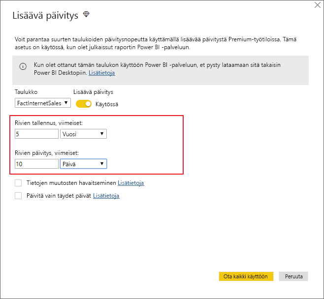

> [!NOTE]
> Alueiden määritys saattaa olla ainoa asia, mitä sinun tarvitsee tehdä, jolloin voit siirtyä suoraan alla olevaan julkaisuvaiheeseen. Muut avattavat valikot on tarkoitettu kehittyneille ominaisuuksille.

### <a name="advanced-policy-options"></a>Lisäkäytäntöasetukset

#### <a name="detect-data-changes"></a>Havaitse tietojen muutokset

10 päivän lisäävä päivitys on paljon tehokkaampi kuin viiden vuoden koko päivitys. Voit kuitenkin tehostaa toimintaa vieläkin enemmän. Jos valitset **Havaitse tietojen muutokset** -valintaruudun, voit valita päivämäärä/aika-sarakkeen, jonka avulla tunnistetaan ja päivitetään vain päivät, joiden tiedot ovat muuttunut. Tällöin oletetaan, että lähdejärjestelmässä on kyseinen sarake, joka on yleensä valvontaa varten. **Tämä ei saa olla sama sarake kuin jota käytetään tietojen jakamiseen RangeStart- ja RangeEnd-parametreilla.** Tämän sarakkeen suurin arvo lasketaan jokaisen lisäävän alueen ajanjakson osalta. Jos arvo ei ole muuttunut viimeisen päivityksen jälkeen, ajanjaksoa ei tarvitse päivittää. Esimerkissä lisäävästi päivitettävien päivien määrä voisi vähentyä vielä kymmenestä noin kahteen.

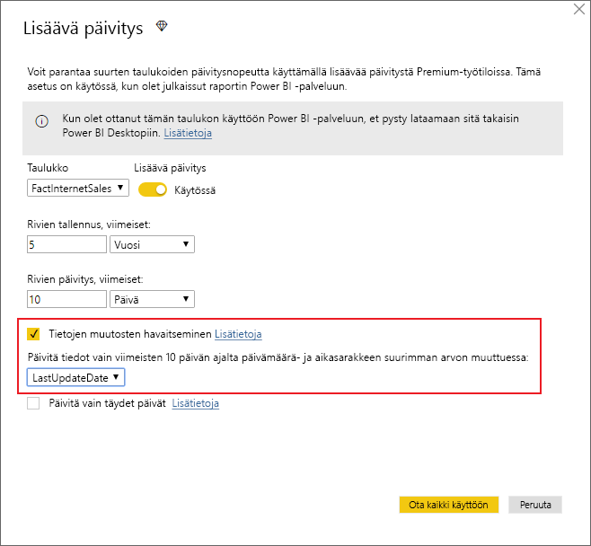

> [!TIP]
> Nykyinen rakenne edellyttää, että sarake on pysyvä ja tallennettu välimuistiin tietojen muutosten havaitsemiseksi. Kannattaa harkita jotakin seuraavista tekniikoista kardinaliteetin ja muistin kulutuksen vähentämiseksi.
>
> Säilytä vain sarakkeen suurin arvo päivityshetkellä mahdollisesti Power Query -funktion avulla.
>
> Vähennä tarkkuus tasolle, joka on hyväksyttävä päivitystaajuutta koskevien vaatimustesi mukaisesti.
>
> Mukautettujen kyselyjen määrittäminen tietojen muutosten havaitsemiseksi aiotaan sallia myöhemmin. Tällöin voidaan välttää kaikkien sarakkeen arvojen säilyttäminen.

#### <a name="only-refresh-complete-periods"></a>Vain täysien jaksojen päivittäminen

Oletetaan, että päivitys on ajoitettu suoritettavaksi klo 4.00 joka aamu. Jos lähdejärjestelmässä esiintyy tietoja kyseisten neljän tunnin aikana, et ehkä halua ottaa niitä huomioon. Jotkin liiketoiminnan mittarit – esimerkiksi barrelit päivässä öljy- ja kaasunalalla – eivät ole mielekkäitä, kun kyseessä ovat osittaiset päivät.

Toinen esimerkki on taloushallinnon järjestelmän tietojen päivittäminen, kun edellisen kuukauden tiedot hyväksytään kuun 12. päivänä. Voit määrittää lisäävän alueen yhdelle kuukaudelle ja ajoittaa päivityksen suoritettavaksi kuukauden 12. päivänä. Kun tämä vaihtoehto on valittuna, esimerkiksi tammikuun tiedot päivitettäisiin 12. helmikuuta.

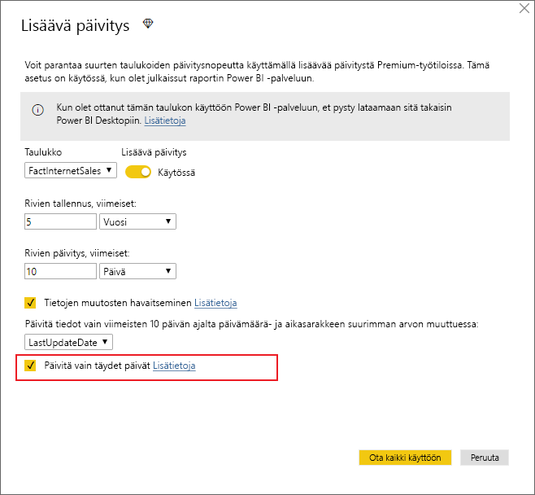

> [!NOTE]
> Palvelun päivitystoiminnot suoritetaan UTC-ajan mukaan. Tämä voi määrittää voimaantulopäivän ja vaikuttaa täysiin jaksoihin. Mahdollisuus ohittaa päivitystoiminnon voimaantulopäivä aiotaan lisätä.

## <a name="publish-to-the-service"></a>Palveluun julkaiseminen

Koska lisäävä päivitys on vain Premium-kapasiteetin ominaisuus, Julkaise-valintaikkunassa voidaan valita vain Premium-kapasiteetin työtila.

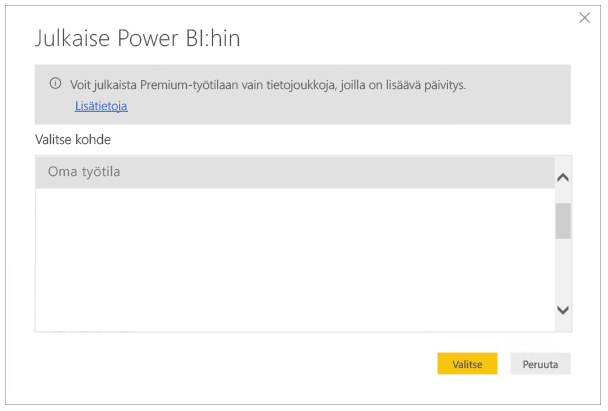

Voit nyt päivittää mallin. Ensimmäinen päivitys saattaa kestää kauemmin historiatietojen tuomisen vuoksi. Myöhemmät päivitykset voivat olla paljon nopeampia, koska niissä käytetään lisäävää päivitystä.

## <a name="query-timeouts"></a>Kyselyn aikakatkaisut

[Vianmäärityksen päivitys](https://docs.microsoft.com/power-bi/refresh-troubleshooting-refresh-scenarios) -artikkelissa kerrotaan, että Power BI -palvelussa päivitystoiminnot voidaan aikakatkaista. Tietolähteen oletusaikakatkaisu voi myös rajoittaa kyselyjä. Useimmat suhteelliset lähteet sallivat aikakatkaisujen ohittamisen M-lausekkeessa. Esimerkiksi alla olevassa lausekkeessa sen kestoksi määritetään kaksi tuntia [SQL Serverin tietojen käytön funktion](https://msdn.microsoft.com/query-bi/m/sql-database) avulla. Kukin käytäntöalueiden määrittämä jakso lähettää kyselyn, joka noudattaa komennon aikakatkaisua.

```powerquery-m
let
    Source = Sql.Database("myserver.database.windows.net", "AdventureWorks", [CommandTimeout=#duration(0, 2, 0, 0)]),
    dbo_Fact = Source{[Schema="dbo",Item="FactInternetSales"]}[Data],
    #"Filtered Rows" = Table.SelectRows(dbo_Fact, each [OrderDate] >= RangeStart and [OrderDate] < RangeEnd)
in
    #"Filtered Rows"
```

## <a name="limitations"></a>Rajoitukset

Tällä hetkellä [yhdistelmämallien](desktop-composite-models.md) asteittaista päivittämistä tuetaan vain SQL Server-, Azure SQL -tietokanta-, SQL Data Warehouse-, Oracle- ja Teradata-tietolähteillä.

