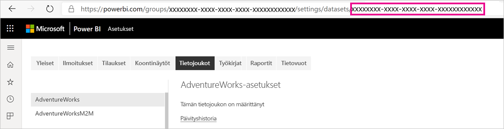
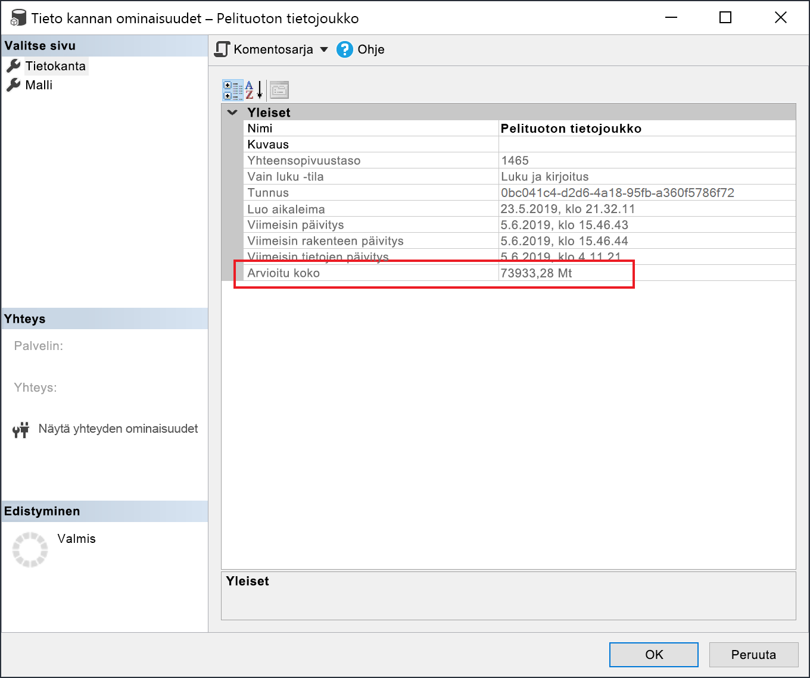

# <a name="large-models-in-power-bi-premium-preview"></a>Suuret mallit Power BI Premiumissa (esikatselu)

Power BI -tietojoukot voivat tallentaa tietoja voimakkaasti pakattuun välimuistiin. Tämä optimoi kyselyjen suorituskyvyn ja mahdollistaa käyttäjille suurten tietojoukkojen nopean käytön. Suuret mallit mahdollistavat Power BI Premium -tietojoukkojen kasvun yli 10 gigatavun kokoiseksi. Tietojoukon kokoa sen sijaan rajoittaa Power BI Premium -kapasiteetin koko, mikä vastaa Azure Analysis Servicesin toimintaa mallin koon rajoittamisessa. Lisätietoja Power BI Premium kapasiteetin koosta on kohdassa Kapasiteettisolmut. Voit määrittää suuria malleja kaikille Premium P- ja upotetuille varastointiyksiköille, mutta ne toimivat kuitenkin vain [uusien työtilojen](service-create-the-new-workspaces.md)kanssa.

Suuret mallit eivät vaikuta PBIX-latauskokoon, joka on edelleen rajoitettu 10 gigatavuun. Sen sijaan tietojoukot kasvavat 10 gigatavun jälkeen päivityksen yhteydessä. Lisäävän päivityksen avulla voit määrittää tietojoukon suuremmaksi kuin 10 gigatavua.

## <a name="enable-large-models"></a>Suurten mallien käyttöönotto

Jos haluat luoda tietojoukon, joka kasvaa yli 10 gigatavuun, toimi seuraavasti:

1. Luo tietojoukko Power BI Desktopissa ja määritä [lisäävä päivitys](service-premium-incremental-refresh.md).

1. Julkaise tietojoukko Power BI Premium -palveluun.

1. Ota tietojoukko käyttöön suurissa malleissa suorittamalla alla olevat PowerShellin cmdlet-komennot. Näillä cmdlet-komennoilla Power BI tallentaa tietojoukon Azure Premium -tiedostoihin, eikä 10 gigatavun rajaa voi pakottaa.

1. Käynnistä päivitys, jos haluat ladata historiatiedot lisäävän päivityskäytännön perusteella. Ensimmäinen päivitys saattaa kestää jonkin aikaa, ennen kuin historia ladataan. Seuraavien päivitysten pitäisi olla nopeampia, koska ne ovat lisäävää.

### <a name="powershell-cmdlets"></a>PowerShellin cmdlet-komennot

Ota käyttöön suurten mallien nykyisessä versiossa tietojoukko Premium-tiedostojen tallennusta varten PowerShellin cmdlet-komennoilla. Sinulla on oltava kapasiteetin järjestelmänvalvojan ja työtilan järjestelmänvalvojan oikeudet, jotta voit suorittaa PowerShellin cmdlet-komentoja.

1. Etsi tietojoukon tunnus (GUID). Työtilan **Tietojoukot**-väli lehdellä tieto joukkoasetuksissa näet tunnuksen URL-osoitteessa.

    

1. Asenna PowerShell-järjestelmänvalvojan komentokehotteesta[MicrosoftPowerBIMgmt](/powershell/module/microsoftpowerbimgmt.data/)-moduuli.

    ```powershell
    Install-Module -Name MicrosoftPowerBIMgmt
    ```

1. Kirjaudu sisään ja tarkista tietojoukon tallennustila suorittamalla seuraavat cmdlet-komennot.

    ```powershell
    Login-PowerBIServiceAccount

    (Get-PowerBIDataset -Scope Organization -Id <Dataset ID> -Include actualStorage).ActualStorage
    ```

    Vastauksen on oltava seuraava. Tallennustila on ABF (Analysis Services -varmuuskopiotiedosto), joka on oletusarvo.

    ```
    Id                   StorageMode

    --                   -----------

    <Dataset ID>         Abf
    ```

1. Suorita seuraavat cmdlet-komennot, jotta voit valita tallennustilan Premium-tiedostoille ja tarkistaa ne. Premium-tiedostoiksi muuntaminen voi kestää muutaman sekunnin.

    ```powershell
    Set-PowerBIDataset -Id <Dataset ID> -TargetStorageMode PremiumFiles

    (Get-PowerBIDataset -Scope Organization -Id <Dataset ID> -Include actualStorage).ActualStorage
    ```

    Vastauksen on oltava seuraava. Tallennustilan tilaksi on nyt määritetty Premium-tiedostot.

    ```
    Id                   StorageMode
    
    --                   -----------
    
    <Dataset ID>         PremiumFiles
    ```

Voit tarkistaa tieto joukon muunnosten ja Premium-tiedostojen tilan [Get-PowerBIWorkspaceMigrationStatus](/powershell/module/microsoftpowerbimgmt.workspaces/get-powerbiworkspacemigrationstatus) cmdlet-komennolla.

## <a name="dataset-eviction"></a>Tietojoukon poisto

Power BI käyttää dynaamista muistinhallintaa passiivisten tietojoukkojen poistamiseen muistista. Power BI poistaa tietojoukkoja, jotta se voi ladata muita tietojoukkoja käyttäjän kyselyiden käsittelemiseksi. Dynaamisen muistinhallinnan avulla tietojoukon kokojen summa voi olla huomattavasti suurempi kuin kapasiteetin käytettävissä oleva muisti, mutta yksittäisen tietojoukon pitää mahtua muistiin. Lisätietoja dynaamisesta muistinhallin nasta on kohdassa [Kapasiteettien toiminta](service-premium-what-is.md#how-capacities-function).

Ota huomioon poiston vaikutukset suuriin malleihin. Huolimatta siitä, että tietojoukon latausajat ovat suhteellisen nopeita, käyttäjille saattaa silti olla havaittavissa viive, jos heidän on odotettava, että suuret poistetut tietojoukot ladataan uudelleen. Tästä syystä suuria malleja niiden nykyisessä muodossa suositellaan ensisijaisesti kapasiteeteille, jotka on kohdennettu yritysten liiketoimintatiedon hallinnan vaatimuksille, ei niinkään kapasiteeteille, jotka on yhdistetty omatoimiseen liiketoimintatietojen hallintaan. Enterprise BI -vaatimuksiin varatut kapasiteetit eivät todennäköisesti käynnistä poistoa usein ja aiheuta näin tarvetta tietojoukkojen lataamiseen uudelleen. Omatoimisen liiketoimintatietojen hallintakapasiteetissa voi olla useita pieniä tietojoukkoja, jotka ladataan ja poistetaan muistista usein.

## <a name="checking-dataset-size"></a>Tietojoukon koon tarkistus

Kun historiatiedot on ladattu, voit käyttää [SSMS-](https://docs.microsoft.com/sql/ssms/download-sql-server-management-studio-ssms)[XMLA-päätepistettä](service-premium-connect-tools.md), jotta voit tarkistaa arvioidun tietojoukon koon Mallin ominaisuudet -ikkunassa.



Voit myös tarkistaa tietojoukon koon suorittamalla seuraavia DMV-kyselyitä SQL Server Management Studiosta. Laske DICTIONARY\_SIZE ja käytä\_SIZE -sarakkeet tuloksesta, jotta tietojoukon koko tavuina tulee näkyviin.

```sql
SELECT * FROM SYSTEMRESTRICTSCHEMA
($System.DISCOVER_STORAGE_TABLE_COLUMNS,
 [DATABASE_NAME] = '<Dataset Name>') //Sum DICTIONARY_SIZE (bytes)

SELECT * FROM SYSTEMRESTRICTSCHEMA
($System.DISCOVER_STORAGE_TABLE_COLUMN_SEGMENTS,
 [DATABASE_NAME] = '<Dataset Name>') //Sum USED_SIZE (bytes)
```

## <a name="limitations-and-considerations"></a>Rajoitukset ja huomioitavat asiat

Muista seuraavat rajoitukset, kun käytät suuria malleja:

- **Tuo oma BYOK-salausavain**: Premium-tiedostojen käytössä olevat tietojoukot eivät ole [BYOK-](service-encryption-byok.md)salattuja.
- **Multi-Geo -tuki**: Premium-tiedostojen käytössä olevat tietojoukot eivät toimi kapasiteeteissa, joissa myös [Multi-Geo](service-admin-premium-multi-geo.md) on käytössä.

- **Lataa Power BI Desktopiin**: Jos tietojoukko on tallennettu Premium-tiedostoihin, [lataus .pbix-](service-export-to-pbix.md) tiedostoina epäonnistuu.
- **Tuetut alueet**: Suuria malleja tuetaan kaikilla Azure-alueilla, jotka tukevat Premium-tiedostosäilöä. Lisätietoja on artikkelissa [Eri alueilla saatavissa olevat tuotteet](https://azure.microsoft.com/global-infrastructure/services/?products=storage) ja seuraavassa osassa olevassa taulukossa.


## <a name="availability-in-regions"></a>Saatavuus eri alueilla

Power BI:n suuret mallit ovat käytettävissä vain tietyillä Azure-alueilla, jotka tukevat [Azuren premium-tiedostosäilöä](https://docs.microsoft.com/azure/storage/files/storage-files-planning#file-share-performance-tiers).

Seuraavassa on lueteltu alueet, joilla Power BI:ssä voidaan käyttää suuria malleja. Suuria malleja ei tueta alueilla, joita ei ole seuraavassa luettelossa:


|Azure-alue  |Azure-alueen lyhenne  |
|---------|---------|
|Australia, itäinen     | australiaeast        |
|Kaakkois-Australia     | australiasoutheast        |
|Keski-Yhdysvallat     | centralus        |
|Itä-Aasia     | eastasia        |
|Itä-Yhdysvallat     | eastus        |
|Itäinen Yhdysvallat 2     | eastus2        |
|Japani, itä     | japaneast        |
|Japani, länsi     | japanwest        |
|Korea, keskinen     | koreacentral        |
|Korea, eteläinen     | koreasouth        |
|Yhdysvaltojen pohjoinen keskiosa     | northcentralus        |
|Pohjois-Eurooppa     | northeurope        |
|Yhdysvaltojen eteläinen keskiosa     | southcentralus        |
|Kaakkois-Aasia     | southeastasia        |
|Yhdistynyt kuningaskunta, eteläinen     | uksouth        |
|Yhdistynyt kuningaskunta, läntinen     | ukwest        |
|Länsi-Eurooppa     | westeurope        |
|Länsi-Yhdysvallat     | westus        |
|Länsi-Yhdysvallat 2     | westus2        |


## <a name="next-steps"></a>Seuraavat vaiheet

Seuraavissa linkeissä on tietoja, jotka voivat olla hyödyllisiä suuria malleja käytettäessä:

* [Azuren premium-tiedostosäilö](https://docs.microsoft.com/azure/storage/files/storage-files-planning#file-share-performance-tiers)
* [Power BI Premiumin Multi-Geo-tuen määrittäminen](service-admin-premium-multi-geo.md)
* [Omien salausavainten tuominen Power BI:hin](service-encryption-byok.md)
* [Kapasiteettien toiminta](service-premium-what-is.md#how-capacities-function)
* [Lisäävä päivitys](service-premium-incremental-refresh.md).