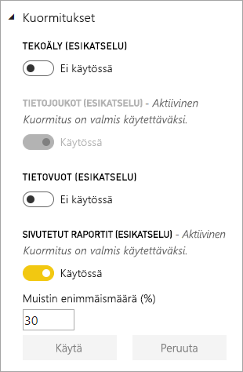
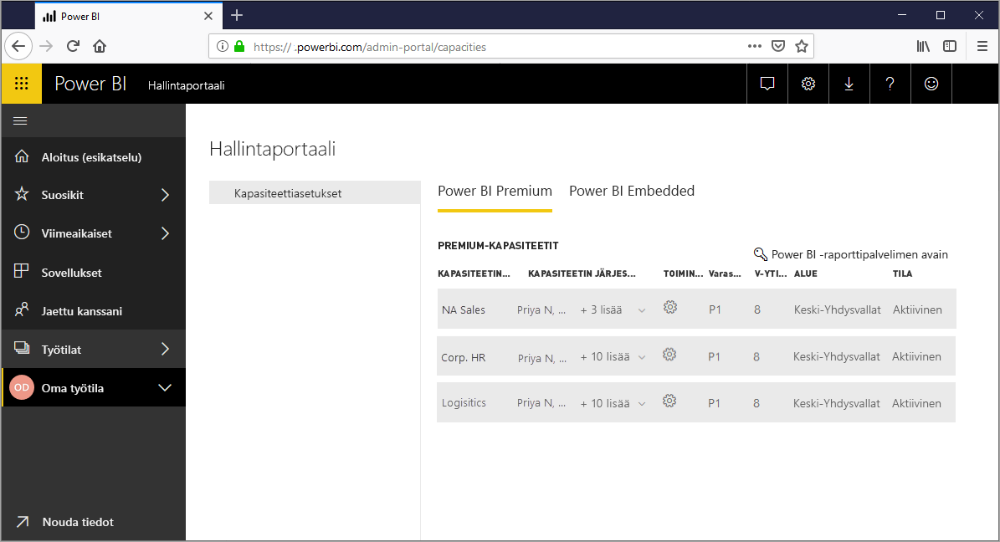
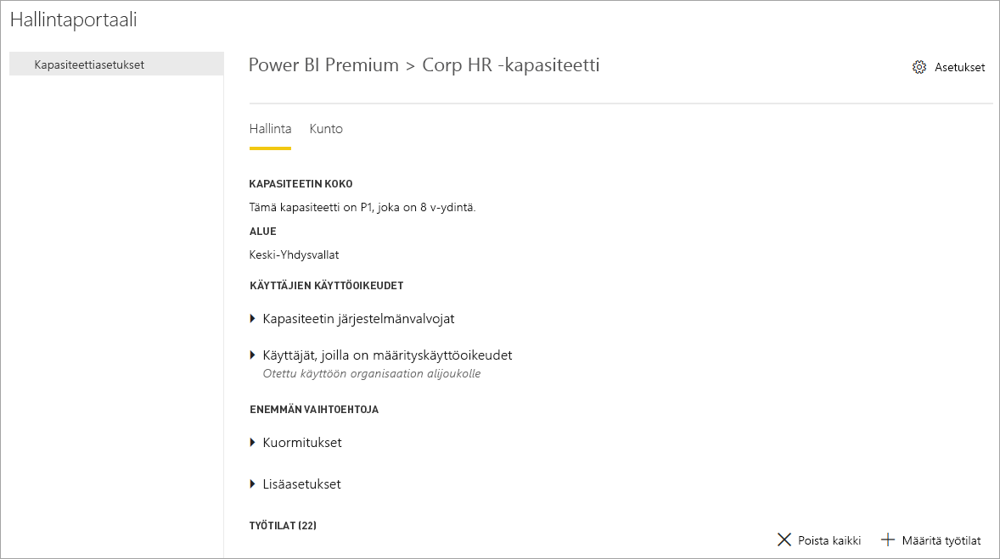
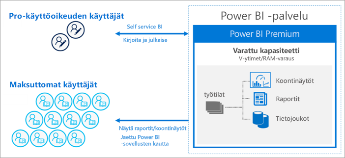

# Mikä on Power BI Premium?

Power BI Premium tarjoaa organisaatiollesi varatut ja parannetut resurssit Power BI -palvelun käyttämiseen. Esimerkki:

> [!div class="checklist"]
> * Parempi skaalautuvuus ja suorituskyky
> * Mahdollisuus lisensiointiin kapasiteetin mukaan
> * Yhtenäistä omatoiminen ja yrityksen liiketoimintatiedon hallinta
> * Laajenna paikallista liiketoimintatiedon hallintaa Power BI -raporttipalvelimella
> * Tietojen sijainnin tuki alueen mukaan (Multi-Geo)
> * Jaa tietoja kenen kanssa tahansa ilman käyttäjäkohtaisen käyttöoikeuden ostoa

Tässä artikkelissa esitellään Power BI Premiumin tärkeimmät ominaisuudet. Tarvittaessa annetaan linkkejä tarkempia tietoja sisältäviin artikkeleihin.

## Tilaukset ja lisenssit

Power BI Premium on vuokraajatason Office 365: n tilaus, joka on saatavilla kahdesta SKU- eli varastointiyksikköperheestä:

- **EM**-SKU:t (EM1 EM3) upottamiseen, vaatii vuosisitoumuksen, laskutetaan kuukausittain. EM1- ja EM2-varastointiyksiköt ovat käytettävissä vain volyymikäyttöoikeuspalvelupakettien kautta. Niitä ei voi ostaa suoraan.
- **P**-varastointiyksiköt (P1–P3) upottamiseen yritysominaisuudet, vaatii kuukausi- tai vuosisitoumuksen, laskutetaan kuukausittain ja sisältää oikeuden asentaa paikallinen Power BI -raporttipalvelin.

Vaihtoehtoisesti voi ostaa **Azure Power BI Embedded** -paketin, jossa on yksi **A**-varastointiyksikköperhe (A1–A6) vain upotusta ja kapasiteettitestausta varten. Kaikki SKU:t toimittavat näennäisytimen kapasiteettien luomiseen, mutta EM-varastointiyksiköt on rajoitettu pienempimuotoista upotusta varten. EM1-, EM2-, A1- ja A2-varastointiyksiköitä, joissa on alle neljä näennäisydintä, eivät toimi varatussa infrastruktuurissa.

Vaikka tässä artikkelissa keskitytään P-varastointiyksiköihin, kuvatut asiat koskevat suurelta osin myös A-varastointiyksikköjä. Verrattuna premium-pakettien varastointiyksiköihin Azuren SKU:t eivät vaadi aikasitoumusta ja ne laskutetaan tunneittain. Ne toimittavat täyden joustavuuden, joka mahdollistaa skaalauksen kumpaankin suuntaan, keskeyttämisen, uudelleen jatkamisen ja poistamisen. 

Azure Power BI Embedded jää pitkälti tässä artikkelissa käsiteltyjen asioiden ulkopuolelle, mutta se on kuvattu Premium-kapasiteettien optimointi -artikkelin [Testausmenetelmiä](service-premium-capacity-optimize.md#testing-approaches)-osiossa työkuormien testauksen ja mittauksen käytännöllisenä ja taloudellisena vaihtoehtona. Saat lisätietoja Azure-varastointiyksiköistä lukemalla [Azure Power BI Embedded -dokumentaation](https://azure.microsoft.com/services/power-bi-embedded/).

### Osto

Järjestelmänvalvojat ostavat Power BI Premium -tilaukset Microsoft 365 -hallintakeskuksesta. Tarkemmin sanottuna vain Office 365:n yleiset järjestelmänvalvojat tai laskutuksen järjestelmänvalvojat voivat ostaa varastointiyksiköitä. Oston yhteydessä vuokraaja saa vastaavan määrän kapasiteetteihin määritettäviä näennäisytimiä, mitä kutsutaan *näennäisytimien ryhmittämiseksi*. Esimerkiksi P3-SKU:n ostaminen antaa vuokraajan käyttöön 32 näennäisydintä. Lisätietoja on artikkelissa [Ohjeet Power BI Premiumin ostamiseen](service-admin-premium-purchase.md).

## Varatut kapasiteetit

Power BI Premium tarjoaa sinulle *varatut kapasiteetit*. Toisin kuin jaettu kapasiteetti, jossa kuormitukset suoritetaan muiden asiakkaiden kanssa jaetuissa laskennallisissa resursseissa, varattu kapasiteetti on tarkoitettu organisaation yksinoikeudelliseen käyttöön. Se on eristetty varatuilla laskennallisilla resursseilla, jotka tarjoavat luotettavan ja tasalaatuisen suorituskyvyn isännöidylle sisällölle. 

Työtilat sijaitsevat kapasiteeteissa. Kullakin Power BI -käyttäjällä on henkilökohtainen työtila, jota kutsutaan **omaksi työtilaksi**. Yhteistyön mahdollistamiseksi voidaan luoda lisää työtiloja, joita kutsutaan **sovellustyötiloiksi**. Työtilat, mukaan lukien henkilökohtaiset työtilat, luodaan oletusarvoisesti jaetussa kapasiteetissa. Kun sinulla on Premium-kapasiteetteja, sekä omat työtilat että sovellustyötilat voidaan määrittää Premium-kapasiteetteihin.

### Kapasiteetin solmut

Kuten [Tilaukset ja lisenssit](#subscriptions-and-licensing) -osiossa on kuvattu, Power BI Premium -SKU-perheitä on kaksi: **EM** ja **P**. Kaikki Power BI Premium SKU:t ovat käytettävissä kapasiteetin *solmuina*, joista kukin edustaa määrättyä määrää resursseja, jotka koostuvat suorittimesta, muistista ja tallennustilasta. Resurssien lisäksi jokaisessa SKU:ssa on toiminnallisia rajoituksia sille, kuinka monta DirectQuery- ja Live Connection -yhteyttä sekunnissa ja kuinka monta paralleelia mallin uudelleen latausta sillä voi olla.

Käsittelyn suorittaa määrätty määrä näennäisytimiä, joka on jaettu tasan taustan ja edustan välillä.

**Taustan näennäisytimet** vastaavat Power BI:n ydintoiminnoista, joihin kuuluvat kyselyiden käsittely, välimuistin hallinta, R-palvelujen suorittaminen, mallien päivittäminen, luonnollisen kielen käsittely (Q&A) sekä raporttien ja kuvien palvelinpuolen hahmontaminen. Taustan näennäisytimille määritetään tietty määrä muistia, jota käytetään pääasiassa mallien eli aktiivisten tietojoukkojen isännöintiin.

**Edustan näennäisytimet** vastaavat verkkopalvelusta, koontinäytön ja raportin tiedostohallinnasta, käyttöoikeuksien hallinnasta, ajoituksista, ohjelmointirajapinnoista, latauksista ja yleisesti ottaen kaikesta, mikä liittyy käyttökokemuksiin.

Tallennustila on asetettu **100 TB:iin kapasiteettisolmua kohden**.

Kunkin Premium-SKU:n (ja yhtä suuren A-SKU:n) resurssit ja rajoitukset on kuvattu seuraavassa taulukossa:

| Kapasiteetin solmut | V-ytimiä yhteensä | Taustan v-ytimet | RAM (GB) | Edustan v-ytimet | DirectQuery/live-yhteys (sekunnissa) | Mallin uudelleen latauksen parallelisointi |
| --- | --- | --- | --- | --- | --- | --- |
| EM1/A1 | 1 | 0.5 | 2.5 | 0.5 | 3.75 | 1 |
| EM2/A2 | 2 | 1 | 5 | 1 | 7.5 | 2 |
| EM3/A3 | 4 | 2 | 10 | 2 | 15 | 3 |
| P1/A4 | 8 | 4 | 25 | 4 | 30 | 6 |
| P2/A5 | 16 | 8 | 50 | 8 | 60 | 12 |
| P3/A6 | 32 | 16 | 100 | 16 | 120 | 24 |
| | | | | | | |

### Kapasiteetin kuormitukset

Kapasiteetin kuormitukset ovat käyttäjien käytettävissä olevia palveluita. Oletusarvoisesti Premium- ja Azure-kapasiteetit tukevat ainoastaan Power BI -kyselyjen suorittamiseen liittyviä tietojoukon kuormituksia. Tietojoukon kuormitusta ei voi poistaa käytöstä. Muita kuormituksia voi ottaa käyttöön [tekoälylle (kognitiiviset palvelut)](https://powerbi.microsoft.com/blog/easy-access-to-ai-in-power-bi-preview/), [tietovoille](service-dataflows-overview.md#dataflow-capabilities-on-power-bi-premium) ja [sivutetuille raporteille](paginated-reports-save-to-power-bi-service.md). Näitä kuormituksia tuetaan vain Premium-tilauksissa. 

Jokainen lisäkuormitus antaa määrittää enimmäismuistin (prosenttiosuutena kaikesta käytettävissä olevasta muistista), jota kuormitus voi käyttää. SKU määrittää enimmäismuistin oletusarvot. Voit maksimoida kapasiteettisi käytettävissä olevat resurssit ottamalla käyttöön vain kyseiset lisäkuormitukset niitä käytettäessä. Voit muuttaa muistiasetuksia vain, jos olet todennut, että oletusasetukset eivät vastaa kapasiteettisi resurssivaatimuksia. Kapasiteetin järjestelmänvalvojat voivat ottaa kuormituksia käyttöön ja määrittää niitä kapasiteettiin käyttämällä [hallintaportaalin](service-admin-portal.md) **kapasiteettiasetuksia** tai käyttämällä [kapasiteettien REST-ohjelmointirajapintoja](https://docs.microsoft.com/rest/api/power-bi/capacities).  

Lue lisää artikkelista [Premium-kapasiteettien kuormitusten määrittäminen](service-admin-premium-workloads.md). 

### Miten kapasiteetit-toimivat

Power BI-palvelu käyttää kapasiteetin resursseja aina mahdollisimman tehokkaasti ilman, että kapasiteetille asetetut rajoitukset ylittyvät.

Kapasiteetin toiminnot luokitellaan joko *vuorovaikutteisiksi* tai *taustaksi*. Vuorovaikutteisiin toimintoihin kuuluvat pyyntöjen hahmontaminen ja käyttäjien toimintaan reagoiminen (suodatus, Q&A-kyselyt jne.). Tuontimallin kyselyt käyttävät yleensä paljon muistin resursseja, kun taas DirectQuery- ja Live-yhteysmallien kyselyt vaativat paljon suorittimelta. Taustan toiminnot sisältävät tietovirran ja tuontimallin päivitykset sekä koontinäyttökyselyjen tallentamisen välimuistiin.

On tärkeää ymmärtää, että vuorovaikutteisia toimintoja priorisoidaan aina suhteessa taustatoimintoihin parhaan mahdollisen käyttökokemuksen varmistamiseksi. Jos resurssit eivät riitä, taustatoiminnot lisätään jonoon, josta ne käsitellään resurssien vapautuessa. Power BI -palvelu voi keskeyttää taustatoiminnot kuten tietojoukkojen päivittämisen kesken käsittelyn ja lisätä ne jonoon.

Tuontimallien tulee olla ladattuja muistiin kokonaisuudessaan, jotta niille voidaan tehdä kyselyitä ja jotta ne voidaan päivittää. Power BI -palvelu hallitsee muistin käyttöä käyttämällä kehittyneitä algoritmeja, joiden avulla se varmistaa käytettävissä olevan muistin maksimaalisen hyödyntämisen, ja se voi aiheuttaa kapasiteetin ylivahvistamisen: Vaikka kapasiteetin on mahdollista tallentaa monta tuontimallia (enintään 100 TB:ä Premium-kapasiteettia kohti), niiden yhdistetyn levytallennustilan ylittäessä tuetun muistin määrän (ja lisämuistia tarvitaan kyselyihin ja päivityksiin) niitä kaikkia ei voida ladata muistiin samalla kertaa.

Siksi tuontimallit ladataan muistiin ja poistetaan muistista käytön mukaan. Tuontimalli ladataan, kun siihen kohdistuu kysely (vuorovaikutteinen toiminto) mutta se ei ole vielä muistissa tai kun se on päivitettävä (taustatoiminto).

Mallin muistista poistamista kutsutaan *häätämiseksi*. Se on toiminto, jonka Power BI voi suorittaa nopeasti mallien koosta riippuen. Jos kapasiteetilla ei ole muistipaineita, mallit yksinkertaisesti ladataan muistiin, johon ne myös jäävät. Kun muistia ei ole riittävästi mallin lataamiseen, Power BI -palvelun on ensin vapautettava muistia. Palvelu vapauttaa muistia tunnistamalla mallit, jotka ovat muuttuneet passiivisiksi eli etsimällä mallit, joita ei ole käytetty viimeisen kolmen minuutin aikana \[ [1](#endnote-1)\], ja sitten poistamalla ne käytöstä. Jos passiivisia malleja ei ole häädettäväksi, Power BI -palvelu pyrkii häätämään taustatoimintoja varten ladatut mallit. Kun epäonnistuneita yrityksiä on tehty 30 sekunnin ajan \[ [1](#endnote-1)\], viimeisenä keinona on hylätä vuorovaikutteinen toiminto. Tässä tapauksessa raportin käyttäjälle ilmoitetaan epäonnistumisesta ja häntä kehotetaan yrittämään pian uudelleen. Joissakin tapauksissa mallit voidaan poistaa muistista palvelutoimintojen vuoksi.

On tärkeää korostaa, että tietojoukon häätäminen on tavallista ja odotettua toimintaa. Sillä pyritään maksimoimaan muistin käyttö lataamalla ja poistamalla malleja, joiden yhteenlasketut koot voivat ylittää käytettävissä olevan muistin määrän. Tämä on tarkoituksellista ja läpinäkyvää raportin käyttäjille. Suuret häätömäärät eivät välttämättä tarkoita, että kapasiteetti on riittämättömästi resursoitu. Ne voivat kuitenkin muotoutua ongelmaksi, jos kyselyihin tai päivityksiin reagointi kärsii suurten häätömäärien vuoksi.

Tuontimallien päivitykset vaativat aina paljon muistia, sillä mallit on ladattava muistiin. Käsittelyä varten tarvitaan lisämuistia. Täydellinen päivitys voi käyttää noin kaksinkertaisen määrän muistia mallin vaatimuksiin nähden. Näin varmistetaan, että mallille voidaan tehdä kyselyitä myös käsittelyn aikana, sillä kyselyt lähetetään aiemmin luotuun malliin, kunnes päivitys on valmis ja mallin uudet tiedot ovat käytettävissä. Lisäävä päivitys edellyttää vähemmän muistia ja se voi valmistua nopeammin, jolloin kapasiteettiresursseille kohdistuvaa painetta voidaan vähentää huomattavasti. Mallien päivitykset voivat myös vaatia paljon suorittimelta. Tällaisia ovat varsinkin monimutkaiset Power Query -muunnokset tai lasketut taulukot tai sarakkeet, jotka ovat monimutkaisia tai perustuvat suuriin taulukoihin.

Päivitykset, kuten kyselyt, vaativat, että malli on ladattu muistiin. Jos muisti ei riitä, Power BI-palvelu yrittää häätää passiiviset mallit, ja jos tämä ei ole mahdollista (kaikkien mallien ollessa aktiivisia), päivitystyö lisätään jonoon. Päivitykset vaativat tavallisesti paljon suorittimelta – jopa enemmän kuin kyselyt. Tästä syystä samanaikaisilla päivityksillä on kapasiteettirajat, joita on määritetty puolitoista kertaa taustan näennäisytimien määrä, ylöspäin pyöristettynä. Jos on samanaikaisia päivityksiä on liian monta, ajoitettu päivitys asetetaan jonoon. Kun näin tapahtuu, päivityksen valmistuminen kestää normaalia kauemmin. Pyynnöstä suoritetut, esimerkiksi käyttäjäpyynnön tai ohjelmointirajapinnan kutsun käynnistämät päivitykset yrittävät uudelleen kolme kertaa \[ [1](#endnote-1)\]. Jos resursseja ei ole edelleenkään tarpeeksi, päivitys epäonnistuu.

Osion huomautukset:   
\[1\] Voi muuttua.

### Alueellinen tuki

Uutta kapasiteettia luotaessa Office 365:n yleiset järjestelmänvalvojat ja Power BI-palvelun järjestelmänvalvojat voivat määrittää alueen, johon kapasiteettiin määritetyt työtilat tallennetaan. Tätä kutsutaan **Multi-Geoksi**. Multi-Geon avulla organisaatiot voivat vastata tietojen sijaintia koskeviin vaatimuksiin ottamalla sisällön käyttöön tietyn alueen tietokeskuksissa, vaikka alue olisi eri kuin se, missä Office 365 -tilaus sijaitsee. Lue lisätietoja artikkelista [Multi-Geo-tuki Power BI Premiumille](service-admin-premium-multi-geo.md).

### Kapasiteetin hallinta

Premium-kapasiteettien hallintaan kuuluu kapasiteettien luominen tai poistaminen, järjestelmänvalvojien määrittäminen, työtilojen määrittäminen, kuormituksien määrittäminen, valvonta ja muutosten tekeminen kapasiteetin suorituskyvyn parantamiseksi. 

Office 365:n yleiset järjestelmänvalvojat ja Power BI -palvelun järjestelmänvalvojat voivat luoda Premium-kapasiteetteja käytettävissä olevista näennäisytimistä tai muokata olemassa olevia Premium-kapasiteetteja. Kun kapasiteetti luodaan, sille määritetään kapasiteetin koko ja maantieteellinen alue sekä vähintään yksi kapasiteetin järjestelmänvalvoja. 

Kapasiteetteja luotaessa useimmat hallintatehtävät suoritetaan [hallintaportaalissa](service-admin-portal.md).

Kapasiteetin järjestelmänvalvojat voivat määrittää kapasiteettiin työtiloja, hallita käyttöoikeuksia ja määrittää muita järjestelmänvalvojia. Kapasiteetin järjestelmänvalvojat voivat myös määrittää kuormituksia, säätää muistin varauksia ja tarvittaessa käynnistää kapasiteetin uudelleen, jolloin toiminnot palautetaan, jos kapasiteetti ylikuormittuu.

Kapasiteetin järjestelmänvalvojat voivat myös varmistaa, että kapasiteetti toimii ongelmitta. He voivat valvoa kapasiteettien kuntoa suoraan hallintaportaalissa tai käyttämällä Premium-kapasiteetin mittausarvot -sovellusta.

Voit lukea lisää kapasiteettien luomisesta ja järjestelmänvalvojien sekä työtilojen määrittämisestä artikkelista [Premium-kapasiteettien hallinta](service-premium-capacity-manage.md). Saat lisätietoja rooleista [Power BI:hin liittyvät järjestelmänvalvojaroolit](service-admin-administering-power-bi-in-your-organization.md#administrator-roles-related-to-power-bi) -ohjeartikkelista.

### Valvonta

Premium-kapasiteettien valvonta antaa järjestelmänvalvojille käsityksen siitä, miten kapasiteetit toimivat. Kapasiteetteja voidaan valvoa hallintaportaalissa ja [Power BI Premium -kapasiteetin mittausarvot](https://app.powerbi.com/groups/me/getapps/services/capacitymetrics) -sovelluksella.

Valvonta portaalissa tarjoaa nopean näkymän, jossa korkean tason mittausarvot ilmaisevat kapasiteetin sijoittamat kuormat ja sen käyttämät resurssit viimeisen seitsemän päivän keskiarvona. 

**Power BI Premium -kapasiteetin mittausarvot** -sovellus tarjoaa tarkimmat tiedot kapasiteettiesi toiminnasta ja suorituskyvystä. Sovellus tarjoaa korkean tason koontinäytön ja tarkempia raportteja.

Voit avata tarkan raportin napsauttamalla sovelluksen koontinäytön mittausarvosolua. Raportit tarjoavat tarkat mittausarvot ja suodatinominaisuuden, joiden ansiosta voit porautua alaspäin tarvitsemiisi tärkeimpiin tietoihin ja pitää kapasiteetit käynnissä ongelmitta.

Lisätietoja kapasiteettien valvonnasta on artikkeleissa [Valvonta Power BI -hallintaportaalissa](service-admin-premium-monitor-portal.md) ja [Valvonta Power BI Premium -kapasiteetin mittausarvot -sovelluksessa](service-admin-premium-monitor-capacity.md).

### Kapasiteettien optimointi

Kapasiteettiesi optimaalinen hyödyntäminen on tärkeää, kun haluat varmistaa, että käyttäjäsi saavat suorituskyvyn ja itse saat parhaan arvon Premium-sijoituksestasi. Avainmittausarvoja valvomalla järjestelmänvalvojat voivat selvittää, miten pullonkaulojen vianmääritys onnistuu parhaiten, ja tehdä tarvittavat toimet. Lisätietoja on artikkeleissa [Premium-kapasiteettien optimointi](service-premium-capacity-optimize.md) ja [Premium-kapasiteettitilanteet](service-premium-capacity-scenarios.md).

### Kapasiteettien REST-ohjelmointirajapinnat

Power BI REST -ohjelmointirajapinnat sisältävät kokoelman [kapasiteettien ohjelmointirajapintoja](https://docs.microsoft.com/rest/api/power-bi/capacities). Ohjelmointirajapintojen avulla järjestelmänvalvojat voivat hallita ohjelmallisesti monia Premium-kapasiteettien ominaisuuksia, kuten kuormitusten käyttöönottoa ja käytöstä poistamista, työtilojen määrittämistä kapasiteettiin ja paljon muuta.

## Suuret tietojoukot

SKU:sta riippuen Power BI Premium tukee enintään **10 GB:n** kokoisten Power BI Desktop (.pbix) -mallitiedostojen lataamista. Ladattu malli voidaan julkaista työtilaan, joka on määritetty Premium-kapasiteettiin. Tietojoukko voidaan päivittää enintään **12 gigatavun** kokoiseksi.

### Huomioitavaa koosta

Suuret mallit voivat vaatia paljon resursseja. Sinulla tulisi olla vähintään P1 SKU kaikille yli 1 Gt:n malleille. Vaikka suurten mallien julkaiseminen työtiloihin, joita tuetaan A-varastointiyksiköillä A3:een asti, voikin onnistua, niitä ei voida päivittää.

Seuraavassa taulukossa kuvataan suositellut varastointiyksiköt eri .pbix-koille:

   |SKU  |.pbix:n koko   |
   |---------|---------|
   |P1    | < 3 Gt        |
   |P2    | < 6 Gt        |
   |P3, P4, P5    | enintään 10 Gt   |

Power BI Embedded A4 -varastointiyksikkö vastaa P1-varastointiyksikköä, A5 = P2 ja A6 = P3. Suurten mallien julkaiseminen A- ja EM-varastointiyksiköihin voi palauttaa virheitä, jotka eivät liity erityisesti mallin kokorajoituksen virheeseen jaetussa kapasiteetissa. Suurten mallien päivitysvirheet A- ja EM-varastointiyksiköissä osoittavat todennäköisesti aikakatkaisuihin. 

.pbix-tiedostot kuvaavat tietoja *erittäin tehokkaasti pakatussa tilassa*. Tietoja laajennetaan todennäköisesti useita kertoja, kun ne ladataan muistiin, ja uudelleen useita kertoja tietojen päivittämisen aikana.

Suurten tietojoukkojen ajoitettu päivitys voi kestää kauan ja vaatia paljon resursseja. On tärkeää olla ajoittamatta useita päivityksiä päällekkäin. On suositeltavaa, että määritettynä on [lisäävä päivitys](service-premium-incremental-refresh.md), koska se on nopeampi, luotettavampi ja kuluttaa vähemmän resursseja.

Suurten tietojoukkojen alkuperäisen raportin lataaminen voi kestää kauan, jos tietojoukon edellisestä käyttökerrasta on kulunut aikaa. Pitkään latautuvissa raporteissa latauksen edistyminen näkyy latauspalkissa.

Vaikka kyselykohtaiset muisti- ja aikarajoitukset ovat paljon suuremmat Premium-kapasiteetissa, on suositeltavaa rajoittaa visualisoinnit näyttämään vain tarpeellinen sisältö käyttämällä suodattimia ja osittajia.

## Lisäävä päivitys

Lisäävä päivitys on olennainen osa isojen tietojoukkojen säilyttämistä ja ylläpitoa Power BI Premiumissa. Lisäävässä päivityksessä on monia etuja, esimerkiksi päivitykset ovat nopeampia, koska vain muutetut tiedot täytyy päivittää. Päivitykset ovat luotettavampia, koska sinun ei tarvitse enää säilyttää pitkäkestoisia yhteyksiä lyhytkestoisiin tietolähteisiin. Resurssien kulutus on vähäisempää, sillä kun päivitettäviä tietoja on vähemmän, muistin ja muiden resurssien yleinen kulutus on pienempi. Lisäävän päivityksen käytännöt on määritetty **Power BI Desktopissa**, ja ne otetaan käyttöön, kun ne on julkaistu työtilassa Premium-kapasiteetissa. 

Lisätietoja on artikkelissa [Lisäävää päivitys Power BI Premiumissa](service-premium-incremental-refresh.md).

## Sivutetut raportit

Varastointiyksiköissä P1 – P3 ja A4–A6 tuetut sivutetut raportit perustuvat SQL Server Reporting Services -palvelun RDL-kieliteknologiaan. Vaikka raportit perustuvat RDL-teknologiaan, kyseessä on eri asia kuin myös Power BI Premiumiin sisältyvä Power BI -raporttipalvelin, joka on ladattava raportointialusta, jonka voi asentaa paikallisesti. Sivutetut raportit muotoillaan sopimaan hyvin sivulle, joka voidaan tulostaa tai jakaa. Tiedot näytetään taulukossa, vaikka taulukko olisi useita sivuja pitkä. Windowsin maksutonta [ **Power BI- raportin muodostin**](https://go.microsoft.com/fwlink/?linkid=2086513) -työpöytäsovellusta käyttämällä käyttäjät tekevät sivutettuja raportteja ja julkaisevat ne palveluun.

Power BI Premiumissa sivutetut raportit ovat kuormituksia, jotka on otettava käyttöön kapasiteetissa hallintaportaalia käyttämällä. Kapasiteetin järjestelmänvalvojat voivat ottaa käyttöön ja sitten määrittää muistin määrän prosenttiosuutena kapasiteetin kokonaismuistiresursseista. Premium suorittaa sivutetut raportit rajoitetussa tilassa kapasiteetin sisällä toisin kuin muun tyyppiset kuormitukset. Tälle tilalle osoitetaan kaikki määritetty muisti riippumatta siitä, onko kuormitus aktiivinen. Oletusarvo on 20 %. 

Saat lisätietoja artikkelista [Mitä ovat sivutetut raportit Power BI Premiumissa?](paginated-reports-report-builder-power-bi.md) Saat lisätietoja sivutettujen raporttien kuormitusten käyttöönotosta artikkelista [Kuormitusten määrittäminen](service-admin-premium-workloads.md).

## Power BI -raporttipalvelin
 
Power BI Premiumiin sisältyvä Power BI -raporttipalvelin on verkkoportaalilla varustettu *paikallinen* raporttipalvelin. Voit luoda BI ympäristösi paikallisesti ja jakaa raportteja organisaatiosi palomuurin takana. Raporttipalvelimen avulla käyttäjät voivat käyttää SQL Server Reporting Services -palvelun monipuolisia ja vuorovaikutteisia yritystason raportointiominaisuuksia. Käyttäjät voivat tarkastella visualisoinnin tietoja ja löytää nopeasti säännönmukaisuuksia, joiden avulla voi tehdä parempia ja nopeampia päätöksiä. Raporttipalvelin tarjoaa omien ehtojesi mukaista hallintaa. Kun aika koittaa, Power BI-raporttipalvelimen avulla on helppo siirtyä pilveen, jossa organisaatiosi voi hyödyntää kaikkia Power BI Premium -toimintoja.

Lisätietoja on artikkelissa [Power BI-raporttipalvelin](report-server/get-started.md).

## Rajoittamaton sisällön jakaminen

Premiumia käyttämällä niin organisaatiosi sisällä kuin ulkopuolella olevat käyttäjät voivat tarkastella Power BI -sisältöäsi, mukaan lukien sivutettuja ja vuorovaikutteisia raportteja, ilman yksittäisten käyttöoikeuksien ostoa. 

Premium mahdollistaa Pro-version käyttäjien luoman sisällön laaja-alaisen jakamisen ilman, että sisältöä katselevilla vastaanottajilla on oltava Pro-käyttöoikeus. Sisällöntekijöille vaaditaan Pro-käyttöoikeudet. Tekijät muodostavat yhteyden tietolähteisiin, mallintavat tietoja ja luovat raportteja ja koontinäyttöjä, jotka on pakattu työtilan sovelluksiksi. 

Lisätietoja on artikkelissa [Power BI-käyttöoikeudet](service-admin-licensing-organization.md).

## Työkalun liitettävyys (esikatselu)

Kulissien takana Power BI -tietojoukot käyttävät yrityksille sopivaa Microsoft **Analysis Services Vertipaq -moduulia**. Analysis Services tarjoaa ohjelmoitavuusominaisuuden ja asiakassovellus- ja työkalutuen avoimen standardin XMLA-protokollaa tukevien asiakaskirjastojen ja ohjelmointirajapintojen kautta. Tällä hetkellä Power BI Premium -tietojoukot tukevat Microsoftin ja kolmansien osapuolten sovellusten ja työkalujen *vain luku* -toimintoja **XMLA-päätepisteiden** kautta. 

Microsoft-työkalut, kuten SQL Server Management Studio ja SQL Serverin profilointi, ja kolmansien osapuolten sovellukset, kuten DAX Studio ja tietojen visualisoinnin sovellukset, voivat muodostaa yhteyden ja tehdä kyselyn Premium-tietojoukkoihin XMLA:ta, DAX:ää, MDX:ää, DMV:itä ja tapahtumien jäljitystä käyttämällä. 

Lisätietoja on artikkelissa [Tietojoukkoihin yhdistäminen asiakassovelluksilla ja -työkaluilla](service-premium-connect-tools.md).

## Seuraavat vaiheet

> [!div class="nextstepaction"]
> [Premium-kapasiteettien hallinta](service-premium-capacity-manage.md)

Onko sinulla kysyttävää? [Voit esittää kysymyksiä Power BI -yhteisössä](https://community.powerbi.com/)

||||||
