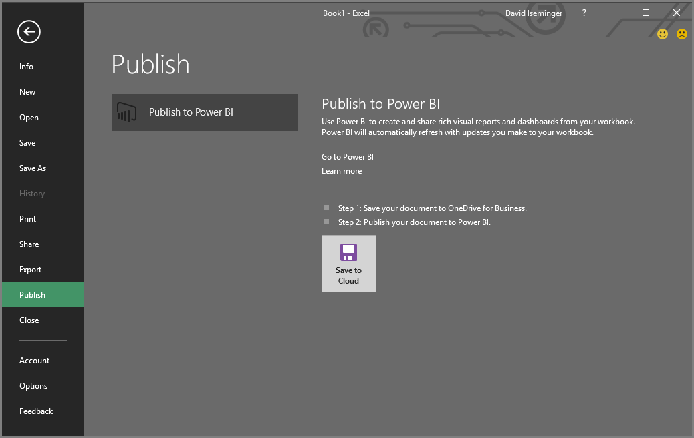
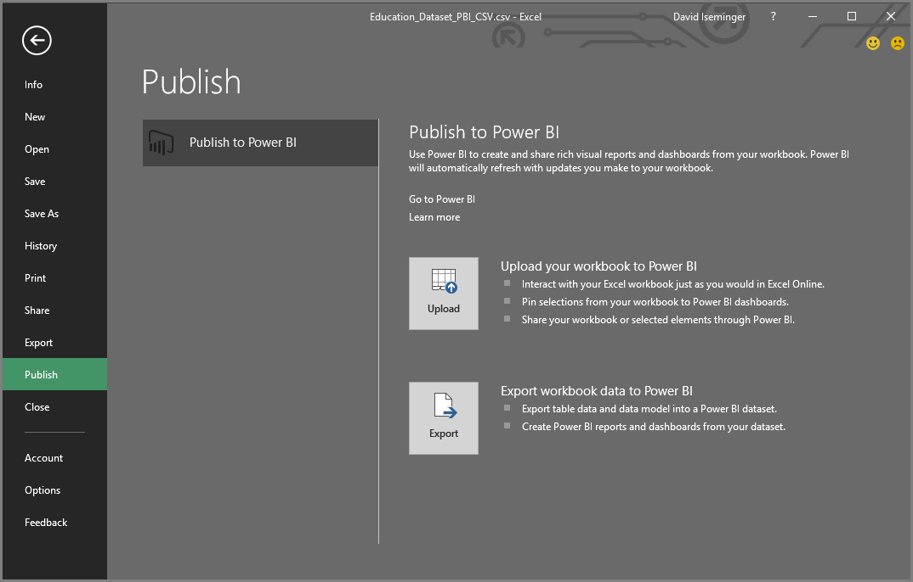

# Julkaiseminen Power BI:stä Excel 2016:een
Excel 2016:n avulla voit julkaista Excel-työkirjat suoraan [Power BI](https://powerbi.microsoft.com) -sivustoon, jossa voit luoda erittäin vuorovaikutteisia raportteja ja koontinäyttöjä työkirjan tietojen perusteella. Voit sitten jakaa merkityksellisiä tietoja muiden kanssa organisaatiossasi.

Ennen kuin siirrymme eteenpäin, tässä on joitakin asioita, jotka kannattaa pitää mielessä:

* Ennen kuin voit julkaista Power BI:hin, työkirjasi on tallennettava OneDrive for Businessiin.
* Tilin, jota käytät kirjautuessasi Officeen, OneDrive for Businessiin ja Power BI:n, on oltava sama tili.
* Et voi julkaista tyhjää työkirjaa tai työkirjaa, joka ei sisällä Power BI:n tukemaa sisältöä.
* Et voi julkaista salattuja tai salasanalla suojattuja työkirjoja tai työkirjoja Information Protection -hallinnalla.
* Power BI:hin julkaiseminen edellyttää, että moderni todentaminen on käytössä (oletus). Jos se ei ole käytössä, Julkaise-vaihtoehto ei ole käytettävissä Tiedosto-valikon kautta.

## Excel-työkirjan julkaiseminen
Valitse Excelissä **Tiedosto** > **Julkaise**.

### Paikallisen tiedoston julkaiseminen
Helmikuun 2017 päivityksestä alkaen Excel 2016 tukee paikallisten Excel-tiedostojen julkaisua. Niitä ei tarvitse tallentaa OneDrive for Businessiin tai SharePoint Onlineen.

> [!IMPORTANT]
> Vain Excel 2016 Office 365 -tilauksella sisältää paikallisten tiedostojen julkaisun käyttökokemuksen. Excel 2016:n erillisasennuksella on edelleen vain ”Julkaise”-toiminto, joka edellyttää, että Excel-työkirja tallennetaan OneDrive for Businessiin tai SharePoint Onlineen.
> 
> 

Kun valitset **Julkaise**, voit valita työtilan, johon haluat julkaista. Tämä voi olla henkilökohtainen tai ryhmän työtila, johon sinulla on käyttöoikeus.

Näkyviin tulee kaksi vaihtoehtoa, miten saat työkirjasi Power BI:hin.

Julkaisun jälkeen sitä säilytetään kopiona Power BI:ssä erillään paikallisesta tiedostosta. Jos haluat päivittää tiedoston Power BI:ssä, sinun on julkaistava päivitetty versio uudelleen. Voit päivittää tiedot ja määrittää ajoitetun päivityksen työkirjaan tai tietojoukkoon Power BI:ssä.

### Julkaiseminen erillisestä Excelistä
Jos työkirjaasi ei ole vielä tallennettu OneDriveen, sinun tulee tallentaa se sinne ensin. Valitse Tallenna pilvipalveluun ja valitse sijainti OneDrive for Businessissa.

Kun työkirja on tallennettu OneDriveen, kun valitset **Julkaise**, näkyviin tulee kaksi vaihtoehtoa, joilla saat työkirjasi Power BI:hin.

#### Työkirjan lataaminen Power BI:hin
Kun valitset tämän vaihtoehdon, työkirjasi näkyy Power BI:ssä aivan samalla tavalla kuin se näkyisi Excel Onlinessa. Mutta toisin kuin Excel Onlinessa, käytettävissäsi on käteviä ominaisuuksia, joilla voit kiinnittää laskentataulukoiden elementtejä koontinäyttöihin.

Et voi muokata työkirjaa, kun se on avoinna Power BI:ssä, mutta jos muutoksia on tehtävä, voit valita **Muokkaa**-vaihtoehdon ja sitten työkirjan muokkaamisen joko Excel Onlinessa tai tietokoneesi Excelissä. Tekemäsi muutokset tallennetaan työkirjaan OneDrivessa.

Latauksen aikana Power BI:ssä ei luoda mitään tietojoukkoja. Työkirja näkyy työtilan siirtymisruudussa Raportit-kohdassa. Power BI:hin ladatuilla työkirjoilla on erityinen Excel-kuvake, jotka merkitsevät ne ladatuiksi Excel-työkirjoiksi.

Valitse tämä vaihtoehto, jos sinulla on vain tietoja laskentataulukoissa tai sinulla Pivot-taulukoita ja kaavioita, jotka haluat nähdä Power BI:ssä.
Lataus-toiminnon käyttäminen Julkaise Power BI:hin -kohdasta Excelissä on melko sama, kuin jos valitset selaimen Power BI:ssä Nouda tiedot > Tiedosto > OneDrive for Business > Yhdistä, hallitse ja näytä Excel Power BI:ssä.

#### Työkirjan tietojen vieminen Power BI:hin
Kun valitset tämän vaihtoehdon, taulukoissa ja/tai tietomallissa tuetut tiedot viedään uuteen tietojoukkoon Power BI:ssä. Jos sinulla on Power View -taulukoita, ne luodaan uudelleen Power BI:ssä raportteina.

Voit jatkaa työkirjan muokkaamista. Kun tekemäsi muutokset tallennetaan, ne synkronoidaan Power BI:n tietojoukon kanssa yleensä tunnin kuluessa. Jos tarvitset tuloksia nopeammin, voit valita Julkaise uudelleen, jolloin muutokset viedään heti. Myös raporteissa ja raporttinäkymissä olevat visualisoinnit päivitetään.

Valitse tämä vaihtoehto, jos olet ladannut tiedot tietomalliin Hae ja muunna -ominaisuuden tai Power Pivotin avulla tai jos työkirjassa on visualisointeja sisältäviä Power View -taulukoita, jotka haluat nähdä Power BI:ssä.

Vie-toiminnon käyttäminen Julkaise Power BI:hin -kohdasta Excelissä on melko sama, kuin jos valitset selaimen Power BI:ssä Nouda tiedot > Tiedosto > OneDrive for Business > Vie Excel-tiedon Power BI:hin.

## Julkaiseminen
Kun valitset jommankumman vaihtoehdon, Excel kirjautuu Power BI:hin nykyiseltä tililtäsi ja sitten julkaisee työkirjan Power BI -sivustoon. Pidä silmällä Excelin tilariviä. Se näyttää yleistilanteen.

Kun toiminto on valmis, voit jatkaa Power BI:hin suoraan Excelistä.

## Seuraavat vaiheet
[Excel-tiedot Power BI:ssä](service-excel-workbook-files.md)  
Onko sinulla muuta kysyttävää? [Kokeile Power BI -yhteisöä](https://community.powerbi.com/)

