# Power BI:n Julkaise verkkoon -toiminto

Voit Power BI:n **Julkaise verkkoon** -toiminnon avulla helposti upottaa verkossa interaktiivisia Power BI -visualisointeja, kuten blogiposteja ja verkkosivustoja, sähköpostiviestien tai sosiaalisen median kautta kaikilla laitteilla.

Voit myös helposti muokata, päivittää ja ladata uudelleen julkaistuja visualisointeja tai poistaa niiden jakamisen.

> [!WARNING]
> **Julkaise verkkoon** -toiminnon avulla kuka tahansa Internetissä voi tarkastella julkaisemaasi raporttia tai visualisointia. Näiden raporttien tarkasteluun ei tarvita mitään todennusta. Käytä Julkaise verkkoon -toimintoa vain niiden raporttien ja tietojen kanssa, jotka voidaan näyttää kaikille Internetissä oleville jäsenille (ei-todennetut jäsenet). Tämä sisältää raportteihin yhdistetyt yksityiskohtaisen tason tiedot. Varmista ennen tämän raportin julkaisemista, että sinulla on oikeus jakaa tiedot ja visualisoinnit julkisesti. Älä julkaise luottamuksellisia tai omistusoikeudellisia tietoja. Jos olet epävarma, tarkista organisaatiosi käytännöt ennen julkaisemista.

## Julkaise verkkoon -toiminnon käyttäminen

**Julkaise verkkoon** -toiminto on käytettävissä henkilökohtaisessa tai ryhmän työtiloissa raporteille, joita voit muokata.  Et voi käyttää Julkaise verkkoon -toimintoa sellaisten raporttien kanssa, jotka jaettiin kanssasi, tai sellaisten raporttien kanssa, joiden tietoihin liittyy rivitason suojaus. Katso alla olevasta **Rajoitukset**-osiosta täydellinen luettelo tapauksista, joissa Julkaise verkkoon -toimintoa ei tueta. Katso tässä artikkelissa aiemmin mainittu **Varoitus** ennen Julkaise verkkoon -toiminnon käyttämistä.

Voit nyt katsoa seuraavasta *lyhyestä videosta*, miten tämä ominaisuus toimii. Kokeile sitten itse noudattamalla alla olevia vaiheita.

<iframe width="560" height="315" src="https://www.youtube.com/embed/UF9QtqE7s4Y" frameborder="0" allowfullscreen></iframe>

Seuraavissa vaiheissa kuvataan, miten voit käyttää **Julkaise verkkoon** -toimintoa.

1. Valitse työtilassa muokattavalle raportille **Tiedosto > Julkaise verkkoon**.
   
   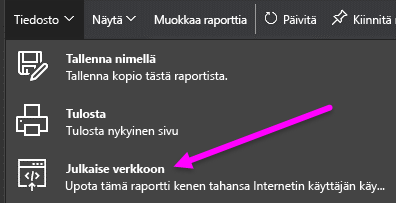

2. Tarkista valintaikkunan sisältö ja valitse **Luo upotuskoodi** seuraavassa valintaikkunassa esitetyllä tavalla.
   
   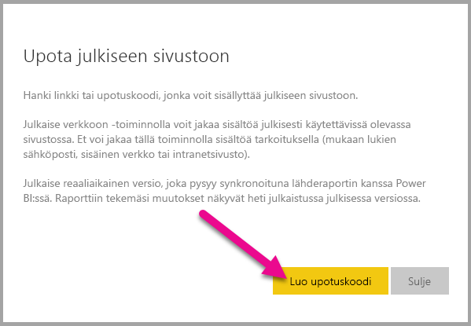

3. Lue seuraavassa valintaikkunassa näkyvä varoitus ja varmista, että tiedot voidaan upottaa julkiselle verkkosivustolle. Jos näin on, valitse **Julkaise**.
   
   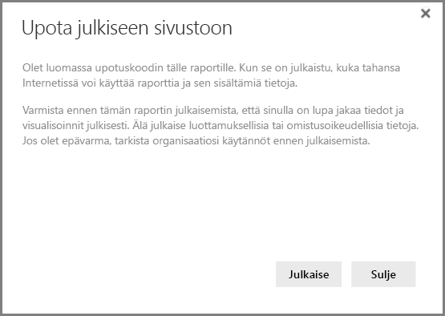

4. Näyttöön tulee valintaikkuna. Se sisältää linkin, joka voidaan lähettää sähköpostissa upotettuna koodiin (kuten iFrame) tai joka voidaan liittää suoraan verkkosivustolle tai blogiin.
   
   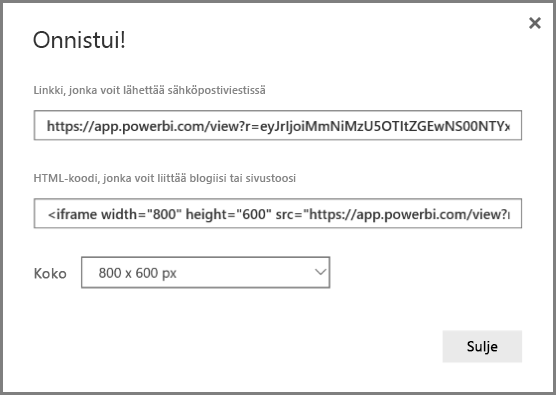

5. Jos olet aiemmin luonut raportin upotuskoodin, upotuskoodi tulee näkyviin nopeasti. Voit luoda vain yhden upotuskoodin kullekin raportille.
   
   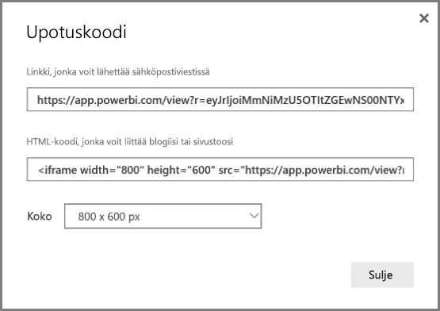

## Vihjeitä ja vinkkejä näyttötiloihin

Kun upotat sisältöä blogipostiin, sinun on yleensä sovitettava se tiettyyn näyttökokoon.  Voit myös muuttaa korkeutta ja leveyttä iFrame-tunnisteessa tarvittaessa. Sinun on kuitenkin ehkä myös varmistettava, että raporttisi mahtuu iFramen tietylle alueelle, ja määritettävä siten asianmukainen näyttötila raporttia muokattaessa.

Seuraavassa taulukossa on ohjeita näyttötilasta ja siitä, miten se tulee näkyviin upotettuna.

| Näyttötila | Miltä se näyttää upotettuna |
| --- | --- |
|  |**Sovita sivulle** noudattaa raportin sivun korkeutta ja leveyttä. Jos määrität sivun ”dynaamisille” suhteille, kuten 16:9 tai 4:3, sisältösi skaalautuu siten, että se mahtuu antamaasi iFrameen. Kun sisältö upotetaan iFrameen, **Sovita sivulle** -komennon käyttäminen voi aiheuttaa **letterboxingin**, jossa iFramen alueilla näkyy harmaa tausta sisällön jälkeen, koska sitä skaalataan mahtumaan iFrameen. Voit minimoida letterboxingin vaikutuksen määrittämällä iFramen korkeuden/leveyden asianmukaisesti. |
|  |**Todellinen koko** varmistaa, että raportin koko säilyy siten kuin se on määritetty raporttisivulle. Tämän vuoksi iFramessa voi olla vierityspalkkeja. Määritä iFramen korkeus ja leveys siten, että vältät vierityspalkit. |
|  |**Sovita leveyteen** -komento varmistaa, että sisältö mahtuu iFramen vaakasuuntaiselle alueelle. Reuna näkyy edelleen, mutta sisältö skaalataan käyttämään kaikkea saatavilla olevaa vaakasuuntaista tilaa. |

## Vihjeitä ja vinkkejä iFramen korkeuteen ja leveyteen

Upotuskoodi, jonka saat Julkaise verkkoon -komennon jälkeen, näyttää seuraavalta:

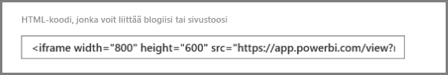

Voit muokata leveyttä ja korkeutta manuaalisesti, jotta ne ovat täsmälleen haluamasi siten, että sisältö mahtuu sivulle, johon sen upotat.

Jos haluat sovittaa sisällön vieläkin paremmin, voit yrittää lisätä 56 kuvapistettä iFramen korkeusdimensioon. Se mukauttaa alapalkin nykyistä kokoa. Jos raporttisivulla käytetään dynaamista kokoa, seuraavassa taulukossa on joitakin kokoja, joiden avulla voit mahduttaa sisällön ilman letterboxingia.

| Suhde | Koko | Dimensio (leveys x korkeus) |
| --- | --- | --- |
| 16:9 |Pieni |640 x 416 kuvapistettä |
| 16:9 |Keskikokoinen |800 x 506 kuvapistettä |
| 16:9 |Suuri |960 x 596 kuvapistettä |
| 4:3 |Pieni |640 x 536 kuvapistettä |
| 4:3 |Keskikokoinen |800 x 656 kuvapistettä |
| 4:3 |Suuri |960 x 776 kuvapistettä |

## Upotuskoodien hallinta

Kun olet luonut **Julkaise verkkoon** -upotuskoodin, voit hallita koodeja, jotka luot Power BI -palvelun **Asetukset**-valikosta. Upotuskoodien hallinta sisältää kyvyn poistaa koodin kohdevisualisoinnin tai raportin (upotuskoodia ei voida tämän jälkeen käyttää) tai upotuskoodin palauttamisen.

1. Voit hallita omia **Julkaise verkkoon** -upotuskoodeja avaamalla **Asetukset**-rataskuvakkeen ja valitsemalla **Hallitse upotuskoodeja**.
   
   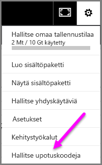

2. Esiin tulee luomiesi upotuskoodien luettelo seuraavassa kuvassa esitetyllä tavalla.
   
   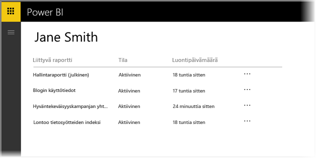

3. Voit sitten luettelossa olevan kunkin **Julkaise verkkoon** -upotuskoodin tapauksessa joko noutaa upotuskoodin tai poistaa sen ja siten estää tähän raporttiin tai visualisointiin liittyvän linkin toiminnan.
   
   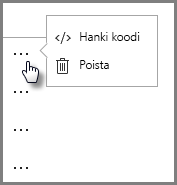

4. Jos valitset **Poista**, sinulta kysytään, haluatko varmasti poistaa upotuskoodin.
   
   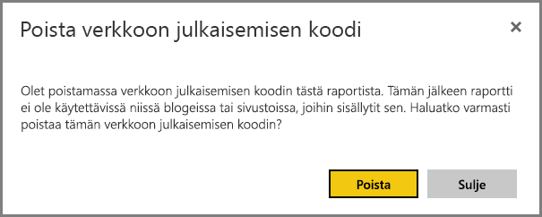

## Raporttien päivittäminen ja tietojen uudelleenlataus

Kun olet luonut oman **Julkaise verkkoon** -upotuskoodin ja jakanut sen, raporttiin päivitetään kaikki tekemäsi muutokset. Sinun on kuitenkin tärkeää tietää, että voi kestää hetken, ennen kuin käyttäjäsi näkevät päivityksen. Raportin tai visualisoinnin päivittäminen kestää noin tunnin, ennen kuin näet sen Julkaise verkkoon -upotuskoodeissa.

Kun käytät ensimmäisen kerran **Julkaise verkkoon** -komentoa upotuskoodin saamiseksi, upotuskoodi on heti aktiivinen ja kuka tahansa, joka avaa linkin, voi tarkastella sitä.  Kun olet ensimmäisen kerran käyttänyt Julkaise verkkoon -toimintoa, voi kestää noin tunnin, ennen kuin käyttäjät näkevät niiden raporttien ja visualisointien seuraavat päivitykset, joihin verkkolinkki osoittaa.

Löydät lisätietoja tässä artikkelissa olevasta **Miten se toimii** -osiosta. Jos haluat, että päivitykset ovat heti saatavilla, voit poistaa upotuskoodin ja luoda uuden upotuskoodin.

## Tietojen uudelleenlataus

Tietojen uudelleenlataukset näkyvät automaattisesti upotetussa raportissa tai visualisoinnissa. Voi kestää noin tunnin verran, ennen kuin uudelleenladatut tiedot näkyvät upotuskoodeissa. Voit poistaa automaattisen uudelleenlatauksen käytöstä valitsemalla **Älä lataa uudelleen** raportin käyttämän tietojoukon aikataulussa.  

## Mukautetut visualisoinnit

Mukautettuja visualisointeja tuetaan **Julkaise verkkoon** -toiminnossa. Kun käytät Julkaise verkkoon -toimintoa, niiden käyttäjien, joiden kanssa jaat julkaistun visualisoinnin, ei tarvitse ottaa käyttöön mukautettuja visualisointeja raportin tarkastelemiseksi.

## Rajoitukset

**Julkaise verkkoon** -toimintoa tuetaan useimmissa tietolähteissä ja raporteissa Power BI -palvelussa. Julkaise verkkoon -toimintoa **ei kuitenkaan tällä hetkellä tueta tai se ei ole saatavilla** seuraavien raporttien tapauksessa:

- Raportit, jotka käyttävät rivitason suojausta.
- Raportit, jotka käyttävät reaaliaikaisen yhteyden tietolähdettä, mukaan lukien paikallisesti isännöity Analysis Services Tabular, Analysis Services Multidimensional ja Azure Analysis Services.
- Raportit jaetaan sinulle suoraan tai organisaation sisältöpaketin kautta.
- Raportit ryhmässä, jonka muokkausjäsen et ole.
- ”R”-visualisointeja ei tällä hetkellä tueta Julkaise verkkoon -raporteissa.
- Tietojen vieminen visualisoinneista raportissa, joka on julkaistu verkkoon
- Power BI -visualisointien ArcGIS Maps
- Raportit, jotka sisältävät raporttitason DAX-mittayksiköitä
- Kertakirjautuminen tietokyselymalleissa
- [Luottamuksellisten tai omistusoikeudellisten tietojen suojaaminen](#publish-to-web-from-power-bi)

## Vuokraaja-asetukset

Power BI:n järjestelmänvalvojat voivat ottaa Julkaise verkkoon -toiminnon käyttöön tai poistaa sen käytöstä. He voivat myös rajoittaa käyttöoikeuden tietyille ryhmille. Kykysi luoda upotuskoodin muutoksia perustuu tähän asetukseen.

|Toiminto |Otettu käyttöön koko organisaatiolle |Otettu käyttöön koko organisaatiolle |Tietyt käyttöoikeusryhmät   |
|---------|---------|---------|---------|
|Raportin **Tiedosto**-valikon **Julkaise verkkoon** -toiminto|Käytössä kaikille|Ei näkyvissä kaikille|Näkyvissä vain valtuutetuille käyttäjille tai ryhmille.|
|**Asetukset**-valikon **Upotuskoodien hallinta**|Käytössä kaikille|Käytössä kaikille|Käytössä kaikille  * **Poista**-vaihtoehto vain valtuutetuille käyttäjille tai ryhmille. * **Hae koodit** käytössä kaikille.|
|**Upotuskoodit** hallintaportaalissa|Tila ilmaisee jotain seuraavista: * Aktiivinen * Ei tuettu * Estetty|Tilana näytetään **Ei käytössä**|Tila ilmaisee jotain seuraavista: * Aktiivinen * Ei tuettu * Estetty  Jos käyttäjälle ei ole annettu oikeuksia vuokraaja-asetuksissa, tilana näytetään **Loukannut**.|
|Aiemmin luodut julkaistut raportit|Kaikki käytössä|Kaikki poissa käytöstä|Raportit näytetään jatkossakin kaikille.|

## Upotuskoodin tilan sarakkeen ymmärtäminen

Kun tarkastelet **Upotuskoodien hallinta** -sivua **Julkaise verkkoon** -upotuskoodeille, näet tilan sarakkeen. Upotuskoodit ovat oletusarvoisesti aktiivisia, mutta voit kohdata joitakin alla luetelluista tiloista.

| Tila | Kuvaus |
| --- | --- |
| **Aktiivinen** |Internet-käyttäjät voivat tarkastella ja käsitellä raporttia. |
| **Estetty** |Raportin sisältö rikkoo [Power BI:n palveluehtoja](https://powerbi.microsoft.com/terms-of-service). Microsoft on estänyt sisällön näkymisen. Ota yhteyttä tukeen, jos uskot, että sisältö on estetty virheellisesti. |
| **Ei tueta** |Raportin tietojoukko käyttää rivitason suojausta tai muuta määritystä, jota ei tueta. Katso täydellinen luettelo **Rajoitukset**-osiosta. |
| **Loukannut** |Upotuskoodi on määritetyn vuokraajan käytännön ulkopuolella. Näin tapahtuu yleensä, kun upotuskoodi luotiin ja sitten Julkaise verkkoon -vuokraaja-asetusta muutettiin sulkemalla ulkopuolelle käyttäjä, joka omistaa upotuskoodin. Jos vuokraaja-asetus on poistettu käytöstä tai käyttäjä ei enää voi luoda upotuskoodeja, aiemmin luotujen upotuskoodien tilana on **Loukannut**. |

## Miten voit ilmoittaa Julkaise verkkoon -sisältöä koskevan huolenaiheen

Voit ilmoittaa verkkosivustoon tai blogiin upotettua **Julkaise verkkoon** -sisältöä koskevan huolenaiheen käyttämällä alapalkissa olevaa **Lippu**-kuvaketta seuraavassa kuvassa esitetyllä tavalla. Sinua pyydetään lähettämään Microsoftille sähköpostiviesti, jossa selität huolenaiheen. Microsoft arvioi sitten sisällön Power BI:n käyttöehtojen mukaisesti ja toteuttaa asianmukaisia toimenpiteitä.

Voit ilmoittaa huolenaiheesta valitsemalla **Lippu**-kuvakkeen näkemäsi Julkaise verkkoon -raportin alapalkista.

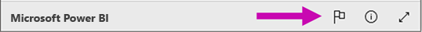

## Käyttöoikeudet ja hinnoittelu

Sinun on oltava Microsoft Power BI:n käyttäjä, jotta voit käyttää **Julkaise verkkoon** -toimintoa. Raporttisi käyttäjien (lukijat, tarkastelijat) ei tarvitse olla Power BI:n käyttäjiä.

## Miten se toimii (tekniset tiedot)

Kun luot upotuskoodin **Julkaise verkkoon** -toiminnon avulla, Internet-käyttäjät näkevät raportin. Se on yleisesti saatavilla, joten tarkastelijat voivat helposti jakaa raportin sosiaalisen median kautta vastaisuudessa. Kun käyttäjät tarkastelevat raporttia joko avaamalla suoran julkisen URL-osoitteen tai tarkastelemalla sitä upotettuna verkkosivulle tai blogiin, Power BI piilottaa raportin määritelmän ja raportin tarkasteluun vaadittujen pyyntöjen tulokset. Tällä tavoin taataan, että tuhannet käyttäjät voivat tarkastella raporttia samanaikaisesti suorituskyvystä tinkimättä.

Välimuisti on pitkäkestoinen, joten jos päivität raportin määritelmää (esimerkiksi jos muutat sen näyttötilaa) tai lataat uudelleen raporttitietoja, voi kestää noin tunnin, ennen kuin muutokset näkyvät käyttäjien tarkastelemassa raportin versiossa. Suosittelemme siksi, että suunnittelet työsi etukäteen, ja luot **Julkaise verkkoon** -upotuskoodin vain, kun olet tyytyväinen asetuksiin.

Onko sinulla muuta kysyttävää? [Kokeile Power BI -yhteisöä](http://community.powerbi.com/)
