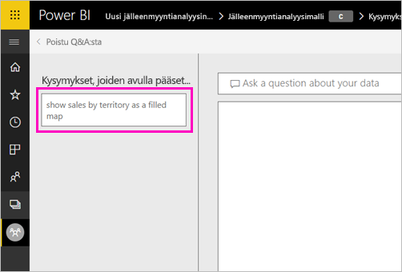
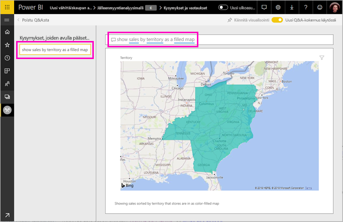

# Power BI:n Q&A-toiminnon suositeltujen kysymysten luominen
Jos omistat tietojoukon, voit lisätä siihen omia suositeltuja kysymyksiä. Power BI Q & A näyttää sitten kyseiset kysymykset kuka raporttien, jotka perustuvat.  Suositellut kysymykset antavat työtovereille ideoita kysymyksistä, joita he voivat kysyä tietojoukosta. Sinä valitset lisättävät suositellut kysymykset – voit lisätä suosittuja kysymyksiä, kiinnostavia vastauksia antavia kysymyksiä tai kysymyksiä, joita voi olla vaikea muotoilla.

> [!NOTE]
> Suositellut Q & kysymykset ovat käytettävissä [Microsoft Power BI-sovelluksessa iOS: lle iPad-, iPhone- ja iPod Touch-laitteissa](consumer/mobile/mobile-apps-ios-qna.md) ja Power BI Desktop Q & a: ta. Luodaan kysymyksiä on käytettävissä vain Power BI-palvelussa (app.powerbi.com).
> 

## Luo suositeltu kysymys

Tässä artikkelissa käytetään [jälleenmyyntianalyysimallia](sample-datasets.md). Noudattamalla näitä vaiheittaisia ohjeita yritä tutkiminen tietojoukon.

1. Valitse koontinäytöstä Q&A-kysymysruutu.   Huomaa, että Q&A:sta on jo hyötyä, sillä se näyttää luettelon tietojoukossa esiintyvistä termeistä.
2. Jos haluat lisätä tähän luetteloon, valitse rataskuvake Power BI oikeassa yläkulmassa.  
   
3. Valitse **Asetukset** &gt; **Tietojoukko** &gt; **Jälleenmyyntianalyysimalli** &gt; **Suositellut Q&A-kysymykset**.  
4. Valitse **Lisää kysymys**.
   
   
5. Kirjoita kysymys tekstiruutuun ja valitse **Käytä**.   Voit halutessasi lisätä muita kysymyksiä valitsemalla **Lisää kysymys**.  
   
6. Palaa takaisin jälleenmyyntianalyysimallin Power BI -koontinäyttöön ja aseta hiiriosoitin Q&A-kysymysruutuun.   
   
7. Uusi suositeltu kysymys **Myynti alueen mukaan karttana** on luettelossa ensimmäisenä. Valitse se.  
8. Vastaus näytetään täytetyn kartan visualisointina.  
   

## Seuraavat vaiheet

- [Q & A kuluttajat](consumer/end-user-q-and-a.md)  
- [Koontinäyttöjen ja raporttien Q & A: n käyttäminen](power-bi-tutorial-q-and-a.md)  
- [Power BI:n peruskäsitteet](consumer/end-user-basic-concepts.md)  

Onko sinulla muuta kysyttävää? [Kokeile Power BI -yhteisöä](http://community.powerbi.com/)

