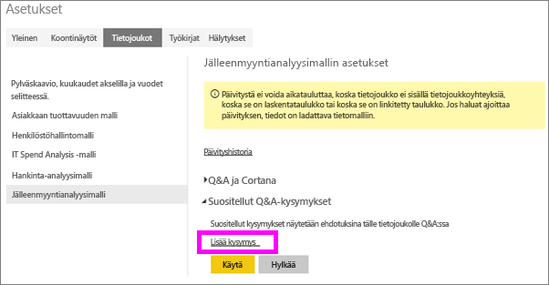
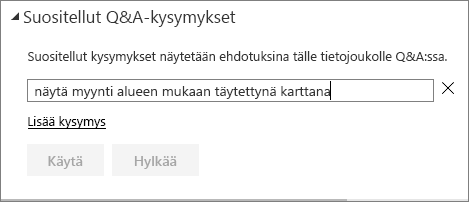
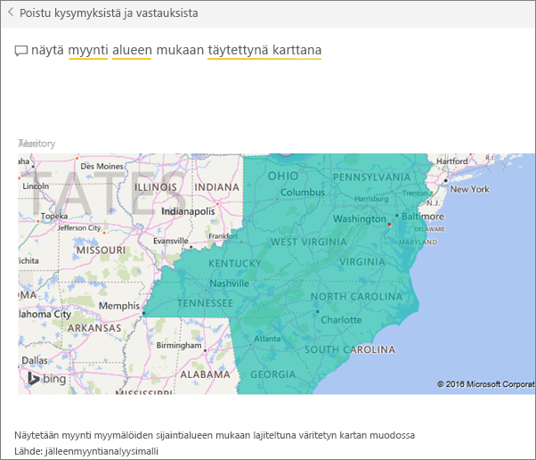

# Power BI:n Q&A-toiminnon suositeltujen kysymysten luominen
Jos omistat tietojoukon, voit lisätä siihen omia suositeltuja kysymyksiä.  Power BI Q&A näyttää sitten kyseiset kysymykset tietojoukkoa käyttäville (*kuluttaville*) työtovereille.  Suositellut kysymykset antavat työtovereille ideoita kysymyksistä, joita he voivat kysyä tietojoukosta. Sinä valitset lisättävät suositellut kysymykset – voit lisätä suosittuja kysymyksiä, kiinnostavia vastauksia antavia kysymyksiä tai kysymyksiä, joita voi olla vaikea muotoilla.

Katso, kun Will lisää joitakin suositeltuja kysymyksiä Power BI Q&A:han ja tutkii sitten tietojoukkoaan kyseisten suositeltujen kysymysten avulla. Kokeile sitten itse noudattamalla videon alapuolella olevia vaiheittaisia ohjeita.

<iframe width="560" height="315" src="https://www.youtube.com/embed/E1mIAyEXuF4" frameborder="0" allowfullscreen></iframe>

> [!NOTE]
> Suositellut Q&A-kysymykset ovat käytettävissä [Microsoft Power BI -sovelluksessa iOS:lle iPad-, iPhone- ja iPod Touch -laitteissa](consumer/mobile/mobile-apps-ios-qna.md) sekä Power BI Desktop Q&A Preview’ssa. Kysymyksiä voi kuitenkin luoda vain Power BI -palvelussa (app.powerbi.com).
> 

Tässä artikkelissa käytetään [jälleenmyyntianalyysimallia](sample-datasets.md).

1. Valitse koontinäytöstä Q&A-kysymysruutu.   Huomaa, että Q&A:sta on jo hyötyä, sillä se näyttää luettelon tietojoukossa esiintyvistä termeistä.
2. Voit lisätä kohteita tähän luetteloon valitsemalla Power BI:n oikeasta yläkulmasta rataskuvakkeen.  
   
3. Valitse **Asetukset** &gt; **Tietojoukko** &gt; **Jälleenmyyntianalyysimalli** &gt; **Suositellut Q&A-kysymykset**.  
4. Valitse **Lisää kysymys**.
   
   
5. Kirjoita kysymys tekstiruutuun ja valitse **Käytä**.   Voit halutessasi lisätä muita kysymyksiä valitsemalla **Lisää kysymys**.  
   
6. Palaa takaisin jälleenmyyntianalyysimallin Power BI -koontinäyttöön ja aseta hiiriosoitin Q&A-kysymysruutuun.   
   
7. Uusi suositeltu kysymys **Myynti alueen mukaan karttana** on luettelossa ensimmäisenä. Valitse se.  
8. Vastaus näytetään täytetyn kartan visualisointina.  
   

### Seuraavat vaiheet
[Q&A Power BI:ssä](consumer/end-user-q-and-a.md)  
[Opetusohjelma: Power BI Q&A:n johdanto](power-bi-visualization-introduction-to-q-and-a.md)  
[Power BI:n peruskäsitteet](consumer/end-user-basic-concepts.md)  
Onko sinulla muuta kysyttävää? [Kokeile Power BI -yhteisöä](http://community.powerbi.com/)

