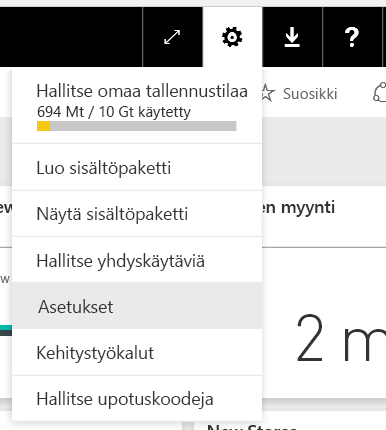
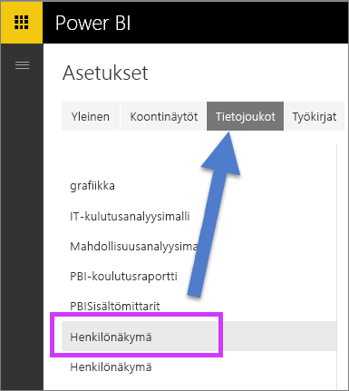
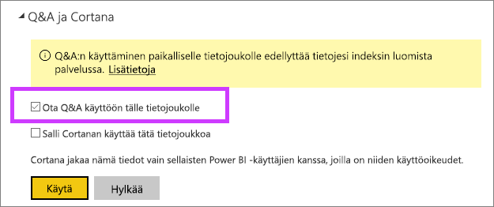

# Q&A:n ottaminen käyttöön reaaliaikaisia yhteyksiä varten Power BI:ssä
## Mikä on paikallinen tietoyhdyskäytävä?  Mikä on reaaliaikainen yhteys?
Power BI ‑tietojoukkoja voi joko tuoda Power BI:hin tai niihin voi luoda reaaliaikaisen yhteyden. Reaaliaikainen yhteys tietojoukkoja viitataan usein nimellä ”paikalliseen”. Reaaliaikaisia yhteyksiä hallitaan käyttämällä [yhdyskäytävää](service-gateway-onprem.md), ja tietoja ja kyselyitä lähetetään edestakaisin käyttämällä reaaliaikaisia kyselyjä.

## Q & A paikallisen tietoyhdyskäytävän tietojoukot
Jos haluat käyttää Q&A:ta sellaisten tietojoukkojen kanssa, joita käytät yhdyskäytävän kautta, sinun on ensin otettava ne käyttöön.

Kun ne on otettu käyttöön, Power BI luo tietolähteestäsi indeksin ja lataa tiedoista alijoukon Power BI:hin, jotta voit esittää kysymyksiä. Ensimmäisen indeksin luomiseen voi kulua useita minuutteja. Power BI ylläpitää indeksiä ja päivittää sen automaattisesti tietojen muuttuessa. Q&A:n käyttö tällaisten tietojoukkojen kanssa toimii samalla tavalla kuin Power BI:hin julkaistujen tietojen kanssa. Molemmat tavat tukevat täyttä Q&A-kokemusta, myös tietolähteen käyttöä yhdessä Cortanan välityksellä.

Kun esität kysymyksiä Power BI:ssä, Q&A määrittää tietojoukkosi indeksiä käyttämällä parhaan visualisoinnin tai raportintaulukon, joka vastaisi kysymykseesi. Määritettyään parhaan mahdollisen vastauksen Q&A noutaa DirectQueryn avulla yhdyskäytävän kautta reaaliaikaiset tiedot tietolähteestä ja täyttää kaaviot tiedoilla. Se tarkoittaa, että Power BI:n Q&A-tuloksissa esitetään aina ajantasaiset tiedot suoraan pohjana olevasta tietolähteestä.

Koska Power BI:n Q&A käyttää tietolähteestä peräisin olevia teksti- ja rakennearvoja määrittämään, miten pohjana olevaan malliin tehdään kysely, tiettyjä uusia tai poistettuja tekstiarvoja koskevat haut (esimerkiksi pyyntö hiljattain lisättyyn tekstitietueeseen liittyvästä asiakkaan nimestä) ovat riippuvaisia siitä, että indeksin arvot ovat ajan tasalla. Power BI pitää automaattisesti teksti- ja rakenneindeksin ajan tasalla 60 minuutin muutosikkunalla.

Lisätietoja:

* Mikä [paikallisen tietoyhdyskäytävän](service-gateway-onprem.md)?
* [Power BI Q & A: n kuluttajille](consumer/end-user-q-and-a.md)

## Q&A:n ottaminen käyttöön
Kun olet määrittänyt tietoyhdyskäytävän, muodosta sen kautta yhteys tietoihisi Power BI:ssä.  Voit joko luoda koontinäytön käyttämällä paikallisia tietoja tai ladata .pbix-tiedoston, joka käyttää paikallisia tietoja.  Sinulla voi olla myös valmiiksi paikallisia tietoja koontinäytöissä, raporteissa ja tietojoukoissa, jotka on jaettu sinulle.

1. Valitse Power BI:n oikeasta yläkulmasta hammasrataskuvake  ja valitse **Asetukset**.
   
   
2. Valitse **Tietojoukot** ja valitse sitten tietojoukko, jota haluat hyödyntää Q&A-toiminnossa.
   
   
3. Laajenna kohta **Q&A ja Cortana**, valitse valintaruutu **Ota Q&A käyttöön tässä tietojoukossa** ja valitse **Käytä**.
   
    

## Tietojen tallentaminen välimuistiin ja yksityisyydensuoja
Kun otat Q&A:n käyttöön paikallisissa tiedoissa, osa tiedoista tallennetaan palvelun välimuistiin. Se varmistaa Q&A:n kohtuullisen suorituskyvyn. Power BI jättää välimuistista pois arvot, jotka ovat yli 24 merkkiä pitkiä. Välimuisti poistetaan muutaman tunnin kuluessa siitä, kun poistat Q&A :n käytöstä poistamalla valintamerkin kohdasta **Ota Q&A käyttöön tässä tietojoukossa** tai kun poistat tietojoukon.

## Huomioon otettavat seikat ja vianmääritys
Ominaisuudella on joitakin rajoituksia:

* Aluksi ominaisuus on käytettävissä vain taulukkomuotoisille SQL Server 2016 Analysis Services  ‑tietolähteille. Ominaisuus on optimoitu toimimaan taulukkomuotoisten tietojen kanssa. Q & A-käyttökokemus ei vielä tueta monidimensioisena. Muita tietolähteitä paikallisen tietoyhdyskäytävän tukemia tarjolle ajan kuluessa.
* Täysi tuki rivitason suojaukselle SQL Server Analysis Services ei ole käytettävissä alun perin. Kun esittää kysymyksiä Q & A ”automaattinen täydennys” aikana kirjoittamalla näyttää merkkijonoarvoja käyttäjä, joihin ei voi käyttää. Mallissa määritettyä rivitason suojausta kuitenkin kunnioitetaan raporttien ja kaaviovisualisointien osalta, eli taustalla olevia numeerisia tietoja ei paljastu. Tulevissa päivityksissä julkaistaan asetukset, joilla tätä käytöstä voi hallita.
* Objektin rivitason suojaus (OLS) ei tueta. Q & A ei noudattaa objektin rivitason suojaus ja voi paljastaa taulukko tai sarakkeiden nimiä käyttäjille, joilla ei ole niihin käyttöoikeutta. Sinun on otettava käyttöön rivitason suojaus (RSL) sen varmistamiseksi, että myös data-arvot suojataan asianmukaisesti. 
* Reaaliaikaisia yhteyksiä tuetaan vain paikallisen tietoyhdyskäytävän kanssa. Tämän vuoksi tämä ei voi käyttää henkilökohtaisen yhdyskäytävän kanssa.

## Seuraavat vaiheet

- [On-premises data gateway (Paikallinen tietoyhdyskäytävä)](service-gateway-onprem.md)  
- [Tietolähteen hallinta – Analysis Services](service-gateway-enterprise-manage-ssas.md)  
- [Power BI: Peruskäsitteet](consumer/end-user-basic-concepts.md)  
- [Yleiskatsaus Power BI Q&A:sta](consumer/end-user-q-and-a.md)  

Onko sinulla kysyttävää? [Voit esittää kysymyksiä Power BI -yhteisössä](http://community.powerbi.com/)

