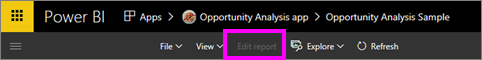
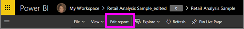
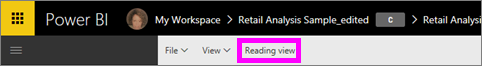

# Lukunäkymä ja muokkausnäkymä Power BI -palvelun raporteissa
Power BI -palvelussa (ei koske Power BI Desktopia) raportteja voi tarkastella ja käyttää kahdessa tilassa: lukunäkymässä ja muokkausnäkymässä. Lukunäkymä on kaikkien käyttäjien käytettävissä, ja se on suunniteltu erityisesti tietojen *kuluttajille*, kun taas muokkausnäkymää voivat käyttää vain raporttien *tekijät* ja omistajat.

## Raportin lukunäkymä

 Lukunäkymä mahdollistaa raportin tarkastelemisen ja käyttämisen. Se on kätevä ja turvallinen tapa käsitellä tietoja ja perehtyä niihin. Lukunäkymä on suunniteltu raporttien *kuluttajille*, jotka avaavat raportteja sovelluksista tai joiden kanssa muut ovat [jakaneet raportteja](service-share-dashboards.md). Lukunäkymä varmistaa, että tietyn raportin jokainen yksittäinen kuluttaja näkee saman raportin samoilla visualisoinneilla ja valinnaisesti myös samoilla suodattimilla.  Kuluttajat voivat käyttää raportteja interaktiivisesti ja muuttaa käytössä olevia suodattimia (nämä muutokset myös tallentuvat raportin mukana), mutta eivät voi lisätä uusia suodattimia.

>**Huomautus**: tietyissä tilanteissa raportin kuluttajat voivat nähdä eri tietoja rivitason suojauksen ja käyttöoikeuksien vuoksi.

## Raportin muokkausnäkymä

Muokkausnäkymää voi käyttää vain raportin luonut henkilö tai henkilö, joka [myös omistaa raportin sovellustyötilan jäsenen tai järjestelmänvalvojan ominaisuudessa](service-create-distribute-apps.md).

Muokkausnäkymä on suunniteltu raportin *luojille*. Tässä näkymässä raporttien luojat voivat tuoda tietoja ja yhdistää niitä tietojoukkoihin, tutkia tietoja ja luoda raportteja ja koontinäyttöjä. Muokkausnäkymässä raporttien *luojat* voivat tutustua tietoihin vielä tarkemmin lisäämällä ja poistamalla kenttiä, muuttamalla visualisointityyppiä, luomalla uusia visualisointeja ja lisäämällä ja poistamalla visualisointeja ja sivuja raportista. Tämän jälkeen he voivat jakaa luomiaan raportteja työtovereiden kanssa.

## Lukunäkymä verrattuna muokkausnäkymään
Tässä kaaviossa ei luetella Power BI -palvelun kaikkia raporttiominaisuuksia. Siinä luetellaan vain raporttitehtävät, jotka eivät ole käytettävissä **sekä** lukunäkymässä että muokkausnäkymässä.

|Tehtävä  | Lukunäkymä  | Muokkausnäkymä |
|-------------------------|-------|-------|
|**Raportit kokonaisuutena**  |
| [Raportin luominen tai muokkaaminen](service-report-create-new.md) | Ei  | Kyllä |
| [Raportin jakaminen](service-share-reports.md)| Kyllä | Kyllä, ja myös käyttöoikeuksien hallinta on mahdollista, mukaan lukien *omistajan* käyttöoikeuksien antaminen muille. |
| [Pysyvien visuaalisen tason, alirakennetason, sivutason ja raporttitason suodattimien luominen Suodattimet-ruudusta](power-bi-report-add-filter.md) | Ei  | Kyllä |
| [Raportin Suodattimet-ruudun käyttäminen](power-bi-how-to-report-filter.md) | Kyllä, olemassa olevia suodattimia voidaan käyttää ja muutokset voidaan tallentaa raportin mukana, mutta uusia suodattimia ei voida lisätä. | Kyllä |
| [Raportin Analytiikka-ruudun käyttäminen](service-analytics-pane.md) | Ei | Kyllä |
| [Raportin **Näkymä**-asetukset](power-bi-report-display-settings.md) | Kyllä, tietyin poikkeuksin. | Kyllä, kaikki mukaan lukien ruudukot, kohdistus ja lukitus. |
| [Päivitysaikataulun luominen](refresh-data.md) | Ei  | Kyllä |
| [Raportin tilaaminen](service-report-subscribe.md) | Kyllä | Ei |
| [Q&A – kysymysten esittäminen raporteissa](power-bi-q-and-a.md) | Ei  | Kyllä |
| [Käyttömittarien näyttäminen ](service-usage-metrics.md) | Kyllä, raportin piirtoalustalla. | Kyllä, raporttiluettelossa (sisältönäkymässä) |
| [Aiheeseen liittyvän sisällön näyttäminen](service-related-content.md) | Kyllä, raportin piirtoalustalla. | Kyllä, raporttiluettelossa (sisältönäkymässä) |
| [Raportin tallentaminen](service-report-save.md) | Kyllä, mutta vain käyttämällä **Tallenna nimellä** -komentoa. | Kyllä |
| [Raportin poistaminen](service-delete.md) | Ei  | Kyllä |
|**Raporttisivut** |
| [Raporttisivun lisääminen tai nimeäminen uudelleen](power-bi-report-add-page.md)  | Ei  | Kyllä  |
| [Raporttisivun monistaminen](power-bi-report-copy-paste-page.md) | Ei  | Kyllä |
| [Raporttisivun poistaminen](service-delete.md) | ei | kyllä |
|**Raportin visualisointien käyttäminen**|
| [Visualisointien lisääminen raporttiin](visuals/power-bi-report-add-visualizations-i.md) | Ei  | Kyllä |
| [Tekstiruutujen ja muotojen lisääminen raporttiin](power-bi-reports-add-text-and-shapes.md) | Ei  | Kyllä |
| [Raportin Muotoilu-ruudun käyttäminen](service-the-report-editor-take-a-tour.md) | Ei | Kyllä |
| [Visualisoinnin vuorovaikutusten määrittäminen](service-reports-visual-interactions.md) | Ei  | Kyllä |
| [Visualisoinnin lähdetietojen näyttäminen](service-reports-show-data.md) | Ei  | Kyllä |
| [Tietoihin porautumisen määrittäminen](power-bi-visualization-drill-down.md) | Ei  | Kyllä |
| [Käytössä olevan visualisointityypin muuttaminen](visuals/power-bi-report-change-visualization-type.md) | Ei | Kyllä|
| [Visualisoinnin, tekstiruudun tai muodon poistaminen](service-delete.md)| Ei | Kyllä |

## Muokkausnäkymän ja lukunäkymän välillä siirtyminen
Muista, että vain raportin luoja ja omistaja(t) voivat avata raportin muokkausnäkymässä.

1. Tavallisesti raportti avautuu oletusarvoisesti lukunäkymässä. Tiedät olevasi lukunäkymässä, jos näet **Muokkaa raporttia** -vaihtoehdon. Jos **Muokkaa raporttia** näkyy harmaana, sinulla ei ole oikeuksia avata raporttia muokkausnäkymässä.

   

2. Voit avata raportin muokkausnäkymässä valitsemalla **Muokkaa raporttia** -vaihtoehdon, jos se ei ole harmaa.

   

   Raportti on nyt muokkausnäkymässä ja käyttää samoja [näyttöasetuksia](power-bi-report-display-settings.md), joita käytit viimeksi lukunäkymässä.

2. Voit palata lukunäkymään valitsemalla **Lukunäkymä**-vaihtoehdon yläreunan siirtymispalkista.

    

### Seuraavat vaiheet
Voit käsitellä raporttia lukunäkymässä monin eri tavoin ja saada esiin merkityksellistä tietoa ja vastauksia kysymyksiin paloittelemalla ja purkamalla raportin tietoja.  Seuraavassa aiheessa, [Raportin käsittely lukunäkymässä](service-interact-with-a-report-in-editing-view.md), kuvataan joitain näitä seikkoja yksityiskohtaisesti.    
Takaisin [Power BI -raportteihin](service-reports.md)    
Onko sinulla muuta kysyttävää? [Kokeile Power BI -yhteisöä](http://community.powerbi.com/)
