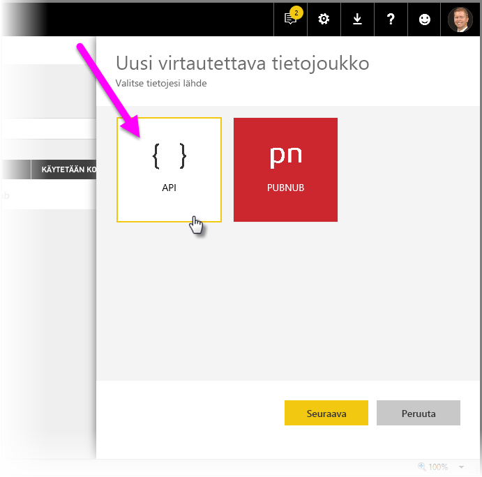
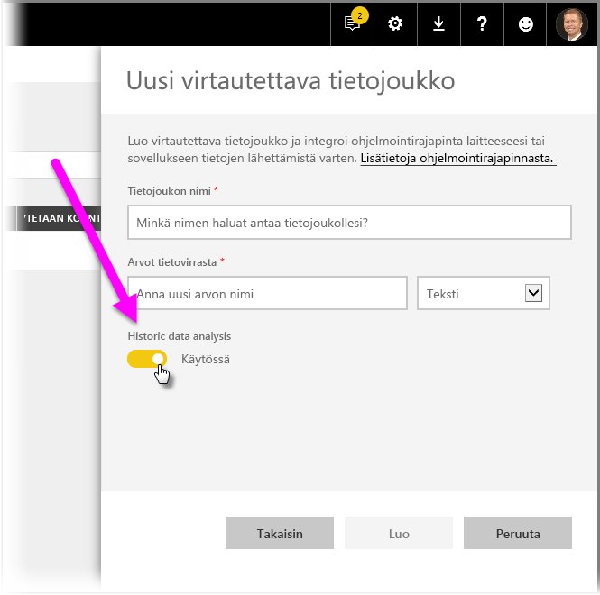
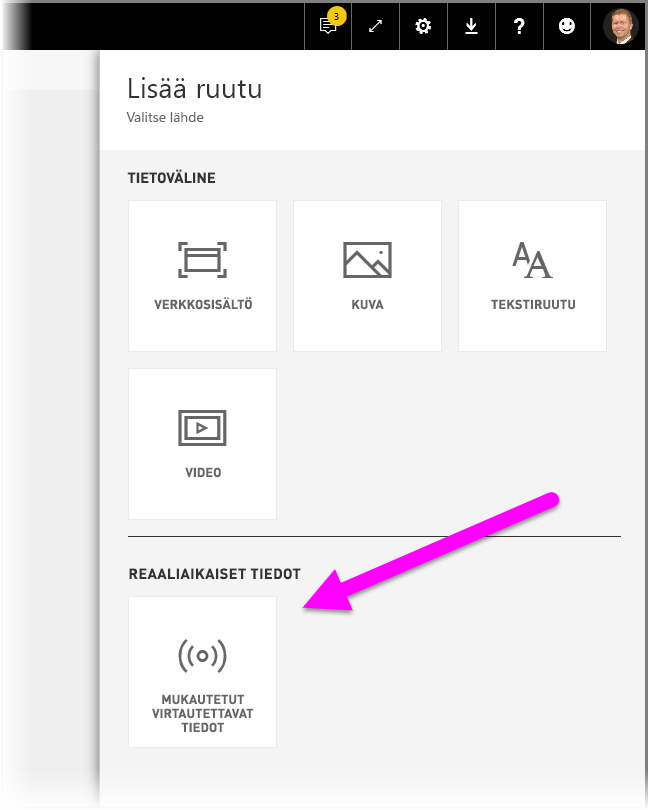
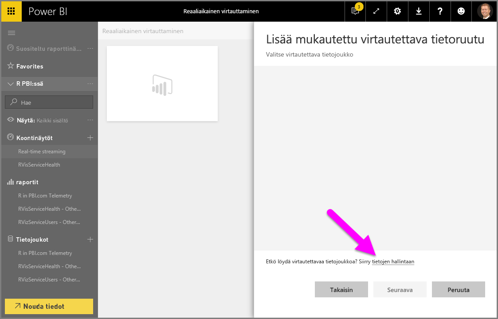
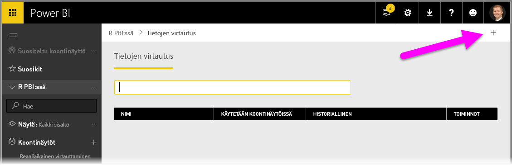
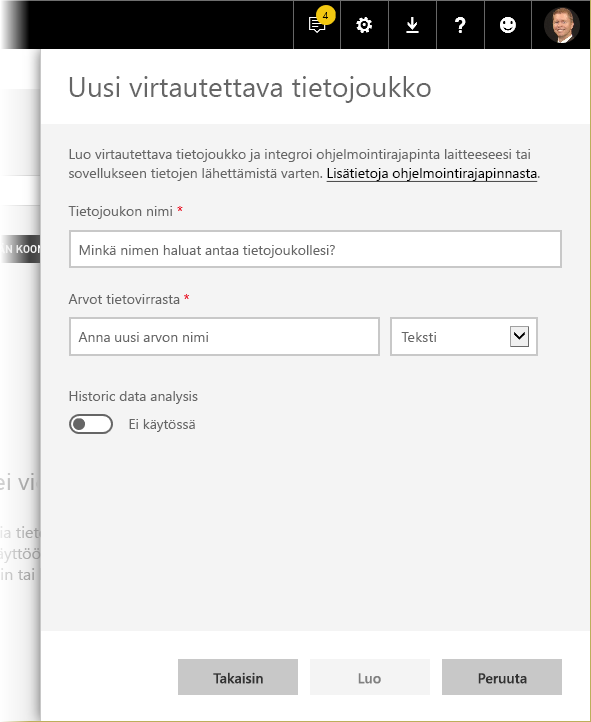
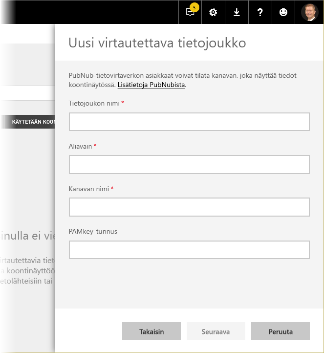
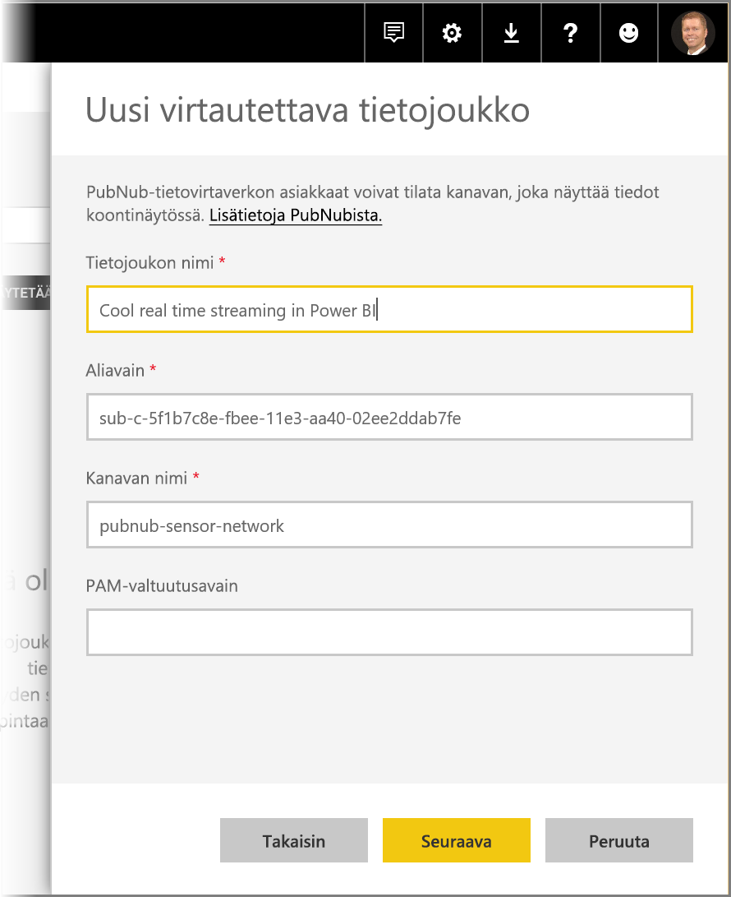
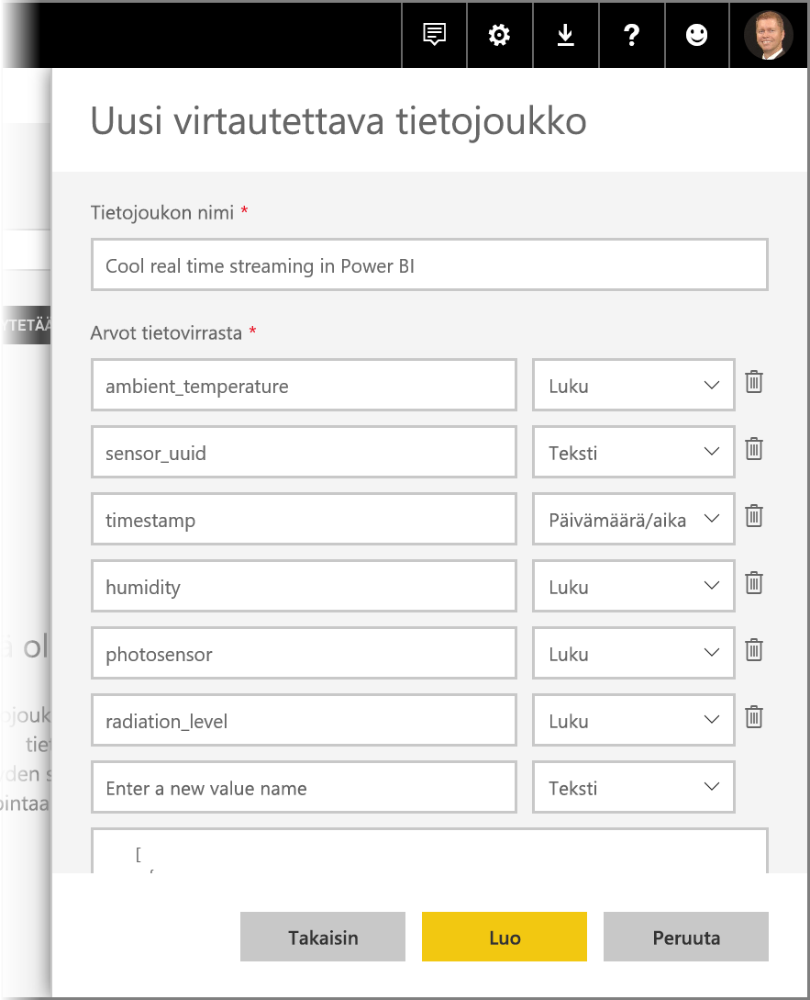

# Reaaliaikainen suoratoisto Power BI:ssä
Power BI: reaaliaikaisen suoratoiston avulla voit suoratoistaa tietoja ja päivittää koontinäyttöjä reaaliajassa. Kaikki Power BI:ssä luotavat visualisoinnit tai koontinäytöt voidaan luoda myös näyttämään ja päivittämään reaaliaikaisia tietoja ja visualisointeja. Tietojen suoratoistoon käytettävät laitteet ja lähteet voivat olla tehtaiden tunnistimia, sosiaalisen median lähteitä, huoltokäyttötietoja ja mitä tahansa muita, joista voidaan kerätä ja lähettää ajan mukaan määräytyviä tietoja.

Tässä artikkelissa kerrotaan, miten reaaliaikaisesti suoratoistava tietojoukko määritetään Power BI:ssä. Ennen siihen ryhtymistä on kuitenkin tärkeää tuntea erityyppiset reaaliaikaiset tietojoukot, jotka on suunniteltu näytettäviksi ruuduissa (ja koontinäytöissä), ja mitä eroja näiden tietojoukkojen välillä on.

## Reaaliaikaisten tietojoukkojen tyypit
On olemassa kolmentyyppisiä reaaliaikaisia tietojoukkoja, jotka voidaan näyttää reaaliaikaisilla koontinäytöillä:

* Push-tietojoukko
* Suoratoistettava tietojoukko
* Suoratoistettava PubNub-tietojoukko

Ensin tutustumme siihen, miten nämä tietojoukot eroavat toisistaan (tässä osassa) ja sitten käsittelemme sitä, miten tietoja siirretään kuhunkin näistä tietojoukoista.

### Push-tietojoukko
**Tietojoukon siirtäminen** -toiminnon avulla tiedot siirretään Power BI -palveluun. Kun tietojoukko on luotu, Power Bi -palvelu luo automaattisesti uuden tietokannan palveluun tietojen tallentamiseksi. Koska pohjana oleva tietokanta, joka jatkaa tietojen tallentamista niiden saapuessa, tietoja voidaan käyttää raporttien luomiseen. Nämä raportit ja niiden visualisoinnit ovat samanlaisia kuin mitkä tahansa muutkin raporttivisualisoinnit, mikä tarkoittaa sitä, että voit käyttää kaikkia Power BI:n raporttienkasausominaisuuksia visualisointien luomiseen, kuten mukautettujen visualisointien, tietohälytysten ja koontinäyttöön kiinnitettyjen ruutujen luomiseen.

Kun raporttia luodaan tietojoukon siirron avulla, mikä tahansa sen visualisoinneista voidaan kiinnittää koontinäyttöön. Tässä koontinäytössä visualisoinnit päivittyvät reaaliaikaisesti aina, kun tiedot päivitetään. Koontinäyttö käynnistää ruudun päivityksen palvelussa joka kerran, kun uutta tietoa vastaanotetaan.

On otettava huomioon kaksi asiaa kiinnitettyjen ruutujen suhteen, jotka on saatu tietojoukon siirron kautta:

* Koko raportin kiinnittäminen käyttämällä *Kiinnitä reaaliaikainen sivu* -vaihtoehtoa **ei** johda automaattisesti tietojen päivittämiseen.
* Kun visualisointi on kiinnitetty koontinäyttöön, voit käyttää **Q&A** -kyselytoimintoa kysymysten tekemiseen siirretystä tietojoukosta luonnollisella kielellä. Kun olet tehnyt **Q&A**-kyselyn, voit kiinnittää tuloksena saadun visualisoinnin takaisin koontinäyttöön, jolloin kyseinen koontinäyttö *myös* päivittyy reaaliaikaisesti.

### Suoratoistettava tietojoukko
Myös **suoratoistettavassa tietojoukossa** tiedot lähetetään Power BI -palveluun, mutta prosessissa on yksi tärkeä ero: Power BI tallentaa tiedot vain tilapäiseen välimuistiin, joka vanhenee nopeasti. Tilapäistä välimuistia käytetään vain sellaisten visualisointien näyttämiseen, joihin voidaan kohdistaa jokin tilapäinen aikakäsite, kuten viivakaavio, jolla on yhden tunnin aikaraja.

**Suoratoistettavaa tietojoukkoa** käytettäessä pohjana *ei* ole mitään tietojoukkoa, joten *et voi* koota raporttivisualisointeja käyttämällä suoratoiston kautta virtaavia tietoja. Sen vuoksi et voi hyödyntää raporttitoimintoja, kuten suodatusta, mukautettuja visualisointeja tai muita raporttitoimintoja.

Ainoa tapa suoratoistettavan tietojoukon visualisoimiseen on lisätä ruutu ja käyttää suoratoistettavaa tietojoukkoa **mukautettuna suoratoistettavana tietolähteenä**. Mukautetut suoratoistettavat ruudut, jotka pohjautuvat **suoratoistettavaan tietojoukkoon**, ovat optimoituja reaaliaikaisten tietojen nopeaa toistoa varten. Tietojen Power BI -palveluun siirtämisen ja visualisoinnin päivittymisen välillä on vain hyvin pieni viive, koska tietoja ei tarvitse syöttää tietokantaan tai lukea tietokannasta.

Käytännössä suoratoistettavia tietojoukkoja ja niiden mukana suoratoistettavia visualisointeja kannattaa käyttää tilanteissa, joissa tietojen siirtämisen ja niiden visualisoimisen välisen viiveen minimointi on äärimmäisen tärkeää. Lisäksi on parhaiden käytäntöjen mukaista siirtää tiedot sellaisessa muodossa, joka voidaan visualisoida sellaisenaan, ilman muita koosteita. Esimerkkejä sellaisenaan valmiista tiedoista ovat lämpötilat ja ennalta lasketut keskiarvot.

### Suoratoistettava PubNub-tietojoukko
Suoratoistettavaa **PubNub**-tietojoukkoa käytettäessä Power BI -verkkosovellus käyttää PubNub SDK:ta PubNub-tietovirran lukemiseen eikä Power BI -palvelu tallenna mitään tietoja.

Samoin kuin **suoratoistettavan tietojoukon** kohdalla, **suoratoistettavassa PubNub-tietojoukossa** ei ole pohjana tietojoukkoa Power BI:ssa, joten et voi koota raporttivisualisointeja sisään virtaavista tiedoista etkä pysty hyödyntämään raporttitoimintoja, kuten suodatusta, mukautettuja visualisointeja jne. Tämän vuoksi **suoratoistettava PubNub-tietojoukko** voidaan visualisoida vain lisäämällä ruutu koontinäyttöön ja määrittämällä PubNub-tietovirta lähteeksi.

**Suoratoistettavaan PubNub-tietojoukkoon** pohjautuvat ruudut ovat optimoituja reaaliaikaisten tietojen nopeaa toistoa varten. Koska Power BI on suorassa yhteydessä PubNub-tietovirtaan, tietojen Power BI -palveluun siirtämisen ja visualisoinnin päivittymisen välillä on vain hyvin pieni viive.

### Suoratoistettavan tietojoukon matriisi
Seuraavassa taulukossa (eli matriisissa) kuvataan reaaliaikaisen suoratoiston kolme eri tietojoukkotyyppiä sekä luetellaan kunkin ominaisuudet ja rajoitukset.

> [!NOTE]
> Katso [tästä artikkelista](https://docs.microsoft.com/power-bi/developer/api-rest-api-limitations) lisätietoja **Push**-siirtotoiminnon rajoituksista tietojen siirtomäärien osalta.
> 
> 

## Tietojen siirtäminen tietojoukkoihin
Edellisessä osassa kuvailtiin reaaliaikaiseen suoratoistoon käytettävien reaaliaikaisten tietojoukkojen kolmea päätyyppiä sekä niiden välisiä eroja. Tässä osassa kuvataan, miten tietoja voidaan luoda ja siirtää kyseisiin tietojoukkoihin.

Tietoja voidaan siirtää tietojoukkoon kolmella pääasiallisella tavalla:

* Käyttämällä Power BI REST -ohjelmointirajapintoja
* Käyttämällä Suoratoistettavan tietojoukon käyttöliittymää
* Käyttämällä Azure Stream Analytics -toimintoa

Katsotaanpa kutakin vaihtoehtoa yksi kerrallaan.

### Power BI REST -ohjelmointirajapintojen käyttäminen tietojen siirtämiseen
**Power BI REST -ohjelmointirajapintojen** avulla voidaan luoda ja lähettää tietoja tietojoukkojen **siirtämiseksi** ja tietojoukkojen **suoratoistamiseksi**. Kun luot tietojoukon Power BI REST -ohjelmointirajapinnan avulla, *defaultMode* (oletustila) -merkki kertoo, onko tietojoukko tyypiltään push (siirto) vai streaming (suoratoisto). Jos *defaultMode*-merkkiä ei ole asetettu, tietojoukon oletustilana on **push**-tietojoukko.

Jos *defaultMode*-arvoksi on määritetty *pushStreaming*, tietojoukko on sekä **push**- *että* **streaming**-tietojoukko, jolloin siinä on kummankin tietojoukkotyypin parhaat puolet. 

> [!NOTE]
> Käytettäessä tietojoukkoja, joilla *defaultMode* -merkintä, joka on asetettu tilaan *pushStreaming*, jos pyyntö ylittää **streaming**-tietojoukolle asetetun 15 kilotavua kokorajoituksen, mutta on pienempi kuin **push**-tietojoukolle asetettu 16 megatavun kokorajoitus, pyyntö onnistuu ja tiedot päivitetään push-tietojoukkoon. Suoratoistettavat ruudut kuitenkin epäonnistuvat tilapäisesti.

Kun tietojoukko on luotu, käytä tietojen siirtämiseen REST-ohjelmointirajapintaa käyttämällä [**PostRows**-ohjelmointirajapintaa](https://docs.microsoft.com/rest/api/power-bi/pushdatasets/datasets_postrows).

Kaikki pyynnöt REST-ohjelmointirajapintaan on suojattu **Azure AD OAuth** -todennuksella.

### Suoratoistettavan tietojoukon käyttöliittymän käyttäminen tietojen siirtämiseen
Voit luoda tietojoukon Power BI-palvelussa valitsemalla **Ohjelmointirajapinta**-vaihtoehdon seuraavassa kuvassa esitetyllä tavalla.

Kun luot uuden suoratoistettavan tietojoukon, voit halutessasi ottaa käyttöön **Historiatietojen analyysin** alla kuvatulla tavalla, jolla on merkittävä vaikutus.

Kun **Historiatietojen analyysi** on pois käytöstä (se on oletusarvoisesti pois käytöstä), voit luoda **suoratoistettavan tietojoukon** tämän artikkelin ohjeiden mukaisesti. Kun **Historiatietojen analyysi** on *otettu käyttöön*, luodusta tietojoukosta tulee sekä **suoratoistettava tietojoukko** että **siirrettävä tietojoukko**. Tämä vastaa Power BI REST -ohjelmakäyttöliittymän käyttämistä tietojoukon luomiseen, jonka *defaultModeksi* on asetettu *pushStreaming*, kuten tässä artikkelissa on edellä kuvattu.

> [!NOTE]
> Suoratoistettavien tietojoukkojen kohdalla, jotka on luotu käyttämällä Power BI -palvelukäyttöliittymää edellisessä kappaleessa kuvatulla tavalla, ei Azure AD -todennusta tarvita. Tällaisten tietojoukkojen kohdalla tietojoukon omistaja saa URL-osoitteen, jossa on rivin avain, joka valtuuttaa pyytäjän tietojen siirtämiseen tietojoukkoon ilman Azure AD OAuth -haltijatunnuksen käyttöä. Huomaa kuitenkin, että Azure AD (AAD) -vaihtoehto toimii edelleen tietojen siirtämisessä tietojoukkoon.
> 
> 

### Azure Stream Analytics -toiminnon käyttäminen tietojen siirtämiseen
Voit lisätä Power BI:n lähtökohdaksi **Azure Stream Analyticsissa** (ASA) ja visualisoida sitten nämä tietovirrat reaaliaikaisesti Power BI -palvelussa. Tässä osassa kuvaillaan tämän prosessin tekniset yksityiskohdat.

Azure Stream Analytics käyttää Power BI REST -ohjelmointirajapintoja lähtötietovirran luomiseksi Power BI:hin, ja sen *defaultModeksi* asetettu *pushStreaming* (katso lisätiedot tämän artikkelin aiemmista osista *defaultModen* osalta), jonka ansiosta saadaan aikaan tietojoukko, joka voi hyödyntää sekä **push**- että **streaming**-ominaisuuksia. Tietojoukon luomisen aikana Azure Stream Analytics määrittää myös **retentionPolicy*-merkin tilaan *basicFIFO*. Tällä asetuksella siirrettyjä tietojoukkoja tukeva tietokanta tallentaa 200 000 riviä, ja kun tämä raja saavutetaan, rivejä pudotetaan ”ensimmäinen sisään, ensimmäinen ulos” (FIFO) -periaatteen mukaan.

> [!CAUTION]
> Mikäli Azure Stream Analytics -hakusi saa aikaan erittäin nopean tulosteen Power BI:hin (esimerkiksi kerran tai kaksi sekunnissa), Azure Stream Analytics aloittaa näiden tulosteiden yhdistämisen yhteen pyyntöerään. Tämä saattaa aiheuttaa sen, että pyynnön koko ylittää suoratoistettavien ruutujen rajan. Tässä tapauksessa suoratoistettavien ruutujen hahmontaminen epäonnistuu, kuten aiemmissa osissa on todettu. Näissä tapauksissa paras käytäntö on hidastaa tietojen tulostenopeutta Power BI:hin, esimerkiksi asettamalla maksimiarvo joka sekunnin sijaan yli 10 sekuntiin.
> 
> 

## Reaaliaikaisesti suoratoistettavan tietojoukon määrittäminen Power BI:ssä
Nyt, kun olemme käsitelleet reaaliaikaisesti suoratoistettavien tietojoukkojen kolme päätyyppiä sekä kolme pääasiallista tapaa tietojen siirtämiseen tietojoukkoon, siirrytäänpä seuraavaksi reaaliaikaisesti suoratoistettavan tietojoukon varsinaiseen käyttöön Power BI:ssä.

Pääset alkuun reaaliaikaisessa suoratoistossa valitsemalla jommankumman kahdesta tavasta, jolla suoratoistettavia tietoja voidaan käyttää Power BI:ssä:

* **ruudut** ja visualisoinnit suoratoistettavista tiedoista
* **tietojoukot**, jotka on luotu Power BI:ssä olevista suoratoistettavista tiedoista

Kummankin vaihtoehdon kohdalla sinun tulee määrittää **Tietojen suoratoisto** Power BI:ssä. Voit tehdä tämän koontinäytössä (joko aiemmin luodussa tai uudessa koontinäytössä) valitsemalla **Lisää ruutu** ja valitsemalla sitten **Mukautetut suoratoistettavat tiedot**.

Jos et ole vielä määrittänyt suoratoistettavia tietoja, ei hätää – voit valita **Tietojen hallinta** -kohdan, jolla pääset alkuun.

Tällä sivulla voit syöttää suoratoistettavan tietojoukon päätepisteen, jos sellainen on jo luotu (tekstiruutuun). Jos sinulla ei vielä ole suoratoistettavaa tietojoukkoa, valitse plus-kuvake ( **+** ) oikeasta yläkulmasta, jolloin saat näkyviin käytettävissä olevat vaihtoehdot suoratoistettavan tietojoukon luomiseksi.

Kun napsautat **+** -kuvaketta, näet kaksi vaihtoehtoa:

Seuraavassa osassa kuvataan näitä vaihtoehtoja sekä kerrotaan tarkemmin suoratoistettavan **ruudun** luomisesta ja **tietojoukon** luomisesta suoratoistettavasta tietolähteestä, jota voit myöhemmin käyttää raporttien luomiseen.

## Luo suoratoistettava tietojoukko haluamallasi vaihtoehdolla
On olemassa kaksi tapaa, jolla voidaan luoda reaaliaikainen suoratoistettava tietosyöte, jota voidaan käyttää ja visualisoida Power BI:ssä:

* **Power BI REST -ohjelmointirajapinta** käyttämällä reaaliaikaista suoratoiston päätepistettä
* **PubNub**

Seuraavissa osissa tutustutaan kumpaankin vaihtoehtoon vuorollaan.

### POWER BI REST -ohjelmointirajapinnan käyttö
**Power BI REST -ohjelmointirajapinta** – Power BI REST -ohjelmointirajapinnan viimeaikaisten parannusten ansiosta reaaliaikainen suoratoisto on kehittäjille entistä helpompaa. Kun valitset **Ohjelmointirajapinnan** **Uusi suoratoistettava tietojoukko** -ikkunasta, saat käyttöösi vaihtoehtoja, joiden avulla Power BI voi muodostaa yhteyden ja käyttää päätepistettäsi:

Jos haluat, että Power BI tallentaa tiedot, jotka lähetetään tämän tietovirran kautta, ota käyttöön *Historiatietojen analyysi*, jolloin voit tehdä raportteja ja analyyseja kerätystä tietovirrasta. Voit myös [lukea lisää ohjelmointirajapinnasta](https://docs.microsoft.com/rest/api/power-bi/).

Kun olet luonut tietovirran, saat REST-ohjelmointirajapinnan URL-päätepisteen, johon sovelluksesi voi ottaa yhteyden käyttämällä *POST*-pyyntöjä tietojen siirtämiseksi luomaasi Power BI:n **suoratoistettavien tietojen** tietojoukkoon.

*POST*-pyyntöjä tehtäessä tulee varmistaa, että pyynnön runko vastaa Power BI -käyttöliittymän antamaa näyte-JSON:ia. Voit esimerkiksi paketoida JSON-objektit matriisiin.

### PubNubin käyttö
Integroimalla **PubNub**-suoratoiston Power BI:hin voit käyttää pienen viiveen **PubNub**-tietovirtoja (tai luoda uusia) ja käyttää niitä Power BI:ssä. Kun valitset **PubNub**in ja valitset sitten **Seuraava**, näet seuraavan ikkunan:

> [!WARNING]
> PubNub-kanavat voidaan suojata PubNub Access Manager (PAM) -todennusavaimella. Tämä avain jaetaan kaikille koontinäyttöön käyttöoikeudet omistaville käyttäjille. Voit myös [lukea lisää PubNub-käytönhallinnasta](https://www.pubnub.com/docs/web-javascript/pam-security).
> 
> 

**PubNub**-tietovirrat ovat usein suurikokoisia eivätkä ne aina sovellu alkuperäisessä muodossaan tallennettaviksi ja historialliseen analysointiin. Voit käyttää Power BI:tä PubNub-tietojen historialliseen analysointiin koostamalla raa’an PubNub-virran ja lähettämällä sen Power BI:hin. Eräs tapa sen tekemiseen on [Azure Stream Analytics](https://azure.microsoft.com/services/stream-analytics/)’in käyttö.

## Esimerkki reaaliaikaisen suoratoiston käytöstä Power BI:ssä
Seuraavassa on nopea esimerkki siitä, miten reaaliaikainen suoratoisto toimii Power BI:ssä. Voit seurata tätä esimerkkiä, jotta näet itse reaaliaikaisen suoratoiston hyödyt.

Tässä esimerkissä käytämme julkisesti saatavilla olevaa virtaa **PubNubista**. Työvaiheet ovat seuraavanlaiset:

1. Valitse **Power BI -palvelussa** koontinäyttö (tai luo uusi) ja valitse **Lisää ruutu** > **Mukautetut suoratoistettavat tiedot** ja valitse sitten **Seuraava**-painike.
   
   
2. Jos sinulla ei vielä ole suoratoistettavien tietojen lähteitä, valitse **Tietojen hallinta** -linkki (joka sijaitsee **Seuraava**-painikkeen yläpuolella), ja valitse sitten **+ Lisää suoratoistettavat tiedot** ikkunan oikeassa yläreunassa olevasta linkistä. Valitse **PubNub** ja valitse sitten **Seuraava**.
3. Luo nimi tietojoukollesi nimi, liitä sitten seuraavat arvot ilmestyvään ikkunaan, ja valitse sitten **Seuraava**:
   
   *Tilaa avain:*
   
       sub-c-5f1b7c8e-fbee-11e3-aa40-02ee2ddab7fe
   *Kanava:*
   
       pubnub-sensor-network
   
   
4. Valitse seuraavassa ikkunassa oletusasetukset (jotka täytetään automaattisesti), valitse sitten **Luo**.
   
   
5. Palattuasi Power BI -työtilaan luo uusi koontinäyttä ja lisää sitten ruutu (katso tarvittaessa ohjeet edeltä). Tällä kerralla, kun luot ruudun ja valitset **Mukautetut suoratoistettavat tiedot**, sinulla on käytettävissäsi suoratoistettava tietojoukko. Nyt voit kokeilla, miten se toimii. Lisäämällä *numero*kenttiä viivakaavioihin ja lisäämällä sitten muita ruutuja saat reaaliaikaisen koontinäytön, joka näyttää seuraavanlaiselta:
   
   

Kokeile sitä nyt ja testaa, miten näytetietojoukko toimii. Sitten voit luoda omia tietojoukkoja ja suoratoistaa reaaliaikaiset tiedot Power BI:hin.

## Kysymyksiä ja vastauksia
Seuraavassa on tavallisimpia kysymyksiä reaaliaikaisesta suoratoistosta Power BI:ssä ja vastauksia niihin.

#### Voinko käyttää suodattimia push-tietojoukkoon? Entä suoratoistettavaan tietojoukkoon?
Valitettavasti suoratoistettavat tietojoukot eivät tue suodattamista. Push-tietojoukoille voit luoda raportin, suodattaa raportin ja kiinnittää suodatetut visualisoinnit sitten koontinäyttöön. Visualisoinnin suodatinta ei kuitenkaan voida muuttaa millään tavalla, kun se on koontinäytössä.

Voit kuitenkin erikseen kiinnittää reaaliaikaisen raporttitapahtumaruudun koontinäyttöön, ja siinä tapauksessa voit muuttaa suodattimia. Reaaliaikaiset raporttiruudut eivät kuitenkaan päivity reaaliaikaisesti, kun tiedot on siirretty – sinun pitää päivittää visualisointi manuaalisesti käyttämällä *Päivitä koontinäytön ruudut* -vaihtoehtoa **Lisää**-valikossa.

Kun suodattimia käytetään push-tietojoukkoihin, joissa *DateTime*-kentät ovat millisekunnin tarkkuudella, *vastaavuuden* operaattoreita ei tueta. Operaattorit, kuten suurempi kuin (>) tai pienempi kuin (<) toimivat kuitenkin oikein.

#### Miten näen push-tietojoukon viimeisimmän arvon? Entä suoratoistettavan tietojoukon?
Suoratoistettavat tietojoukot on suunniteltu viimeisimpien tietojen näyttämiseen. Voit käyttää **Card** (Kortti) -suoratoistovisualisointia, jolloin näet viimeisimmät numeroarvot helposti. Valitettavasti kortti ei tue tietotyyppejä *DateTime* (PäivämääräAika) tai *Text* (Teksti).
Push-tietojoukkojen kohdalla voit yrittää luoda raporttivisualisoinnin viimeisellä N-suodattimella, olettaen, että käytössäsi on aikaleima.

#### Voinko muodostaa yhteyden push- tai suoratoistettaviin tietojoukkoihin Power BI Desktopissa?
Valitettavasti tämä ei ole käytettävissä tällä hetkellä.

#### Ottaen huomioon edellisen kysymyksen, miten voin tehdä mallinnuksia reaaliaikaisiin tietojoukkoihin?
Mallinnuksen tekeminen ei ole mahdollista suoratoistettaviin tietojoukkoihin, koska tietoja ei tallenneta pysyvästi. Push-tietojoukon kohdalla voit käyttää tietojoukon/taulukon päivitystä REST-ohjelmointirajapinnassa mittarien ja suhteiden lisäämiseksi. 

#### Miten voit poistaa kaikki push-tietojoukon arvot? Entä suoratoistettavan tietojoukon?
Push-tietojoukolle voit käyttää Poista rivejä -kutsua REST -ohjelmointirajapinnassa. Tällä hetkellä tietoja ei voida poistaa suoratoistettavasta tietojoukosta, tiedot tosin poistuvat itsestään tunnin kuluessa.

#### Olen määrittänyt Azure Stream Analytics -tulosteen Power BI:hin, mutta en näe sitä Power BI:ssä – mistä tämä johtuu?
Tässä on tarkistusluettelo, jota voit käyttää vianmääritykseen:

1. Käynnistä Azure Stream Analytics -työ uudelleen (työt, jotka on luotu ennen suoratoiston GA-julkaisua, vaativat uudelleenkäynnistyksen)
2. Kokeile Power BI -yhteytesi uudelleenvaltuutusta Azure Stream Analyticsissa
3. Minkä työtilan määritit Azure Stream Analytics -tulosteessa? Tarkistitko asian (samassa) työtilassa Power BI-palvelussa?
4. Meneekö Azure Stream Analytics -kysely nimenomaisesti Power BI -tulosteeseen? (INTO-avainsanan käyttö)
5. Kulkeeko Azure Stream Analytics -työn kautta tietoa? Tietojoukko luodaan vain, jos tietoja siirretään.
6. Tarkista Azure Stream Analytics -lokitiedoista, näkyykö siellä varoituksia tai virheilmoituksia.

## Automaattinen sivun päivitys

Automaattinen sivun päivitys toimii raporttisivutasolla. Sen avulla raporttien tekijät voivat määrittää sivun visualisoinneille päivitysvälin, jota käytetään vain sivua käytettäessä. Automaattinen sivun päivitys on käytettävissä vain DirectQuery-tietolähteille. Pienin mahdollinen päivitysväli riippuu siitä, millaisessa työtilassa raportti julkaistaan, sekä Premium-työtilojen kapasiteettihallinta-asetuksista.

Lue lisätietoja [automaattisen sivun päivityksen](desktop-automatic-page-refresh.md) ohjeartikkelista.

## Seuraavat vaiheet
Tässä on joitakin linkkejä, joista voi olla hyötyä käsiteltäessä reaaliaikaista suoratoistoa Power BI:ssä:

* [Power BI REST -ohjelmointirajapinnan ja reaaliaikaisten tietojen yleiskatsaus](https://docs.microsoft.com/rest/api/power-bi/)
* [Azure Stream Analytics](https://azure.microsoft.com/services/stream-analytics/)

