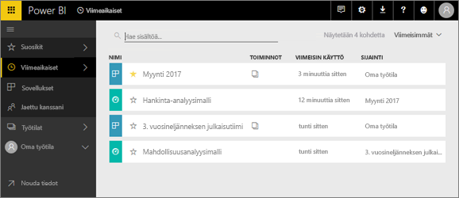
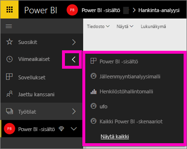
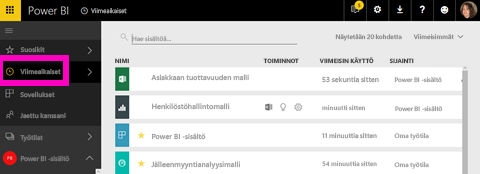

# **Viimeisimmät**-sisältö Power BI -palvelussa

## Mitä on viimeisin sisältö?
Viimeisimmät sisältö on tietoyksiköt, joissa olet käynyt, enintään 20 kpl.  Näitä ovat esimerkiksi koontinäytöt, raportit, sovellukset ja työkirjat kaikissa työtiloissasi.

Katso kuinka Amanda osoittaa, miten **Viimeisimmät** sisällön luettelot täytetään, ja kokeile sitten itse noudattamalla videon alapuolella olevia vaiheittaisia ohjeita.

<iframe width="560" height="315" src="https://www.youtube.com/embed/G26dr2PsEpk" frameborder="0" allowfullscreen></iframe>

## Näytä viimeisin sisältö
Katso viisi viimeksi käytyä yksikköä vasemmasta siirtymisruudusta ja valitse oikealla nuolella **Viimeisimmät**.  Täältä voit valita viimeaikaisen sisällön sen avaamiseksi. Vain viisi viimeisintä kohdetta näkyy luettelossa.

Jos sinulla on enemmän kuin viisi hiljattain käytyä kohdetta, valitse **Näytä kaikki** avataksesi viimeksi käytetyn näytön (katso alta). Voit myös valita **Viimeisimmät**, tai  vasemmanpuoleisesta siirtymisruudusta.

Täältä voit käsitellä sisältöä samalla tavalla kuin yksittäisillä [ **koontinäytöillä**](service-dashboards.md), [ **raporteissa**](service-reports.md) ja  **Työkirjat**-välilehdillä ja [ **Sovellukset** ](service-install-use-apps.md)-näytöllä.

## Seuraavat vaiheet
[Power BI -palvelun sovellukset](service-install-use-apps.md)

Onko sinulla muuta kysyttävää? [Kokeile Power BI -yhteisöä](http://community.powerbi.com/)

