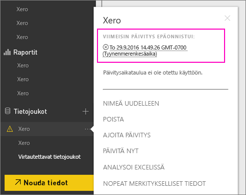
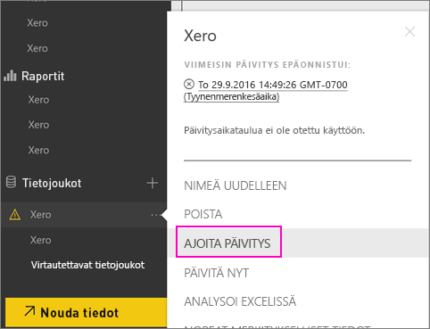
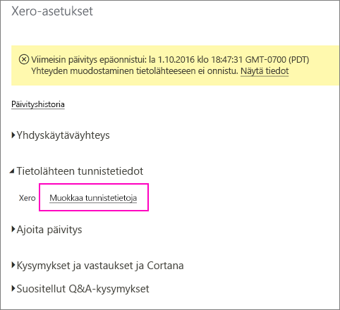
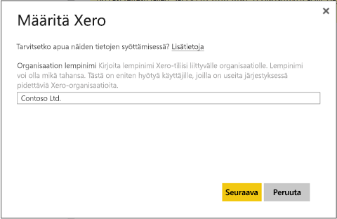
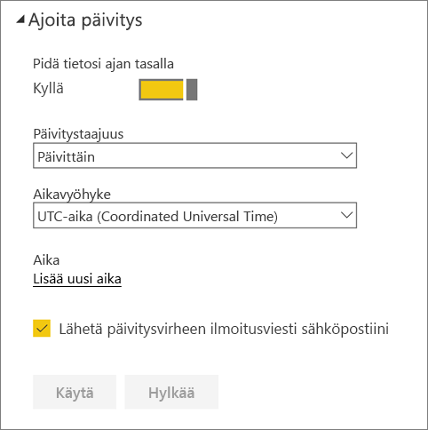
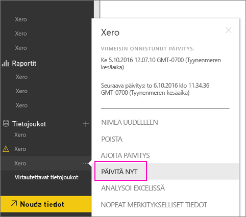

# Xero-sisältöpaketin tunnistetietojen päivitys, jos päivitys epäonnistuu
Jos käytät Xero Power BI -sisältöpakettia, olet saattanut kohdata ongelmia sisältöpaketin päivittäisessä päivityksessä viimeisimmän Power BI -palvelun tapahtumaa vuoksi.

Voit nähdä, onko sisältöpaketin päivitys onnistunut,  tarkistamalla viimeisimmän päivityksen tilan Xero-tietojoukolle seuraavassa näyttökuvassa esitetyllä tavalla.

Jos näet, että päivitys epäonnistui kuten yllä, noudata näitä ohjeita ja uudista sisältöpaketin tunnistetiedot.

1. Valitse **Enemmän vaihtoehtoja** (...) Xero-tietojoukon vieressä ja valitse sitten **Ajoita päivitys**. Tämä avaa Xero -sisältöpaketin asetussivun.
   
    
2. Valitse **Xero-asetukset** -sivulla **Tietolähteen tunnistetiedot** > **Muokkaa tunnistetietoja**.
   
    
3. Kirjoita organisaation nimi > **Seuraava**.
   
    
4. Kirjaudu sisään Xero-tilin tiedoilla.
   
    
5. Nyt kun tunnistetiedot on päivitetty, varmistamme, että päivitysaikataulu on määritetty suoritettavaksi päivittäin. Valitse **Enemmän vaihtoehtoja** (...) Xero-tietojoukon vieressä ja napsauta sitten uudelleen **Ajoita päivitys**.
   
    
6. Voit myös valita tietojoukon päivittämisen heti. Valitse **Enemmän vaihtoehtoja** (...) Xero-tietojoukon vieressä ja valitse sitten **Päivitä nyt**.
   
    

Jos sinulla on edelleen päivitysongelmia, älä epäröi ottaa yhteyttä osoitteeseen [https://support.powerbi.com](https://support.powerbi.com) 

Lue lisää Power BI:n Xero-sisältöpaketista [Xero-sisältöpaketin ohjesivulta](service-connect-to-xero.md).

### Seuraavat vaiheet
* Onko sinulla kysyttävää? [Kokeile Power BI -yhteisöä](https://community.powerbi.com/)

