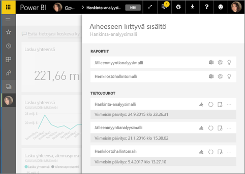
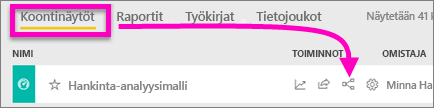
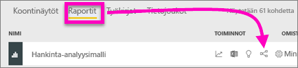
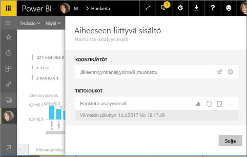
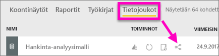
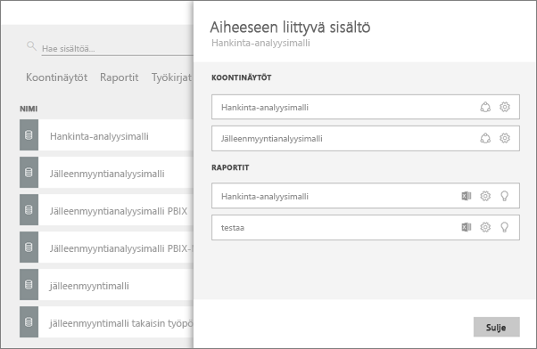

# Tarkastele aiheeseen liittyvää sisältöä Power BI -palvelussa
**Aiheeseen liittyvä sisältö** -ruutu näyttää, miten Power BI -palvelun sisältösi -- koontinäytöt, raportit ja tietojoukot --on yhdistetty toisiinsa.  Ja vielä paranee, tässä ruudussa voit suorittaa yleisiä tehtäviä, kuten päivittää, nimetä uudelleen, luoda merkityksellistä tietoa sekä paljon muuta. Valitse aiheeseen liittyvä raportti tai raporttinäkymä ja se avautuu Power BI -työtilassasi.   

Kuten olet todennäköisesti jo huomannut, raporttien perustana ovat tietojoukot; raporttien visualisoinnit on sitten kiinnitetty raporttinäkymään ja raporttinäkymän visualisoinnit linkittyvät takaisin raportteihin. Mutta mistä tiedät mitkä raporttinäkymät isännöivät markkinointiraporttisi visualisointeja? Ja miten löydät ne raporttinäkymät? Onko hankinnan raporttinäkymässäsi käytössä visualisointeja useammasta kuin yhdestä tietojoukosta? Jos näin on, miten ne ovat nimetty ja miten voit avata ja muokata niitä? Käyttääkö mikään raportti tai raporttinäkymä HR-tietojoukkoa, vai voidaanko se siirtää katkaisematta yhtään linkkiä? Näihin kysymyksiin voidaan vastata **Aiheeseen liittyvä sisältö** -ruudussa.  Aiheeseen liittyvän sisällön esittelemisen lisäksi ruutu mahdollistaa sinulle myös toiminnot sisällön kanssa sekä helpon siirtymisen aiheeseen liittyvien sisältöjen välillä.

> [!NOTE]
> Aiheeseen liittyvä sisältö -ominaisuutta ei voi käyttää tietojoukkojen suoratoistossa.
> 
> 

## Tarkastele raporttinäkymään liittyvää sisältöä
Katso kun Will tarkastelee raporttinäkymään liittyvää sisältöä. Kokeile sitten itse samaa hankinta-analyysimallin tietojoukon kanssa noudattamalla videon alapuolella olevia vaiheittaisia ohjeita.

<iframe width="560" height="315" src="https://www.youtube.com/embed/B2vd4MQrz4M#t=3m05s" frameborder="0" allowfullscreen></iframe>

Avataksesi **Aiheeseen liittyvä sisältö** -ruudun sinun pitää käydä läpi raporttinäkymään liittyvät oikeudet kohdasta *Lue*. Tässä esimerkkinä toimii [Hankinta-analyysimalli](sample-procurement.md).

**Menetelmä 1**

Valitse ensin **Raporttinäkymät**-välilehti työtilassa ja sitten  kuvakkeesta **Näytä aiheeseen liittyvät**.

 

**Menetelmä 2**

Avaa raporttinäkymästä valitse    yläreunan valikkoriviltä.

**Aiheeseen liittyvä sisältö** -ruutu avautuu. Se näyttää kaikki raportit, joissa visualisoinnit ovat kiinnitettyinä raporttinäkymiin ja niihin liittyviin tietojoukkoihin. Tähän raporttinäkymään on kiinnitetty visualisointeja kolmesta eri raportista, jotka perustuvat kolmeen eri tietojoukkoon.

Täältä voit tehdä suoria toimintoja aiheeseen liittyvään sisältöön.  Valitse esimerkiksi raportin nimi avataksesi sen.  Listatun raportin kanssa voit suorittaa toimintoja valitsemalla kuvakkeen: [Analysoi Excelissä](service-analyze-in-excel.md), [Nimeä uudelleen](service-rename.md), tai [Hae merkityksellistä tietoa](service-insights.md). Tietojoukon kanssa voit suorittaa toimintoja joko avaamalla tietojoukon **Asetukset**-ikkunan tai valitsemalla kuvakkeen: [Luo uusi raportti](service-report-create-new.md), [Päivitä](refresh-data.md), nimeä uudelleen, [Analysoi Excelissä](service-analyze-in-excel.md), tai [Hae merkityksellistä tietoa](service-insights.md).  

## Tarkastele raporttiin liittyvää sisältöä
Avataksesi **Aiheeseen liittyvä sisältö** -ruudun sinun pitää käydä läpi raporttiin liittyvät oikeudet kohdasta *Lue*. Tässä esimerkkinä toimii [Hankinta-analyysimalli](sample-procurement.md).

**Menetelmä 1**

Valitse ensin **Raportit**-välilehti työtilassa ja sitten  kuvakkeesta **Näytä aiheeseen liittyvät**.

 

**Menetelmä 2**

Avaa raportti kohdasta [Lukunäkymä](service-reading-view-and-editing-view.md) ja valitse yläreunan valikkoriviltä .

**Aiheeseen liittyvä sisältö** -ruutu avautuu. Se näyttää asiaan liittyvät tietojoukot sekä kaikki raporttinäkymät, joihin on kiinnitetty vähintään yksi ruutu raportista. Tässä raportissa on kiinnitetty visualisointeja kahteen eri raporttinäkymään.

Täältä voit tehdä suoria toimintoja aiheeseen liittyvään sisältöön.  Valitse esimerkiksi raporttinäkymän nimi avataksesi sen.  Voit jakaa listassa olevan raporttinäkymän valitsemalla kuvakkeen [Raporttinäkymän jakaminen muille](service-share-dashboards.md) tai avaamalla raporttinäkymän **Asetukset**-ikkunan. Tietojoukon kanssa voit suorittaa toimintoja avaamalla tietojoukon **Asetukset**-ikkunan tai valitsemalla kuvakkeen: [Luo uusi raportti](service-report-create-new.md), [Päivitä](refresh-data.md), nimeä uudelleen, [Analysoi Excelissä](service-analyze-in-excel.md), tai [Hae merkityksellistä tietoa](service-insights.md).  

## Tarkastele tietojoukkoon liittyvää sisältöä
Avataksesi **Aiheeseen liittyvä sisältö** -ruudun sinun pitää käydä läpi tietojoukkoon liittyvät oikeudet kohdasta *Lue*. Tässä esimerkkinä toimii [Hankinta-analyysimalli](sample-procurement.md).

Valitse ensin **Tietojoukot**-välilehti työtilassa ja etsi sitten  kuvakkeesta **Näytä aiheeseen liittyvät**.

Valitse kuvake avataksesi **Aiheeseen liittyvä sisältö** -ruudun.

Täältä voit tehdä suoria toimintoja aiheeseen liittyvään sisältöön.  Valitse esimerkiksi raporttinäkymän tai raportin nimi avataksesi sen.  Voit jakaa listassa olevan raporttinäkymän valitsemalla kuvakkeen [Raporttinäkymän jakaminen muille](service-share-dashboards.md) tai avaamalla raporttinäkymän **Asetukset**-ikkunan. Raportin kanssa voit suorittaa toimintoja valitsemalla kuvakkeen [Analysoi Excelissä](service-analyze-in-excel.md), [Nimeä uudelleen](service-rename.md), tai [Hae merkityksellistä tietoa](service-insights.md).  

## Rajoitukset ja vianmääritys
* Jos selaimessasi ei ole tarpeeksi tilaa, et näe vaihtoehtoa **Näytä aiheeseen liittyvät**, mutta näet edelleen kohdan . Valitse kuvake avataksesi **Aiheeseen liittyvä sisältö** -ruudun.
* Jos haluat avata raporttiin liittyvää sisältöä pitää sinulla olla käytössä [Lukunäkymä](service-reading-view-and-editing-view.md).
* Aiheeseen liittyvä sisältö -ominaisuus ei ole käytettävissä Power BI Desktopissa.
* Aiheeseen liittyvä sisältö -ominaisuus ei toimi suoratoistettuihin tietojoukkoihin.

## Seuraavat vaiheet
* [Power BI -palvelun käytön aloittaminen](service-get-started.md)
* Onko sinulla muuta kysyttävää? [Kokeile Power BI -yhteisöä](http://community.powerbi.com/)

