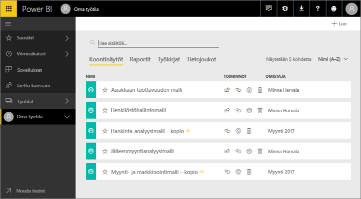
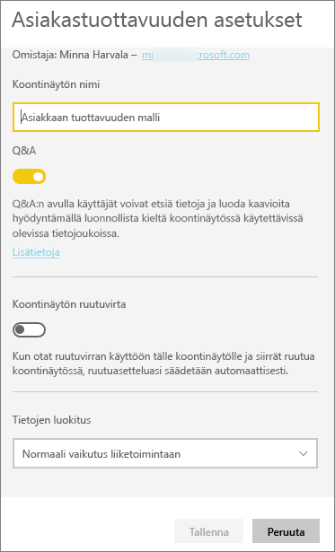
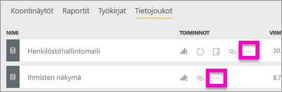
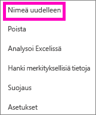
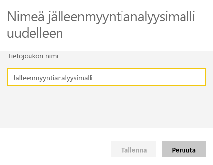
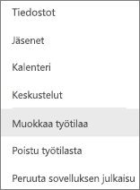
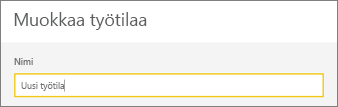
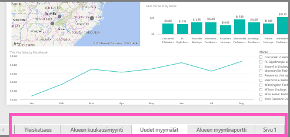
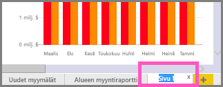

# Nimeä melkein mitä tahansa uudelleen Power BI -palvelussa
Tässä artikkelissa opetetaan, miten Power BI -palvelussa nimetään uudelleen koontinäyttö, raportti, raporttisivu, työkirja, tietojoukko, sovellus ja työtila.

**Voinko muuttaa nimen?**

| Sisältötyyppi | Olen tekijä tai luoja | Jaettu kanssani |
| --- | --- | --- |
| Työtilan koontinäyttö |Kyllä |Ei |
| Työtilan raportti |Kyllä |Ei |
| Työtilan työkirja |Kyllä |Ei |
| Työtilan tietojoukko |Kyllä |Ei |
| Sovellustyötila |Kyllä, jos olet omistaja tai sinulla on järjestelmänvalvojan oikeudet |Ei |
| Julkaistut sovellukset |Ei sovellusnäytöltä, mutta sovelluksen nimen voi muuttaa sovellustyötilassa ja julkaista uudelleen uudella nimellä, jos sinulla on järjestelmänvalvojan oikeudet |Ei |
| Sovelluksen sisältö (koontinäyttö, raportti, työkirja ja tietojoukko) |Ei sovellusnäytöltä, mutta sovelluksen sisällön voi nimetä uudelleen sovellustyötilassa ja julkaista uudelleen uudella nimellä, jos sinulla on järjestelmänvalvojan oikeudet |Ei |
| Sisältö **Jaettu kanssani** -kohdissa |Ei |Ei |

## Nimeä uudelleen koontinäyttö, raportti tai työkirja
1. Aloita työtilasta ja valitse **Koontinäytöt**-, **Raportit**- tai **Työkirjat**-välilehti. Vie hiiren osoitin uudelleen nimettävän kohteen päälle ja valitse hammaspyöräkuvake . Jos et näe hammaspyöräkuvaketta, sinulla ei ole oikeutta uudelleen nimeämiseen.
   
   
2. Kirjoita Asetukset-sivulla uusi nimi ja valitse **Tallenna**.
   
   

## Nimeä tietojoukko uudelleen
1. Aloita työtilasta ja valitse **Tietojoukot**-välilehti.
   
   
2. Vie hiiren osoitin uudelleen nimettävän kohteen päälle, valitse kolme pistettä (...) ja valitse **Nimeä uudelleen**.  
   
      
   
   > [!NOTE]
   > Avattavan valikon vaihtoehdot vaihtelevat.
   > 
   > 
3. Kirjoita Asetukset-sivulla uusi nimi ja valitse **Tallenna**.
   
     

## Nimeä sovellustyötila uudelleen
Sovellustyötilan voi nimetä uudelleen kuka tahansa, jolla on järjestelmänvalvojan oikeudet.

1. Aloita siitä työtilasta, jonka haluat nimetä uudelleen.
2. Valitse oikeasta yläkulmasta kolme pistettä (...) ja valitse **Muokkaa työtilaa**. Jos et näe tätä asetusta, sinulla ei ole oikeutta nimetä tätä työtilaa uudelleen. 
   
    
3. Kirjoita uusi työtilan nimi ja valitse **Tallenna**.
   
   

## Nimeä raportin sivu uudelleen
Etkö pidä Power BI -raporttisi sivun nimestä?  Uusi nimi on vain napsautuksen päässä. Sivuja voi nimetä uudelleen [raportin muokkausnäkymässä](service-interact-with-a-report-in-editing-view.md).

1. Avaa raportti [muokkausnäkymässä](service-reading-view-and-editing-view.md).
2. Etsi raporttisivun välilehdet Power BI -ikkunan alareunasta.
   
    
3. Avaa raporttisivu, jonka haluat nimetä uudelleen, valitsemalla välilehti.
4. Korosta välilehti kaksoisnapsauttamalla sen nimeä.  
   
    
5. Kirjoita uusi raporttisivun nimi ja paina ENTER-näppäintä.
   
    

## Huomioon otettavat seikat ja vianmääritys
* Jos uudelleen nimettävä kohde on jaettu kanssasi tai kuuluu sisältöpakettiin, et näe hammaspyöräkuvaketta etkä pääse asetuksiin.
* Jos et näe **Tietojoukot**-välilehdessä kolmea pistettä (...), laajenna selainikkuna.

Ilmenikö muuta kysyttävää? [Kokeile Power BI -yhteisöä](http://community.powerbi.com/)

