# Uuden raportin luominen Power BI -palvelussa tuomalla tietojoukko
Olet lukenut [Power BI -raportit](service-reports.md) ja haluat nyt luoda omasi. Voit luoda raportin monella eri tavalla, ja aloitamme tämän artikkelin luomalla hyvin perustasoisen raportin Excel-tietojoukosta käyttämällä Power BI -palvelua. Kun ymmärrät raportin luomisen perusteet, **Seuraavat vaiheet** näytön alareunassa vievät sinut monimutkaisempia raportteja koskevaan aiheisiin.  

> **VIHJE**: Voit luoda raportin kopioimalla aiemmin luodun raportin, katso [Kopioi raportti](power-bi-report-copy.md)
> 
### Edellytykset
- Power BI -palvelu (katso raporttien luominen Power BI Desktopissa kohdasta [Työpöydän raporttinäkymä](desktop-report-view.md) )  
- Jälleenmyyntianalyysimallin tietojoukko

## Tuo tietojoukko
Tämä raporttien luontimenetelmä alkaa tietojoukosta ja tyhjästä raporttipohjasta. Seuraavaksi [Lataa jälleenmyyjän analyysin Excel-tietojoukkoesimerkki](http://go.microsoft.com/fwlink/?LinkId=529778) ja tallenna se OneDrive for Businessiin (ensisijainen) tai paikallisesti.

1. Luomme raportin Power BI -palvelun työtilassa, joten valitse aiemmin luotu työtila tai luo uusi.
   
   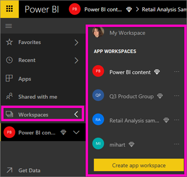
2. Valitse vasemman siirtymisruudun alaosassa, **Nouda tiedot**.
   
   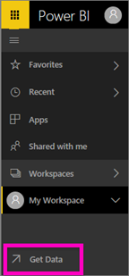
3. Valitse **Tiedostot** ja siirry sijaintiin, johon tallensit jälleenmyyntianalyysimallin.
   
    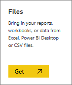
4. Valitse tässä harjoituksessa **Tuonti**.
   
   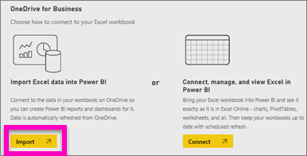
5. Kun tietojoukko on tuotu, valitse **Näytä tietojoukko**.
   
   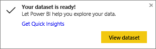
6. Tietojoukon tarkastelu itse asiassa avaa raporttieditorin.  Näkyviin tulee tyhjä kangas ja raporttien muokkaustyökalut.
   
   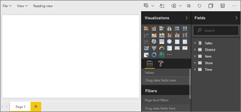

> **Vihje**: Jos et tunne raporttien muokkauspohjaa tai haluat päivittää tietojasi, [katso esittely raporttieditorista ](service-the-report-editor-take-a-tour.md) ennen jatkamista.
> 
> 

## Viisarimittarin lisääminen raporttiin
Nyt kun tietojoukkomme on tuotu, aloitetaan vastaamaan kysymyksiin.  Markkinointipäällikkö (CMO) haluaa tietää, miten lähellä tämän vuoden myyntitavoitteitamme olemme. Mittari on [hyvä valinta visualisoimaan](power-bi-report-visualizations.md) tämän tyyppisten tietojen näyttämistä.

1. Valitse Kentät-ruudussa **Myynti**  >  **Tämän vuoden myynti** > **Arvo**.
   
    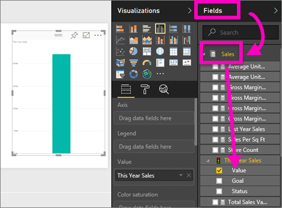
2. Visualisoinnin muuntaminen mittariksi valitsemalla  mittarin kuvakkeesta **Visualisoinnit**-ruudussa.
   
    
3. Vedä **Myynti** > **Tämän vuoden myynti** > **Tavoite** kohtaan **Tavoitearvo**. Näyttää siltä, että olemme hyvin lähellä tavoitteitamme.
   
    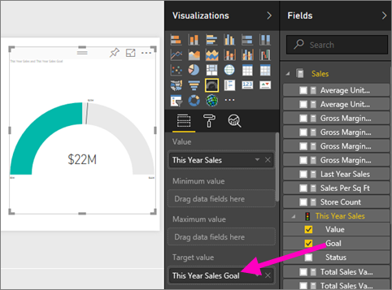
4. Nyt olisi hyvä aika [tallentaa raporttisi](service-report-save.md).
   
   

## Aluekaavion ja osittajan lisääminen raporttiin
CMO haluaa esittää meille joitakin lisäkysymyksiä vastattavaksi. Hän haluaa tietää, miten tämän vuoden myynti vertautuu viime vuoteen. Ja hän haluaa nähdä havainnot alueittain.

1. Tehdään ensin tilaa pohjalle. Valitse mittari ja siirrä se oikeaan yläkulmaan. Tartu ja vedä jotain kulmaa ja pienennä sitä.
2. Poista mittarin valinta. Valitse Kentät-ruudussa **Myynti** > **Tämän vuoden myynti** > **Arvo** ja valitse **Myynti**  >  **Viime vuoden myynti**.
   
    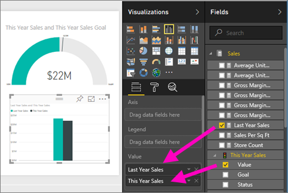
3. Visualisoinnin muuntaminen aluekaavioksi valitsemalla Aluekaavion malli  **Visualisoinnit**-ruudussa.
4. Valitse **Aika**  >  **Jakso** ja lisää se **Akseli**-kohtaan.
   
    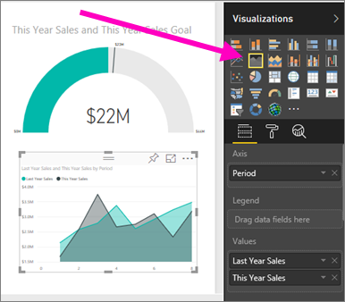
5. Voit lajitella visualisoinnin ajanjakson mukaan valitsemalla kolme pistettä ja valitsemalla **Lajitteluperuste**.
6. Nyt lisätään osittaja. Valitse pohjalta tyhjä alue ja valitse osittaja 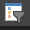    malli. Tämä lisää pohjalle tyhjän osittajan.
   
    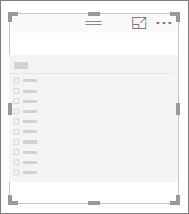    
7. Valitse Kentät-ruudussa **Alue** > **Alue**. Siirrä ja muuta osittajan kokoa.
   
      
8. Osittajan avulla voit etsiä kuviot ja merkitykselliset tiedot alueen mukaan.
   
     

Jatka tietojen tarkastelemista ja visualisointien lisäämistä. Kun olet löytänyt erityisen merkityksellisiä tietoja, [kiinnitä ne raporttinäkymään](service-dashboard-pin-tile-from-report.md).

## Seuraavat vaiheet
* [Uuden sivun lisääminen raporttiin](power-bi-report-add-page.md)  
* Lue, miten [kiinnittää visualisointeja raporttinäkymään](service-dashboard-pin-tile-from-report.md)   
* Onko sinulla muuta kysyttävää? [Kokeile Power BI -yhteisöä](http://community.powerbi.com/)

