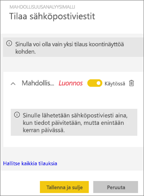
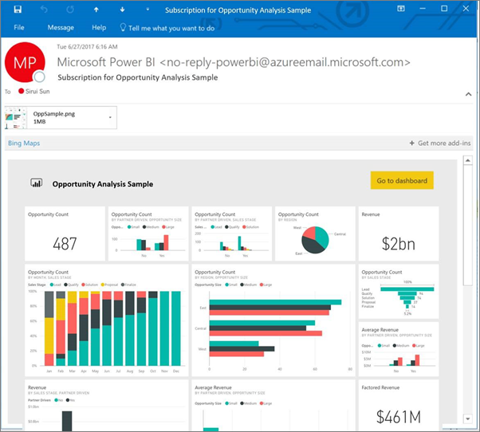
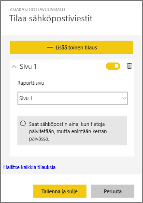
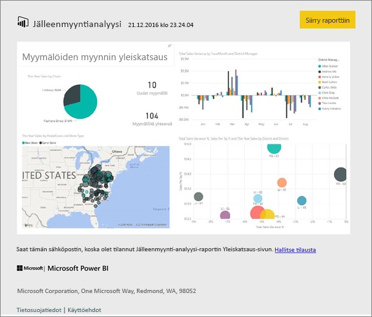
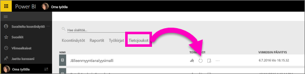

# Power BI ‑raportin tai ‑koontinäytön tilaaminen
Ei ole koskaan ollut näin helppoa pysyä ajan tasalla tärkeimmistä koontinäytöistä ja raporteista. Kun tilaat itsellesi tärkeimmät raporttisivut ja koontinäytöt, Power BI lähettää sinulle sähköpostitse niistä tilannevedoksen. Voit määrittää, miten usein haluat Power BI:n lähettävän viestejä – vaihtoehtoja on päivittäisestä viikoittaiseen. 

Sähköpostissa ja tilannevedoksessa käytetään samaa kieliasetusta kuin Power BI:ssä (katso [Power BI:ssä tuetut kielet ja maat/alueet](supported-languages-countries-regions.md)). Jos mitään kieltä ei ole määritetty, Power BI käyttää senhetkisen selaimesi paikka-asetuksen mukaista kieltä. Jos haluat nähdä kieliasetuksesi tai muuttaa sitä, valitse hammasrataskuvake  **> Asetukset > Yleiset > Kieli**. 

> [!NOTE]
> Tilauksia voi luoda vain Power BI -palvelussa. Kun saat sähköpostiviestin, siinä on mukana linkki, jonka kautta voi siirtyä raporttiin tai koontinäyttöön. Mobiililaitteissa, joihin on asennettu Power BI ‑sovelluksia, linkin valitseminen käynnistää sovelluksen (eikä oletusarvoista raportin tai koontinäytön avaamista Power BI ‑sivustolla).
> 
> 

Katso videolta, miten Sirui ottaa käyttöön raportin sähköpostitilauksen. Kokeile sitä itse noudattamalla videon alapuolella olevia vaiheittaisia ohjeita.

<iframe width="560" height="315" src="https://www.youtube.com/embed/saQx7G0pxhc" frameborder="0" allowfullscreen></iframe>

## Vaatimukset
Tilauksen **luominen** Power BI Pro ‑ominaisuus, lisäksi sinulla on oltava sisältöön (koontinäyttöön tai raporttiin) katselu- tai muokkausoikeudet.

## Koontinäytön tilaaminen

1. Avaa koontinäyttö.
2. Valitse yläreunan valikkoriviltä **Tilaa** tai valitse kirjekuvake .
   
   
3. Voit ottaa tilauksen käyttöön tai poistaa sen käytöstä keltaisella liukusäätimellä.  Liukusäätimen asettaminen Pois-vaihtoehtoon ei poista itse tilausta. Jos haluat poistaa tilauksen, valitse roskakorikuvake.
   
   
4. Tallenna tilaus valitsemalla **Tallenna ja sulje**. Saat koontinäytöstä tilannevedoksen sähköpostitse aina, kun jokin sen pohjana olevista tietojoukoista muuttuu. Jos koontinäyttö päivittyy useammin kuin kerran päivässä, saat sähköpostitse tilannevedoksen vain ensimmäisestä muutoksesta.
   
   
   
   > [!TIP]
   > Haluatko nähdä sähköpostin saman tien? Käynnistä sähköpostiviestin lähettäminen päivittämällä jokin koontinäyttöön liittyvistä tietojoukoista. (Jos sinulla ei ole tietojoukkoon muokkausoikeuksia, sinun on pyydettävä muokkausoikeudet omaavaa henkilöä tekemään sen puolestasi.) Voit selvittää koontinäytöstä, mitä tietojoukkoja koontinäytön luomiseen on käytetty, valitsemalla **Näytä aiheeseen liittyvät** ‑kuvake . Näytölle avautuu **Liittyvä sisältö** ‑ikkuna, josta voit sitten valita päivityskuvakkeen . 
   > 
   > 
   
   

## Raporttisivun tilaaminen
1. Avaa raportti [lukunäkymässä](service-reading-view-and-editing-view.md).
2. Valitse yläreunan valikkoriviltä **Tilaa**.
   
   
3. Voit tilata yhden raporttisivun kerrallaan. Valitse haluamasi raporttisivu avattavasta valikosta.
   
   
   
   Lisää haluamasi muut raporttisivut.
4. Voit ottaa tilauksen käyttöön tai poistaa sen käytöstä sivukohtaisesti keltaisella liukusäätimellä.  Liukusäätimen asettaminen Pois-vaihtoehtoon ei poista itse tilausta. Jos haluat poistaa tilauksen, valitse roskakorikuvake.
   
   
5. Tallenna tilaus valitsemalla **Tallenna ja sulje**. Saat sähköpostitse tilannevedoksen jokaisesta tilatusta raporttisivusta, kun raportti päivitetään. Jos raporttia ei päivitä, et saa sinä päivänä tilannevedosviestiä.  Jos raportti päivittyy useammin kuin kerran päivässä, saat sähköpostitse tilannevedoksen vain ensimmäisestä muutoksesta.
   
   
   
   > [!TIP]
   > Haluatko nähdä sähköpostin saman tien? Käynnistä sähköpostiviestin lähettäminen avaamalla tietojoukko ja valitsemalla **Päivitä nyt**. Jos sinulla ei ole tietojoukkoon muokkausoikeuksia, sinun on pyydettävä muokkausoikeudet omaavaa henkilöä tekemään sen puolestasi.
   > 
   > 
   > 
   > 

## Miten raporttien sähköpostittamisen aikataulu määräytyy?
Seuraava taulukko esittää, miten usein sähköpostiviesti lähetetään. Kaikki riippuu tietojoukon yhteystavasta, jolle koontinäyttö tai raportti perustuu (DirectQuery, reaaliaikainen yhteys, tuonti Power BI:hin tai Excel-tiedosto OneDrivessa tai SharePoint Onlinessa) sekä käytettävissä ja valittuna olevista tilausasetuksista (päivittäin, viikoittain tai ei mitään).

|  | **DirectQuery** | **Reaaliaikainen yhteys** | **Ajoitettu päivitys (tuonti)** | **Excel-tiedosto OneDrivessa tai SharePoint Onlinessa** |
| --- | --- | --- | --- | --- |
| **Miten usein raportti/koontinäyttö päivittyy?** |15 min välein |Power BI tarkistaa 15 minuutin välein, onko tietojoukko muuttunut ja jos on, päivittää raportin. |Käyttäjä valitsee joko ei mitään, päivittäin tai viikoittain. Päivittäin voi olla enintään 8 kertaa päivässä. Viikoittain tarkoittaa viikoittaista aikataulua, jonka käyttäjä luo ja määrittää mielensä mukaan päivittämään raportin vähintään kerran viikossa ja enintään kerran päivässä. |Tunnin välein |
| **Miten paljon käyttäjä voi vaikuttaa tilatun sähköpostiviestin aikatauluun?** |Asetusvaihtoehdot: päivittäin tai viikoittain |Ei asetusvaihtoehtoja: käyttäjille lähetetään sähköpostiviesti, jos raportti päivittyy, mutta tiheimmillään kerran päivässä. |Jos päivittämisen asetukseksi on valittu päivittäin, vaihtoehdot ovat päivittäin ja viikoittain.  Jos päivittämisen asetukseksi on valittu viikoittain, ainoa vaihtoehto on viikoittain. |Ei asetusvaihtoehtoja: käyttäjälle lähetetään sähköpostiviesti aina, kun tietojoukko päivittyy, mutta tiheimmillään kerran päivässä. |

## Tilausten hallinta
Tilausten hallintanäkymään pääsee kahta reittiä.  Ensimmäinen reitti: Valitse **Tilaa sähköpostiviestit** ‑valintaikkunasta **Kaikkien tilausten hallinta** (katso vaihe 3 edellä). Toinen reitti: Valitse yläreunan valikkoriviltä Power BI:n hammasrataskuvake  ja valitse sitten **Asetukset**.

Näytettävät tilaukset riippuvat siitä, mikä työtila on sillä hetkellä aktiivisena.  Jos haluat nähdä kaikkien työtilojen kaikki tilaukset kerralla, varmista, että aktiivisena on **Oma työtila**. Työtilojen toiminnasta saat lisätietoa artikkelista [Työtilat Power BI:ssä](service-create-distribute-apps.md).

Tilaus päättyy, jos Pro-käyttöoikeus umpeutuu, omistaja poistaa koontinäytön tai raportin tai tilauksen luomiseen käytetty käyttäjätili poistetaan.

## Huomioon otettavat seikat ja vianmääritys
* Tällä hetkellä sisältöpaketeista tai Power BI ‑sovelluksista peräisin olevien koontinäyttöjen tai raporttien tilaaminen ei ole mahdollista. Ongelman voi kuitenkin kiertää tekemällä raportista tai koontinäytöstä kopion ja lisäämällä tilaukset kopioon.
* Raporttisivujen tilaukset on sidottu raporttisivun nimeen. Jos tilaat raporttisivun ja nimeät sen uudelleen, sinun on luotava myös tilaus uudelleen.
* Jos teet sähköpostitilauksen tietojoukkoihin, jotka käyttävät reaaliaikaista yhteyttä, saat sähköpostiviestejä vain tietojen muuttuessa. Eli jos tiedot päivittyvät, mutta niihin ei tule muutoksia, Power BI ei lähetä sinulle sähköpostiviestiä.
* Sähköpostitilaukset eivät tue suurinta osaa [mukautetuista visualisoinneista](power-bi-custom-visuals.md).  Poikkeuksena ovat mukautetut visualisoinnit, jotka on [sertifioitu](power-bi-custom-visuals-certified.md).  
* Sähköpostitilaukset lähetetään käyttäen raportin oletusarvoista suodatin- ja osittajatilaa. Jos olet tehnyt oletusarvoihin muutoksia ennen tilaamista, muutokset eivät näy sähköpostiviesteissä.    
* Sähköpostitilauksia ei vielä tueta raporttisivuilla, jotka on luotu Power BI Desktopin reaaliaikaisella palveluyhteystoiminnolla.    
* Erityisesti koontinäyttötilausten osalta tiettyjä ruututyyppejä ei vielä tueta.  Sellaisia ovat esimerkiksi suoratoisto-, video- ja mukautetut verkkosisältöruudut.     
* Jos jaat koontinäytön työtoverille, joka ei kuulu samaan vuokraajaan kanssasi, hän ei voi tilata koontinäyttöä tai siihen liittyviä raporttisivuja. Eli jos olet esimerkiksi aaron@xyz.com, voit jakaa sisältöä käyttäjän anyone@ABC.com kanssa.  anyone@ABC.com ei voi kuitenkaan tilata jaettua sisältöä.    
* Tilaukset voi epäonnistua sähköpostiviestien kokorajoitusten vuoksi, jos koontinäytöissä tai raporteissa on erittäin suuria kuvia.    
* Power BI keskeyttää automaattisesti sellaisten tietojoukkojen päivittämisen, joihin liittyvissä koontinäytöissä tai raporteissa ei ole vierailtu yli kahteen kuukauteen.  Kuitenkin jos lisäät koontinäytön tai raportin tilauksen, päivitystä ei lopeteta, vaikka kohteessa ei vierailtaisikaan.    
* Jos et saa tilaamiasi sähköpostiviestejä, varmista, että täydellinen käyttäjätunnuksesi (UPN) pystyy vastaanottamaan sähköpostia. [Power BI ‑tiimi yrittää parhaillaan höllentää vaatimusta](https://community.powerbi.com/t5/Issues/No-Mail-from-Cloud-Service/idc-p/205918#M10163), joten pysy kuulolla. 
* Lähettävät raportit ja koontinäytöt noudattavat Power BI:n kieliasetustasi. Oletuskieli on englanti. Jos haluat nähdä kieliasetuksesi tai muuttaa sitä, valitse hammasrataskuvake  **> Asetukset > Yleiset > Kieli**.

## Seuraavat vaiheet
* Onko sinulla muuta kysyttävää? [Voit esittää kysymyksiä Power BI -yhteisössä](http://community.powerbi.com/)    
* [Lue blogimerkintä](https://powerbi.microsoft.com/blog/introducing-dashboard-email-subscriptions-a-360-degree-view-of-your-business-in-your-inbox-every-day/)

